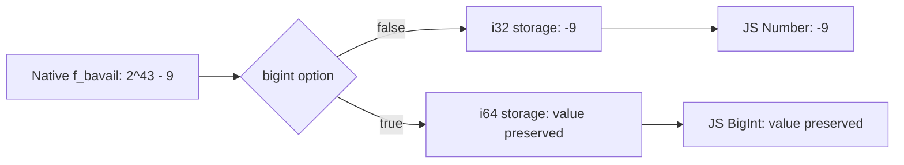

After moving a filesystem to EFS, a disk guard started repeatedly stopping running jobs. Its job was to stop work when free disk space fell below a threshold. It should have intervened only when space was actually running low, but the free-space reading I found was negative.

My work records from July 2026 describe a loop of jobs stopping and retrying because of that negative value, and an investigation into Bun's `statfs` conversion. The question was: why was a filesystem that could still accept writes being treated as full? If the block count going into the calculation was wrong, lowering the threshold would not fix it.

This post isolates the path where that number changes. On September 14, 2026, I read Bun **1.3.14**'s public source and ran that version directly. Instead of mounting the original EFS filesystem again, I replaced only the statistics returned by the operating system with fixed inputs. The numbers and code below belong to that separate experiment, not to the service's usage or configuration.

## Compare the block counts before calculating bytes

`statfsSync()` does not return available bytes directly. `blocks` is the total number of data blocks, `bfree` is the number of free blocks, and `bavail` is the number of free blocks available to unprivileged users. You cannot assume `bfree` and `bavail` are equal. [Node.js's StatFs documentation](https://nodejs.org/download/release/v24.15.0/docs/api/fs.html#class-fsstatfs) makes that distinction.

For this experiment, I defined one block as 4,096 bytes. Once the block count is preserved, `bavail × 4096` gives the available bytes. I started with these inputs.

| Native statfs field | Experiment input | Meaning |
|---|---:|---|
| `f_bsize` | `4096` | Block size for this experiment |
| `f_blocks` | `2^43` | Total block count |
| `f_bfree` | `2^43 - 7` | Free block count |
| `f_bavail` | `2^43 - 9` | Free blocks available to unprivileged users |

The difference between 7 and 9 is deliberate. It separates occupied blocks from blocks unavailable to an unprivileged user. I read the same path in two ways.

```js
import { statfsSync } from "node:fs";

const numberStats = statfsSync("/__statfs_width_fixture__");
const bigintStats = statfsSync("/__statfs_width_fixture__", { bigint: true });
```

This path is not a real mount. A small C library intercepts the native `statfs` call for this path and returns the structure shown above. Bun's conversion code and `fs.statfsSync()` then run unchanged. This tests a different boundary from manually truncating the result to 32 bits in JavaScript.

Here is the comparison between Bun `1.3.14+0d9b296af` and Node.js `24.15.0` on macOS arm64.

| Field | Bun default (`number`) | Bun `{ bigint: true }` | Node default (`number`) |
|---|---:|---:|---:|
| `blocks` | `0` | `8796093022208n` | `8796093022208` |
| `bfree` | `-7` | `8796093022201n` | `8796093022201` |
| `bavail` | `-9` | `8796093022199n` | `8796093022199` |

The values differ before any multiplication happens. Calculating available bytes through Bun's default path gives `-9 × 4096 = -36864`. Compared with a positive minimum-free-space threshold, that reading says the filesystem is short of space.

## The problem is an intermediate i32, not Number precision

JavaScript Number's [maximum safe integer is `2^53 - 1`](https://developer.mozilla.org/en-US/docs/Web/JavaScript/Reference/Global_Objects/Number/MAX_SAFE_INTEGER). The block count `2^43` and its neighboring integers are within that range. An inability to represent those block counts as Numbers does not explain the negative values.

[Bun 1.3.14's StatFS.zig](https://github.com/oven-sh/bun/blob/0d9b296af33f2b851fcbf4df3e9ec89751734ba4/src/runtime/node/StatFS.zig#L2-L14) selects its storage type like this:

```zig
const Int = if (big) i64 else i32;
```

The BigInt option selects `i64`; the default path selects `i32`. The [initialization code in the same file](https://github.com/oven-sh/bun/blob/0d9b296af33f2b851fcbf4df3e9ec89751734ba4/src/runtime/node/StatFS.zig#L71-L77) applies `@truncate` to the operating system's `f_blocks`, `f_bfree`, and `f_bavail` values when storing them in that type. The default path keeps only the low 32 bits.

The [C++ binding](https://github.com/oven-sh/bun/blob/0d9b296af33f2b851fcbf4df3e9ec89751734ba4/src/jsc/bindings/NodeFSStatFSBinding.cpp#L252-L269) then turns the stored values into JavaScript Numbers. By that point, the high bits have already been lost. That conversion cannot recover them.


<span class="figcap">The value is truncated before JavaScript calculates the byte count.</span>

`2^43` is a multiple of `2^32`, so its low 32 bits are all zero. The low 32 bits of `2^43 - 9` equal `2^32 - 9`, which a signed 32-bit integer reads as `-9`. That explains the experiment's total of 0 and available count of -9.

But it does not establish that “free space always becomes exactly the negative of used space.” In this input, the occupied block count is `blocks - bfree = 7`, while the truncated `bavail` is -9. The difference between the fields matters, as does the signed range that remains after truncation.

## Rejecting negative values still leaves incorrect positive ones

Changing the boundary inputs exposes the problem on smaller filesystems, too. These are the `bavail` results from the same native-input injection method.

| Injected `bavail` | Bun default path | Bun BigInt and Node default paths |
|---:|---:|---|
| `749000` | `749000` | Original value preserved |
| `2^31` | `-2147483648` | Original value preserved |
| `2^43 - 9` | `-9` | Original value preserved |
| `2^32 + 9` | `9` | Original value preserved |

The first sign change happens at **`2^31` blocks**, not bytes. With 4 KiB blocks, that corresponds to 8 TiB. Values do not stay negative forever beyond that point. Keeping only the low 32 bits can turn them into zero or small positive numbers again.

The last row shows why a negative-value check is insufficient. `2^32 + 9` blocks shrank to 9 blocks, but the result is positive. With a synthetic minimum of 40 KiB, the truncated reading is 36 KiB and fails the check, while the original value has plenty of space. A `free < 0` check cannot catch that mistake.

## Change the read path and keep the arithmetic in BigInt

In the Bun version I checked, `{ bigint: true }` avoids the 32-bit storage path. Rather than immediately converting the result back with `Number()`, I kept the byte multiplication and threshold comparison in BigInt for the experiment.

This is the calculation function used in the test. It distinguishes invalid statistics as `unknown` instead of turning them into zero bytes.

```js
function availableBytes(stats) {
  const { bsize, blocks, bfree, bavail } = stats;
  if ([bsize, blocks, bfree, bavail].some(v => typeof v !== "bigint")) {
    throw new TypeError("Read statfs with bigint: true before doing arithmetic");
  }
  if (bsize <= 0n || blocks <= 0n || bfree < 0n || bavail < 0n
      || bfree > blocks || bavail > bfree) {
    return { kind: "unknown" };
  }
  return { kind: "measured", bytes: bavail * bsize };
}
```

For all four inputs, the calculated bytes matched the original `bavail × 4096`. The final input, which had produced an incorrect positive reading, no longer failed the space check. I also checked that a zero block size, negative available count, or available count greater than the free count produces `unknown`, while valid statistics with `bavail = 0` produce an actual zero-byte reading.

`unknown` does not mean “there is enough space.” It separates an unreadable measurement from a reason to stop running work or explain that a disk is full. Accepting new work and handling actual write failures need separate decisions. Likewise, `measured` here means the example could calculate the reported statistics. It guarantees neither a future write nor an allocation limit.

Bun's default path was changed to avoid the narrowing in [official fix PR #36503](https://github.com/oven-sh/bun/pull/36503), merged on July 31, 2026. The binary directly compared in this post is still 1.3.14. After upgrading, check whether the fix is included in your version and verify the result for the same inputs again.

## A block count alone does not tell you the EiB value

`2^43` is not yet a byte count. The size assigned to each block changes the result.

```text
2^43 blocks × 2^12 bytes/block = 2^55 bytes = 32 PiB
2^43 blocks × 2^20 bytes/block = 2^63 bytes = 8 EiB
```

This experiment uses the first line. Calling it 8 EiB just because there are `2^43` blocks would miss the difference between 4 KiB and 1 MiB. These inputs were created to test numeric conversion, so they should not be read as statistics returned by an actual EFS filesystem.

When diagnosing a real mount, record the block size together with `blocks`, `bfree`, and `bavail`. Node.js documents `bsize` as the optimal transfer block size, while the system's `statvfs` may expose a separate `f_frsize` that defines the block-count unit. This experiment makes those units the same, at 4,096 bytes. It is not a universal byte-conversion formula for every filesystem.

## Run the comparison

Place the [runner](/blog/examples/statfs-width-repro.mjs) and [native-input fixture](/blog/examples/statfs-width-shim.c) in the same directory. The verified environment is macOS arm64, Node.js 24.15.0, Bun 1.3.14, and clang. The script stops on a different version or platform to keep that comparison distinct from the verified run.

```sh
node statfs-width-repro.mjs
```

The script builds the C library in a temporary directory and applies `DYLD_INSERT_LIBRARIES` only to its Bun and Node child processes. It checks the dedicated nonexistent path and the `type = 12345` sentinel to confirm that the native input was actually replaced. It cleans up its temporary files when finished, without mounting a filesystem or changing the runtime installations.

```text
large: Bun number=[0, -7, -9]; Bun bigint / Node=[8796093022208, 8796093022201, 8796093022199]; corrected low=false
positive-wrap: old low=true even though the returned fields are nonnegative
PASS: native conversion, bigint workaround, validation, and byte units
```

The original reason for investigating was jobs stopping after the EFS migration. The defect isolated here is narrower: **Bun 1.3.14's default statfs path reduced large block counts to i32, while the BigInt path preserved the same inputs.** That comparison lets us examine actual filesystem capacity, block-count conversion, and the guard's decision separately.

This verification covers preserving the published block-count inputs and removing the resulting false low-space decisions. It does not reproduce EFS statistics or the original deployment as a whole.

## References

- [Bun 1.3.14 StatFS.zig](https://github.com/oven-sh/bun/blob/0d9b296af33f2b851fcbf4df3e9ec89751734ba4/src/runtime/node/StatFS.zig) (Bun): Storage types selected by the option and the locations of `@truncate`.
- [Bun 1.3.14 NodeFSStatFSBinding.cpp](https://github.com/oven-sh/bun/blob/0d9b296af33f2b851fcbf4df3e9ec89751734ba4/src/jsc/bindings/NodeFSStatFSBinding.cpp#L252-L269) (Bun): The path from stored integers to JavaScript Numbers.
- [Avoid i32 truncation in non-bigint statfs](https://github.com/oven-sh/bun/pull/36503) (Bun): The fix to the default path's storage width and its Linux native-input regression test.
- [Class: fs.StatFs](https://nodejs.org/download/release/v24.15.0/docs/api/fs.html#class-fsstatfs) (Node.js): Field meanings and the BigInt option.
- [statvfs](https://pubs.opengroup.org/onlinepubs/9799919799/basedefs/sys_statvfs.h.html) (The Open Group): The distinction between `f_bsize`, `f_frsize`, and block-count units.
- [dyld-interposing.h](https://github.com/apple-oss-distributions/dyld/blob/main/include/mach-o/dyld-interposing.h) (Apple): The public definition of native-function interposition on macOS.
