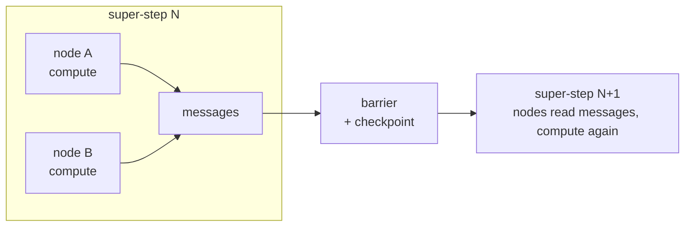

The first time you use LangGraph, the state seems to update *somewhere* you can't
quite point to. You return a partial dict from a node and it merges into a global
state; you interrupt a run and resume it hours later; two branches run in parallel
and reconcile. It feels like magic — which usually means you're missing the model.

The model is **[Pregel](https://research.google/pubs/pub37252/)**, Google's 2010
system for large-scale graph processing. LangGraph is a Pregel engine wearing a
workflow-library coat. Learn the coat and you memorize an API; learn Pregel and the
API becomes obvious.

> **TL;DR** — LangGraph nodes are Pregel vertices, state updates are messages, and
> execution advances in **super-steps** (synchronized rounds). A checkpoint is taken
> at every super-step boundary — which is *why* durable resume, human-in-the-loop,
> and parallel nodes all work.

## Pregel in one minute: think like a vertex

Pregel processes a graph by having each **vertex** reason only from its own local
view. It's a [Bulk Synchronous Parallel](https://en.wikipedia.org/wiki/Bulk_synchronous_parallel)
(BSP) model, and each round — a **super-step** — has three phases:

1. Every active vertex processes the messages it received last round.
2. It sends messages to its neighbors.
3. It optionally **votes to halt**. When all vertices have halted, computation ends.

Nodes compute independently within a round; a barrier synchronizes them, a checkpoint is saved, then the next round begins. That barrier is the whole trick.

The synchronization barrier between super-steps is the key: nothing crosses into the
next round until the current one is fully settled and recorded.

## The mapping: LangGraph is Pregel, renamed

Once you line them up, LangGraph's vocabulary is just Pregel's:

| Pregel | LangGraph |
|---|---|
| Vertex | Node |
| Message | State update (the partial dict you return) |
| `vote_to_halt()` | `END` node |
| Combiner (merges messages) | Reducer (merges state updates) |

That "state updates somewhere" mystery? A node doesn't mutate global state — it
**emits a message (a partial update)**, and a **reducer** combines messages into the
next state at the barrier. Same as Pregel's combiner. Nothing magic; just a model you
hadn't named.

## Why the barrier buys you everything

LangGraph's headline features are all direct consequences of "checkpoint at every
super-step":

- **Durable resume** — the checkpoint at each barrier is a consistent snapshot, so a
  run can stop and pick up exactly where it left off.
- **Human-in-the-loop** — "pause for approval" is just *not starting the next
  super-step* until a human acts. The state is already safely checkpointed.
- **Parallel nodes** — vertices in the same super-step are independent by
  construction, so fanning out branches is native, not bolted on.
- **Transactional state** — updates land at the barrier, atomically, via the
  reducer — never half-applied mid-round.

None of these are features someone added to a workflow tool. They **fall out** of
the BSP/Pregel design. That's the difference between a library that happens to
checkpoint and an engine whose execution model *is* checkpointing.

## What I'd tell another engineer

1. **When a framework feels magical, find its underlying model.** The magic is
   almost always a well-known system you haven't connected yet.
2. **Read the execution model, not just the API.** Pregel explains LangGraph's
   guarantees; the API only shows its surface.
3. **"State updates somewhere" is a smell you can resolve.** Here, "somewhere" is a
   reducer at a super-step barrier. Name it and the mystery dies.

---

## References & further reading

- Malewicz et al. — **Pregel: A System for Large-Scale Graph Processing**, SIGMOD 2010. [paper](https://research.google/pubs/pub37252/)
- L. Valiant — **A Bridging Model for Parallel Computation** (BSP), CACM 1990. [paper](https://dl.acm.org/doi/10.1145/79173.79181)
- **LangGraph** — *Low-level concepts: Pregel, super-steps, checkpointers*. [docs](https://langchain-ai.github.io/langgraph/concepts/low_level/)
