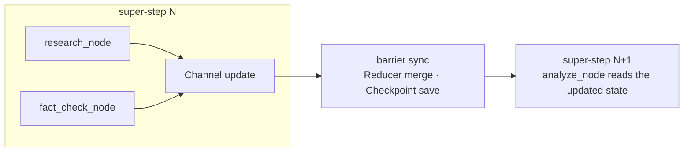

When I built my first LangGraph agent, my head was full of question marks.

```python
from langgraph.graph import StateGraph, START, END

graph = StateGraph(State)
graph.add_node("research", research_node)
graph.add_node("analyze", analyze_node)
graph.add_edge(START, "research")
graph.add_edge("research", "analyze")

app = graph.compile(checkpointer=checkpointer)
result = app.invoke({"messages": ["Hello"]})
```

The code *looks* simple. Make a few nodes, wire them with edges, `compile()`,
`invoke()`. But the moment I ran it, I couldn't tell how the state actually moved,
when checkpoints were saved, or what a "super-step" even was.

A node does `return {"messages": [new_msg]}` and somehow it reaches the next node —
even though I never called that node directly. How? The docs only say "each node
receives the state and returns an update." *So… what?*

**I burned three days on this.** I attached a debugger and stepped through it, and the
state still updated *somewhere*, checkpoints still saved *somewhere*. It genuinely
felt like magic.

Then, buried in the docs, one line:

> "LangGraph's underlying Pregel-inspired architecture…"

**Pregel?** I'd never seen the word. It turned out to be a large-scale graph
processing system Google published in 2010 — and in that instant I realized every
"weird" behavior in LangGraph came from it.

## I thought I'd been handed a bicycle. It was an F1 car.

LangGraph looks like a workflow library for building `A → B → C` flows. Under the
hood it's a **graph-processing engine for distributed systems.**

```text
what I wanted:  a bicycle    (a simple workflow)
what I got:     an F1 car    (a distributed graph engine)
```

Hand someone an F1 car and say "it's easy, just hit the gas" and of course they're
confused. That was me. But here's the twist: once you understand the F1 car, you can
do things a bicycle never could — durable resume, human-in-the-loop, parallel
execution, transactional guarantees. All of it comes from Pregel.

## So what *is* Pregel?

In 2010 Google had a problem: running PageRank over billions of pages, and MapReduce
was too slow. Written in MapReduce, each iteration looks like this:

```python
for iteration in range(max_iterations):
    mapped = map_phase(graph)
    shuffled = shuffle(mapped)   # data over the network
    graph = reduce_phase(shuffled)
    save_to_disk(graph)          # disk I/O
```

Disk I/O and a network shuffle on *every* iteration. Brutal. So they built Pregel,
and its core idea is **"Think Like a Vertex"** — each vertex reasons only from its own
local view.

```python
class Vertex:
    def compute(self, messages):
        process(messages)                     # handle received messages
        for neighbor in self.out_edges:
            self.send_message(neighbor, data)  # send to neighbors
        if done():
            self.vote_to_halt()               # nothing left → halt
```

A vertex has no idea what the whole graph looks like. It knows its neighbors, and
that's it. Vertices pass messages to traverse the graph while keeping disk I/O to a
minimum.

## How LangGraph borrowed Pregel

It took Pregel's concepts wholesale and swapped the domain: **graph algorithms →
workflow orchestration.**

| Pregel | LangGraph |
|---|---|
| Vertex | Node |
| Edge | Channel |
| Message | State update |
| Combiner | Reducer |
| `vote_to_halt()` | `END` node |

Put a Pregel PageRank vertex next to a LangGraph node and the difference jumps out:

```python
# Pregel — sends messages explicitly
class PageRankVertex(Vertex):
    def compute(self, messages):
        self.value = 0.15 + 0.85 * sum(messages)
        for neighbor in self.out_edges:
            self.send_message(neighbor, self.value / len(self.out_edges))
        if converged():
            self.vote_to_halt()

# LangGraph — just returns a dict
def research_node(state: State) -> dict:
    result = search_web(state["messages"][-1])
    return {"messages": [result], "research_data": result}
```

Pregel sends via `send_message()`; LangGraph just returns a dict. **So how does that
dict reach the next node?** This is exactly where I was stuck for three days.

## The state-passing secret, finally

In Pregel, when vertex A sends to B: (1) the message goes on a queue, and (2) B reads
it on the *next* super-step. LangGraph is the same.

```python
# Super-step 1: research_node runs
def research_node(state):
    return {"research_data": "result"}   # this is just a Channel update

# ── Barrier sync: wait for all nodes → apply Reducer → save Checkpoint ──

# Super-step 2: analyze_node runs
def analyze_node(state):
    data = state["research_data"]        # already reflected
```

A node never hands state to the next one directly. It **updates a Channel**; at the
barrier that update is reconciled and becomes visible in the next super-step. That's
message passing — which is why a bare `return` "magically" propagated.


<span class="figcap">Nodes run independently within a round; only after the barrier merges and saves do we advance. That barrier is the whole trick.</span>

## When checkpoints are saved

Pregel checkpoints after every super-step. LangGraph too — it never saves *during* a
node, only when the super-step **ends**, for transactional safety. If anything in a
super-step fails, the whole round rolls back.

```python
config = {"configurable": {"thread_id": "user_123"}}
app.invoke({"messages": ["Hello"]}, config)   # say it fails midway
# run again → auto-resumes from the last checkpoint
app.invoke({"messages": ["Hello"]}, config)
```

Durable resume isn't magic; it's a consistent snapshot at every barrier.
Human-in-the-loop ("pause until approved") is just *not starting the next super-step*
until a human acts — the state is already safely checkpointed.

## Parallelism and the Reducer

Nodes in the same super-step are independent, so they run in parallel. But if two
parallel nodes touch the same Channel, they collide.

```python
def node_a(state): return {"messages": ["A"]}
def node_b(state): return {"messages": ["B"]}
# without a Reducer, one overwrites the other → with one, they merge
```

The Reducer is Pregel's Combiner. For data that should accumulate — like chat
messages — you declare it:

```python
from typing import Annotated
from langgraph.graph.message import add_messages

class State(TypedDict):
    messages: Annotated[list, add_messages]   # ["A"] + ["B"] → ["A","B"]
```

## The design philosophy I could finally see

One by one, my three days of question marks resolved:

- **Why take state as an arg and return a dict?** Vertex-centric programming. A node
  doesn't need to know the whole flow — just its own job. That makes it easy to
  unit-test and reuse.
- **Why does `compile()` exist?** It converts the developer-friendly API (StateGraph)
  into an actual Pregel runtime. No compile, no super-steps, no checkpoints, no
  transactions.
- **Why inject a checkpointer?** Runtime and persistence are separated. `MemorySaver`
  in tests, `PostgresSaver` in production — the runtime code never changes.

## Conclusion

LangGraph is complex. But there's a reason: it's built on Pregel, which Google has
battle-tested for over a decade. What first felt like gratuitous complexity was
quietly buying me durable resume, human-in-the-loop, parallel execution, and
transactional guarantees — for free.

I thought I'd been handed a bicycle; it was an F1 car. And once I understood the F1
car, I could do things no bicycle could. **LangGraph's complexity isn't a bug, it's
the feature** — and when a framework feels like magic, there's almost always a
well-known system underneath that you haven't named yet. For me, that was Pregel.

## Practical tips

When debugging, think in super-steps:

```python
import logging
logging.basicConfig(level=logging.DEBUG)
app.invoke({"messages": ["Hello"]})
# [Super-step 0] START
# [Super-step 1] research_node, fact_check_node  → Checkpoint saved
# [Super-step 2] analyze_node                     → Checkpoint saved
```

And you can inspect each step's state snapshot from the checkpoint list:

```python
for cp in checkpointer.list(config):
    print(f"Step {cp.id}: {cp.state}")
```

---

## References & further reading

- Malewicz et al. — **Pregel: A System for Large-Scale Graph Processing**, Google, SIGMOD 2010. [paper](https://research.google/pubs/pub37252/)
- L. Valiant — **A Bridging Model for Parallel Computation** (BSP), CACM 1990. [paper](https://dl.acm.org/doi/10.1145/79173.79181)
- **LangGraph** — *Low-level concepts: Pregel, super-steps, checkpointers*. [docs](https://langchain-ai.github.io/langgraph/concepts/low_level/)
- **LangGraph** — *Persistence & checkpointers (MemorySaver / PostgresSaver)*. [docs](https://langchain-ai.github.io/langgraph/concepts/persistence/)
