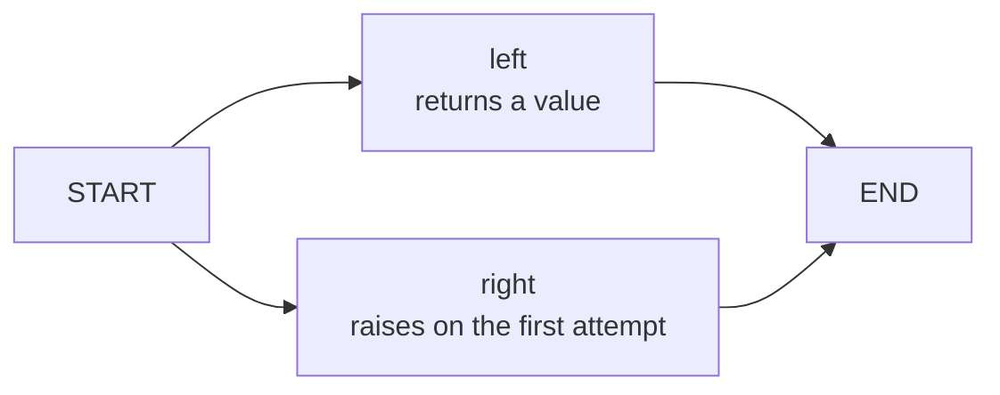

I connected two nodes in parallel in LangGraph and deliberately made the right node fail
on its first attempt. The left node had returned a value; the right had raised an exception.
What should I pass to continue the run? If I send the original input again, will it repeat
work that already finished?

I tried both approaches separately: resuming with `invoke(None, config)`, and calling
`invoke({"values": []}, config)` with an empty list in the input. **The final result lists
were the same, but the left node ran a different number of times.** I would have missed
the difference if I had only checked the return value.

This is an independent experiment run on September 13, 2026. I used Python 3.11.15,
LangGraph 1.0.10, langgraph-checkpoint 4.2.0, and langchain-core 1.6.3. It runs the actual
LangGraph runtime, without an LLM or external APIs.

## I counted results and execution traces separately

The graph is small. `START` activates both nodes, and each node leads to `END` when it
finishes. The two nodes belong to the same execution step, called a super-step.



<span class="figcap">I added no branch to decide whether the left node should run again. LangGraph decides which nodes to rerun.</span>

I kept the nodes' return values in the graph's `State`, with call counts and execution traces
outside it. Here are the two nodes inside `make_graph()` in the
[complete script](/blog/examples/langgraph-supersteps.py).

```python
calls = Counter()
effects = []

def left(state):
    calls["left"] += 1
    effects.append("left")
    return {"values": ["left"]}

def right(state):
    calls["right"] += 1
    effects.append("right")
    if calls["right"] == 1:
        raise RuntimeError("deliberate first-attempt failure")
    return {"values": ["right"]}
```

The right node raises its exception **after** leaving a trace. Even though it returns no
value, `"right"` remains in the Python list. I made that distinction deliberately to check
whether a node failure also undoes work already done outside the graph.

I don't compare the order in which the nodes ran. I compare counts with `Counter(effects)`,
so the result doesn't depend on the order in which the threads execute.

## First, I needed a way to combine parallel results

Before the main experiment, I checked a smaller failure. What happens if the left and right
nodes each return a value for the same string field?

```python
class ConflictingState(TypedDict):
    value: str

# Updates returned in the same step by the two nodes connected to START
# left:  {"value": "left"}
# right: {"value": "right"}
```

The script's first check catches `InvalidUpdateError` in this case. The later value didn't
simply overwrite the earlier one. I hadn't defined how to combine two updates received
in the same step. The [official error documentation](https://docs.langchain.com/oss/python/langgraph/errors/INVALID_CONCURRENT_GRAPH_UPDATE)
also explains that a key receiving concurrent updates needs a reducer.

I wanted to collect both strings, so I defined the state for the main experiment like this.

```python
class State(TypedDict):
    values: Annotated[list[str], operator.add]
```

`operator.add` concatenates the two lists. That's a rule for combining results. It doesn't
also decide where execution should resume after a node fails. The conflicting-update check
and the `RuntimeError` in the right node are two different failures.

## The left result was visible after the failure

I compiled the graph with `InMemorySaver` and assigned a `thread_id` to find the same run.
The `make_graph()` and `fail_once()` functions below are in the complete script.
`fail_once()` catches the first run's exception and checks that both nodes were called once.

```python
graph, calls, effects = make_graph()
config = {"configurable": {"thread_id": "resume-example"}}
fail_once(graph, config, calls, effects)

live = graph.get_state(config)
tasks = {task.name: task for task in live.tasks}
```

Here is what I found.

```text
live.values = {'values': ['left']}
live.next = ('right',)
tasks['left'].result = {'values': ['left']}
tasks['right'].error = "RuntimeError('deliberate first-attempt failure')"
```

The whole step hadn't succeeded, but the left result remained. LangGraph keeps the outputs
of successful tasks in the same step as **pending writes**. It can use those results when
resuming, so it doesn't need to recompute the successful node. This matches the
[checkpointer documentation on pending writes](https://docs.langchain.com/oss/python/langgraph/checkpointers#why-use-checkpointers).

The way I queried the state also made a difference. The `config` above contains only a
`thread_id`. But `live.config` also contains a `checkpoint_id` pointing to a particular
checkpoint. Passing that back showed a different view at the same moment.

```python
checkpoint = graph.get_state(live.config)
```

| Query after failure | Value of the `values` key | `next` |
| --- | --- | --- |
| `graph.get_state(config)` | `['left']` | `('right',)` |
| `graph.get_state(live.config)` | `[]` | `('left', 'right')` |

In this version, querying the latest state with only a `thread_id` also incorporates the
pending writes of completed tasks. Querying a specific checkpoint showed that checkpoint's
state. The empty list in the second row therefore doesn't mean the left result was lost.
To investigate the failed run, I needed to check which config I had used and each task's
`result` and `error`, alongside `values`.

## Resuming with None ran only the right node again

In the first experiment, I continued without submitting the input again. I used the same
`config` created above.

```python
resumed = graph.invoke(None, config)
```

Here is the result. I sorted the returned list before printing it so the output wouldn't
depend on execution order.

```text
RESUME: calls={'left': 1, 'right': 2}, values=['left', 'right'], effects={'left': 1, 'right': 2}
```

The left node ran just once, on the first attempt. Only the right node ran again, and this
time it didn't raise an exception, so I received the combined result.
`graph.get_state(config).next` also became an empty tuple, confirming that no tasks
remained to run.

## Sending the same input again produced the same result

The second experiment starts with **a new graph and a new saver**. Adding input after the
first experiment had finished would change the conditions of the comparison. I ran both
nodes once again, made the right node fail, and then passed a dict containing an empty list.

```python
fresh_graph, fresh_calls, fresh_effects = make_graph()
fresh_config = {"configurable": {"thread_id": "new-input-example"}}
fail_once(fresh_graph, fresh_config, fresh_calls, fresh_effects)

restarted = fresh_graph.invoke({"values": []}, fresh_config)
```

This was the output.

```text
NEW_INPUT: calls={'left': 2, 'right': 2}, values=['left', 'right'], effects={'left': 2, 'right': 2}
```

The final `values` look the same as in the resume case. But the left node also ran twice.
In this graph, the call with an input dict activated both nodes again through `START`.
Using the same `thread_id` and the same input values didn't make it equivalent to resuming
with `None`.

| Second call | Total left calls | Total right calls | Final result |
| --- | --- | --- | --- |
| `invoke(None, config)` | 1 | 2 | `['left', 'right']` |
| `invoke({'values': []}, config)` | 2 | 2 | `['left', 'right']` |

Comparing only the response body would miss this difference when checking code that
continues after a failure. The results matched, but the work done to produce them differed.

## Traces outside the checkpoint weren't rolled back

Even in the first experiment, which resumed with `None`, the right node had two entries
in `effects`. Both the `append()` from its failed first attempt and the `append()` from its
successful second attempt remained. The reducer combined graph state, and the checkpointer
preserved results needed to resume, but neither restored the separate Python list to its
previous state.

That list is an observation tool for distinguishing work done outside graph state. This
doesn't test duplicate handling or idempotency in a real external API. Also, because I used
`InMemorySaver`, the experiment covers catching an exception and resuming while the process
stays alive. It doesn't establish recovery after terminating the process.

What I corrected in this experiment was the state definition for combining parallel results
and the call used to continue a failed run. I used separate traces to check which work still
repeated afterward. When investigating retries, I want to check both whether the final
result is correct and which tasks ran how many times. Here, two calls that returned the same
list did different work.

## Run it yourself

Download the [complete code and assertions](/blog/examples/langgraph-supersteps.py) and run
this command in that directory. The file includes all the functions and imports used above.

```sh
uv run --no-project langgraph-supersteps.py
```

The file specifies Python 3.11 and pins the three main packages. The first run may need to
download Python and dependencies. No model calls happen during execution. The script checks
the conflicting updates, the two state views, the difference between resuming and submitting
new input, and the traces outside graph state. It ends by printing:

```text
PASS: conflict, state views, resume, new input, effects
```

## References

- [INVALID_CONCURRENT_GRAPH_UPDATE](https://docs.langchain.com/oss/python/langgraph/errors/INVALID_CONCURRENT_GRAPH_UPDATE) (LangGraph): concurrent updates to the same key within a step, and reducers
- [Checkpointers](https://docs.langchain.com/oss/python/langgraph/checkpointers) (LangGraph): checkpoints, per-task pending writes, and state queries
- [Executable script](/blog/examples/langgraph-supersteps.py) (this post): both experiments, with assertions for state and call counts
