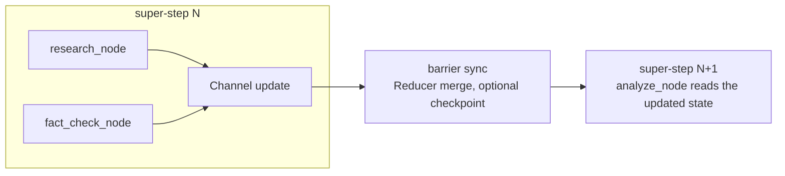

When I built my first LangGraph agent, my head was full of question marks.

```python
from langgraph.graph import StateGraph, START, END

graph = StateGraph(State)
graph.add_node("research", research_node)
graph.add_node("analyze", analyze_node)
graph.add_edge(START, "research")
graph.add_edge("research", "analyze")

app = graph.compile(checkpointer=checkpointer)
result = app.invoke(
    {"messages": ["Hello"]},
    {"configurable": {"thread_id": "example"}},
)
```

The code looks simple. Make a few nodes, wire them with edges, `compile()`, `invoke()`.
But the moment I ran it, I couldn't tell how the state actually moved, when checkpoints
were saved, or what a "super-step" even was.

A node does `return {"messages": [new_msg]}` and somehow it reaches the next node, even
though I never called that node directly. How? The docs only say "each node receives
the state and returns an update," which left me wondering what that actually meant.

I burned three days on this. I attached a debugger and stepped through it, and the state
still updated somewhere, checkpoints still saved somewhere. It genuinely felt like
magic.

Then, buried in the docs, one line:

> "LangGraph's underlying Pregel-inspired architecture…"

Pregel? I'd never seen the word. It turned out to be a large-scale graph processing
system Google published in 2010. It gave me a way to understand step-based state
propagation, though persistence and external side effects needed separate explanations.

## Separate a function call from a step

The part I had mixed up was the order of function calls and the moment their updates
become visible. Sequential code can pass one return value to the next function. Parallel
nodes also need a rule for when and how to combine their updates.

LangGraph's Pregel runtime repeats planning, execution, and channel updates in
super-steps. Persistence is a separate capability provided by a checkpointer. The sketch
above shows the call structure, not a complete runnable program; there is one below.

## So what is Pregel?

In 2010 Google had a problem: running PageRank over billions of pages, and MapReduce
was too slow. Written in MapReduce, each iteration looks like this.

```python
for iteration in range(max_iterations):
    mapped = map_phase(graph)
    shuffled = shuffle(mapped)   # data over the network
    graph = reduce_phase(shuffled)
    save_to_disk(graph)          # disk I/O
```

Disk I/O and a network shuffle on every iteration is brutal. So they built Pregel, and
its core idea is "Think Like a Vertex": each vertex reasons only from its own local
view.

```python
class Vertex:
    def compute(self, messages):
        process(messages)                     # handle received messages
        for neighbor in self.out_edges:
            self.send_message(neighbor, data)  # send to neighbors
        if done():
            self.vote_to_halt()               # nothing left, so halt
```

A vertex has no idea what the whole graph looks like. It knows its neighbors, and that's
it. Vertices pass messages to traverse the graph while keeping disk I/O to a minimum.

## How LangGraph borrowed Pregel

It borrows ideas from Pregel for step-based execution. This is a conceptual comparison,
not a claim that the APIs or failure guarantees are identical.

| Pregel | LangGraph |
|---|---|
| Vertex | Node |
| Messages delivered in the next step | State delivery through channels |
| Message | State update |
| Combiner | Reducer |
| A vertex voting to halt | A graph path ending at `END` (a different API) |

Put a Pregel PageRank vertex next to a LangGraph node and the difference jumps out.

```python
# Pregel, sends messages explicitly
class PageRankVertex(Vertex):
    def compute(self, messages):
        self.value = 0.15 + 0.85 * sum(messages)
        for neighbor in self.out_edges:
            self.send_message(neighbor, self.value / len(self.out_edges))
        if converged():
            self.vote_to_halt()

# LangGraph, just returns a dict
def research_node(state: State) -> dict:
    result = search_web(state["messages"][-1])
    return {"messages": [result], "research_data": result}
```

Pregel sends via `send_message()`, while LangGraph just returns a dict. So how does that
dict reach the next node? This is exactly where I was stuck for three days.

## The state-passing secret, finally

In Pregel, when vertex A sends to B, the message goes on a queue, and B reads it on the
next super-step. LangGraph also makes channel updates visible in the following step.

```python
# Super-step 1: research_node runs
def research_node(state):
    return {"research_data": "result"}   # this is just a Channel update

# ── Barrier sync: wait for all nodes, apply Reducer, optionally checkpoint ──

# Super-step 2: analyze_node runs
def analyze_node(state):
    data = state["research_data"]        # already reflected
```

A node never hands state to the next one directly. It updates a Channel, and at the
barrier that update is reconciled and becomes visible in the next super-step. That's
message passing, which is why a bare `return` "magically" propagated.


<span class="figcap">Nodes in one step do not see each other’s new updates during that step. State updates and persistent storage are separate concerns.</span>

## Check concurrent writes and failure directly

The original version said that without a reducer, one parallel result overwrites another.
That mixed up sequential and concurrent updates. When two nodes update the same key
without a suitable reducer in one step, LangGraph raises `InvalidUpdateError`.

```python
import operator
from typing import Annotated, TypedDict

class State(TypedDict):
    values: Annotated[list[str], operator.add]
```

This reducer concatenates lists. Other reducers have other contracts: `add_messages`,
for example, can update a message by ID. Each state key needs a deliberate rule for
combining or rejecting updates.

I wrote a [standalone reproduction](/blog/examples/langgraph-supersteps.py) while revising
this post in September 2026. It is a synthetic example, not the original production code.
It uses Python 3.11 or later and LangGraph 1.0.10, without an LLM or external API calls.
Download it and run:

```sh
uv run langgraph-supersteps.py
```

The dependency is declared in the file; `uv` downloads it into a separate environment on
first use. The program first checks a conflicting update without a reducer. It then adds
a list reducer and an in-memory checkpointer, and makes the right node fail once.

```text
Without a reducer: InvalidUpdateError
After failure: left=1, right=1; side effects remain
After resume: left=1, right=2; values=['left', 'right']
PASS: conflict detection, pending writes, resume, external effects
```

## A whole-round rollback was the wrong explanation

The left node succeeded and the right node failed. An unfinished step does not mean
all successful task results must be discarded. A checkpointer can keep pending writes
from completed tasks. When I resumed the same thread, the left node did not run again;
the right node ran a second time.

```python
# graph and config are created in the reproduction file.
result = graph.invoke(None, config)
for snapshot in graph.get_state_history(config):
    print(snapshot.metadata, snapshot.values, snapshot.next)
```

Resuming a failed run with `None` is different from submitting a new input dict. An
`interrupt()` waiting for a response uses `Command(resume=...)`. Reusing a thread ID
does not make every invocation the same kind of resume.

The external side effects mattered more. Before returning its state update, each node
appends a marker to a separate list. The right node's first marker remains after its
failure, and resuming adds another. That list is outside graph state; a checkpoint does
not undo it. A node that writes to an external system still needs an idempotency key or
another explicit boundary for retries.

This example's `InMemorySaver` keeps data only inside the current process. Surviving a
process restart requires a persistent checkpointer and an operated storage backend.

## Looking back

Knowing Pregel gave me more precise debugging questions: are these nodes in the same
step, which key do they both update, what reducer governs it, and which external actions
will happen again after a failure?

A checkpoint alone does not make retries safe. Counting calls in a small example made
the boundary between runtime guarantees and application responsibilities clearer than
saying that the whole round rolls back.

## References

- Malewicz et al., [Pregel: A System for Large-Scale Graph Processing](https://research.google/pubs/pub37252/) (Google, SIGMOD 2010)
- L. Valiant, [A Bridging Model for Parallel Computation](https://dl.acm.org/doi/10.1145/79173.79181) (BSP, CACM 1990)
- LangGraph, [Low-level concepts: Pregel, super-steps, checkpointers](https://langchain-ai.github.io/langgraph/concepts/low_level/)
- LangGraph, [Persistence & checkpointers](https://langchain-ai.github.io/langgraph/concepts/persistence/) (MemorySaver, PostgresSaver)

- [Concurrent graph updates](https://docs.langchain.com/oss/python/langgraph/errors/INVALID_CONCURRENT_GRAPH_UPDATE) (LangGraph): conflicting writes within one step
- [Checkpointers](https://docs.langchain.com/oss/python/langgraph/checkpointers) (LangGraph): step snapshots and pending writes
- [Interrupts](https://docs.langchain.com/oss/python/langgraph/interrupts) (LangGraph): pausing and resuming with Command
