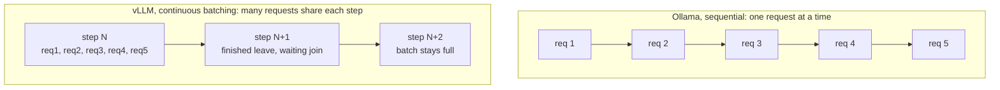
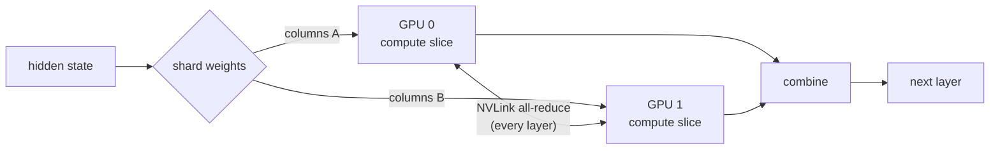

We were serving three 27B to 32B open-weight models on two 48GB GPUs with
[Ollama](https://ollama.com). A batch job took 90 minutes. After moving to
[vLLM](https://docs.vllm.ai) behind an OpenAI-compatible gateway, the same job
finished in 21, which is a 4.8× throughput gain on our hardware.

But the engineering wasn't really in that number. The two hard parts were choosing an
engine I could actually operate, rather than the fastest one on a leaderboard, and
proving the quantized models still gave the right answers before I trusted them in
production. This post walks through both, and explains why vLLM is faster rather than
just that it is, because the "why" is the part that transfers to your own stack.

## Where does LLM serving spend its time?

Before the speed story, it helps to know what an inference server is fighting.
Generating text with a transformer is autoregressive: the model emits one token,
appends it, and runs the whole forward pass again for the next one. Two costs dominate.

The first is that it's memory-bandwidth bound, not compute bound. Every token read the
full model weights out of GPU memory. At batch size 1 you pay that read to produce a
single token, so the compute units mostly sit idle. The fix is to generate tokens for
many requests inside the same weight read, which is batching.

The second is the KV cache. To avoid recomputing attention over the whole sequence
each step, the model caches per-token keys and values, and that cache is large and
grows with every token. How you manage it decides how many requests fit in memory at
once.

Almost every trick below is an attack on one of those two costs, and Ollama, by design,
doesn't fight either one very hard.

## Where Ollama ran out of room

Ollama got us to production quickly, which is its job and it did it well. Under real
concurrent load it capped out for three structural reasons.

- No continuous batching. Requests serialized, so the GPU paid a full weight read per
  request instead of amortizing it across many.
- No tensor parallelism. Two NVLink'd GPUs, but a single model couldn't span them, so
  we couldn't use their combined memory bandwidth.
- A cold start on model switch. Tens of seconds every time we swapped between the three
  models.

None of these are bugs. Ollama, built on [llama.cpp](https://github.com/ggml-org/llama.cpp),
optimizes for running a model on one box, easily, and we'd simply outgrown that shape.

## Why vLLM is fast, in three mechanisms

### 1. Continuous batching

Static batching collects a batch, runs it to completion, then starts the next, so one
slow request holds up everything and finished slots sit idle. Continuous batching (from
[Orca, OSDI '22](https://www.usenix.org/conference/osdi22/presentation/yu)) works at
the granularity of a single forward pass: after each step, finished requests leave the
batch and waiting ones join. The GPU stays full.


<span class="figcap">Sequential leaves the GPU idle between requests; continuous batching amortizes each weight read across the whole in-flight batch.</span>

Anyscale measured up to [23× throughput](https://www.anyscale.com/blog/continuous-batching-llm-inference)
from this alone, and our 5-concurrent workload is exactly the case it targets.

### 2. PagedAttention

The naive way to store a request's KV cache is one big contiguous block sized to the
maximum sequence length, which wastes a lot of memory to internal fragmentation. And
memory is what limits how many requests you can batch.
[PagedAttention](https://arxiv.org/abs/2309.06180) (the paper behind vLLM) borrows the
operating-system idea of paging: the KV cache is split into fixed-size blocks that
don't have to be contiguous and are allocated on demand. Near-zero waste means far more
concurrent sequences fit in the same VRAM, which directly feeds continuous batching.
It's the virtual-memory insight applied to attention.

| KV cache strategy | Memory waste | Concurrent sequences |
|---|---|---|
| Contiguous, max-length reserved | High (internal fragmentation) | Few |
| Paged, on-demand blocks | Near-zero | Many |

### 3. Tensor parallelism

Our two GPUs are joined by NVLink. Tensor parallelism (from
[Megatron-LM](https://arxiv.org/abs/1909.08053)) shards each layer's weight matrices
across both GPUs; each computes its slice, then they exchange partial results over
NVLink every layer (an all-reduce). The payoff is combined memory bandwidth, the bound
that actually matters, plus room for a model that wouldn't fit on one card.


<span class="figcap">Tensor parallelism (<code>--tensor-parallel-size 2</code>): each layer split across both GPUs, reconciled over NVLink per layer. Ollama couldn't do this at all.</span>

### And the quantization: AWQ vs GGUF

Quantization shrinks weights from 16-bit to about 4-bit so a big model fits and reads
faster, but the format matters to the engine. GGUF (llama.cpp, Ollama) is built around
CPU offload and flexible CPU/GPU splits.
[AWQ](https://arxiv.org/abs/2306.00978) (Activation-aware Weight Quantization) is built
for GPU CUDA kernels, fusing dequantization into the matrix multiply so there's no
separate unpack step. On a GPU-only server, AWQ's kernels are the right tool, and that
brings us to the part that actually cost the time.

## The real cost was proving the quantized models still worked

The real bottleneck wasn't configuration, it was verification. For several models there
was no official AWQ build, only community conversions of unknown fidelity, and you
can't swap a quantization format and just hope the outputs are still correct.
Quantization is lossy, and a bad conversion degrades quality in ways that don't show up
until a user hits them.

So I built an internal benchmark set: the same prompts through the old stack (GGUF) and
the new one (AWQ), outputs compared for equivalence before the swap was trusted. This
is the principle I keep coming back to. The engine that does the work doesn't get to
certify its own work; a separate check decides whether the swap is safe. That
verification step, not the deployment, is where most of the time went.

For reproducibility, the final serve command was this.

```bash
uv run python -m vllm.entrypoints.openai.api_server \
    --model org/Model-32B-AWQ \
    --tensor-parallel-size 2 \      # span both GPUs (NVLink)
    --max-model-len 2048 \          # cap context to bound the KV cache
    --max-num-seqs 16 \             # max concurrent sequences in a batch
    --gpu-memory-utilization 0.80 \ # headroom for KV cache growth
    --host 0.0.0.0 --port 8000
```

## The numbers, and what they actually mean

Same 32B-class model, same 4-bit quantization, 5 concurrent requests, 3-run average,
256-token generations. This is an internal benchmark on a single hardware
configuration, not a general claim.

| Metric | Ollama | vLLM | Δ |
|---|---|---|---|
| 5 concurrent, wall-clock | 38.9s | 5.7s | 6.8× |
| Mean latency | 23.31s | 6.48s | 3.6× |
| Per-request throughput | 15.0 tok/s | 40.6 tok/s | 2.7× |
| Total throughput | 98.6 tok/s | 472.5 tok/s | 4.8× |

Read these honestly. The headline 4.8× is throughput under concurrency, the direct
result of continuous batching keeping the GPU full. Single-request latency improved a
more modest 3.6×, because a lone request can't benefit from batching. Report the metric
that matches your workload, not the biggest one on the page. For our batch jobs, where
many requests make it throughput-bound, 4.8× is the honest figure; for a latency-SLA
chat endpoint you'd quote the 3.6×.

## Choosing the engine I could trust, not the fastest one

I surveyed about 12 inference servers, and on raw throughput vLLM was not the leader.

| Engine | Throughput (H100, 8B) | vs vLLM | Notes |
|---|---|---|---|
| [SGLang](https://github.com/sgl-project/sglang) | 16,215 tok/s | +29% | RadixAttention, fast-growing |
| [LMDeploy](https://github.com/InternLM/lmdeploy) | 16,132 tok/s | +29% | TurboMind kernels |
| [vLLM](https://docs.vllm.ai) | 12,553 tok/s | baseline | largest, most mature community |
| [llama.cpp](https://github.com/ggml-org/llama.cpp) | ~35 tok/s | ~−360× | CPU, edge focus |

<span class="figcap">Published third-party numbers, not my own, used only to rank the field.</span>

I chose vLLM anyway. A 29% throughput edge is real, but so is the cost of operating an
engine with fewer answers when it breaks at 2am. vLLM had the most resolved issues, the
most battle-tested edge cases, and the most reference deployments. For a small team
putting this in front of a product, operability beats peak throughput. Trading a
one-time 29% for a standing operational tax is a bad deal, and I'd make the same call
again.

## Serving several models: a gateway, not a hard-wire

Three models, one contract. I put an OpenAI-compatible gateway
([LiteLLM proxy](https://docs.litellm.ai)) in front of the fleet.


<span class="figcap">Clients speak <code>/v1/chat/completions</code> and never learn what's behind the gateway.</span>

Clients speak one API (`/v1/chat/completions`). Swapping Ollama's `/api/chat` for the
OpenAI-compatible surface meant client code stopped caring what runs behind the
gateway, so the next engine change becomes a config edit instead of a client rewrite.
Embeddings go through the same door to
[TEI](https://github.com/huggingface/text-embeddings-inference) on CPU. The interface
is the thing you own, and the engine behind it is swappable. That decoupling outlasts
any single serving engine, which is the whole point.

## Looking back

At first this looked like swapping one LLM engine for another, but it was really a
distributed-systems optimization wearing an LLM costume. Three things stuck with me
afterward. Sometimes "good enough, fast" beats "optimal, eventually," and the
29%-faster engine wasn't worth the thinner safety net. A quantization swap is a
verification problem, not a config problem, so budget more time for proving output
fidelity than for writing the deployment. And putting an interface between clients and
the engine is what keeps your next engine change from turning into a client migration.

## References

- Kwon et al., [PagedAttention / vLLM](https://arxiv.org/abs/2309.06180) (SOSP 2023): memory management for LLM serving
- Yu et al., [Orca](https://www.usenix.org/conference/osdi22/presentation/yu) (OSDI 2022): the origin of continuous batching
- Anyscale, [how continuous batching enables 23× throughput](https://www.anyscale.com/blog/continuous-batching-llm-inference)
- Lin et al., [AWQ](https://arxiv.org/abs/2306.00978) (MLSys 2024): Activation-aware Weight Quantization
- Shoeybi et al., [Megatron-LM](https://arxiv.org/abs/1909.08053): tensor parallelism
- [vLLM docs](https://docs.vllm.ai) | [SGLang](https://github.com/sgl-project/sglang) | [LMDeploy](https://github.com/InternLM/lmdeploy) | [LiteLLM](https://docs.litellm.ai) | [TEI](https://github.com/huggingface/text-embeddings-inference)
