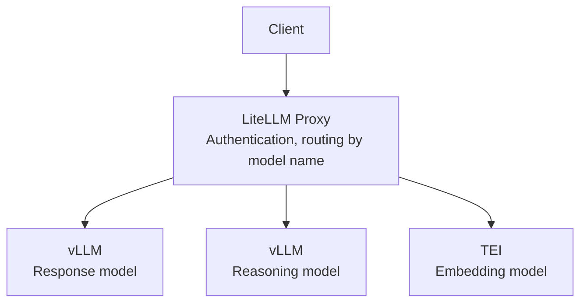

We were serving response and reasoning models through Ollama. It worked well when
one person used it. With concurrent requests, the wait grew. Switching models added
the time to unload one and load another, and a batch job kept holding up the next task.

I planned the migration, compared Ollama and vLLM on a separate test server, then
moved the production stack and brought model routing into LiteLLM Proxy. Calling
that whole process a "4.8× speedup from vLLM" leaves out quite a lot. We had two
hardware configurations, and the quantization format changed along with the engine.

## First, which server produced the numbers?

The preliminary benchmark and the production deployment ran on different hardware.

| Environment | Hardware | Work done there |
|---|---|---|
| Test | Two RTX 3090 24GB GPUs | Preliminary Ollama and vLLM comparison |
| Production | Two A6000 48GB GPUs | Migration of the multi-model serving stack |

On the test server, I compared the same 32B-class model at roughly 4-bit precision
with five concurrent requests. The record specifies three repetitions and a maximum
of 256 generated tokens. Ollama used GGUF Q4_K_M; vLLM used AWQ. This matched the
model family and approximate bit width, but did not feed identical weight files to
two engines.

That matters when interpreting the result. The engine, weight representation, and
execution kernels changed together. The comparison could inform a stack migration,
but it couldn't tell me how much of the difference came from continuous batching alone.

## The 4.8× is a ratio of the throughput values I recorded

The benchmark table recorded these values as total token throughput:

| Recorded metric | Ollama | vLLM |
|---|---|---|
| Total token throughput | 98.6 tok/s | 472.5 tok/s |

Their ratio is approximately 4.8. Showing those results helped the team discuss the
migration. The surviving summary, however, doesn't let me reconstruct the token
counting scope or timing denominator. These are historical reported values, not
results from rerunning the benchmark for this revision.

The earlier article also put batch completion time and average latency in the same
table. One recorded average latency exceeded the corresponding batch completion
time, so I couldn't treat them as measurements of the same population over the same
interval. Without the request records and aggregation definitions, I stopped quoting
those rows as chat latency or SLA improvements.

There was also a batch that took over 90 minutes on the production Ollama server and
21 minutes on the test vLLM server. The hardware changed too. That observation doesn't
belong in the same experiment as the 4.8× throughput ratio.

If I repeated the comparison, I'd keep each request's input and actual output token
counts, start and finish times, and whether warmup was included. Then someone else
could calculate a metric with an explicit denominator, such as total generated tokens
divided by the time from the first request starting to the last request finishing.

## Ollama's capabilities and our configuration were different questions

I initially described Ollama as processing requests one at a time. That was too broad.
Its [official FAQ](https://docs.ollama.com/faq) describes parallel requests, concurrent
model loading, and spreading a model across multiple GPUs. Memory availability and
concurrency settings affect what actually happens.

What I had observed was waiting and model-switching delay in our configuration. I
don't have a version-pinned record of every setting, so I can't claim to have beaten
the best configuration Ollama could have supported. Using multiple GPUs also isn't
the same thing as tensor parallelism within a model layer.

What interested me in vLLM was request batching and KV cache management. Continuous
batching admits new requests into a running batch; PagedAttention manages KV cache
in blocks to reduce the waste of reserving large contiguous allocations. The
[PagedAttention paper](https://arxiv.org/abs/2309.06180) explains the design. Those
mechanisms can affect throughput, but I didn't measure their individual contributions
to this migration.

## Comparing outputs took longer than starting the server

Some models had no official AWQ release. Community conversions were available, but
I still had to check their outputs against the GGUF models we were using.
[AWQ](https://arxiv.org/abs/2306.00978) is a low-bit weight quantization method; matching
bit widths across two quantization schemes doesn't establish equal output quality.

I collected comparison prompts, sent the same inputs through the existing GGUF and
new AWQ paths, and looked through the results. That took longer than writing the
serving code. At the time, I judged the outputs I inspected suitable for our use and
proceeded with the migration.

The evidence here is a comparison of outputs for the same inputs. It wasn't a
quantitative evaluation with a predefined passing score, nor an independent verifier
establishing equivalence. The records available to me don't establish the prompt
count or results by failure type, so I can't turn that judgment into a numerical claim of no
quality degradation.

For another migration, I'd keep the inputs, output differences, and acceptance
reasons next to the speed measurements. I'd separately count cases where a fast
answer violates the requested format or omits required information. That would make
the output review more useful than an overall impression.

## The calling boundary mattered beyond the launch options

After the single-model comparison, we still needed to serve response, reasoning,
and embedding models together. If every client knew each engine's address and
request format, the next engine change would spread through the clients again. I
brought model routing into LiteLLM Proxy.


<span class="figcap">This is the logical request path. It doesn't combine the preliminary benchmark's GPU split with the placement of production models.</span>

There was an initial client migration from the `/api/chat` path we had used to the
gateway's `/v1/chat/completions`. Embeddings use a separate `/v1/embeddings` path.
Afterward, clients addressed the gateway and selected a model by name. This reduced
the spread of engine address changes. It didn't eliminate the need to check outputs
and supported options whenever an engine changed.

The command below illustrates options recorded in the original article. The model
name is a placeholder; this isn't a complete specification for reproducing a
benchmark on a pinned vLLM version.

```bash
python -m vllm.entrypoints.openai.api_server \
    --model org/Model-32B-AWQ \
    --tensor-parallel-size 2 \
    --max-model-len 2048 \
    --max-num-seqs 16 \
    --gpu-memory-utilization 0.80 \
    --host 127.0.0.1 \
    --port 8000
```

`tensor-parallel-size` controls the GPU count for model sharding, `max-model-len`
limits request context length, and `max-num-seqs` limits concurrent sequences.
`gpu-memory-utilization` sets the engine's GPU memory budget. These are different
limits; lowering one doesn't increase KV capacity in the same proportion. This
example binds locally. A real gateway connection also needs addresses and
authentication appropriate to the deployment. The [Engine Arguments](https://docs.vllm.ai/en/latest/configuration/engine_args/)
reference gives the precise definitions; use the version matching your installation.

## Looking back

I chose to try vLLM first partly because I found useful operating examples and
documentation. I hadn't tested every competing engine on identical hardware and
selected a universal winner. I narrowed the candidates within the comparison I
could perform, inspected the outputs, then moved the production request path.

Revisiting the work, I wish I'd kept a clearer record more than a larger headline
number. Separating test and production hardware, throughput and latency, and output
inspection and quantitative evaluation from the start would have made the decision
easier to explain. The useful assets for the next migration are that comparison
record and the boundary where client requests meet the serving stack.

## References

- [FAQ](https://docs.ollama.com/faq) (Ollama): Concurrency, model loading, and multi-GPU behavior
- [Efficient Memory Management for Large Language Model Serving with PagedAttention](https://arxiv.org/abs/2309.06180) (Kwon et al., 2023): KV cache block management and batching
- [AWQ: Activation-aware Weight Quantization for LLM Compression and Acceleration](https://arxiv.org/abs/2306.00978) (Lin et al., 2023): Low-bit weight quantization
- [Optimization and Tuning](https://docs.vllm.ai/en/latest/configuration/optimization/) (vLLM): Interactions between memory and concurrency settings; current documentation, not evidence of the historical runtime version
