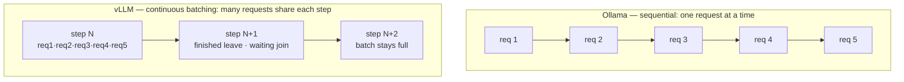
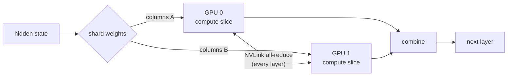
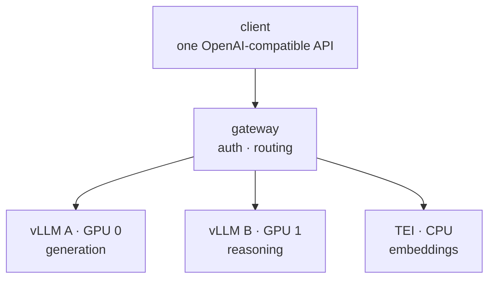

We were serving three 27–32B open-weight models on 2×48GB GPUs with
[Ollama](https://ollama.com). Batch jobs took **90 minutes**. After migrating to
[vLLM](https://docs.vllm.ai) behind an OpenAI-compatible gateway, the same jobs
finished in **21** — a **4.8× throughput gain** on our hardware.

But the throughput number is not where the engineering was. The hard parts were
(1) choosing an engine I could *operate*, not the fastest one on a leaderboard,
and (2) proving the quantized models still produced the right answers before I
trusted them in production. This post walks through both — and explains *why* vLLM
is faster, not just *that* it is, because the "why" is what transfers to your own
stack.

> **TL;DR** — Ollama serializes requests; vLLM overlaps them with continuous
> batching + PagedAttention and spans both GPUs with tensor parallelism. That's the
> 4.8×. The migration's real cost was validating a quantization format change
> (GGUF → AWQ), and the durable win was putting a swappable interface in front of
> the engine.

---

## First, where does LLM serving actually spend time?

To understand the speedup you have to understand what an inference server is
fighting. Generating text with a transformer is **autoregressive**: the model emits
one token, appends it, and runs the whole forward pass again for the next token. Two
costs dominate:

1. **It's memory-bandwidth bound, not compute bound.** Each token generation reads
   the full model weights from GPU memory. At batch size 1, you pay that read to
   produce a *single* token — the GPU's compute units sit mostly idle. The fix is to
   generate tokens for *many* requests in the same weight read (batching).
2. **The KV cache grows and must be stored.** To avoid recomputing attention over
   the whole sequence every step, the model caches per-token key/value tensors. That
   cache is large, grows with every token, and how you manage it decides how many
   requests fit in memory at once.

Almost every trick below is an attack on one of these two costs. Ollama, by design,
addresses neither aggressively.

## Where Ollama ran out of room

Ollama got us to production fast — that is its job, and it did it well. Under real
concurrent load it capped out for three structural reasons:

- **No continuous batching.** Requests serialized; the GPU paid a full weight read
  per request instead of amortizing it across many.
- **No tensor parallelism.** Two [NVLink](https://www.nvidia.com/en-us/data-center/nvlink/)'d
  GPUs, but a single model couldn't span them — so we couldn't use the aggregate
  memory bandwidth of both.
- **Cold start on model switch.** Tens of seconds every time we swapped between the
  three models.

None of these are bugs. They are design choices — Ollama (built on
[llama.cpp](https://github.com/ggml-org/llama.cpp)) optimizes for "run a model on a
box, easily." We had outgrown that shape.

## Why vLLM is fast — the three mechanisms

### 1. Continuous batching

Static batching waits to collect a batch, runs it to completion, then starts the
next — so one slow request holds up everything, and finished slots sit idle.
**Continuous** batching (introduced by [Orca, OSDI '22](https://www.usenix.org/conference/osdi22/presentation/yu))
works at the granularity of a single forward pass: after every step, finished
requests leave the batch and waiting ones join. The GPU is kept full.


<span class="figcap">Sequential leaves the GPU idle between requests; continuous batching amortizes each weight read across the whole in-flight batch.</span>

Anyscale measured up to [23× throughput](https://www.anyscale.com/blog/continuous-batching-llm-inference)
from this alone. Our 5-concurrent workload is exactly the case it targets.

### 2. PagedAttention (the KV cache trick)

The naïve way to store a request's KV cache is one big contiguous block sized to the
*maximum* possible sequence length. That wastes enormous memory to internal
fragmentation — and memory is what limits how many requests you can batch.

[PagedAttention](https://arxiv.org/abs/2309.06180) (the paper behind vLLM) borrows
the operating-system idea of **paging**: the KV cache is split into fixed-size blocks
that need not be contiguous, allocated on demand. Near-zero waste means far more
concurrent sequences fit in the same VRAM — which directly feeds continuous batching.
It's the same insight as virtual memory, applied to attention.

| KV cache strategy | Memory waste | Concurrent sequences |
|---|---|---|
| Contiguous, max-length reserved | High (internal fragmentation) | Few |
| **Paged, on-demand blocks** | Near-zero | Many |

### 3. Tensor parallelism

Our two GPUs are joined by NVLink. Tensor parallelism (from
[Megatron-LM](https://arxiv.org/abs/1909.08053)) shards each layer's weight matrices
across both GPUs; every GPU computes its slice, then they exchange partial results
over NVLink (an all-reduce) each layer. The payoff is aggregate memory bandwidth —
the bound that matters — plus room for a model that wouldn't fit on one card.


<span class="figcap">Tensor parallelism (`--tensor-parallel-size 2`): each layer split across both GPUs, results reconciled over NVLink per layer. Ollama couldn't do this at all.</span>

### And the quantization: AWQ vs GGUF

Quantization shrinks weights from 16-bit to ~4-bit so a big model fits and reads
faster. But the *format* matters for the engine:

- **GGUF** (llama.cpp / Ollama) is designed around CPU offload and flexible
  CPU/GPU splits.
- **[AWQ](https://arxiv.org/abs/2306.00978)** (Activation-aware Weight Quantization)
  is designed for GPU CUDA kernels — dequantization is fused into the matrix multiply,
  so you don't pay a separate unpack step.

On a GPU-only server, AWQ's kernels are the right tool. Which brings us to the part
that actually cost the time.

## The real cost: proving the quantized models still worked

The migration's actual bottleneck wasn't configuration — it was **verification.**

For several models there was no official AWQ build, only community conversions of
unknown fidelity. You cannot swap a quantization format and *hope* the outputs are
still correct — quantization is lossy, and a bad conversion degrades quality in ways
that don't show up until a user hits them.

So I built an internal benchmark set: the same prompts through the old stack (GGUF)
and the new one (AWQ), outputs compared for equivalence *before* the swap was
trusted. The principle I keep coming back to: **the engine that does the work does
not get to certify its own work** — a separate check decides whether the swap is
safe. That verification step, not the deployment, is where most of the time went.

The final serve command, for reproducibility:

```bash
uv run python -m vllm.entrypoints.openai.api_server \
    --model org/Model-32B-AWQ \
    --tensor-parallel-size 2 \      # span both GPUs (NVLink)
    --max-model-len 2048 \          # cap context to bound KV cache
    --max-num-seqs 16 \             # max concurrent sequences in a batch
    --gpu-memory-utilization 0.80 \ # headroom for KV cache growth
    --host 0.0.0.0 --port 8000
```

## The numbers — and what they actually mean

Same 32B-class model, same 4-bit quantization, 5 concurrent requests, 3-run average,
256-token generations. **Internal benchmark, single hardware configuration** — not a
general claim:

| Metric | Ollama | vLLM | Δ |
|---|---|---|---|
| 5 concurrent, wall-clock | 38.9s | 5.7s | 6.8× |
| Mean latency | 23.31s | 6.48s | 3.6× |
| Per-request throughput | 15.0 tok/s | 40.6 tok/s | 2.7× |
| **Total throughput** | 98.6 tok/s | 472.5 tok/s | **4.8×** |

Read these honestly. The headline 4.8× is *throughput under concurrency* — the direct
result of continuous batching keeping the GPU full. Single-request latency improved a
more modest 3.6×, because a lone request can't benefit from batching. **Report the
metric that matches your workload, not the biggest one on the page.** For our batch
jobs (many requests, throughput-bound) 4.8× is the honest figure; for a latency-SLA
chat endpoint you'd quote the 3.6×.

## Choosing the engine I could trust — not the fastest one

I surveyed ~12 inference servers. On raw throughput, vLLM was **not** the leader:

| Engine | Throughput (H100, 8B) | vs vLLM | Notes |
|---|---|---|---|
| [SGLang](https://github.com/sgl-project/sglang) | 16,215 tok/s | +29% | RadixAttention, fast-growing |
| [LMDeploy](https://github.com/InternLM/lmdeploy) | 16,132 tok/s | +29% | TurboMind kernels |
| **[vLLM](https://docs.vllm.ai)** | 12,553 tok/s | baseline | largest / most mature community |
| [llama.cpp](https://github.com/ggml-org/llama.cpp) | ~35 tok/s | ~−360× | CPU/edge focus |

<span class="figcap">Published third-party numbers, not my own — used only to rank the field.</span>

I chose vLLM anyway. A 29% throughput edge is real — but so is the cost of operating
an engine with fewer answers when it breaks at 2am. vLLM had the most resolved issues,
the most battle-tested edge cases, the most reference deployments. For a small team
putting this in front of a product, **operability beat peak throughput.** Trading a
one-time 29% for a standing operational tax is a bad deal, and I'd make the same call
again.

## Serving several models: a gateway, not a hard-wire

Three models, one contract. I put an OpenAI-compatible gateway
([LiteLLM proxy](https://docs.litellm.ai)) in front of the fleet:


<span class="figcap">Clients speak <code>/v1/chat/completions</code> and never learn what's behind the gateway.</span>

Swapping Ollama's `/api/chat` for the OpenAI-compatible surface meant client code
stopped caring what runs behind the gateway — the next engine change becomes a config
edit, not a client rewrite. Embeddings go to
[TEI](https://github.com/huggingface/text-embeddings-inference) on CPU through the
same door. **The interface is the thing you own; the engine behind it is swappable.**
That decoupling outlasts any single serving engine — which is the whole point.

## What I'd tell another engineer

1. **"Good enough, fast" beats "optimal, eventually."** The 29%-faster engine was not
   worth the thinner safety net.
2. **Quantization swaps are a verification problem, not a config problem.** Budget
   more time for proving output fidelity than for writing the deployment.
3. **Put an interface between clients and the engine.** You *will* change engines;
   don't make that a client migration.

It looked like "just an LLM engine." It was really a distributed-systems optimization
wearing an LLM costume.

---

## References & further reading

- Kwon et al., **PagedAttention / vLLM** — *Efficient Memory Management for LLM Serving with PagedAttention*, SOSP 2023. [arXiv:2309.06180](https://arxiv.org/abs/2309.06180)
- Yu et al., **Orca** (continuous batching) — *A Distributed Serving System for Transformer-Based Generative Models*, OSDI 2022. [paper](https://www.usenix.org/conference/osdi22/presentation/yu)
- Anyscale — *How continuous batching enables 23× throughput in LLM inference*. [blog](https://www.anyscale.com/blog/continuous-batching-llm-inference)
- Lin et al., **AWQ** — *Activation-aware Weight Quantization for LLM Compression and Acceleration*, MLSys 2024. [arXiv:2306.00978](https://arxiv.org/abs/2306.00978)
- Shoeybi et al., **Megatron-LM** (tensor parallelism) — [arXiv:1909.08053](https://arxiv.org/abs/1909.08053)
- **vLLM** docs — [docs.vllm.ai](https://docs.vllm.ai) · **SGLang** — [github](https://github.com/sgl-project/sglang) · **LMDeploy** — [github](https://github.com/InternLM/lmdeploy)
- **LiteLLM** proxy — [docs.litellm.ai](https://docs.litellm.ai) · **TEI** — [github](https://github.com/huggingface/text-embeddings-inference)
