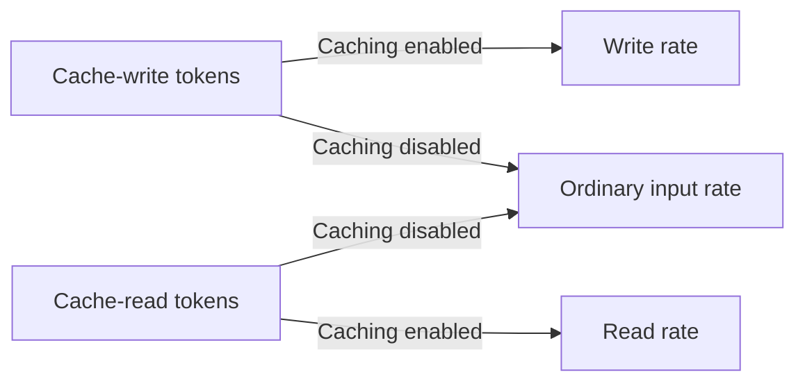

During a prompt-cache cost review, I encountered two interpretations of the same billing category. One explanation was that cache writes accounted for a large share, so disabling caching would save most of it. I thought the ordinary input charges would still remain. To compare the two, I needed to calculate **where those same tokens would be billed after caching was disabled**.

That was the starting point recorded in the work notes and discussion from August 2026. Checking the configured TTL also mattered, but one distinction could be made before that setting was known: the cache-write line item is not the same as the extra cost caused by caching.

Here, I work through that calculation using a synthetic token ledger created on September 14, 2026. It contains no actual bill or measured savings after a deployment. The [complete calculation code](/blog/examples/prompt-cache-cost.py) runs without making model calls.

## Compare the same requests with caching disabled

Let the ordinary input rate be `p` and the one-hour cache-write rate be `2p`. If writing some tokens to the cache costs $2, processing those tokens as ordinary input still costs $1 when caching is disabled. The full $2 write charge cannot be counted as savings.

Cache reads move in the opposite direction. Tokens that were cheap to read from cache become ordinary input too. Disabling caching removes the write premium, but it also removes the read discount.



I fixed the calculation to Sonnet 4.5 standard Claude API rates, checked on September 14, 2026. All rates are US dollars per million tokens. Batch discounts, geographic premiums, tool charges, and taxes are excluded. For another model or Bedrock, substitute the rates for that model and provider. [Anthropic pricing](https://platform.claude.com/docs/en/about-claude/pricing)

| Token category | Symbol | Price per million tokens |
| --- | --- | ---: |
| Ordinary input | U | $3.00 |
| Five-minute cache write | W5 | $3.75 |
| One-hour cache write | W1 | $6.00 |
| Cache read | R | $0.30 |
| Output | O | $15.00 |

Keeping the requests and outputs unchanged gives these two costs:

```text
Caching enabled = (3U + 3.75W5 + 6W1 + 0.3R + 15O) / 1,000,000
Caching disabled = (3(U + W5 + W1 + R) + 15O) / 1,000,000

Caching enabled - Caching disabled = (0.75W5 + 3W1 - 2.7R) / 1,000,000
```

A positive value on the final line means caching costs more for that ledger. Ordinary input and output cancel because they are held constant. With enough cache reads, the difference becomes negative, and disabling caching would increase the cost.

## Three ledgers for 100 requests

Each request is assumed to process 1,000 ordinary input tokens, a 10,000-token prefix eligible for caching, and 200 output tokens. Across 100 requests, that is 1,100,000 input tokens and 20,000 output tokens. I calculated cases where the content changes every time and where the same prefix is reused.

All three rows below are **calculations from synthetic inputs**. They do not measure actual cache hits. In particular, the second row assumes that, after the first write, the remaining requests read the same prefix while its cache entry is still valid.

| Condition | W5 | W1 | R | Caching enabled | Caching disabled |
| --- | ---: | ---: | ---: | ---: | ---: |
| One-hour write on every request | 0 | 1,000,000 | 0 | $6.600 | $3.600 |
| One initial write, then 99 reads | 0 | 10,000 | 990,000 | $0.957 | $3.600 |
| Ledger with mixed TTLs | 80,000 | 20,000 | 900,000 | $1.290 | $3.600 |

The first row's cache-write charge is $6, but disabling caching saves $3. Processing the same prefix tokens as ordinary input still costs $3. Total cost falls from $6.60 to $3.60, so the write category's share of the bill cannot be used directly as the overall savings percentage.

In the second row, disabling caching is more expensive. Looking only at the initial write makes the policy seem costly, but the subsequent read discount more than pays for it. A cost review therefore needs reads as well as writes.

## The same hit rate can lead to opposite conclusions

Now compare **two-request observation windows that begin with the prefix to be read already cached**. The earlier cache-creation cost is outside these ledgers, so this is not a comparison over the cache's full lifetime. One hit out of two requests gives a request-based hit rate of 50%. But the cost within the window changes with the sizes of the hit and miss requests.

| Two requests using a one-hour cache | Read tokens | Write tokens | Caching enabled | Caching disabled |
| --- | ---: | ---: | ---: | ---: |
| Long request hits; short request writes | 100,000 | 10,000 | $0.090 | $0.330 |
| Short request hits; long request writes | 10,000 | 100,000 | $0.603 | $0.330 |

Ordinary input and output are set to 0 for this small comparison. Both rows have the same total token count and the same number of hit requests. Caching saves money in the first row and costs more in the second.

A rule such as “enable caching above this hit rate” therefore needs to define the denominator. Request counts alone cannot distinguish a long miss from a short hit. For these ledgers, directly summing the token counts `W5`, `W1`, and `R` is clearer.

## Validate the ledger's inputs too

In a Claude Messages response, `input_tokens` is not the total input including cache reads and writes. `cache_creation_input_tokens` is the total written, while `cache_creation` contains its TTL breakdown. Adding both the total and the breakdown counts writes twice. [Response usage documentation](https://platform.claude.com/docs/en/build-with-claude/prompt-caching#tracking-cache-performance)

```python
usage = {
    "input_tokens": 100_000,
    "cache_creation_input_tokens": 100_000,
    "cache_creation": {
        "ephemeral_5m_input_tokens": 80_000,
        "ephemeral_1h_input_tokens": 20_000,
    },
    "cache_read_input_tokens": 900_000,
    "output_tokens": 20_000,
}
```

This object is **the field-by-field sum of usage from the 100 synthetic requests above**. It is neither a single API response nor a request containing 1,100,000 tokens. Each request still has 11,000 input tokens. The code checks `80,000 + 20,000 = 100,000` and uses the write total only for that cross-check. Total input is `100,000 + 100,000 + 900,000 = 1,100,000` tokens.

If the ledger has a write total but no TTL split, this rate table cannot produce a single definite price. The code rejects that input. A short application default is not sufficient evidence to price all billed writes at the short TTL.

Bedrock Converse uses different field names, including `inputTokens`, `cacheWriteInputTokens`, `cacheReadInputTokens`, and `cacheDetails`. The code accepts the Claude Messages format, so it does not take a Converse response unchanged. Convert it according to the billing provider's field definitions first. [AWS cache-usage documentation](https://docs.aws.amazon.com/bedrock/latest/userguide/prompt-caching.html)

## How many reads repay the write premium?

Narrow the question to one write of a fixed-size prefix followed by `n` reads before expiry. Normalize the ordinary input rate to 1; at the rates used here, a cache read costs 0.1.

```text
1-hour cache: 2 + 0.1n < 1 + n
              n > 1 / 0.9
              At least 2 reads needed

5-minute cache: 1.25 + 0.1n < 1 + n
                n > 0.25 / 0.9
                At least 1 read needed
```

For a one-hour cache, “two” means two reads after the initial write: three requests in total. If the prefix changes or expires and must be written again, another write charge enters the calculation. This formula cannot be applied directly to an entire day's request count.

The reuse interval also matters when choosing a TTL. If the same prefix is read frequently, there is less reason to pay for a longer TTL. If reuse actually occurs at longer intervals, the longer TTL becomes worth comparing. The fact that a hit refreshes the cache lifetime needs to be included too. [Cache lifetime documentation](https://platform.claude.com/docs/en/build-with-claude/prompt-caching#1-hour-cache-duration)

## What the calculation code checks

Download the [complete file](/blog/examples/prompt-cache-cost.py) and run it with Python 3.10 or later. It checks the ledgers against the table's amounts, the hit-rate counterexample, and missing TTL details.

```sh
python3 prompt-cache-cost.py
```

```text
all_miss_1h: cached=$6.600, no_cache=$3.600, delta=$+3.000
one_write_99_reads: cached=$0.957, no_cache=$3.600, delta=$-2.643
mixed_ttl: cached=$1.290, no_cache=$3.600, delta=$-2.310
large_hit_small_miss: cached=$0.090, no_cache=$0.330, delta=$-0.240
small_hit_large_miss: cached=$0.603, no_cache=$0.330, delta=$+0.273
PASS: baseline, mixed TTL, hit-rate counterexample, usage validation, break-even
```

What this verifies is how to price the same usage at different rates. It does not verify actual cache hits, response latency, or lower bills after deployment. Comparing days with different traffic or output lengths requires accounting for those changes separately.

Returning to the original question, removing the cache-write category does not save its entire amount. A useful comparison needs a ledger that turns writes and reads back into ordinary input. Making that distinction helped me identify missing usage before deciding whether to enable or disable caching.

## References

- [Pricing](https://platform.claude.com/docs/en/about-claude/pricing) (Anthropic): Sonnet 4.5 standard token rates checked on 2026-09-14
- [Prompt caching](https://platform.claude.com/docs/en/build-with-claude/prompt-caching) (Anthropic): input and cache-usage fields, TTL breakdown, and refresh behavior
- [Prompt caching for faster model inference](https://docs.aws.amazon.com/bedrock/latest/userguide/prompt-caching.html) (AWS): Bedrock Converse token fields and TTL details
