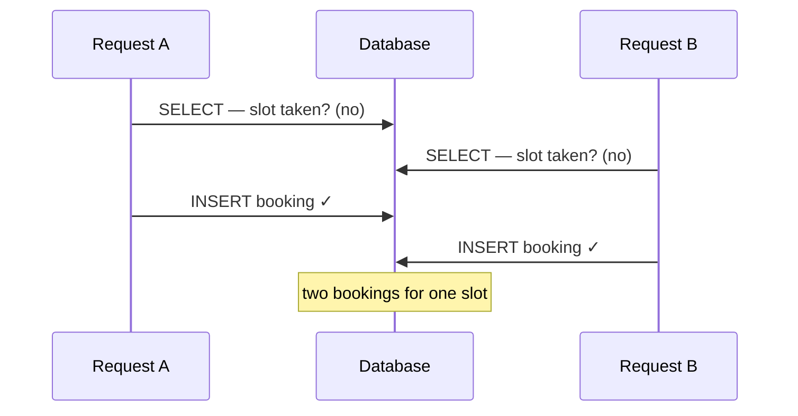

A reservation system let two users book the same slot at nearly the same instant —
and *both* succeeded, even though the code ran inside a database transaction and
checked for duplicates first. The instinct is "the transaction should have caught
that." It didn't, and understanding why is the whole lesson.

> **TL;DR** — A check-then-insert has a race window a transaction alone won't close.
> You need mutual exclusion. A Redis lock (`SETNX`) acquired *before* the transaction
> works — but for this exact bug, a database **unique constraint** is often the more
> robust fix. Know which tool the problem actually calls for.

## Why the transaction doesn't save you

The booking logic is check-then-act: *is this slot taken? no → insert a booking.*
Wrap it in a transaction and it still races, because both requests do their check
before either does its insert:


<span class="figcap">Both reads happen before either write. Neither transaction sees the other's uncommitted insert (true under READ COMMITTED and REPEATABLE READ alike) — so both believe the slot is free.</span>

A transaction gives you atomicity and isolation *of a snapshot*, not mutual
exclusion across the check-then-act sequence. The two requests are running the same
critical section concurrently, and nothing serializes them.

## The fix: mutual exclusion with a distributed lock

Across multiple servers, an in-process lock is useless — the requests can be on
different machines. You need a lock they *share*. Redis is a natural fit because it
processes commands single-threaded and sequential, and `SET key val NX` is atomic:
exactly one caller wins.

The ordering that matters: **acquire the lock before the transaction, release it in
`finally`.**

```text
1. SET lock:slot:{id} <token> NX PX <ttl>   // atomic acquire
2. if not acquired → reject (someone else holds the slot)
3. BEGIN transaction
4.   check + insert
5. COMMIT
6. finally → release lock (only if token matches)   // don't free someone else's lock
```

Two details that separate working from broken:

- **A TTL is mandatory.** If the holder crashes between acquire and release, the TTL
  frees the lock instead of deadlocking the slot forever.
- **Release only your own lock.** Store a token and check it before deleting, or a
  slow request whose TTL expired can delete a *different* request's lock.

## The honest limits (and the better fix for this bug)

A single Redis is now a single point of failure. Put Redis in a cluster and you
reintroduce the very problem you were solving: coordinating a lock across nodes that
can disagree. That's what **[RedLock](https://redis.io/docs/latest/develop/use/patterns/distributed-locks/)**
addresses — and it's genuinely contested (see Kleppmann's
[critique](https://martin.kleppmann.com/2016/02/08/how-to-do-distributed-locking.html)).
Distributed locking is never as simple as it looks.

Which is why, for *this specific bug*, I'd reach for the database first:

| Approach | Best when |
|---|---|
| **`UNIQUE` constraint** on the slot | The invariant is "one row per slot" — let the DB enforce it. Simplest, race-proof. |
| `SELECT … FOR UPDATE` (row lock) | You must read-then-write the same rows atomically. |
| `SERIALIZABLE` isolation | You want the DB to detect the conflict and abort one txn. |
| **Redis distributed lock** | The critical section spans more than the database (external calls, multiple stores). |

For double-booking, a unique index on `(slot_id)` makes the second insert fail by
construction — no lock, no race, no TTL to tune. Reach for the distributed lock when
the critical section is genuinely bigger than one table.

## What I'd tell another engineer

1. **A transaction isolates; it doesn't serialize your check-then-act.** Name the
   race explicitly before picking a fix.
2. **Push the invariant as close to the data as you can.** A unique constraint beats
   a lock you have to operate.
3. **If you must lock, respect the details** — TTL to survive crashes, token to avoid
   freeing someone else's lock, and clear eyes about cluster-mode consensus.

---

## References & further reading

- Redis — *Distributed Locks with Redis (Redlock)*. [docs](https://redis.io/docs/latest/develop/use/patterns/distributed-locks/)
- M. Kleppmann — *How to do distributed locking* (the Redlock critique). [post](https://martin.kleppmann.com/2016/02/08/how-to-do-distributed-locking.html)
- PostgreSQL — *Transaction Isolation*. [docs](https://www.postgresql.org/docs/current/transaction-iso.html)
- M. Kleppmann — *Designing Data-Intensive Applications* (Ch. 7, Weak isolation & race conditions).
