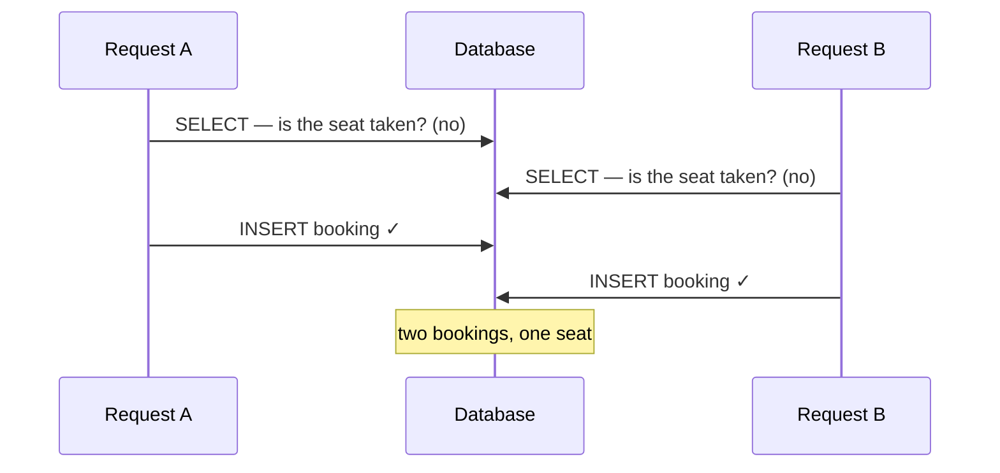

Two users booked the same seat at nearly the same instant — and *both* got a success
response. The reservation code checked whether the slot was taken before inserting,
and the whole thing ran inside a database transaction. My first reaction was the same
one you're probably having: *the transaction should have caught that.*

It didn't. And understanding exactly why is the whole point — because the fix people
reach for first (a "bigger" transaction) doesn't work, and the fix that does isn't
where beginners look.

## Why the transaction didn't save me

The booking logic is **check-then-act**: *is this slot taken? no → insert a booking.*
Wrap it in a transaction and it still races, because both requests run their check
before either runs its insert:


<span class="figcap">Both reads happen before either write. Neither transaction sees the other's uncommitted insert (true under READ COMMITTED and REPEATABLE READ alike) — so both believe the seat is free.</span>

Here's the mental model correction I needed: a transaction gives you **atomicity and
isolation of a snapshot** — it does *not* give you **mutual exclusion** across a
check-then-act sequence. Both requests are executing the same critical section at the
same time, and nothing is serializing them. A transaction was never the tool for this.

## The fix: mutual exclusion with a distributed lock

Across multiple servers, an in-process lock (a language `mutex`, a `synchronized`
block) is useless — the two requests can be on different machines that share no
memory. You need a lock they *both* see.

Redis is a natural fit for two reasons: it processes commands single-threaded and in
order, and `SET key value NX` is atomic — exactly one caller can win the key. The
ordering that matters most: **acquire the lock *before* the transaction, release it in
`finally`.**

```text
1. acquired = SET lock:seat:{id} <token> NX PX <ttl>   // atomic acquire
2. if not acquired → reject (someone else holds this seat)
3. BEGIN transaction
4.   check + insert
5. COMMIT
6. finally → release lock, only if the token still matches
```

Two details separate a working lock from a subtly broken one:

- **A TTL is mandatory.** If the holder crashes between step 3 and step 6, the TTL
  frees the lock instead of deadlocking that seat forever.
- **Release only *your* lock.** Store a unique token and verify it before deleting.
  Otherwise a slow request whose TTL already expired can delete a *different*
  request's freshly-acquired lock.

## The honest limits — and the fix I'd actually pick

A single Redis is now a single point of failure. Put Redis in a cluster to fix *that*,
and you reintroduce the very problem you were solving: coordinating a lock across nodes
that can disagree with each other. That's what
[RedLock](https://redis.io/docs/latest/develop/use/patterns/distributed-locks/)
addresses — and it's genuinely contested (Kleppmann's
[critique](https://martin.kleppmann.com/2016/02/08/how-to-do-distributed-locking.html)
is required reading). Distributed locking is never as simple as it first looks.

Which is why, for *this specific bug*, I'd reach for the database before Redis:

| Approach | Best when |
|---|---|
| **`UNIQUE` constraint** on the seat | The invariant is "one booking per seat" — let the DB enforce it. Simplest, race-proof, nothing to operate. |
| `SELECT … FOR UPDATE` (row lock) | You must read-then-write the *same rows* atomically. |
| `SERIALIZABLE` isolation | You want the DB itself to detect the conflict and abort one transaction. |
| **Redis distributed lock** | The critical section spans more than the database — external API calls, multiple data stores. |

For double-booking, a unique index on `(seat_id, time_slot)` makes the second insert
fail *by construction* — no lock, no race, no TTL to tune. Reach for the distributed
lock when the critical section is genuinely bigger than one table.

## What I took away

1. **A transaction isolates; it doesn't serialize your check-then-act.** Name the race
   explicitly before you pick a fix, or you'll "fix" it with a bigger transaction and
   watch it happen again.
2. **Push the invariant as close to the data as you can.** A unique constraint the DB
   enforces beats a lock you have to operate and reason about.
3. **If you must lock, respect the details** — a TTL to survive crashes, a token so you
   never free someone else's lock, and clear eyes about what cluster-mode consensus
   really costs.

---

## References & further reading

- Redis — *Distributed Locks with Redis (Redlock)*. [docs](https://redis.io/docs/latest/develop/use/patterns/distributed-locks/)
- M. Kleppmann — *How to do distributed locking* (the Redlock critique). [post](https://martin.kleppmann.com/2016/02/08/how-to-do-distributed-locking.html)
- PostgreSQL — *Transaction Isolation*. [docs](https://www.postgresql.org/docs/current/transaction-iso.html)
- M. Kleppmann — *Designing Data-Intensive Applications* (Ch. 7, Weak isolation & race conditions).
