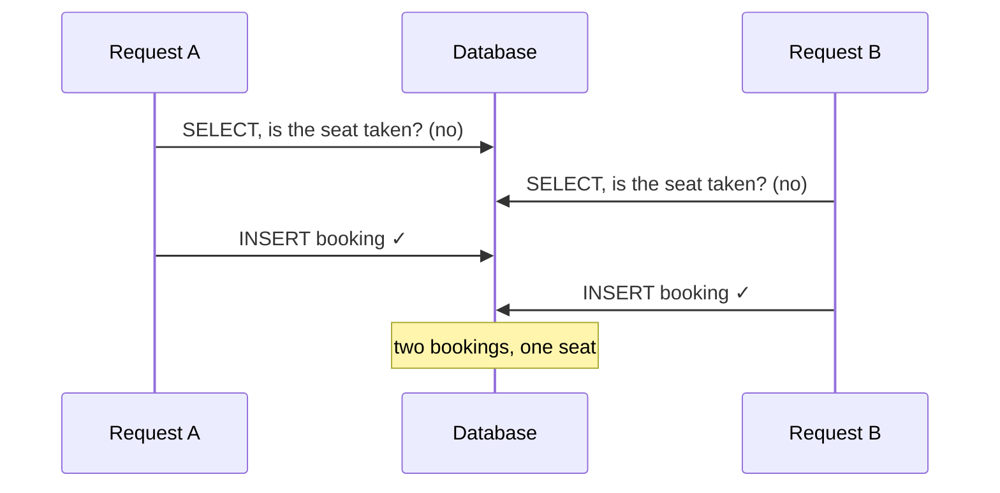

Two users booked the same seat at nearly the same instant, and both got a success
response. The reservation code checked whether the slot was taken before inserting, and
the whole thing ran inside a database transaction. My first reaction was probably the
same one you're having: the transaction should have caught that.

Putting the duplicate check inside a transaction had not serialized the two requests.
I needed to look at the constraint and isolation level that protected the invariant.

## Why the transaction didn't save me

The booking logic is check-then-act: is this slot taken, and if not, insert a booking.
Wrap it in a transaction and it still races, because both requests run their check
before either runs its insert.


<span class="figcap">Both reads happen before either write. Neither transaction sees the other's uncommitted insert (true under READ COMMITTED and REPEATABLE READ alike), so both believe the seat is free.</span>

The problem was relying on a read without a constraint that rejected a duplicate. The
diagram assumes both transactions can read the empty slot. SERIALIZABLE isolation or
appropriate locking changes that behavior and can require retrying an aborted transaction.
The exact historical database, driver version, and isolation setting are not recorded
here, so this is not a claim about every database transaction.

## The fix: mutual exclusion with a distributed lock

Across multiple servers an in-process lock is useless, since the two requests can be on
different machines that share no memory. You need a lock they both see. Redis is a
natural fit for two reasons: it processes commands single-threaded and in order, and
`SET key value NX` is atomic, so exactly one caller can win the key. The ordering that
matters most is to acquire the lock before the transaction and release it in `finally`.

```text
1. acquired = SET lock:seat:{id} <token> NX PX <ttl>   // atomic acquire
2. if not acquired, reject (someone else holds this seat)
3. BEGIN transaction
4.   check + insert
5. COMMIT
6. finally, release the lock only if the token still matches
```

Two details separate a working lock from a subtly broken one. A TTL is mandatory: if the
holder crashes between step 3 and step 6, the TTL frees the lock instead of deadlocking
that seat forever. And you release only your own lock: store a unique token and verify it
before deleting. That comparison and deletion must be one atomic operation, such as a
Lua script; ownership can change between separate GET and DEL commands.

This still does not protect the entire operation. An expired holder may continue its DB
write while a new holder starts. Ownership tokens prevent deleting another holder’s lock,
not overlapping writes. A database constraint can protect the booking invariant itself.

## The honest limits, and the fix I'd actually pick

A single Redis is now a single point of failure. Put Redis in a cluster to fix that, and
you must account for ownership during failover.
[RedLock](https://redis.io/docs/latest/develop/use/patterns/distributed-locks/)
uses multiple independent Redis instances; it is not ordinary Redis Cluster. Kleppmann’s
[critique](https://martin.kleppmann.com/2016/02/08/how-to-do-distributed-locking.html)
is required reading. Distributed locking is never as simple as it first looks.

Which is why, for this specific bug, I'd reach for the database before Redis.

| Approach | Best when |
|---|---|
| `UNIQUE` constraint on the seat | Reject duplicate seat/time-slot pairs. Required keys and conflict handling still matter. |
| `SELECT … FOR UPDATE` (row lock) | Every booking transaction locks the same existing seat row. Querying a missing reservation is insufficient. |
| `SERIALIZABLE` isolation | You want the DB itself to detect the conflict and abort one transaction |
| Redis distributed lock | The critical section spans more than the database: external API calls, multiple data stores |

For double-booking, a unique index on `(seat_id, time_slot)` makes the second insert
fail. This assumes required seat and time-slot keys and one reservation per pair.
Cancellation and rebooking rules may require a different constraint.

I used a Redis lock at the time. Today I would first check whether the database can
reject the duplicate directly. The historical reason for not adding UNIQUE immediately
is not recorded here, so I cannot present this as proof that Redis was necessary.

A useful verification would send two concurrent requests for the same seat and slot,
then check both the final row count and the conflict response. A lock-based design also
needs a case where its TTL expires during the write. I do not have a recorded post-fix
load-test result to attach to this account.

## References

- Redis, [Distributed Locks with Redis (Redlock)](https://redis.io/docs/latest/develop/use/patterns/distributed-locks/)
- M. Kleppmann, [How to do distributed locking](https://martin.kleppmann.com/2016/02/08/how-to-do-distributed-locking.html) (the Redlock critique)
- PostgreSQL, [Transaction Isolation](https://www.postgresql.org/docs/current/transaction-iso.html)
- M. Kleppmann, [Designing Data-Intensive Applications](https://dataintensive.net/) (Ch. 7, weak isolation and race conditions)
