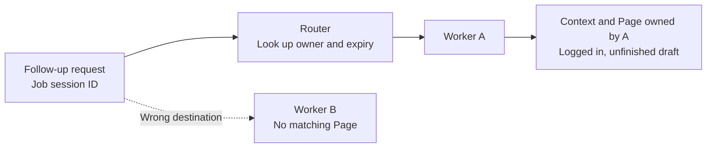

Logging in and collecting data didn't fit into a single request in the scraping service.
The first request logged into the site, the next read the dashboard, and another collected
more detail. Those later requests needed to use the browser that had already logged in.

With one server, I could find the browser that server held. As the number of customers
grew and we added servers, a request could reach a different server. If login happened on A
but the next request went to B, B had no browser with which to continue the work. That was
the problem I described in [the original post on August 20, 2025](https://velog.io/@imkkuk/Stateful-%EC%84%9C%EB%B2%84-%ED%99%95%EC%9E%A5%ED%95%98%EA%B8%B0Session-Aware-Routing%EC%9C%BC%EB%A1%9C-%EB%B8%8C%EB%9D%BC%EC%9A%B0%EC%A0%80-%EC%84%B8%EC%85%98-%EC%9D%BC%EA%B4%80%EC%84%B1-%EC%9C%A0%EC%A7%80%ED%95%98%EA%B8%B0).

The approach I chose then was to use the session ID to route requests to the server that
owned the browser. This time, I used real browsers to check what that choice solves and
where it stops helping. After starting work on a logged-in page, I sent requests to the
wrong worker and to the owner, then tested mapping expiry and owner shutdown separately.

The results below come from an independent local experiment on September 14, 2026, using
Node 24.15.0, Playwright 1.56.1, and Chromium 141.0.7390.37. The target site and login are
mock services created for the example. This does not reproduce the company's system or
its historical operational logs.

## The same session ID doesn't create the same browser

The [complete script](/blog/examples/browser-session-routing.mjs) starts A and B as separate
Node processes. Each worker runs its own headless Chromium and creates a temporary
`BrowserContext` and `Page` for each session. It doesn't use a user browser or an existing
profile.

When A receives a request to start a job, it performs these steps on a real page.

```javascript
const page = await context.newPage();
await page.goto(`${targetUrl}/login`);
await page.getByRole('button', { name: 'Sign in as demo' }).click();
await page.waitForURL(`${targetUrl}/workspace`);
await page.getByRole('textbox', { name: 'Report draft' }).fill(input.draft);
const sessionId = randomUUID();
sessions.set(sessionId, { context, page });
```

The mock site issues a cookie when the login button is clicked. It shows the signed-in
heading and input field only when that cookie is used to access the workspace.
`July report, step 2` is a draft that hasn't been submitted. Neither the target server
nor the router stores it. It remains **an input value in the open Page**.

I needed to distinguish three things that are easy to call a session.

| What it is | What it does in this experiment |
| --- | --- |
| Login on the target site | The site checks a cookie before allowing access to the workspace |
| A worker's job session | Stores real `context` and `page` objects under a session ID |
| Routing mapping | Stores the worker name and expiry time for that session ID |

The client sends the job session ID with each follow-up request. Passing that string
doesn't create A's `Page` object in B. Being logged in as the same account doesn't recreate
the unfinished input in the currently open page, either.

The original post said that each Playwright WebSocket connection creates an independent
browser. That was not a general API restriction. [`browserType.connect()`](https://playwright.dev/docs/api/class-browsertype#browser-type-connect)
can connect to an existing browser, and Playwright also supports
[saving authentication state and reusing it in a new context](https://playwright.dev/docs/auth).
The condition in this experiment is **a worker owning its Page and executing follow-up
work on it**. It isn't a claim that browsers cannot be shared.

## B couldn't find the page. A read the unfinished draft.

I first created a session on A, then sent the same ID directly to B. B couldn't find it
in its own session collection and returned `404 SESSION_NOT_OWNED`.

```javascript
const session = sessions.get(id);
if (!session) return { status: 404, body: { error: 'SESSION_NOT_OWNED', worker: name } };
```

That check matters because the next operation isn't a string or database record lookup.
The worker reads the signed-in heading and input value from the real `Page` it holds.

```javascript
authenticated: await session.page.getByRole('heading', { name: 'Signed in as demo' }).isVisible(),
page: new URL(session.page.url()).pathname,
draft: await session.page.getByRole('textbox', { name: 'Report draft' }).inputValue(),
```

After the request to B failed, I sent the same ID to the router. It found the owner, A,
recorded when the session was created, and forwarded the HTTP request to that worker.



<span class="figcap">The destination of the request changed. The router didn't copy browser state or perform the browser work itself.</span>

These were the outputs from the two paths. The status codes are response choices made
for this example.

```text
WRONG_WORKER: 404 SESSION_NOT_OWNED
OWNER: 200 authenticated=true draft="July report, step 2"
```

The draft A returned wasn't a string cached in the router. It came from calling
`inputValue()` on the page opened after login. This checked both that the ID led to the
right owner and that the follow-up request reached the browser work already in progress.

## The page was still alive after the mapping expired

The routing mapping contains no browser state. Its contents look like this.

```javascript
{ worker: 'A', expiresAt: Date.now() + ttlMs }
```

The router checks expiry before selecting the owner. When the mapping is missing or
expired, this example fails the follow-up request instead of choosing another server
arbitrarily.

```javascript
if (!owner) return json(res, 404, { error: 'MAPPING_MISSING' });
if (owner.expiresAt <= Date.now()) return json(res, 410, { error: 'MAPPING_EXPIRED' });
destination = workers[owner.worker];
```

For the test, I gave a second session's mapping a TTL of 50ms and waited 75ms. Requests
through the router returned `410`, but querying A directly still read the draft from the
same Page.

```text
EXPIRED_MAPPING: 410 MAPPING_EXPIRED; owner still reads the live Page
```

**The mapping's validity and the browser's lifetime were separate.** Expiring the mapping
didn't automatically clean up the browser. A service needs an additional session cleanup
rule to coordinate the two lifetimes. This experiment didn't implement that cleanup;
it showed that the lifetimes don't align automatically.

Here, a local Map stores the expiry time. This doesn't test Redis TTL deletion, replication
lag, or failover. The control page's expiry button moves the deadline into the past.
The automated test actually waits, then checks the same expiry condition.

## Pointing the address at B didn't recover the work

Next, I closed A's browser and stopped A's HTTP server and process. I left the first
session's mapping pointing at A. The follow-up request failed because its owner could
no longer be reached.

What if I changed only the mapping to point at B? B was a server that could respond,
but it didn't have the original session's `Page`.

```text
STOPPED_OWNER: 502 OWNER_UNAVAILABLE
REMAPPED_TO_B: 404 SESSION_NOT_OWNED
```

A connection failure became a missing-session response. The interrupted work didn't
continue. An address mapping doesn't contain the logged-in context, the open page, or
the unfinished input.

Finally, I logged in on B using the same mock account. Login succeeded, but the new
workspace's input field was empty, and a new job session ID was created.

```text
NEW_LOGIN_ON_B: 201 authenticated=true draft=""; new session
```

Logging in again made it possible to start a new job. It didn't recover the unfinished
draft. I deliberately kept that draft only in the page. Recovery could work differently
if the target service saved drafts on its server or if the necessary work state were
preserved separately.

## What this experiment establishes

The change in this experiment was the destination of a follow-up request. Going through
the router reached A's Page, where the login and draft remained. Mapping expiry didn't
delete the live Page, and changing an address after shutting down its owner didn't bring
that Page back.

The shutdown was controlled: the worker also cleaned up its browser. I didn't test host
failure, browser processes left behind after a forced shutdown, or recovery after a
restart. Ordering and conflicts when two requests manipulate the same Page concurrently
are also outside this test.

Returning to the original problem, a session ID alone didn't let the next collection
request continue. It also had to connect to the browser's location and the worker that
would perform the operation. Routing solved that connection. Recreating browser work
that was already lost needed a separate approach to preserving state and restarting work.

## Run it yourself

Download the [script](/blog/examples/browser-session-routing.mjs) into an empty directory
and run these commands. They install dependencies for the example; Chromium needs to be
downloaded on the first run.

```sh
npm install --save-exact playwright@1.56.1
npx playwright install chromium
node browser-session-routing.mjs --self-test
```

The automated checks call the actual worker APIs and assert browser values and response
codes. When finished, the script cleans up its servers and browsers and prints:

```text
PASS: browser ownership, routing, mapping expiry, owner stop, address-only remap, new login
```

Run it without `--self-test` to open the controls at `http://127.0.0.1:47320`. Buttons send
the same requests for session creation, the wrong worker, owner routing, expiry, shutdown,
and remapping. Every server binds only to the loopback address.

## References

- [Scaling a stateful server](https://velog.io/@imkkuk/Stateful-%EC%84%9C%EB%B2%84-%ED%99%95%EC%9E%A5%ED%95%98%EA%B8%B0Session-Aware-Routing%EC%9C%BC%EB%A1%9C-%EB%B8%8C%EB%9D%BC%EC%9A%B0%EC%A0%80-%EC%84%B8%EC%85%98-%EC%9D%BC%EA%B4%80%EC%84%B1-%EC%9C%A0%EC%A7%80%ED%95%98%EA%B8%B0) (original post, August 20, 2025): the need for follow-up requests to share a logged-in session when adding servers
- [BrowserType.connect](https://playwright.dev/docs/api/class-browsertype#browser-type-connect) (Playwright): connecting to an existing browser
- [BrowserContext](https://playwright.dev/docs/api/class-browsercontext) (Playwright): independent browser sessions and Pages within a context
- [Authentication](https://playwright.dev/docs/auth) (Playwright): saving authentication state and reusing it in a new context
- [Executable script](/blog/examples/browser-session-routing.mjs) (this post): workers owning real browsers, the router, and boundary checks
