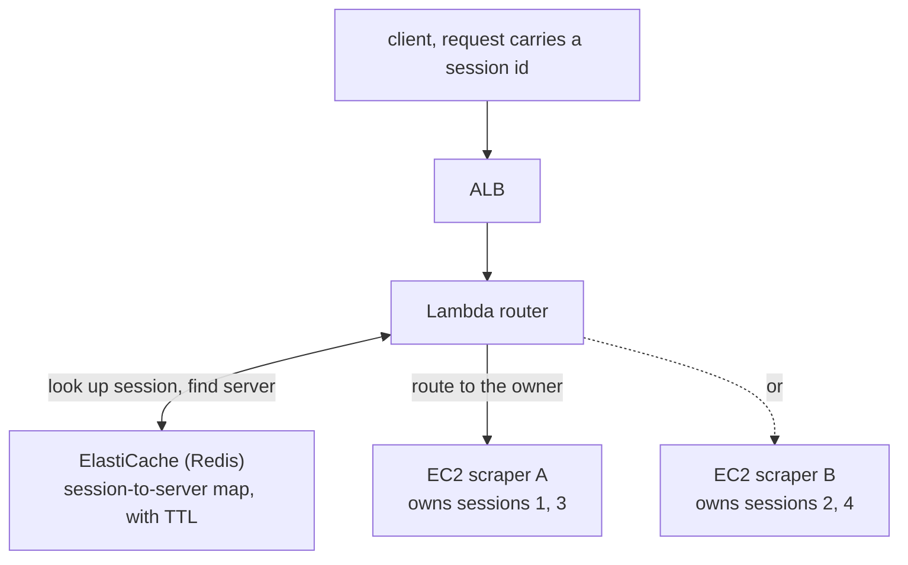

The scraping service had to log into sites and then keep working as that logged-in user.
A single job was a sequence of requests sharing one authenticated browser session.

1. Request 1, log in to the target site.
2. Request 2, scrape the dashboard on that logged-in session.
3. Request 3, pull more detail on the same session.

On one server this was effortless. The browser session lived in memory, and every
request found it. Then traffic grew, we put the service behind a load balancer, added a
second server, and it broke right away. Request 2 landed on a machine that had never
logged in, so the session simply wasn't there.

The expensive state was the running browser and its work, not just login cookies.
Follow-up requests needed to reach the owner for the lifetime of that live session.
That did not mean permanently pinning all of a user's activity to one server.

## The dead end I walked into first

My first instinct was to copy the database pattern. If every server can reach one shared
database, why not one shared browser? Put Playwright behind its own server, let any
scraper connect to it, and the session-sharing problem disappears.

It half-worked, and the half that failed taught me the most.

A separate Playwright tier still needed explicit ownership and cleanup of browsers and
contexts. The original post said that every WebSocket connection creates an independent
browser. That was wrong as a general description of Playwright.

`browserType.connect()` attaches to an existing browser started with `launchServer()`;
`connectOverCDP()` can attach to an existing Chromium browser. Selecting and sharing a
context depends on the server implementation. That historical connection code is not
recorded here, so I withdraw the claim that the API itself prevented sharing.

The design I kept assigned ownership to one server and routed work to that owner,
rather than allowing arbitrary servers to manipulate the same browser concurrently.

## The fix: externalize the location, not the session

If you can't move the session, route to it. Let each server own its own browser
sessions, keep a central map of which server holds which session, and have a router read
that map and forward each request to the right place.

Session 1 was born on scraper A, so every follow-up request for session 1 gets routed back to A, where its browser actually lives.

Three principles held the design together. First, I externalized the location, not the
session: the map lives in Redis, while the heavy, un-serializable browser state stays
exactly where it is. Second, I routed on the session ID: the first request creates the mapping
(with a TTL), and every later request carries the session id, so the router looks up its
owner before forwarding. The mapping is not a copy of the browser state. If the owner
disappears, pointing at another server does not restore the work; the contract must say
whether to start a new login or fail the existing job.

The exact historical TTL, error codes, and shutdown verification are not recorded here.
Rather than invent a completed recovery implementation, these are the boundaries I would
check in a design using this pattern.

| Lookup result | Behavior to verify |
|---|---|
| Valid mapping and live session | Route to the owner and check session access rights |
| Mapping expired | Distinguish a new job from a follow-up to an existing one |
| Mapping exists, owner is gone | Require a new login or fail; do not pretend the session moved |
| Redis lookup fails | Distinguish an unavailable store from an absent mapping |

A TTL expires routing information; it does not terminate the browser. Session cleanup
and mapping deletion need their own failure cases.

## Say the trade-offs out loud

Every clever routing design buys a new failure surface. Here's the honest ledger.

| New risk | Response to evaluate and its limit |
|---|---|
| Redis lookup failure | Multi-AZ still needs application error handling during failover |
| An owner dies and its sessions are lost | New login and retry, with duplicate work checked separately |
| Lambda cold-start latency | Compare provisioned concurrency cost with measured latency |

These are responses to evaluate, not a list of measures verified in the historical
implementation. I chose to find the owner of the live browser. Other designs can share a
browser context or move serializable state into a store. The relevant questions are
which state can move and who coordinates concurrent access.

This pattern applies when a connection or process-local state has an owner. Uploads
backed by shared storage and workflows with persistent state need not stay on their
initial node.

The useful decision was sharing the location of expensive state. It selected the right
owner for follow-up requests, but did not automatically recover a lost session. Next time
I would separately reproduce normal routing, owner shutdown, and TTL expiry, and record
the response in each case.

## References

- AWS, [Application Load Balancer: sticky sessions](https://docs.aws.amazon.com/elasticloadbalancing/latest/application/sticky-sessions.html)
- AWS, [Amazon ElastiCache for Redis](https://docs.aws.amazon.com/AmazonElastiCache/latest/red-ug/WhatIs.html)
- M. Kleppmann, [Designing Data-Intensive Applications](https://dataintensive.net/) (Ch. 6, partitioning and request routing)
- Playwright, [Browser & CDP connection model](https://playwright.dev/docs/api/class-browsertype)
