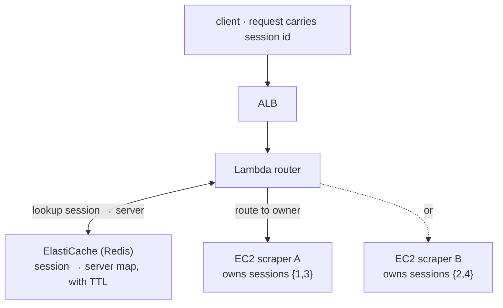

The textbook advice for scaling is "make your servers stateless." Good advice —
until the state is a **live browser session** holding a login you can't cheaply
serialize and hand to another machine. That was my situation, and forcing
statelessness was the wrong goal. The right move was to externalize the session's
*location* and route each request to the one server that owns it.

> **TL;DR** — When state can't be externalized, don't fight it. Externalize a
> **map of which server holds which session**, and make routing session-aware. The
> hard part isn't the routing table; it's admitting which state is genuinely sticky.

## The problem: a multi-step session across many servers

A scraping service that logs into sites has to keep a sequence of requests on the
same authenticated session:

1. Request 1 — log in to the target site
2. Request 2 — scrape the dashboard *as that logged-in session*
3. Request 3 — pull more detail *on the same session*

On one server this is trivial: the browser session lives in memory, every request
finds it. Scale out, and a load balancer scatters those requests across servers —
request 2 lands on a machine that never logged in. The session is gone.

The core constraint: **"a given user's requests must always reach the same
server"** — the definition of a stateful service, and the thing statelessness
advice assumes away.

## The dead end I tried first

My instinct was to mimic the database pattern: centralize the browser behind a
shared Playwright server so any scraper could reach any session. It half-worked and
taught me something.

- Splitting Playwright out as its own tier **did** save network resources.
- But it **didn't** solve session sharing. Playwright gives you two ways in, and
  neither fixes it:
  - **WebSocket** — each connection spins up an *independent* browser. No sharing.
  - **CDP (Chrome DevTools Protocol)** — you can attach to a specific browser by
    port, but at hundreds of browsers, port bookkeeping becomes its own distributed
    problem.

I kept the architectural split (it was useful) and dropped the shared-browser idea.
A dead end that eliminates an option is still progress.

## The fix: externalize the *location*, not the session

If you can't move the session, route to it. Each server owns its own browser
sessions; a central map records **which server holds which session**; a router reads
that map and forwards accordingly.

Session 1 was born on scraper A, so every follow-up for session 1 is routed back to A.

Three design principles carried the whole thing:

1. **Externalize the session's location, not the session.** The map (session →
   server) lives in Redis; the heavy, un-serializable browser state stays put.
2. **Route on identity.** The router extracts the session id and looks up its owner
   before forwarding — the first request creates the mapping (with a TTL), later
   ones follow it.
3. **Plan for failure.** A server dying means its sessions are gone; the system has
   to detect that and fail cleanly rather than route into a void.

## The trade-offs (say them out loud)

Every "clever routing" design buys a new failure surface. The honest list:

| Limit | Mitigation |
|---|---|
| Redis is now a single point of failure | Multi-AZ ElastiCache |
| Server down → its sessions lost | Client-side retry that starts a fresh session |
| Lambda cold start on the routing hop | Provisioned concurrency |

None of these are free, and pretending otherwise is how architectures rot. The
design is worth it only because the alternative — serializing a live browser session
on every hop — is worse.

## The pattern generalizes

This isn't about scraping. The same shape appears any time state is expensive to
move:

- **WebSocket fan-out** (chat, game servers) — the connection lives on one node.
- **Chunked file uploads** — the in-progress upload lives where it started.
- **State-machine workflows** — the machine's memory is pinned to a worker.

The reusable idea: **define the state's lifecycle, externalize its *location*, and
make routing follow it.** "Sticky sessions" is the well-known cousin; this is the
same instinct when the stickiness can't be delegated to the load balancer alone.

## What I'd tell another engineer

1. **"Make it stateless" is a goal, not a law.** Some state is genuinely sticky;
   name it instead of pretending it isn't.
2. **Externalize the cheap thing (a pointer), not the expensive thing (the
   session).**
3. **A design's real cost is its new failure modes.** Write them down next to the
   diagram, or you'll meet them in production.

---

## References & further reading

- AWS — *Application Load Balancer: sticky sessions*. [docs](https://docs.aws.amazon.com/elasticloadbalancing/latest/application/sticky-sessions.html)
- AWS — *Amazon ElastiCache for Redis*. [docs](https://docs.aws.amazon.com/AmazonElastiCache/latest/red-ug/WhatIs.html)
- M. Kleppmann — *Designing Data-Intensive Applications* (Ch. 6, Partitioning / request routing).
- Playwright — *Browser & CDP connection model*. [docs](https://playwright.dev/docs/api/class-browsertype)
