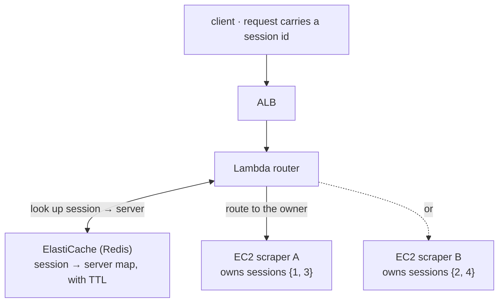

The scraping service had to log into sites and then keep working *as that logged-in
user*. A single job was a sequence of requests sharing one authenticated browser
session:

1. Request 1 — log in to the target site.
2. Request 2 — scrape the dashboard, on that logged-in session.
3. Request 3 — pull more detail, on the same session.

On one server this was effortless. The browser session lived in memory; every request
found it. Then traffic grew, we put the service behind a load balancer, added a second
server — and it broke immediately. Request 2 landed on a machine that had never logged
in. The session simply wasn't there.

That's the moment the textbook advice — "just make your servers stateless" — stopped
being useful. My state was a **live browser holding a login I couldn't cheaply
serialize** and hand to another machine. The real requirement was uncomfortable but
clear: *a given user's requests must always reach the same server.* That's the
definition of a stateful service, and it's exactly what statelessness advice assumes
away.

## The dead end I walked into first

My first instinct was to copy the database pattern: if every server can reach one
shared database, why not one shared *browser*? Put Playwright behind its own server,
let any scraper connect to it, and the session-sharing problem disappears.

It half-worked — and the half that failed taught me the most.

Splitting Playwright into its own tier **did** help: it saved network resources and
cleaned up the architecture. But it did **not** let two servers share a session,
because Playwright only gives you two ways in, and neither does what I wanted:

- **WebSocket** — every connection spins up its *own independent* browser. No sharing.
- **CDP (Chrome DevTools Protocol)** — you can attach to a specific browser by port…
  but at hundreds of live browsers, managing those ports *becomes its own distributed
  systems problem.* I'd just moved the mess, not removed it.

So I abandoned the shared-browser idea and kept the architectural split. A dead end
that eliminates an option is still progress — it told me the session was *inherently*
pinned to a server, and I should stop fighting that.

## The fix: externalize the *location*, not the session

If you can't move the session, route to it. Let each server own its own browser
sessions, keep a central map of **which server holds which session**, and have a
router read that map and forward each request to the right place.

Session 1 was born on scraper A, so every follow-up request for session 1 gets routed back to A — where its browser actually lives.

Three principles held the design together:

1. **Externalize the location, not the session.** The map (session → server) lives in
   Redis; the heavy, un-serializable browser state stays exactly where it is.
2. **Route on identity.** The first request creates the mapping (with a TTL); every
   later request carries the session id, and the router looks up its owner before
   forwarding.
3. **Plan for failure.** A server dying means its sessions are gone — so the system
   has to detect that and fail cleanly, not route into a void.

## The trade-offs (say them out loud)

Every "clever routing" design buys a new failure surface. The honest ledger:

| New risk it introduces | How I mitigated it |
|---|---|
| Redis is now a single point of failure | Multi-AZ ElastiCache |
| A server dies → its sessions are lost | Client-side retry that starts a fresh session |
| The Lambda routing hop adds cold-start latency | Provisioned concurrency |

None of these are free. The design is only worth it because the alternative —
serializing a live browser session on every hop — is worse. Writing the failure modes
down next to the diagram is how you keep an architecture honest.

## The pattern generalizes

This was never really about scraping. The same shape shows up whenever state is
expensive to move:

- **WebSocket fan-out** (chat, game servers) — the connection lives on one node.
- **Chunked file uploads** — the in-progress upload lives where it started.
- **State-machine workflows** — the machine's memory is pinned to a worker.

The reusable idea: **define the state's lifecycle, externalize its *location*, and
make routing follow it.** "Sticky sessions" is the well-known cousin; this is the same
instinct for when the stickiness can't be delegated to the load balancer alone.

## What I took away

1. **"Make it stateless" is a goal, not a law.** Some state is genuinely sticky — name
   it instead of pretending it isn't, and design *for* it.
2. **Externalize the cheap thing (a pointer), not the expensive thing (the session).**
3. **A design's real cost is its new failure modes.** I met all three of mine
   eventually; the only reason they didn't become incidents is that they were on the
   diagram from day one.

---

## References & further reading

- AWS — *Application Load Balancer: sticky sessions*. [docs](https://docs.aws.amazon.com/elasticloadbalancing/latest/application/sticky-sessions.html)
- AWS — *Amazon ElastiCache for Redis*. [docs](https://docs.aws.amazon.com/AmazonElastiCache/latest/red-ug/WhatIs.html)
- M. Kleppmann — *Designing Data-Intensive Applications* (Ch. 6, Partitioning & request routing).
- Playwright — *Browser & CDP connection model*. [docs](https://playwright.dev/docs/api/class-browsertype)
