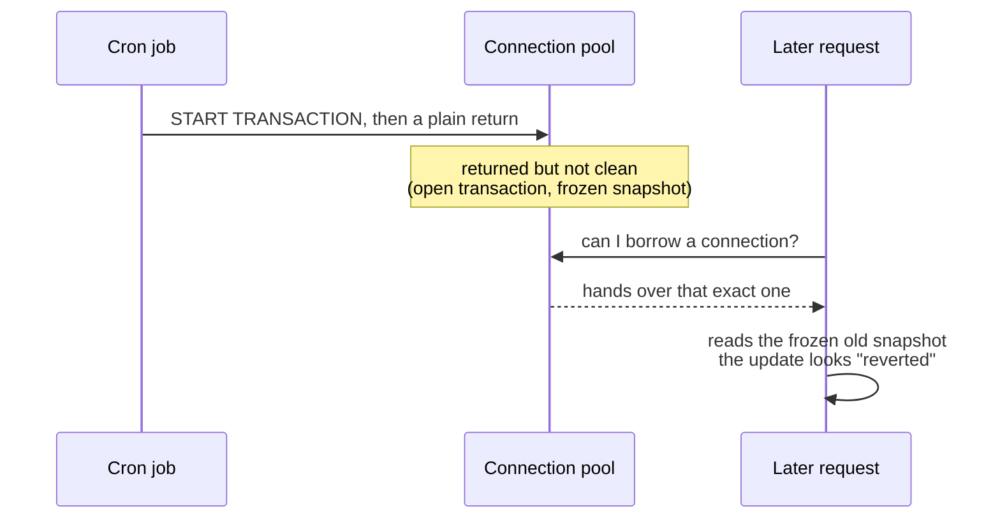

The bug report I got was a strange one. A user edits a value, and it saves — that part
works. But when they refresh, the old value is sometimes back. Same request, same code,
yet it works some of the time and not others.

What made it stranger: restarting the server fixed it, but only for about 20–30
minutes, after which it slowly crept back.

If you've spent time around production, "a restart fixes it for a while" probably makes
something click. It usually isn't a bug in your logic — it points at a shared resource
that accumulates state over time. And the most shared, most reused resource in a
backend is the connection pool.

## Before opening any code, I read the symptoms

Lining up the three symptoms already told me roughly where to look:

- The same request returns different values from one call to the next.
- An update saves, then reverts to the old value.
- A freshly started server is fine; it only shows up 20–30 minutes in.

A fresh pool doesn't have a problem connection in it yet. The offending code has to run
once, and then that connection has to get lent back out — which takes time. So some
requests were drawing a connection that still carried leftover state from whoever used
it last. Now I had a shape to chase.

## Ruling out the cheap suspects first

I started with the database. MariaDB was on a current version with no known issue for
this, and when I checked who was actually connected, it was just the app and my own
DataGrip session. Nothing odd on the server side, so I moved on.

Then the cache. There was no Redis in front of it, and TypeORM's built-in query cache
was turned off, so stale reads couldn't be a caching artifact.

With those gone, what was left was how the application handled transactions. Two logs
closed the case. First, once I had structured app logging, I caught two requests
arriving at the same moment and getting different values — one saw the update, the
other saw stale data. That was the tell: the data wasn't wrong, different connections
were simply seeing different things. Then I turned on SQL logging and there it was, a
`START TRANSACTION` with no matching commit or rollback.

## The real cause: a plain `return` inside a transaction

A cron job was opening a transaction and then returning early on one branch, before it
ever committed.

```javascript
async badCode() {
  const connection = getConnection();
  try {
    await connection.startTransaction();
    // ...business logic...
    if (A === true) {
      return A;                       // leaves here with no commit and no rollback
    }
    await connection.commitTransaction();
    return dto;
  } catch (e) {
    await connection.rollbackTransaction();
  } finally {
    await connection.release();       // released — but the transaction is still open
  }
}
```

This is the tricky bit. The `finally` does release the connection, so it looks tidy.
But the early return skipped both the commit and the rollback, so the connection goes
back to the pool with its transaction still open. It's returned, just not clean.

Here's why that surfaces as stale reads. Under MySQL and MariaDB's default REPEATABLE
READ, a transaction takes a consistent snapshot at its first read and keeps serving
that same snapshot until it ends. So a connection frozen mid-transaction keeps showing
an old view of the world to whoever borrows it next.



Seen this way, all three symptoms line up at once. The result depends on which
connection you draw, so it's inconsistent. The frozen snapshot predates the write, so
the value looks reverted. And the cron has to run and its connection has to get re-lent,
so it only appears once the server has been up a while.

## The fix was simple. The habit behind it mattered more.

I changed it so every path commits or rolls back before the connection is released.

```javascript
async goodCode() {
  const connection = getConnection();
  try {
    await connection.startTransaction();
    const dto = A === true
      ? await handleA(connection)
      : await handleNonA(connection);   // decide the branch inside the try
    await connection.commitTransaction();
    return dto;
  } catch (e) {
    await connection.rollbackTransaction();
    throw e;
  } finally {
    await connection.release();          // now it's always a clean connection
  }
}
```

Commit in `try`, roll back in `catch`, release in `finally`. That was the immediate
fix. But the longer-lasting one was to stop managing transaction boundaries by hand at
all. If you wrap them in a `typeorm-transactional` decorator or a `withTransaction(fn)`
helper, there's no branch you can leave through that skips the commit or rollback. And
inside a raw transaction block, it's better not to branch or return partway — if you
need a branch, settle it before you open the transaction.

One more thing worth saying: the only reason I caught this was the logs. If they hadn't
shown two same-moment requests getting different values, this could have hidden for
weeks. Ever since, I keep structured logging on in staging and production as a matter of
habit.

Looking back, what made this bug so annoying was that the code that caused it (a cron
job) and the place the symptom showed up (user requests) had nothing to do with each
other. When one transaction leaks, the blast radius isn't that code — it's the whole
pool. It was a good reminder that building something you can't forget beats trying hard
to remember.

## References

- MySQL — [Consistent Nonlocking Reads](https://dev.mysql.com/doc/refman/8.0/en/innodb-consistent-read.html) (how REPEATABLE READ snapshots work)
- MariaDB — [SET TRANSACTION ISOLATION LEVEL](https://mariadb.com/kb/en/set-transaction/)
- TypeORM — [Transactions & QueryRunner](https://typeorm.io/transactions)
- [typeorm-transactional](https://github.com/Aliheym/typeorm-transactional) — declarative transaction boundaries
