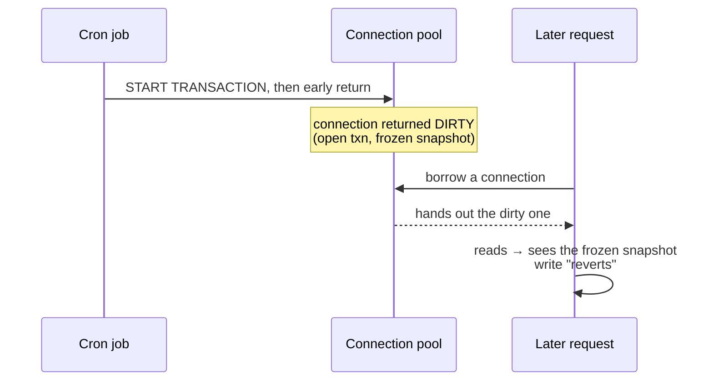

The bug report was the kind that makes you distrust reality: a user updates a value,
it saves, they refresh — and sometimes the old value is back. Same request, same
code, different outcome. And it only started **20–30 minutes after each restart**,
never right away.

That last detail is the whole case. Bugs that appear *only after the system warms up*
are almost always about **shared, reused resources** — and the most reused resource
in a backend is the **database connection pool.**

> **TL;DR** — An early `return` inside a manual transaction left it open. The
> connection went back to the pool **dirty**, still holding a REPEATABLE READ
> snapshot. Whatever request borrowed that connection next kept reading the old
> snapshot — so writes "reverted." The fix is making every code path close the
> transaction; the discipline is never branching out of one.

## Reading the symptom like a clue

Three facts, taken together, point almost directly at the cause:

- **Non-deterministic** — identical requests returned different values.
- **Reverting writes** — updates succeeded, then stale values reappeared.
- **Only 20–30 min after restart** — never on a fresh process.

"Non-deterministic + reverting + needs warm-up" reads as: *some requests get a
connection carrying old state.* A fresh pool has no poisoned connections yet; you
have to wait for the offending code to run and for that connection to be handed out
again.

## The investigation (ruling things out first)

Failure-mode-first means eliminating the cheap suspects before theorizing:

- **Database?** MariaDB was current, no rogue connections, nothing unusual server-side.
- **Cache?** No Redis; TypeORM's query cache was off. Not a caching artifact.

That narrows it to the application's own transaction handling. Then the logs closed
it:

1. **App logs** showed two requests at the *same timestamp* returning different
   values — a smoking gun for connection-level state, not data-level state.
2. **SQL logs** showed a `START TRANSACTION` with **no matching COMMIT or ROLLBACK.**

## The root cause: an early return inside a transaction

A cron job opened a transaction and then returned early on a branch — before commit,
before rollback:

```javascript
// the bug
await queryRunner.startTransaction();
if (condition) {
  return earlyValue;   // ← transaction never closed, connection never released
}
await queryRunner.commitTransaction();
```

When a method returns mid-transaction, the connection goes back to the pool with an
**open transaction still attached.** Under MySQL/MariaDB's default **REPEATABLE
READ**, a transaction takes a consistent snapshot at its first read and serves *that*
snapshot for its entire life. So a connection stuck mid-transaction keeps showing an
old view of the world to whoever borrows it next:


<span class="figcap">The poison isn't in the data — it's in the connection. Any request unlucky enough to borrow it inherits a stale, frozen view.</span>

That explains every symptom: non-deterministic (depends which connection you draw),
reverting (the frozen snapshot predates the write), and warm-up-only (the cron has to
run and the connection has to be re-lent).

## The fix — and the discipline behind it

Make **every** path close the transaction and release the connection:

```javascript
await queryRunner.startTransaction();
try {
  const result = condition ? await handleA() : await handleB();
  await queryRunner.commitTransaction();
  return result;
} catch (err) {
  await queryRunner.rollbackTransaction();
  throw err;
} finally {
  await queryRunner.release();   // always return a CLEAN connection to the pool
}
```

The immediate fix is `try/catch/finally`. The durable fix is to stop hand-managing
transaction boundaries at all:

- **Use a transaction abstraction** (e.g. `typeorm-transactional` decorators, or a
  `withTransaction(fn)` wrapper) so commit/rollback/release can't be forgotten.
- **Never branch or early-return inside a raw transaction block.** If you must,
  compute the branch first, transact second.
- **Log structurally, everywhere** — the fix was found because same-timestamp logs
  exposed connection-level divergence. Without that, this bug hides for weeks.

## What I'd tell another engineer

1. **"Only after warm-up" means shared reused state.** Look at pools and caches
   before you look at your logic.
2. **A dirty connection poisons requests that aren't even related to the bug.** The
   blast radius of a leaked transaction is the whole pool.
3. **Don't hand-manage what a wrapper can guarantee.** RAII-style transaction helpers
   turn a discipline you must remember into one you can't forget.

---

## References & further reading

- MySQL — *Consistent Nonlocking Reads* (REPEATABLE READ snapshots). [docs](https://dev.mysql.com/doc/refman/8.0/en/innodb-consistent-read.html)
- MariaDB — *SET TRANSACTION ISOLATION LEVEL*. [docs](https://mariadb.com/kb/en/set-transaction/)
- TypeORM — *Transactions & QueryRunner*. [docs](https://typeorm.io/transactions)
- `typeorm-transactional` — declarative transaction boundaries. [github](https://github.com/Aliheym/typeorm-transactional)
