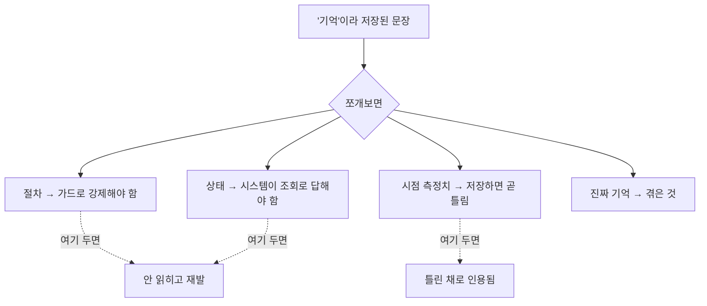

운영 에이전트에게 기억을 붙이는 작업을 맡았어요. 지금은 컨테이너 안에 평문 파일 하나가
사이드카로 있고, 에이전트가 거기에 줄 단위로 덧붙입니다. 이걸 데이터베이스 테이블로
옮겨서 누가 언제 남긴 건지, 누가 볼 수 있는지를 갖추게 하는 게 목표였습니다.

계획을 세우고 나서 착수 직전에 한 가지가 걸렸어요. **이 파일이 지금 실제로 쓸모가
있나?** 옮기는 게 맞는지 판단하려면 원본이 어떻게 쓰이고 있는지는 알아야 할 것
같았습니다.

그래서 운영 인스턴스에 읽기 전용으로 붙어서 세어봤어요. 이 하루가 이 작업 전체의
방향을 바꿨습니다.

## 2주, 세션 76개, 호출 세 번

기억 도구가 불린 횟수부터 셌습니다.

| 기간 | 세션 | 기억 읽기 | 기억 쓰기 |
|---|---|---|---|
| 2주 | 76 | 2 | 1 |

세션이 76개인데 기억 도구는 세 번 불렸어요. 그중 쓰기는 한 번이었습니다.

즉 에이전트는 자기한테 기억 도구가 있다는 걸 거의 활용하지 않고 있었어요. 도구가 없어서
못 쓴 게 아니라, 있는데 안 쓴 겁니다. 왜 안 쓰는지는 이 시점엔 몰랐고, 나중에 도구
설명문을 다시 쓰면서 한 가지 가설을 얻었어요. 이건 뒤에서 다룰게요.

## 유일하게 값진 한 줄은 아무도 안 읽었어요

파일에 실제로 뭐가 적혀 있는지도 봤습니다. 대부분은 지나가는 메모였는데, 하나는 진짜
교훈이었어요. 대충 이런 내용이었습니다.

> 작업자가 조용하다고 해서 프로세스가 죽은 게 아니다. 긴 계산 중일 수 있다.

운영하면서 얻은 지식이고, 다음 사람이 같은 실수를 안 하게 해주는 종류예요. 정확히
"기억"이 하라고 만든 일입니다.

그런데 이 줄은 개인 스코프에 적혀 있었어요. 그 사람만 볼 수 있는 자리요. 그리고 그
사람은 그 뒤로 이 작업에 다시 안 왔습니다. 그러니까 이 문장은 저장된 이후로 **한 번도
프롬프트에 들어간 적이 없어요.**

더 아팠던 건 나흘 뒤였습니다. 다른 사람이 같은 상황에서 똑같이 오진했어요. 조용하니까
죽었다고 판단한 거죠. 교훈은 시스템 안에 분명히 있었는데, 필요한 사람 앞에 놓이지
않았습니다.

## 그 교훈을 네 문장으로 쪼개보니

이 시점에 질문이 하나 생겼어요. 저 문장이 정말 "기억"일까?

네 문장으로 쪼개서 각각 어디에 속하는지 따져봤습니다.

| 쪼갠 문장 | 정체 |
|---|---|
| 조용하다고 죽은 게 아니다 | 절차. 판정 로직이 막아야 할 것 |
| 긴 계산 중일 수 있다 | 상태. 시스템이 답해줄 수 있어야 할 것 |
| 지금 세 건이 그 상태다 | 시점 측정치. 이미 틀렸음 |
| 이럴 땐 프로세스 상태를 확인하라 | 절차. 도구나 런북이 담당 |

네 개 중에 기억인 게 하나도 없었어요. 둘은 가드나 판정 로직이 강제해야 할 규칙이고,
하나는 시스템이 조회로 답해줄 상태고, 나머지 하나는 쓰이는 순간 이미 낡은 숫자였습니다.

이게 꽤 충격이었어요. 우리가 "기억"이라고 부르며 저장하고 있던 것의 상당 부분이
사실은 **구현되지 못한 가드**이거나 **노출되지 않은 상태**였던 겁니다. 사람이 기억으로
때우고 있었던 거죠.



<span class="figcap">기억층에 넣을 게 아니라 다른 층이 담당해야 할 것들이 섞여 있었어요.</span>

## 회상 쿼리도 재봤는데 한쪽이 통째로 안 나왔어요

기왕 재는 김에 읽는 쪽도 봤습니다. 프롬프트에 넣을 항목을 고르는 쿼리가 이렇게 생겼어요.

```sql
SELECT * FROM memory
ORDER BY at DESC, seq DESC
LIMIT 10
```

최근 것부터 열 개를 가져옵니다. 그럴듯하죠.

문제는 초기 적재 방식이었어요. 파일을 처음 DB로 옮길 때 모든 행에 같은 시각을 찍었고,
`seq`는 파일마다 0부터 매겼습니다. 같은 시각으로 적재한 행끼리는 `seq` 내림차순으로
고르므로, 줄 수가 많은 파일의 뒤쪽 항목이 앞에 놓였습니다. 스코프별로 몇 개씩 고를지
정한 쿼리가 아니었어요.

초기 적재 표본으로 돌려보니 공유 스코프에서 열 개가 다 차고, 개인 스코프는 0개였습니다.
새 개인 항목의 `at`가 더 늦으면 먼저 선택되므로, 개인 기억이 언제나 제외된다는 뜻은
아닙니다. 같은 시각으로 옮긴 항목의 선택이 파일 길이에 좌우되는 문제였어요. 앞서 파일에
있던 교훈이 읽히지 않은 사건과 이번 DB 쿼리의 문제는 별도로 확인한 것이고, 같은 원인으로
연결할 근거는 없습니다.

## 그래서 쓰기만 열고 읽기는 안 열었어요

이 측정 결과를 들고 설계를 다시 잡았습니다.

**새로 쓰는 기억의 회상 연결은 나중으로 미뤘어요.** 잘못된 항목이 즉시 프롬프트로
들어가는 경로를 늘리지 않으려는 선택이었습니다. 그렇다고 쓰기만 열면 피해가 없는 건
아니에요. 불필요하거나 민감한 내용이 저장될 수 있고, 정리 비용과 나중에 회상을 연결할
때의 검토 부담도 남습니다. 기존 읽기 경로와 새 쓰기 경로의 범위를 구별해야 했어요.

그 단계에서는 에이전트가 고르는 분류 값의 분포를 관측하려 했습니다. 한쪽으로 몰린다면
분류 설명이나 정책을 다시 볼 단서가 될 수는 있어요. 그 분포만으로 기억의 품질이나
회상 정책이 검증되는 것은 아닙니다.

**분류는 두 가지만 받았습니다.** 겪은 일과 알게 된 사실. 작업 중 임시 상태는 영속
대상이 아니라서 뺐고, "저작된 절차"는 고객이 편집하는 문서가 담당하는 영역이라 기억으로
흡수하면 안 된다고 봤어요. 위에서 네 문장을 쪼개본 게 여기서 바로 쓰였습니다.

**스코프 축은 배선 시점에 고정했어요.** 도구를 부르는 쪽이 스코프를 조립할 수 있으면
격벽이 뚫립니다. 그래서 도구는 내용과 분류 둘만 받고, 누구의 기억인지는 에이전트를
연결할 때 이미 정해지게 했어요.

**마이그레이션을 런타임 경로에서 뺐습니다.** 작업하다 보니 이관 스크립트가 운영 에이전트
호출마다 돌고 있는 걸 발견했어요. 76번 돌았더라고요. 데이터베이스 마이그레이션은 단발
절차지 상시 절차가 아닙니다. 별도 커맨드로 분리했어요.

**도구 설명문을 독자 지정형으로 바꿨어요.** 원래 설명은 "다시 볼 수 없으니 함부로 쓰지
마라"는 부정형이었습니다. 앞에서 본 "있는데 안 쓴다"의 한 원인이 이거였을 수 있어요.
저장 자체를 막는 문장이니까요. "나중에 읽는 사람이 있으니 혼자 읽어도 말이 되게 써라"로
바꾼 뒤에는 다른 사람이 읽을 수 있는 형태의 노트를 관찰했습니다. 다만 설명문만 바꾼
대조 실험은 아니었어요. 호출이 적었던 원인이 설명문이라고 확정하거나, 이 변경으로
활용률이 올랐다고 말할 근거는 없습니다.

## 그리고 이건 아직 기억 시스템이 아니에요

이 작업에는 저장 모델과 스코프 분리의 부분 구현이 남았습니다. 하지만 개인과 공유
메모리 시스템은 완성하지 못했어요. 아래는 당시 남긴 공백입니다. 저장이나 소규모 도구
호출 검증을 끝냈다는 기록으로 이 공백을 덮을 수는 없습니다.

- 새 쓰기에서 회상까지 이어지는 동작을 완성하지 못했습니다. 판단 개선은 확인하지 못했어요.
- 무엇을 언제 꺼낼지 정하는 랭킹이 없습니다.
- 개별 항목 정정과 별개로, 무엇을 오래됐거나 틀렸다고 판정할지 수명 정책이 부족해요.
- 같은 대상에 대한 모순된 기억을 어떻게 다룰지 미정의입니다.
- 쌓이면 쌓이는 대로 갑니다. 압축이 없어요.
- 저장 분류가 맞는지 재는 장치가 없습니다.

당시 통과한 테스트와 소규모 검증은 그 범위의 동작을 확인한 것이었습니다. 모든 기존
동작이 보존됐거나 기억이 실제 판단을 개선했다는 증거로 넓힐 수는 없어요. 이 글도
완성된 메모리 시스템의 성과가 아니라, 무엇을 재고 어디까지 만들지 판단했던 회고로
남깁니다.

## 돌아보면

착수 직전에 멈춰서 원본을 재본 게 이 작업에서 제일 잘한 일이었어요. 안 재고 그냥
옮겼으면 "평문 파일을 DB로 잘 옮겼다"로 끝났을 겁니다. 그리고 여전히 아무도 안 쓰는
기억이 이번엔 테이블 안에 쌓였겠죠.

제일 오래 남은 문장은 "기억이라고 부르던 것의 대부분이 구현 안 된 가드였다"입니다.
사람이 반복해서 같은 말을 적고 있다면, 그건 기억이 부족한 게 아니라 시스템이 그걸
강제하지 않아서일 수 있어요. 기억층을 키우는 것보다 그걸 가드로 옮기는 게 맞는
경우가 많습니다.

그리고 저장이 됐다는 것과 행동이 바뀐다는 건 완전히 다른 이야기예요. 저희가 잰 건
"쓰였는가"였는데, 진짜 물어야 할 건 "다시 읽혀서 판단을 바꿨는가"였습니다. 그 질문에
답하는 장치를 아직 안 만들었고, 그게 다음 일이에요.

## 참고한 자료

- [CoALA: Cognitive Architectures for Language Agents](https://arxiv.org/abs/2309.02427) (Sumers et al., 2023): 기억을 종류별로 나누는 틀. 네 가지 중 둘만 채택한 근거로 썼어요
- [MemGPT: Towards LLMs as Operating Systems](https://arxiv.org/abs/2310.08560) (Packer et al., 2023): 회상과 압축을 시스템 층에서 다루는 접근
- [SQL Window Functions](https://www.postgresql.org/docs/current/tutorial-window.html) (PostgreSQL): 스코프별로 N개씩 뽑을 때 단순 정렬 대신 쓸 수 있는 것
