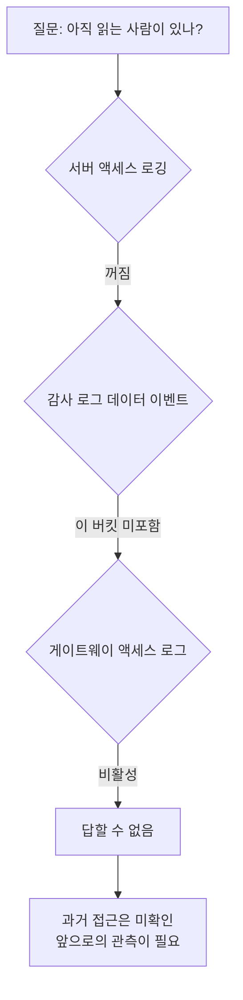

레거시 플랫폼의 마지막 조각을 내리는 일이었어요. 워크플로는 다 옮겼고, 남은 건 그
플랫폼이 제공하던 파일 저장소 기능이었습니다. 사용자가 파일을 올리고 워크플로에서
읽어가는 용도였어요.

"이제 아무도 안 쓰니까 내리면 됩니다"가 제 예상이었습니다. 확인만 하면 되는 일이라고
생각했어요.

## 먼저 규모부터 셌어요

저장소는 객체 스토리지 버킷 하나를 여러 용도가 나눠 쓰고 있었습니다. 그중 이 기능이
쓰는 접두사만 추려야 했어요.

전체 5만여 객체를 나열해서 필터링하니 대상이 5,574개, 8.56기가바이트, 논리적인 드라이브
단위로는 61개였습니다. 생각보다 적어서 다행이다 싶었어요.

쓰기 시각을 보니 대부분이 몇 달 전에 멈춰 있었습니다. 마이그레이션 시점과 얼추 맞았어요.
여기까지는 예상대로였습니다.

## 확인한 경로에 읽기 기록이 없었어요

문제는 그 다음이었어요. 확인한 파일 대부분의 수정 시각은 오래됐는데, **읽기**는요?

읽기 이력은 객체의 수정 시각으로 알 수 없습니다. 별도의 접근 기록이 필요했어요.
이 환경에서 사용할 수 있는 세 가지 로그 경로를 확인했습니다.

**서버 액세스 로깅.** 버킷 설정을 보니 꺼져 있었어요. 켜두었다면 접근 기록을 확보하는
데 도움이 됐겠지만, [S3 서버 액세스 로그](https://docs.aws.amazon.com/AmazonS3/latest/userguide/ServerLogs.html#LogDeliveryBestEffort)는
누락과 지연, 중복이 가능한 best-effort 방식입니다. 모든 요청이 빠짐없이 기록된다는
보장으로 사용할 수는 없어요.

**클라우드 감사 로그의 데이터 이벤트.** 이건 켜져 있었습니다. 그런데 대상 버킷 목록을
보니 다른 버킷들만 들어 있고 이 버킷은 빠져 있었어요. 관리 이벤트(버킷 정책 변경 같은
것)는 남지만 객체를 읽고 쓴 기록은 안 남습니다.

**게이트웨이 액세스 로그.** 서비스 메시 게이트웨이를 지나가면 거기 로그가 남는데,
이것도 비활성이었어요.

확인한 세 경로 모두 이 저장소의 읽기 기록을 남기지 않고 있었습니다. 누군가 지난 몇 달
동안 파일을 다운로드했더라도, 이 로그들로는 그 사용처를 소급해서 찾을 수 없었어요.

여기서 좀 멍했어요. 제가 하려던 건 "아무도 안 쓴다"를 확인하는 거였는데, 그걸 확인할
방법이 원천적으로 없었던 겁니다. 없다는 걸 증명하려면 관측이 있어야 하는데 관측이
없으니까요.

쓰기는 객체 타임스탬프로 알 수 있는데, 읽기는 켜둔 적이 없으면 소급해서 알 방법이 없어요.

## 대신 코드 쪽에서 사용처를 찾기로 했어요

관측이 없으니 반대편에서 접근했습니다. 이 저장소를 읽는 코드가 어디 있는지 전수로
찾는 거예요.

워크플로 정의 525건의 코드를 전부 받아서 이 접두사를 참조하는 곳을 찾았습니다. 사내
코드 저장소 전체도 훑었어요. 클라이언트 라이브러리를 호출하는 지점, 경로 문자열을
하드코딩한 지점, 설정 파일에 적힌 지점을 다 봤습니다.

이 조사로 코드에 남아 있는 참조는 확인할 수 있었지만, 그 코드가 지금도 실행되는지는
별도 문제였습니다. 반대로 사내 저장소 밖의 스크립트나 누군가의 노트북에 있는 코드는
못 봐요. 코드 검색만으로 "현재 사용자가 없다"고 판정할 수는 없었습니다.

그러다 마지막으로 객체 목록을 다시 훑다가 이상한 걸 봤어요.

## 쓰기 주체를 못 찾은 파일에 최근 수정 흔적이 있었어요

한 파일의 최종 수정 시각이 그 주 새벽이었습니다. 다른 것들은 다 몇 달 전인데 이것만요.

이름이 "최신"이라는 뜻의 파일이었어요. 주기적으로 갱신되는 종류로 보였습니다.

세 가지를 확인했어요.

**그 시각에 도는 스케줄이 있나.** 새 플랫폼과 레거시 양쪽 스케줄을 다 봤는데, 그 시각
근처에 도는 게 없었습니다.

**이 파일을 쓰는 코드가 있나.** 아까 훑은 워크플로 525건 전문에 이 파일을 *읽는* 코드는
몇 개 있었는데 *쓰는* 코드는 없었어요.

**사내 저장소에 클라이언트가 있나.** 없었습니다.

확인한 코드와 스케줄에서는 쓰기 주체를 못 찾았는데, 최근 수정 흔적은 있었습니다.
관리 범위 밖의 프로세스일 가능성도 있었지만, 이때는 어디서 쓴 것인지 확정할 수 없었어요.
코드 검색으로 찾지 못한 쓰기가 있다는 것까지가 확인한 사실이었습니다.

이걸 확인하고 나서 "내려도 된다"는 판단을 접었습니다. 중단하면 영향을 받을 사용처를
파악하지 못한 상태였으니까요. 특히 읽기 로그가 없어서, 쓰인 파일을 누가 소비하는지
추적할 수 없었습니다.

## 결론은 "끄지 말고 관측부터 켜자"였어요

그래서 티켓의 목표를 바꿨어요. "저장소 종료"에서 "종료 가능 여부 판정을 위한 관측
확보"로요.

순서는 이렇게 잡았습니다. 먼저 서버 액세스 로깅을 켜고, 관측 기간을 정해서 기다립니다.
그동안 접근이 있는지 보고, 있으면 어디서 오는지 추적해요. 관측 기간은 사용처의 실행
주기를 포함해야 하고, 로그에 접근이 없다는 것만으로 미사용을 확정하지는 않습니다.
확인한 사용처를 전환한 다음 읽기 전용 단계와 종료 순서를 잡기로 했어요.

기간은 늘어나지만, 중단한 뒤 신고를 기다리는 방식으로는 영향을 파악하기 어려웠어요.
실패를 알리지 않고 낡은 데이터를 계속 쓰는 소비자가 있을 수도 있으니까요.

## 일주일 뒤에 추가한 내용

관측을 켜고 7일을 기다렸습니다. 결과가 이랬어요.

| 항목 | 값 |
|---|---|
| 7일간 접근 | 712건 |
| 그중 클러스터 밖에서 온 것 | 63% |
| 쓰기 | 6건, 전부 내부 |

"아무도 안 쓴다"고 하려던 저장소에 하루 100건씩 접근이 있었고, 그 3분의 2가 우리
클러스터 바깥에서 왔습니다. 여기서 "바깥"은 네트워크 출발지 분류이지, 사외 사용자라는
뜻은 아니에요. 쓰기 6건은 모두 내부로 분류됐지만, 그 분류만으로 앞서 본 파일의 갱신
주체를 특정할 수는 없었습니다. 적어도 이 저장소에 접근이 계속 있다는 건 확인했어요.

이 숫자를 들고 종료 계획을 다시 썼어요. 접근 출발지를 분류하고, 바깥에서 오는 것의
주인을 찾고, 그 다음에야 읽기 전용 단계로 넘어가는 순서로요.

## 돌아보면

제일 크게 남은 건 **"안 쓴다"는 판단에 어떤 관측이 필요한지 먼저 정해야 한다**는 거예요.
객체의 최종 수정 시각은 최근 쓰기의 단서가 됐지만, 읽기를 설명해주지는 않았습니다.
이 저장소에는 그 질문에 답할 로그가 없었어요.

그래서 요즘은 뭔가를 종료 대상으로 올릴 때 제일 먼저 하는 게 관측을 켜는 겁니다.
끄는 계획을 세우기 전에요. 순서가 반대인 것 같지만, 그 반대 순서로 하면 판단할 재료가
없는 상태로 결정을 내리게 돼요.

객체 목록의 최근 수정 시각은 코드 조사에서 놓친 사용처가 있을 수 있다는 단서였습니다.
그 단서를 바로 주체에 대한 결론으로 바꾸지 않고, 접근 기록을 확보하는 쪽으로 작업을
바꾼 것이 이번 조사에서 중요한 결정이었어요.

## 참고한 자료

- [Logging requests with server access logging](https://docs.aws.amazon.com/AmazonS3/latest/userguide/ServerLogs.html) (AWS): 기본이 꺼져 있고, 켠 시점 이후만 남는다는 것
- [Logging data events with CloudTrail](https://docs.aws.amazon.com/awscloudtrail/latest/userguide/logging-data-events-with-cloudtrail.html) (AWS): 관리 이벤트와 데이터 이벤트의 차이, 버킷별로 따로 켜야 하는 구조
- [Bucket policies for Amazon S3](https://docs.aws.amazon.com/AmazonS3/latest/userguide/bucket-policies.html) (AWS): 읽기 전용 전환을 검토할 때 확인할 버킷 정책과 권한
