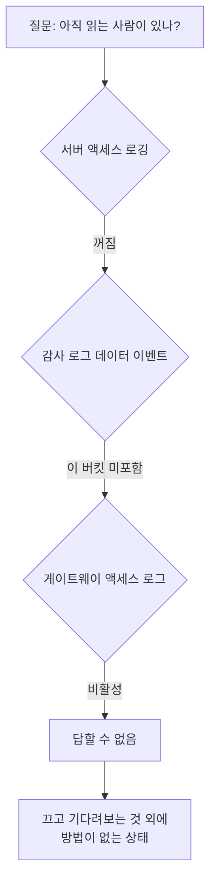

레거시 플랫폼의 마지막 조각을 내리는 일이었어요. 워크플로는 다 옮겼고, 남은 건 그
플랫폼이 제공하던 파일 저장소 기능이었습니다. 사용자가 파일을 올리고 워크플로에서
읽어가는 용도였어요.

"이제 아무도 안 쓰니까 내리면 됩니다"가 제 예상이었습니다. 확인만 하면 되는 일이라고
생각했어요.

## 먼저 규모부터 셌어요

저장소는 객체 스토리지 버킷 하나를 여러 용도가 나눠 쓰고 있었습니다. 그중 이 기능이
쓰는 접두사만 추려야 했어요.

전체 5만여 객체를 나열해서 필터링하니 대상이 5,574개, 8.56기가바이트, 논리적인 드라이브
단위로는 61개였습니다. 생각보다 적어서 다행이다 싶었어요.

쓰기 시각을 보니 대부분이 몇 달 전에 멈춰 있었습니다. 마이그레이션 시점과 얼추 맞았어요.
여기까지는 예상대로였습니다.

## 읽기를 잴 방법이 하나도 없었어요

문제는 그 다음이었어요. 쓰기가 멈췄다는 건 확인했는데, **읽기**는요?

객체 스토리지는 기본적으로 누가 읽었는지를 안 남깁니다. 남기려면 켜야 해요. 세 가지
방법이 있는데 하나씩 확인했습니다.

**서버 액세스 로깅.** 버킷 설정을 보니 꺼져 있었어요. 켜져 있었으면 모든 요청이 다른
버킷에 로그로 쌓였을 텐데요.

**클라우드 감사 로그의 데이터 이벤트.** 이건 켜져 있었습니다. 그런데 대상 버킷 목록을
보니 다른 버킷들만 들어 있고 이 버킷은 빠져 있었어요. 관리 이벤트(버킷 정책 변경 같은
것)는 남지만 객체를 읽고 쓴 기록은 안 남습니다.

**게이트웨이 액세스 로그.** 서비스 메시 게이트웨이를 지나가면 거기 로그가 남는데,
이것도 비활성이었어요.

세 겹이 다 꺼져 있었습니다. 그러니까 누군가 지난 몇 달 동안 이 저장소에서 파일을
다운로드했다 해도 그 흔적이 **어디에도 없어요.** UI로 받았든 클라이언트로 받았든
마찬가지입니다.

여기서 좀 멍했어요. 제가 하려던 건 "아무도 안 쓴다"를 확인하는 거였는데, 그걸 확인할
방법이 원천적으로 없었던 겁니다. 없다는 걸 증명하려면 관측이 있어야 하는데 관측이
없으니까요.

쓰기는 객체 타임스탬프로 알 수 있는데, 읽기는 켜둔 적이 없으면 소급해서 알 방법이 없어요.

## 대신 코드 쪽에서 사용처를 찾기로 했어요

관측이 없으니 반대편에서 접근했습니다. 이 저장소를 읽는 코드가 어디 있는지 전수로
찾는 거예요.

워크플로 정의 525건의 코드를 전부 받아서 이 접두사를 참조하는 곳을 찾았습니다. 사내
코드 저장소 전체도 훑었어요. 클라이언트 라이브러리를 호출하는 지점, 경로 문자열을
하드코딩한 지점, 설정 파일에 적힌 지점을 다 봤습니다.

결과는 깨끗했어요. 남아 있는 참조가 없었습니다. 완벽한 증명은 아니에요. 사내 저장소
밖의 스크립트나 누군가의 노트북에 있는 코드는 못 보니까요. 그래도 "찾을 수 있는 범위
안에서는 없다"는 말은 할 수 있게 됐습니다.

이 정도면 내려도 되겠다 싶었어요. 그러다 마지막으로 객체 목록을 다시 훑다가 이상한 걸
봤습니다.

## 아무도 안 쓰는 파일이 새벽에 덮어써져 있었어요

한 파일의 최종 수정 시각이 그 주 새벽이었습니다. 다른 것들은 다 몇 달 전인데 이것만요.

이름이 "최신"이라는 뜻의 파일이었어요. 주기적으로 갱신되는 종류로 보였습니다.

세 가지를 확인했어요.

**그 시각에 도는 스케줄이 있나.** 새 플랫폼과 레거시 양쪽 스케줄을 다 봤는데, 그 시각
근처에 도는 게 없었습니다.

**이 파일을 쓰는 코드가 있나.** 아까 훑은 워크플로 525건 전문에 이 파일을 *읽는* 코드는
몇 개 있었는데 *쓰는* 코드는 없었어요.

**사내 저장소에 클라이언트가 있나.** 없었습니다.

그러니까 우리가 관리하는 어떤 것도 이 파일을 안 쓰는데, 누군가는 쓰고 있었어요. 서비스
바깥의 프로세스가 이 저장소를 데이터를 떨궈두는 자리로 계속 쓰고 있는 겁니다. 누가
만들었는지도, 어디서 도는지도, 누가 그걸 읽는지도 모르는 채로요.

이걸 확인하고 나서 "내려도 된다"는 판단을 접었습니다. 내리는 순간 정체 모를 무언가가
조용히 깨질 거니까요. 그리고 그게 뭔지 우리는 못 봅니다. 아까 확인한 대로 읽기 로그가
없거든요.

## 결론은 "끄지 말고 관측부터 켜자"였어요

그래서 티켓의 목표를 바꿨어요. "저장소 종료"에서 "종료 가능 여부 판정을 위한 관측
확보"로요.

순서는 이렇게 잡았습니다. 먼저 서버 액세스 로깅을 켜고, 관측 기간을 정해서 기다립니다.
그동안 접근이 있는지 보고, 있으면 어디서 오는지 추적해요. 접근이 없는 게 확인되면
그때 읽기 전용으로 바꾸고, 한 주기 더 기다린 다음 내립니다.

기간이 늘어나는 게 아쉽긴 한데, 대안이 "끄고 누가 비명 지르나 본다"밖에 없었어요.
그 방식은 비명을 지를 사람이 옆 팀이면 통하는데, 정체 모를 외부 프로세스면 비명도
안 지릅니다. 그냥 조용히 낡은 데이터를 쓰게 돼요.

## 일주일 뒤에 추가한 내용

관측을 켜고 7일을 기다렸습니다. 결과가 이랬어요.

| 항목 | 값 |
|---|---|
| 7일간 접근 | 712건 |
| 그중 클러스터 밖에서 온 것 | 63% |
| 쓰기 | 6건, 전부 내부 |

"아무도 안 쓴다"고 하려던 저장소에 하루 100건씩 접근이 있었고, 그 3분의 2가 우리
클러스터 바깥에서 왔습니다. 쓰기 6건은 다 내부라 유령 쓰기의 정체는 그 주에 안 나타났지만,
읽기 쪽은 완전히 다른 그림이었어요. 관측 없이 껐으면 이 712건이 전부 조용히 실패했을
겁니다.

이 숫자를 들고 종료 계획을 다시 썼어요. 접근 출발지를 분류하고, 바깥에서 오는 것의
주인을 찾고, 그 다음에야 읽기 전용 단계로 넘어가는 순서로요.

## 돌아보면

제일 크게 남은 건 **"안 쓴다"는 관측 없이는 주장할 수 없다**는 거예요. 쓰기는 객체
자체에 시각이 박히니까 소급해서 알 수 있는데, 읽기는 그 순간 기록하지 않으면 영원히
모릅니다. 그리고 대부분의 시스템에서 읽기 로그는 기본으로 꺼져 있어요. 비용이 드니까요.

그래서 요즘은 뭔가를 종료 대상으로 올릴 때 제일 먼저 하는 게 관측을 켜는 겁니다.
끄는 계획을 세우기 전에요. 순서가 반대인 것 같지만, 그 반대 순서로 하면 판단할 재료가
없는 상태로 결정을 내리게 돼요.

그리고 유령 쓰기 하나가 이 작업을 구했다는 것도 남았습니다. 객체 목록을 마지막으로 한
번 더 훑지 않았으면 못 봤을 거예요. 전수 조사에서 "다 확인했다" 다음에 한 번 더 보는
게 가끔 이런 걸 잡습니다. 코드에서 안 나오는 사용처는 목록의 이상한 타임스탬프로만
드러나거든요.

## 참고한 자료

- [Logging requests with server access logging](https://docs.aws.amazon.com/AmazonS3/latest/userguide/ServerLogs.html) (AWS): 기본이 꺼져 있고, 켠 시점 이후만 남는다는 것
- [Logging data events with CloudTrail](https://docs.aws.amazon.com/awscloudtrail/latest/userguide/logging-data-events-with-cloudtrail.html) (AWS): 관리 이벤트와 데이터 이벤트의 차이, 버킷별로 따로 켜야 하는 구조
- [Using S3 Object Lock and read-only bucket policies](https://docs.aws.amazon.com/AmazonS3/latest/userguide/object-lock.html) (AWS): 내리기 전 읽기 전용 단계를 두는 방법
