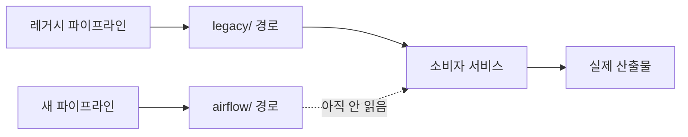

레거시 스케줄러를 새 워크플로 플랫폼으로 옮기는 일을 몇 달째 하고 있었어요. 팀별로
차례로 넘기는 방식이라, 마지막 팀까지 끝나면 레거시를 통째로 내릴 수 있는 구조였습니다.

한 팀이 채널에 "컷오버 완료했습니다"라고 올렸어요. 저는 그 메시지를 근거로 레거시 종료
일정 문서를 쓰려던 참이었습니다. 남은 팀이 몇인지 세고, 마지막 팀 예상 일정을 잡고,
그 뒤에 코어를 내리는 날짜를 적는 거였어요.

쓰기 전에 확인이나 해보자는 마음으로 그 팀 작업을 들여다봤습니다. 30분이면 끝날 줄
알았어요.

## 새 파이프라인이 다른 경로에 쓰고 있었어요

새로 만든 워크플로가 결과를 어디에 저장하는지 봤습니다. 객체 스토리지 경로가 이런
모양이었어요.

```text
s3://<버킷>/airflow/<팀>/<데이터셋>/date=2026-08-26/...
```

그리고 레거시가 쓰던 경로는 이랬습니다.

```text
s3://<버킷>/legacy/<데이터셋>/2026-08-26/...
```

경로가 아예 달랐어요. 같은 데이터를 만드는 두 파이프라인이 서로 다른 자리에 쓰고 있었던
겁니다.

처음엔 이게 실수인 줄 알았어요. 이관하면 같은 자리에 써야 소비자가 그대로 읽을 테니까요.
그런데 좀 더 보니 의도된 설계였습니다. 그리고 꽤 좋은 설계였어요.

같은 경로에 둘이 쓰면 어느 쪽이 마지막에 썼느냐에 따라 결과가 달라집니다. 검증 기간에는
두 파이프라인이 같이 도는데, 새 쪽에 버그가 있으면 그게 레거시 산출물을 덮어써요.
경로를 나누면 그 사고가 원천 차단되고, 두 결과를 나란히 놓고 비교할 수도 있습니다.
교과서적으로 맞는 접근이에요.

## 소비자 코드에 답이 적혀 있었어요

그럼 소비자는 어느 쪽을 읽고 있나. 이걸 봐야 했습니다.

소비자 서비스 코드를 열었더니 주석에 이렇게 적혀 있었어요.

```python
# 컷오버 전까지는 레거시 산출물을 계속 읽는다.
SOURCE_PREFIX = "legacy/"
```

써놓은 사람은 정직했어요. 지금 상태가 뭔지, 언제 바꿔야 하는지 다 적어놨습니다.

그러니까 상황은 이랬습니다. 새 파이프라인이 돌고 있고, 결과도 잘 나오고 있어요. 그런데
그 결과를 아무도 안 읽습니다. 실제로 쓰이는 건 여전히 레거시 산출물이고, 레거시는
당연히 계속 돌고 있어야 해요.

레거시 쪽 객체 타임스탬프를 확인하니 "완료" 공지 시각 이후로도 매시간 꼬박꼬박 새 파일이
찍히고 있었습니다.

## 컷오버는 세 가지가 다 돼야 끝나요

정리하면 컷오버에는 세 단계가 있습니다.

| 단계 | 이 팀 상태 |
|---|---|
| 새 파이프라인이 돈다 | 완료 |
| 소비자가 새 산출물을 읽는다 | 안 됨 |
| 레거시가 멈춘다 | 안 됨 |

셋 중 하나만 된 상태였어요. 그리고 이 상태에는 이름이 있습니다. 섀도우 운영이에요.
새 시스템을 돌려놓고 결과를 비교하는 단계요. 이 이관에서는 의도한 중간 상태였고,
그 상태에서 레거시를 멈추면 안 됐습니다.

문제는 그 상태를 "완료"라고 불렀다는 것뿐이에요.



<span class="figcap">새 쪽은 돌고 있는데 화살표 하나가 아직 안 옮겨져 있었어요. 그 화살표가 컷오버입니다.</span>

만약 제가 확인 안 하고 일정 문서를 썼다면 어떻게 됐을까요. "이 팀은 8월 26일 완료"로
적고, 마지막 팀 일정을 잡고, 레거시 코어 종료일을 정했을 겁니다. 그리고 그날 레거시를
내리는 순간 이 팀의 소비자가 읽을 파일이 더 이상 안 생겨요. 조용히요. 파이프라인이
실패하는 게 아니라, 어제 날짜 파일을 계속 읽으면서 아무 일 없다는 듯 돌아갑니다.

## 그래서 완료 판정 방식을 바꿨어요

이 일 이후로 컷오버 확인을 사람 말이 아니라 산출물로 하기로 했습니다.

레거시와 새 파이프라인은 실행 시각 패턴이 달라요. 레거시는 정시 직후 몇십 초 안에
파일을 쓰고, 새 쪽은 스케줄러를 거치느라 2분에서 3분쯤 뒤에 씁니다. 객체 타임스탬프를
몇 시간치 뽑아보면 어느 쪽이 쓰고 있는지가 초 단위 패턴으로 드러나요.

그래서 판정 기준을 이렇게 잡았습니다.

- 레거시 시그니처가 특정 시각 이후로 사라졌는가
- 소비자 코드가 참조하는 경로가 새 경로인가
- 레거시 워크플로가 실제로 비활성인가

셋 다 실제 조회 결과를 인용해서 판정합니다. "이관했다고 하더라"가 아니라요.

## 곁가지로 나온 두 가지

같은 조사에서 두 개가 더 보였어요.

**스테이징이 프로덕션 파일을 덮어쓰고 있었습니다.** 새 파이프라인의 스테이징 환경과
프로덕션 환경이 같은 객체 스토리지 경로를 쓰고 있었어요. 테스트로 돌린 결과가 실제
최신본 자리에 올라간 기록이 있었습니다. 경로를 레거시와 분리한 건 잘했는데, 환경 간
분리는 빠져 있었던 거예요.

**재시도가 0이었습니다.** 이 워크플로는 외부 데이터 소스에 붙는데, 한 번 삐끗하면 그
시간대 산출물이 그냥 비어요. 재시도를 붙이는 게 맞는데, 여기서 좀 재미있는 상호작용이
있었습니다. 이 플랫폼 전역에 재시도를 켜면 안 돼요. 모델 호출이 들어가는 작업은 재시도가
곧 재과금이거든요. 그런데 이 워크플로는 전부 읽기와 계산이고 업로드가 멱등이라 붙여도
안전했습니다.

재시도 정책은 타임아웃과 함께 검토해야 했어요. Airflow에서 `retries=3`은 최초 시도에
더해 세 번 다시 시도한다는 뜻입니다. 시도마다 실행 타임아웃이 6시간이라면 실행에만
최대 24시간을 쓸 수 있고, 재시도 대기나 큐 대기는 별도로 더해져요. 최종 실패 알림에만
기대면 탐지가 늦어질 수 있어, 산출물이 제시간에 나왔는지도 따로 확인해야 합니다.

## 돌아보면

제일 크게 배운 건 어휘였습니다. "이관 완료"와 "컷오버 완료"를 같은 말처럼 쓰고 있었어요.
앞엣것은 "새 쪽이 돈다"이고 뒤엣것은 "옛 쪽이 멈췄다"인데, 이 둘 사이에 소비자 전환이라는
단계가 통째로 들어 있습니다.

경로 분리와 소비자 코드만 놓고 보면 현재 상태는 이미 드러나 있었습니다. 다음 종료
판정에서는 생산자, 소비자, 레거시 스케줄을 함께 조회하고 그 결과를 남기기로 했어요.
이 글은 그 판정 기준을 바꾼 시점의 기록입니다. 이후 실제 종료 여부는 같은 기준으로
다시 확인해야 하는 별도 작업이었어요.

## 참고한 자료

- [Parallel Run](https://martinfowler.com/bliki/ParallelRun.html) (Martin Fowler): 두 시스템을 나란히 돌리며 비교하는 단계와 그 종료 조건
- [Strangler Fig Application](https://martinfowler.com/bliki/StranglerFigApplication.html) (Martin Fowler): 레거시를 점진적으로 대체할 때 "무엇이 끝인가"를 정의하는 방식
- [Tasks: Timeouts](https://airflow.apache.org/docs/apache-airflow/stable/core-concepts/tasks.html#timeouts) (Apache Airflow): 시도마다 적용되는 execution_timeout과 재시도 횟수의 관계
