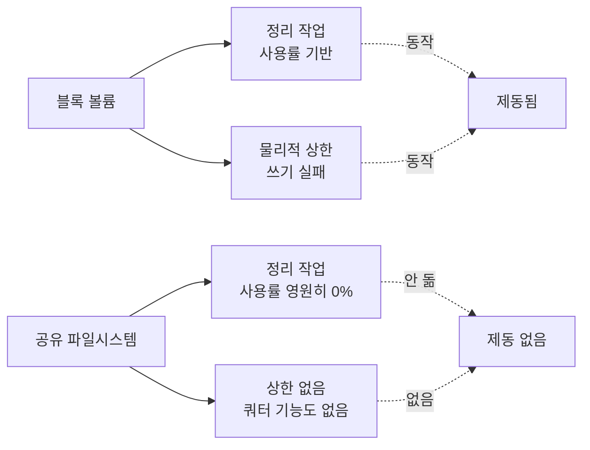

앞선 글에서 스토리지를 공유 파일시스템으로 옮겼고, 옮기자마자 남은 용량이 마이너스로
읽히는 문제를 고쳤어요. 이번 건 그 다음에 나온 건데, 성격이 좀 다릅니다. 앞의 것은
숫자가 이상해서 바로 눈에 띄었고, 이건 아무 소리도 안 났어요.

정리 작업이 한 번도 안 돌고 있었습니다.

## 진단 명령이 계속 "0% 사용 중"이라고 했어요

이상하다고 느낀 건 진단 명령 출력 때문이었어요. 시스템 상태를 찍는 커맨드가 있는데,
거기 디스크 항목이 항상 이렇게 나왔습니다.

```text
Disk: 0% used
```

데이터를 계속 쓰고 있는데 0퍼센트라니. 처음엔 앞 글의 절단 버그가 덜 고쳐진 줄 알고
다시 봤어요. 그런데 이번엔 값이 깨진 게 아니었습니다. 진짜로 0퍼센트가 맞았어요.

이 파일시스템은 용량 상한이 사실상 없습니다. 총량을 8엑사바이트 상당으로 보고해요.
우리가 20기가바이트를 쓰고 있어도 8엑사바이트로 나누면 소수점 아래가 한참 이어지다가
반올림해서 0이 됩니다. 계산이 틀린 게 아니라, 분모가 실질적으로 무한대라 비율이라는
게 의미를 잃은 거예요.

그러니까 진단 명령은 거짓말을 한 게 아니라 정직하게 말하고 있었습니다. "사용률
0퍼센트"가 사실이에요. 다만 그 사실이 아무 정보도 담고 있지 않았을 뿐이고요.

## 정리 작업이 첫 줄에서 돌아가고 있었어요

이게 왜 문제냐면, 우리 정리 작업이 사용률을 보고 판단하기 때문입니다. 코드가 대충
이런 모양이었어요.

```javascript
const usedPct = used / total * 100;
if (usedPct <= highWatermark) {
  return;                      // 여유 있으면 아무것도 안 함
}
// ... 오래된 작업 산출물 정리 ...
```

사용률이 영원히 0퍼센트니까 `return`에서 항상 빠져나옵니다. 정리 로직은 한 줄도 실행된
적이 없었어요. 워치독은 스케줄대로 잘 돌고 있었고, 매번 "여유 있음"으로 판정하고
돌아갔습니다. 에러도 경고도 없이요.

여기까지는 버그 하나예요. 그런데 더 생각해보니 무서운 쪽은 따로 있었습니다.

## 브레이크가 앱 안에도 밖에도 없었어요

원래 이 시스템에는 브레이크가 두 겹이었어요.

첫 겹이 방금 그 정리 작업입니다. 사용률이 높아지면 오래된 걸 지워요. 둘째 겹은
물리적인 한계였습니다. 블록 볼륨을 쓸 때는 프로비저닝한 용량이 있어서, 정리가 실패해도
결국 디스크가 차고 쓰기가 실패했어요. 사고이긴 한데 멈추긴 합니다.

공유 파일시스템으로 오면서 둘째 겹이 사라졌어요. 상한이 없으니까 계속 쓸 수 있습니다.
그리고 이 서비스에는 쿼터 기능 자체가 없어요. 용량 제한을 걸 방법이 없습니다.

첫 겹은 위에서 본 대로 안 돌고 있었고요. 그러니까 그 시점에 우리 시스템은 저장 공간에
관해서 **아무런 제동 장치도 없는 상태**였습니다. 누가 실수로 큰 파일을 반복해서 쓰면
청구서가 올라가는 것 말고는 아무 일도 안 일어나요. 알림도 없고요.



<span class="figcap">두 겹이 같은 전제("볼륨에는 끝이 있다")에 기대고 있었고, 그 전제를 한 번에 걷어냈어요.</span>

## 사용률 대신 압박도라는 신호를 만들었어요

고치는 방향을 두고 좀 고민했습니다. 제일 쉬운 건 "공유 파일시스템이면 절대 바이트로
판단한다"고 코드에 분기를 넣는 거예요. 그런데 이렇게 하면 다음에 또 다른 매체를 쓸 때
같은 분기를 또 넣어야 합니다. 스토리지 종류를 애플리케이션 코드가 알아야 하는 구조가
되는 거죠.

그래서 매체를 선언하는 대신 신호를 관측하기로 했어요. 판단 기준을 "압박도" 하나로
합치고, 그 값을 사용률과 절대 바이트 예산 중 더 높은 쪽으로 정의했습니다. 볼륨이면
사용률이 먼저 올라가고, 무제한 파일시스템이면 절대 예산이 먼저 올라가요. 코드는 어느
쪽인지 몰라도 됩니다.

그리고 총량이 1페비바이트를 넘으면 "측정 불가, 디스크 브레이크 없음"이라고 경고를
띄우게 했어요. 이건 값을 고치는 게 아니라 **모르는 상태를 모른다고 말하게** 만드는
장치입니다. 앞으로 또 상한 없는 매체를 만나면 조용히 지나가지 않고 한 줄이라도 남아요.

## 소비처를 5곳으로 셌다가 8곳이었어요

고치면서 디스크 사용률을 읽는 지점을 전부 찾아야 했습니다. `grep`으로 세니 5곳이
나왔어요. 고치고 나서 뭔가 찜찜해서 다른 방법으로 다시 세어봤는데 8곳이었습니다.

원인은 제 셸이었어요. `grep`이 다른 도구의 별칭으로 잡혀 있었고, 그 도구가 기본으로
특정 디렉터리를 건너뛰고 있었습니다. 절대 경로로 원래 `grep`을 부르니 3곳이 더 나왔어요.

이건 개인적으로 꽤 뜨끔했습니다. 전수 조사라고 말할 때 제가 쓴 도구가 전수를 봤는지
확인한 적이 없었거든요. 그 뒤로는 조사 결과를 문서에 적을 때 어떤 명령으로 셌는지도
같이 적습니다.

## 완료 판정도 고쳐 적었어요

마무리하면서 완료 조건을 "정리 작업이 처음으로 발화하는 것을 확인"으로 적었다가
지웠습니다.

절대 바이트 예산을 꽤 넉넉하게 잡았거든요. 안전망 용도라서요. 그러니까 정상적으로
운영하면 그 예산에 닿을 일이 당분간 없고, "발화를 확인"은 영원히 안 올 수도 있습니다.
그걸 완료 조건으로 두면 티켓이 영원히 안 닫혀요.

그래서 "브레이크가 밟혔다"가 아니라 **"브레이크가 달렸다"**를 확인하는 걸로 바꿨습니다.
예산을 일시적으로 낮춰서 발화하는지 보고, 원복하고, 그 과정을 기록으로 남기는 거예요.
안전망은 평소에 안 걸리는 게 정상이라 "동작 확인"의 정의가 달라야 합니다.

## 돌아보면

제일 아픈 건 앞선 이관 검증이 이걸 못 잡았다는 점이에요. 그때 저는 파일 읽기, 쓰기,
이름 바꾸기, 권한 같은 걸 다 확인했습니다. API 수준에서는 전부 호환됐어요. 그래서
"됐다"고 적었고요.

그런데 깨진 건 API가 아니라 **함수 시그니처 어디에도 안 적혀 있는 불변식**이었습니다.
"이 볼륨에는 끝이 있다"는 가정이요. 아무도 그걸 문서에 적지 않았고, 타입으로 표현되지도
않았고, 테스트에도 없었어요. 그냥 다들 그렇게 알고 있었을 뿐입니다.

그래서 요즘 인프라를 갈아끼울 때는 질문을 하나 더 해요. "이걸 바꾸면 무엇이 무한대가
되는가." 용량이든 지연이든 재시도 횟수든, 원래 유한했던 게 무한해지는 순간 그것에
기대던 코드가 조용히 멈춥니다. 소리가 안 나서 제일 늦게 발견돼요.

## 참고한 자료

- [Amazon EFS quotas and limits](https://docs.aws.amazon.com/efs/latest/ug/limits.html) (AWS): 파일시스템 크기 상한과, 쿼터 기능이 제공되지 않는다는 것
- [Amazon EFS performance](https://docs.aws.amazon.com/efs/latest/ug/performance.html) (AWS): 과금이 실사용 기준이라 "차면 멈춘다"가 성립하지 않는 이유
- [statfs(2)](https://man7.org/linux/man-pages/man2/statfs.2.html) (Linux man-pages): `f_blocks`가 매체에 따라 어떤 의미를 갖는지
- [Fail-safe defaults](https://en.wikipedia.org/wiki/Saltzer_and_Schroeder%27s_design_principles) (Saltzer and Schroeder): 판단 근거가 사라졌을 때 안전한 쪽으로 기울어야 한다는 원칙
