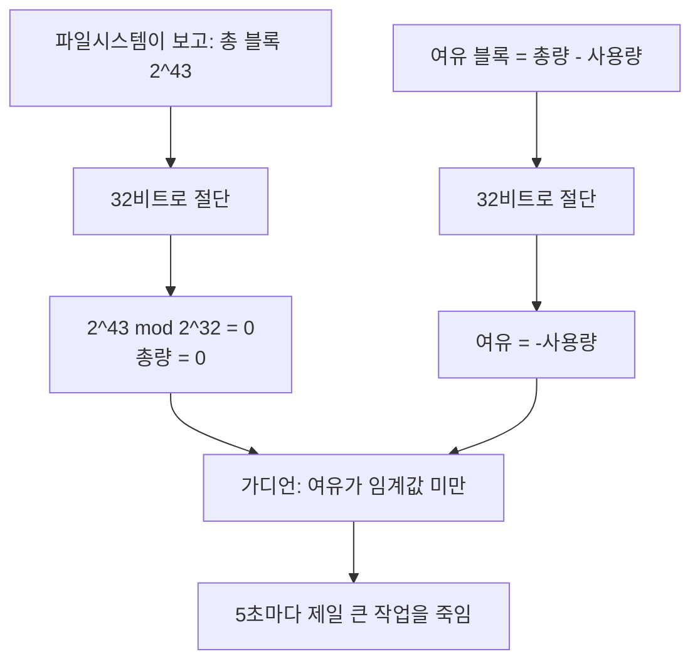

스토리지를 블록 볼륨에서 공유 파일시스템으로 옮긴 다음 날이었어요. 제품이 이상하게
굴기 시작했습니다.

메모리 가디언이 5초마다 깨어나서 제일 큰 작업을 하나씩 죽이고 있었어요. 이건 원래
메모리가 부족할 때 가장 무거운 걸 내려서 전체를 살리는 장치입니다. 그런데 메모리는
멀쩡했어요. 그리고 발행 작업이 "발행 중"과 "초안" 사이를 무한히 오갔습니다. 죽고,
되살아나고, 또 죽고요.

어제 바꾼 게 스토리지 하나뿐이었으니 당연히 그쪽을 봤습니다. 마운트가 이상한가,
지연이 튀나, 쓰기가 막히나. 한참을 봤는데 파일시스템 자체는 멀쩡했어요. 읽고 쓰는 게
다 됐고 지연도 예상 범위였습니다.

## 로그를 보다가 눈을 의심했어요

가디언이 왜 도는지 보려고 그 판단 로그를 켰습니다. 거기 이런 줄이 있었어요.

```text
disk guard: free=-5.5GB used=... threshold=10GB -> shed largest job
```

여유 공간이 마이너스 5.5기가바이트라고 나와 있었습니다.

이걸 보는 순간 방향이 완전히 바뀌었어요. 디스크가 부족한 게 아니라, **디스크가 얼마나
남았는지 읽는 코드가 틀린 값을 돌려주고 있었던** 겁니다. 그리고 그 값이 임계값보다
작으니까 가디언은 성실하게 자기 일을 하고 있었고요.

여유 공간이 음수라는 건 물리적으로 말이 안 됩니다. 뺄셈을 잘못했거나, 읽어온 값 자체가
깨졌거나 둘 중 하나예요.

## 사용량의 정확한 음수였어요

값을 몇 번 더 찍어보니 이상한 규칙이 보였습니다. 여유 공간으로 보고되는 값이 실제
사용량과 절댓값이 같았어요. 인스턴스를 두 개 다 봐도 그랬습니다. 한쪽은 사용량이
5.5기가바이트인데 여유가 마이너스 5.5, 다른 쪽은 사용량이 13.6인데 여유가 마이너스
13.6이었어요.

"여유 = 총량 - 사용량"인데 결과가 정확히 "-사용량"이라면, 총량이 0으로 읽히고 있다는
뜻입니다. 그런데 총량은 분명 0이 아니에요.

여기서 감이 왔습니다. 어딘가에서 값이 잘리고 있고, 하필 총량이 잘린 결과가 0이 되는
거라고요.

## 2의 43제곱을 2의 32제곱으로 나눈 나머지는 0이에요

런타임의 파일시스템 통계 함수를 확인했습니다. 우리는 Bun 1.3 계열을 쓰고 있었고,
`fs.statfsSync`는 Node.js와 같은 인터페이스라 두 가지 모드가 있어요. `bigint` 옵션을
주면 큰 정수를 그대로 돌려주고, 안 주면 일반 숫자로 변환해서 돌려줍니다. 우리 코드는
후자를 쓰고 있었고, 당시 Bun의 그 경로 구현이 블록 수를 부호 있는 32비트 정수로
다루고 있었어요. Node.js에서 같은 코드를 돌리면 이 절단이 안 납니다. 일반 숫자가
2의 53제곱까지는 정확하거든요. 그러니까 같은 인터페이스를 쓰는 다른 런타임에서는 안
보이는 버그였습니다.

그리고 공유 파일시스템 쪽 숫자가 문제였습니다. 이 서비스는 용량 제한이 사실상 없어서,
총 블록 수를 2의 43제곱으로 보고해요. 8엑사바이트에 해당하는 값입니다. 실제로 그만큼
쓸 수 있다는 게 아니라 "상한이 없다"를 표현하는 방식이에요.

2의 43제곱을 2의 32제곱으로 나눈 나머지는 정확히 0입니다. 그러니까 32비트로 자르면
총 블록 수가 0이 돼요. 여유 블록 수도 같은 방식으로 잘리는데, 이건 총량에서 사용량을
뺀 값이라 잘린 뒤에 음수로 남았습니다.



<span class="figcap">파일시스템은 정직하게 큰 수를 보고했고, 그 수가 하필 32비트 경계의 배수였어요.</span>

이전 블록 볼륨에서는 왜 안 드러났는지도 이걸로 설명됩니다. 100기가바이트 볼륨은 블록
수가 2,600만 개 정도예요. 32비트 안에 넉넉히 들어갑니다. 그래서 이 코드는 몇 년 동안
멀쩡히 동작했고, 스토리지를 바꾼 그 순간에 처음으로 틀렸어요.

## 끄고 싶었는데 끌 수가 없었어요

원인을 알고 나서 제일 먼저 하려던 건 가디언의 디스크 조건을 잠깐 끄는 거였습니다.
메모리 조건은 살려두고 디스크 조건만 무력화하면 당장 급한 불은 꺼지니까요.

환경 변수로 임계값을 조정할 수 있게 되어 있었어요. 그래서 0으로 넣으려고 했는데
안 됐습니다. 값을 읽는 코드가 이렇게 생겼거든요.

```javascript
const floor = Number(process.env.DISK_FLOOR_GB);
if (floor > 0) {
  threshold = floor;   // 0을 넣으면 이 분기를 안 타요
}
```

0은 "0으로 설정"이 아니라 "설정 안 함"으로 해석됐습니다. 끄는 값이 곧 기본값을 쓰라는
신호였던 거예요. 노브는 있는데 끄는 자리가 없었습니다.

거기다 배포 차트에 이 환경 변수를 넘기는 통로 자체가 없었어요. 그러니까 노브 하나를
돌리려면 차트를 고쳐 PR을 올리고 배포 컨트롤러 동기화를 기다려야 했습니다. 급할 때
쓰라고 만든 장치가 급할 때 제일 오래 걸리는 경로에 있었던 거죠.

결국 근본 원인을 고치는 게 더 빨랐습니다. 큰 정수 모드로 읽고, 총량이 비정상적으로
크면 "측정 불가"로 판정해 디스크 조건을 건너뛰게 했어요.

## 제 보고서도 한 번 틀렸어요

티켓을 쓰면서 사용률이 마이너스 56만 퍼센트로 찍힌다고 적었습니다. 총량이 0이니까
나눗셈이 폭주한다고 생각했거든요.

나중에 코드를 다시 보니 아니었어요. 사용률 계산에는 0으로 나누기를 막는 가드가
있었고, 실제로는 0퍼센트가 나오고 있었습니다. 극단적인 숫자가 나올 거라고 지레짐작하고
확인을 안 한 거예요.

코멘트로 정정했습니다. 이게 별거 아닌 것 같아도, 원인 분석 문서에 안 재본 숫자가
하나 들어가면 그 문서 전체의 신뢰도가 흔들려요. 특히 "이 값이 이상하다"가 논지인
문서에서는요.

## 돌아보면

여기서 문제가 된 건 당시 런타임의 숫자 변환과, 그 값을 유효한 여유 공간으로 받아들인
가디언의 조합이었습니다. 같은 API를 제공해도 구현이 같은 입력 범위를 처리하는지는
별도로 확인해야 했어요. 이 글의 결과를 Bun 1.3 계열 전체에 대한 호환성 판정으로
확장할 수는 없습니다. 재현에는 정확한 패치 버전과 파일시스템 반환값이 필요해요.

그래서 교훈이 "누가 조심했어야 한다"가 아니라 "경계를 넘을 때 값의 범위가 바뀐다"에
가깝습니다. 우리가 바꾼 건 스토리지 한 줄이었는데, 그게 바꾼 건 시스템 호출이 돌려주는
숫자의 크기였어요.

그리고 안전장치의 끄는 방법은 그 장치를 만들 때 같이 만들어야 한다는 것도 배웠습니다.
가디언은 제품을 지키라고 만든 건데, 그날은 가디언이 제품을 죽이고 있었고 우리는 그걸
멈출 빠른 방법이 없었어요. 안전장치도 틀릴 수 있다는 전제로 설계해야 합니다.

## 참고한 자료

- [fs.statfsSync](https://nodejs.org/api/fs.html#fsstatfssyncpath-options) (Node.js): `bigint` 옵션이 왜 있는지, 기본값이 무엇인지. Bun도 같은 인터페이스를 구현해요
- [Bun node:fs compatibility](https://bun.sh/docs/runtime/nodejs-apis) (Bun): Node.js API 호환 범위와, 구현이 따로라서 동작이 다를 수 있는 지점
- [statfs(2)](https://man7.org/linux/man-pages/man2/statfs.2.html) (Linux man-pages): `f_blocks`와 `f_bavail`의 정의, 블록 크기와의 관계
- [Amazon EFS quotas and limits](https://docs.aws.amazon.com/efs/latest/ug/limits.html) (AWS): 파일시스템 크기 상한이 사실상 없다는 것
- [Number.MAX_SAFE_INTEGER](https://developer.mozilla.org/en-US/docs/Web/JavaScript/Reference/Global_Objects/Number/MAX_SAFE_INTEGER) (MDN): 정수를 일반 숫자로 다룰 때의 경계
