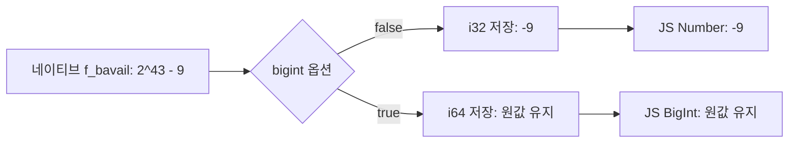

파일시스템을 EFS로 옮긴 뒤, 디스크 보호 로직이 실행 중인 작업을 반복해서 중단하는 문제가 생겼어요. 이 로직은 남은 디스크가 기준보다 작아지면 작업을 중단하는 역할이었습니다. 실제 여유 공간이 부족할 때만 개입해야 했는데, 확인한 디스크 잔량은 음수였습니다.

2026년 7월 당시 작업 기록에는 이 음수 값 때문에 중단과 재시도가 반복됐고, Bun의 `statfs` 변환을 원인으로 조사했다고 남아 있습니다. 여기서 풀어야 했던 문제는 “왜 파일을 더 쓸 수 있는 파일시스템을 용량 부족으로 판단하는가?”였어요. 계산에 들어간 블록 수가 틀렸다면, 중단 기준을 낮추는 것으로는 해결할 수 없습니다.

이 글에서는 그 숫자가 바뀌는 경로를 분리해서 확인합니다. 2026년 9월 14일, Bun **1.3.14**의 공개 소스를 읽고 같은 버전을 직접 실행했어요. 당시 EFS를 다시 마운트하는 대신, 운영체제가 반환하는 통계만 정해진 값으로 대체했습니다. 아래 수치와 코드는 이 독립 실험에서 만든 것이며 당시 서비스의 사용량이나 구성은 아닙니다.

## 바이트를 계산하기 전에 블록 수부터 비교했어요

`statfsSync()`는 남은 바이트를 바로 반환하지 않습니다. `blocks`는 전체 데이터 블록 수, `bfree`는 빈 블록 수, `bavail`은 일반 사용자가 사용할 수 있는 빈 블록 수예요. `bfree`와 `bavail`은 같은 값이라고 가정하면 안 됩니다. [Node.js의 StatFs 문서](https://nodejs.org/download/release/v24.15.0/docs/api/fs.html#class-fsstatfs)에서 이 구분을 확인할 수 있습니다.

이 실험에서는 블록 한 개를 4,096바이트로 정했습니다. 블록 수를 정확히 받은 다음 `bavail × 4096`을 계산하면 사용자에게 남은 바이트를 얻을 수 있어요. 먼저 아래 입력을 준비했습니다.

| 네이티브 statfs 필드 | 실험 입력 | 뜻 |
|---|---:|---|
| `f_bsize` | `4096` | 이 실험의 블록 크기 |
| `f_blocks` | `2^43` | 전체 블록 수 |
| `f_bfree` | `2^43 - 7` | 빈 블록 수 |
| `f_bavail` | `2^43 - 9` | 일반 사용자가 쓸 수 있는 빈 블록 수 |

여기서 7과 9를 다르게 둔 것은 의도적입니다. 전체에서 빠진 블록 수와 사용자가 쓸 수 없는 블록 수를 구분하기 위해서예요. 아래처럼 같은 경로를 두 방식으로 읽었습니다.

```js
import { statfsSync } from "node:fs";

const numberStats = statfsSync("/__statfs_width_fixture__");
const bigintStats = statfsSync("/__statfs_width_fixture__", { bigint: true });
```

이 경로는 실제 마운트가 아닙니다. C로 만든 작은 라이브러리가 이 경로에 대한 네이티브 `statfs` 호출만 받아 위 표의 구조체를 반환해요. 그 뒤의 Bun 변환 코드와 `fs.statfsSync()`는 실제 런타임 그대로 실행됩니다. JavaScript에서 결과를 강제로 32비트로 자른 실험과는 검증하는 위치가 다릅니다.

macOS arm64에서 Bun `1.3.14+0d9b296af`와 Node.js `24.15.0`을 비교한 결과입니다.

| 필드 | Bun 기본값 (`number`) | Bun `{ bigint: true }` | Node 기본값 (`number`) |
|---|---:|---:|---:|
| `blocks` | `0` | `8796093022208n` | `8796093022208` |
| `bfree` | `-7` | `8796093022201n` | `8796093022201` |
| `bavail` | `-9` | `8796093022199n` | `8796093022199` |

곱셈하기 전부터 값이 달라졌습니다. Bun 기본 경로로 남은 바이트를 계산하면 `-9 × 4096 = -36864`가 돼요. 이 값을 양수인 최소 잔량과 비교하면 용량 부족으로 판단하게 됩니다.

## Number의 정밀도가 아니라 중간의 i32가 문제였어요

JavaScript `Number`의 [최대 안전 정수는 `2^53 - 1`](https://developer.mozilla.org/en-US/docs/Web/JavaScript/Reference/Global_Objects/Number/MAX_SAFE_INTEGER)입니다. 실험의 블록 수 `2^43`과 그 근처 정수는 이 범위 안에 있어요. 따라서 블록 수를 Number로 표현할 수 없어서 음수가 됐다는 설명은 맞지 않습니다.

[Bun 1.3.14의 StatFS.zig](https://github.com/oven-sh/bun/blob/0d9b296af33f2b851fcbf4df3e9ec89751734ba4/src/runtime/node/StatFS.zig#L2-L14)를 보면 숫자를 저장하는 타입을 이렇게 고릅니다.

```zig
const Int = if (big) i64 else i32;
```

BigInt 옵션을 켜면 `i64`, 기본 경로에서는 `i32`를 사용합니다. 같은 파일의 [초기화 코드](https://github.com/oven-sh/bun/blob/0d9b296af33f2b851fcbf4df3e9ec89751734ba4/src/runtime/node/StatFS.zig#L71-L77)는 운영체제의 `f_blocks`, `f_bfree`, `f_bavail`을 이 타입으로 `@truncate`해요. 기본 경로에서는 하위 32비트만 남습니다.

이후 [C++ 바인딩](https://github.com/oven-sh/bun/blob/0d9b296af33f2b851fcbf4df3e9ec89751734ba4/src/jsc/bindings/NodeFSStatFSBinding.cpp#L252-L269)이 값을 받아 JavaScript Number로 만듭니다. 여기까지 왔을 때는 이미 상위 비트를 잃은 뒤라 원래 값을 복구할 수 없습니다.


<span class="figcap">값이 잘리는 지점은 JavaScript의 바이트 계산보다 앞에 있습니다.</span>

`2^43`은 `2^32`의 배수라서 하위 32비트가 전부 0입니다. `2^43 - 9`의 하위 32비트는 `2^32 - 9`이고, 이를 부호 있는 32비트 정수로 읽으면 `-9`예요. 실험에서 전체가 0, 사용 가능한 블록 수가 -9로 나온 이유입니다.

다만 “남은 용량은 항상 사용량의 정확한 음수가 된다”로 일반화할 수는 없습니다. 이 입력의 사용 중인 블록은 `blocks - bfree = 7`인데, 잘린 `bavail`은 -9예요. 두 필드의 차이뿐 아니라 32비트로 잘린 뒤의 부호 구간도 영향을 줍니다.

## 음수만 걸러내도 잘못된 양수는 남아요

경계값을 바꾸면 더 작은 파일시스템에서도 문제가 드러납니다. 같은 네이티브 입력 주입 방식으로 확인한 `bavail` 결과예요.

| 주입한 `bavail` | Bun 기본 경로 | Bun BigInt와 Node 기본 경로 |
|---:|---:|---:|
| `749000` | `749000` | 원값 유지 |
| `2^31` | `-2147483648` | 원값 유지 |
| `2^43 - 9` | `-9` | 원값 유지 |
| `2^32 + 9` | `9` | 원값 유지 |

부호가 처음 뒤집히는 경계는 바이트가 아니라 **블록 수 `2^31`**입니다. 블록이 4 KiB라면 8 TiB에 해당해요. 그 뒤 모든 값이 계속 음수가 되는 것도 아닙니다. 하위 32비트만 남기므로 값은 다시 0이나 작은 양수가 될 수 있습니다.

마지막 행이 음수 방어만으로 부족한 이유예요. `2^32 + 9`블록이 9블록으로 줄었지만 부호는 양수입니다. 실험용 최소 잔량을 40 KiB로 잡으면, 잘린 값은 36 KiB라서 용량 부족이 되고 원래 값은 충분하다고 나옵니다. `free < 0` 검사로는 이 오판을 잡을 수 없어요.

## 읽는 경로를 바꾸고, 계산도 BigInt로 유지했어요

확인한 Bun 버전에서는 `{ bigint: true }`가 이 32비트 저장 경로를 피합니다. 옵션만 바꾸고 곧바로 `Number()`로 되돌리기보다, 바이트 곱셈과 임계값 비교까지 BigInt로 유지했어요.

실험에 넣은 계산 함수입니다. 비정상적인 통계를 0바이트로 바꾸지 않고 `unknown`으로 구분합니다.

```js
function availableBytes(stats) {
  const { bsize, blocks, bfree, bavail } = stats;
  if ([bsize, blocks, bfree, bavail].some(v => typeof v !== "bigint")) {
    throw new TypeError("Read statfs with bigint: true before doing arithmetic");
  }
  if (bsize <= 0n || blocks <= 0n || bfree < 0n || bavail < 0n
      || bfree > blocks || bavail > bfree) {
    return { kind: "unknown" };
  }
  return { kind: "measured", bytes: bavail * bsize };
}
```

실험 입력 네 가지 모두 이 함수로 계산한 바이트가 원래 `bavail × 4096`과 일치했습니다. 잘못된 양수가 나왔던 마지막 입력도 용량 부족으로 분류되지 않았어요. 별도로 블록 크기 0, 음수 잔량, 빈 블록 수보다 큰 사용 가능 블록 수를 넣으면 `unknown`, 유효한 통계에서 `bavail = 0`이면 실제 0바이트로 구분하는지 확인했습니다.

`unknown`은 “공간이 충분하다”는 뜻이 아닙니다. 이 값만으로 실행 중인 작업을 종료하거나 디스크가 가득 찼다고 설명하지 않도록 분리한 상태예요. 새 작업의 수락 여부나 실제 쓰기 실패 처리는 별도로 결정해야 합니다. `measured` 역시 이번 예제에서는 통계값을 계산할 수 있다는 뜻이고, 앞으로의 쓰기 성공이나 할당량을 보증하지 않습니다.

Bun 자체의 기본 경로는 [공식 수정 PR #36503](https://github.com/oven-sh/bun/pull/36503)에서 32비트로 좁히지 않도록 변경됐습니다. 2026년 7월 31일 병합된 수정이지만, 이 글에서 직접 비교한 바이너리는 1.3.14입니다. 업그레이드한 환경에서는 해당 버전에 수정이 포함됐는지와 같은 입력의 결과를 다시 확인해야 해요.

## 블록 수만으로 EiB를 말할 수는 없어요

`2^43`이라는 숫자에는 아직 바이트 단위가 없습니다. 한 블록을 얼마로 계산하느냐에 따라 결과가 달라져요.

```text
2^43 blocks × 2^12 bytes/block = 2^55 bytes = 32 PiB
2^43 blocks × 2^20 bytes/block = 2^63 bytes = 8 EiB
```

이번 실험은 첫 번째입니다. `2^43`블록이라는 이유만으로 8 EiB라고 부르면 4 KiB와 1 MiB의 차이를 놓치게 돼요. 이 입력은 숫자 변환을 확인하기 위해 만든 것이므로 EFS가 실제로 반환한 통계로 읽으면 안 됩니다.

실제 마운트를 진단할 때는 `blocks`, `bfree`, `bavail`뿐 아니라 블록 크기도 함께 남겨야 합니다. Node.js 문서의 `bsize`는 최적 전송 블록 크기이고, 시스템의 `statvfs`에는 블록 수의 단위인 `f_frsize`가 별도로 있을 수 있어요. 이 실험은 4,096바이트 단위가 같도록 정했지만, 이를 모든 파일시스템의 바이트 환산식으로 그대로 적용하지는 않습니다.

## 직접 실행해 볼 수 있어요

[실행 스크립트](/blog/examples/statfs-width-repro.mjs)와 [네이티브 입력 코드](/blog/examples/statfs-width-shim.c)를 같은 폴더에 두고 실행하면 됩니다. 확인 환경은 macOS arm64, Node.js 24.15.0, Bun 1.3.14, clang입니다. 버전이나 플랫폼이 다르면 검증된 비교와 섞이지 않도록 중단합니다.

```sh
node statfs-width-repro.mjs
```

스크립트는 임시 폴더에 C 라이브러리를 빌드하고, Bun과 Node 자식 프로세스에만 `DYLD_INSERT_LIBRARIES`를 적용합니다. 존재하지 않는 전용 경로와 `type = 12345` 표식을 검사해서 입력 대체가 실제로 적용됐는지 확인해요. 실행이 끝나면 임시 파일을 정리하며, 파일시스템을 마운트하거나 런타임 설치를 변경하지 않습니다.

```text
large: Bun number=[0, -7, -9]; Bun bigint / Node=[8796093022208, 8796093022201, 8796093022199]; corrected low=false
positive-wrap: old low=true even though the returned fields are nonnegative
PASS: native conversion, bigint workaround, validation, and byte units
```

당시 문제를 찾게 한 것은 EFS 전환 뒤의 작업 중단이었지만, 이번에 분리해서 확인한 결함은 그보다 좁습니다. **Bun 1.3.14의 기본 statfs 경로가 큰 블록 수를 i32로 줄였고, BigInt 경로는 같은 입력을 유지했습니다.** 이 비교 덕분에 파일시스템의 실제 용량, 블록 수의 변환, 보호 로직의 판단을 따로 살펴볼 수 있어요.

이번 검증은 공개한 입력에서 블록 수를 보존하고 잘못된 용량 부족 판단을 없앤 데까지입니다. EFS의 통계값이나 당시 배포 전체를 재현한 결과로 확대하지 않습니다.

## 참고한 자료

- [Bun 1.3.14 StatFS.zig](https://github.com/oven-sh/bun/blob/0d9b296af33f2b851fcbf4df3e9ec89751734ba4/src/runtime/node/StatFS.zig) (Bun): 옵션별 저장 타입과 `@truncate` 적용 위치를 확인했습니다.
- [Bun 1.3.14 NodeFSStatFSBinding.cpp](https://github.com/oven-sh/bun/blob/0d9b296af33f2b851fcbf4df3e9ec89751734ba4/src/jsc/bindings/NodeFSStatFSBinding.cpp#L252-L269) (Bun): 저장된 정수가 JavaScript Number로 넘어가는 경로입니다.
- [Avoid i32 truncation in non-bigint statfs](https://github.com/oven-sh/bun/pull/36503) (Bun): 기본 경로의 저장 폭을 고친 수정과 Linux용 네이티브 입력 회귀 테스트입니다.
- [Class: fs.StatFs](https://nodejs.org/download/release/v24.15.0/docs/api/fs.html#class-fsstatfs) (Node.js): 필드 의미와 BigInt 옵션을 확인했습니다.
- [statvfs](https://pubs.opengroup.org/onlinepubs/9799919799/basedefs/sys_statvfs.h.html) (The Open Group): `f_bsize`, `f_frsize`, 블록 수 필드의 단위를 구분합니다.
- [dyld-interposing.h](https://github.com/apple-oss-distributions/dyld/blob/main/include/mach-o/dyld-interposing.h) (Apple): macOS에서 네이티브 함수 호출을 대체하는 방식의 공개 정의입니다.
