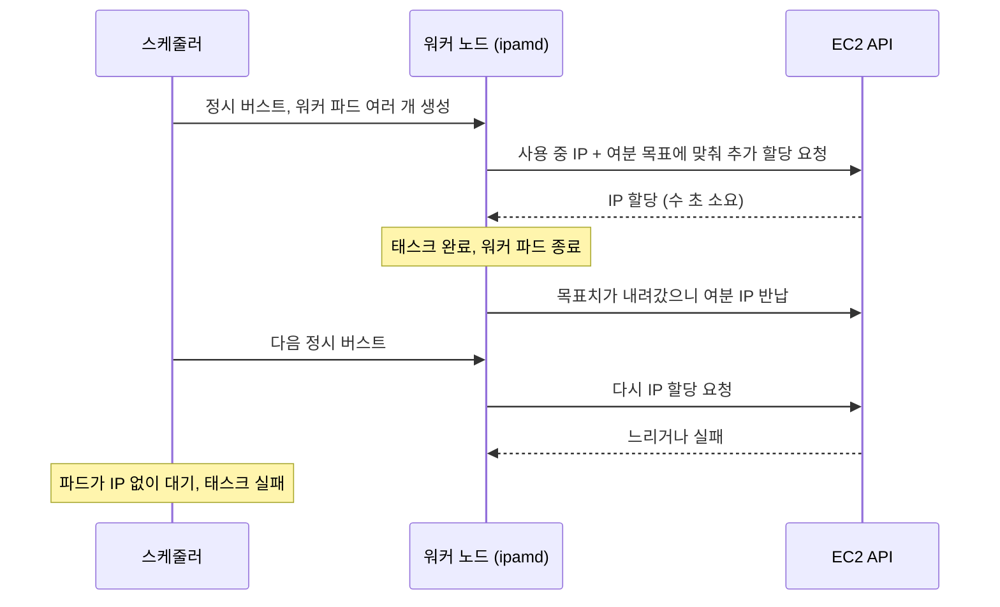

시작은 팀 채널에 올라온 알림 하나였어요. 시간별로 도는 배치 DAG의 첫 태스크가 실패했다는
내용이었습니다. 로그를 열어보니 태스크 자체가 죽은 게 아니라, 태스크를 실행할 워커 파드가
아예 뜨지 못하고 있었어요. 파드 이벤트에는 이런 줄이 찍혀 있었습니다.

```text
Warning  FailedCreatePodSandBox  ... failed to assign an IP address to pod
```

EKS에서 이 메시지를 보신 분이라면 반사적으로 "서브넷 IP가 모자라는구나" 하실 거예요. 저도
그랬습니다. 그런데 서브넷을 보니 아직 여유 IP가 150개 정도는 있었어요. 워커 파드가 한
번에 수십 개씩 뜨는 것도 아니었고요. 뭔가 앞뒤가 안 맞았습니다.

## 지혈 PR을 거절했어요

처음 제안된 해결책은 단순했어요. 실패한 태스크가 재시도로 결국 성공하니까, 알림 조건을
완화하거나 재시도 횟수를 늘리자는 거였습니다. 당장 채널이 조용해지긴 하겠죠.

그런데 이 증상은 이상했어요. IP는 남아 있는데 못 받는다는 건, 서브넷 크기 문제가 아니라
IP를 누가 어떻게 들고 있느냐의 문제라는 뜻이니까요. 알림만 끄면 이 구조는 그대로 남고,
다음엔 더 큰 버스트에서 더 조용하게 터질 거였습니다. 그래서 지혈 PR 대신 원인을 먼저
보자고 했어요.

그러다 석 달 전 온보딩 노트에서 이런 문장을 발견했습니다. "VPC CNI가 노드당 IP를
과하게 잡는 것 같다. 나중에 확인할 것." 인지는 됐는데 티켓이 없어서 93일째 그대로였던
거예요. 문서에만 적힌 문제는 아무 일도 일으키지 않는다는 걸 이때 뼈저리게 느꼈습니다.

## 노드가 쓰지도 못할 IP를 예약하고 있었어요

EKS의 VPC CNI 플러그인은 노드마다 ENI를 붙이고, 그 ENI에 보조 IP를 미리 할당해 둡니다.
파드가 뜨면 그중 하나를 나눠주는 구조예요. 얼마나 미리 받아둘지는 몇 개의 환경변수로
정하는데, 기본값은 `WARM_ENI_TARGET=1`입니다. "여분의 ENI를 항상 하나 더 붙여둬라"는
뜻이고, ENI 하나에 딸린 IP를 통째로 예약하게 돼요.

우리 워커 노드에 붙은 IP를 세어보니 노드당 평균 32.8개였습니다. 그런데 그 인스턴스
타입에서 kubelet이 허용하는 max-pods는 그보다 훨씬 작았어요. 데몬셋 파드를 빼면 워커
파드를 실제로 띄울 수 있는 자리는 열 몇 개뿐이었습니다. 나머지 IP는 그 노드가 영원히
쓸 일이 없는데도 서브넷에서 빠져나가 있었던 거예요.

여기서 "노드당 IP를 너무 많이 준 것 아닌가"라는 가설을 세웠고, 조사 방향이 그쪽으로
재편됐습니다. 그전까지는 파드 수나 스테이징과 프로덕션의 차이 쪽을 보고 있었거든요.
후보 가설 두 개는 실측으로 지웠어요. 스테이징 파드가 더 작아서 그렇다는 가설은 양쪽
설정이 동일해서 기각됐고, 동시 파드 수가 상한을 넘었다는 가설은 실측 최대치가 상한
안이라서 기각됐습니다.

첫 번째 조치는 명확했어요. `WARM_ENI_TARGET` 대신 `WARM_IP_TARGET`으로 바꿔서 ENI
단위가 아니라 IP 단위로 여분을 잡게 했습니다. 노드당 예약 IP가 32.8개에서 16개로
내려갔고, 서브넷 여유는 150개에서 458개로 올라갔어요. 이 시점에 채널에 "조치 완료"라고
올렸습니다.

## 그런데 실패가 하나 남았어요

몇 시간 뒤, 잔여 실패가 한 건 더 났습니다. 서브넷 여유는 400개가 넘는데도요. 이때가
제일 답답했어요. IP는 넘치는데 왜 못 받지?

스냅샷을 아무리 봐도 답이 안 나와서, 노드별로 붙어 있는 IP 수를 시계열로 찍어봤습니다.
그러니까 모양이 보였어요. 워커 노드 하나가 시간당 9~11번씩 IP를 EC2에 반납했다가 다시
받아오고 있었습니다.

원인은 `WARM_IP_TARGET`의 의미에 있었어요. 이 값은 절대값이 아니라 상대값입니다.
"지금 사용 중인 IP에 더해서 N개를 여분으로 유지해라"는 뜻이에요. 그러니까 이렇게 됩니다.



<span class="figcap">상대값 버퍼는 파드가 빠질 때마다 목표치도 같이 내려가서, 짧은 태스크가 자주 드나드는 워크로드에선 반납과 재확보를 반복하게 돼요.</span>

시간별 배치는 정시에 파드가 우르르 뜨고 몇 분 안에 다 빠지는 워크로드예요. 파드가
빠지면 "사용 중"이 줄고, 목표치도 같이 줄어서 ipamd가 IP를 반납합니다. 다음 정시에
다시 우르르 뜨면 EC2 API를 불러 다시 받아와야 하고, 이 왕복이 가끔 버스트를 못 따라가는
거였어요. 서브넷의 여유뿐 아니라, 해당 노드에 IP가 미리 확보돼 있는지를 봐야 했습니다.
이때 시험한 상대 버퍼 상향만으로는 잔여 실패가 없어지지 않았어요.

절대 기준은 따로 있었어요. `MINIMUM_IP_TARGET`은 "사용량과 무관하게 최소 이만큼은
항상 붙여둬라"는 하한입니다. 예상하는 노드별 동시 사용량에 맞춰 하한을 확보하면,
파드가 빠진 뒤에도 그만큼을 유지해 다음 버스트의 추가 할당을 줄일 수 있어요.
다만 예상치를 넘는 부하나 새 노드의 초기 할당까지 없어지는 것은 아닙니다.

## 세 번 만졌고, 두 번 뒤집혔어요

정리하면 값을 세 번 조정했고, 그중 두 번은 앞선 판단을 뒤집는 거였습니다. 워크트리를
따로 파서 PR 세 개로 나눠 냈고, 전부 Terraform plan과 apply를 거쳤어요.

| 항목 | 확인한 내용 |
|---|---|
| 예약 단위 변경 | ENI 단위에서 IP 단위로 바꿔 노드당 32.8개에서 16개, 서브넷 여유 150에서 458 |
| 추가 버퍼 조정 | 상대값 여분을 올린 뒤에도 잔여 실패가 관측됨 |
| 검증 기간의 결과 | 조정 후 6시간 6사이클에서 버스트 실패 0건 관측 |

마지막 행은 그 검증 기간의 결과입니다. 이후 관측에는 잔여 실패가 남았고, 절대 하한을
더 올리는 안과 알림 심각도를 규모에 맞게 조정하는 안을 비용과 함께 정리했습니다.
따라서 "절대 하한을 설정해서 실패가 완전히 없어졌다"는 결론으로 적을 수는 없어요.

숫자만 보면 깔끔한데, 실제로는 깔끔하지 않았어요. 첫 번째 "조치 완료" 공지가 성급했던
거니까요. 그래서 같은 스레드에 정정 공지를 다시 올렸습니다. "완료가 성급했다", "그
알럿도 이 건이다", 그리고 정정된 수치까지요. 구두로 말했던 비용 증가폭도 과대추정이었다는
걸 실측으로 확인해서 문서에서 내렸어요. 값을 세 번 만졌고 두 번 뒤집혔다는 사실 자체를
판단 재료로 남겼습니다. 다음 사람이 "이 값은 왜 이렇지?" 할 때 그 이력이 답이 되니까요.

그리고 한 가지 더 했어요. 이 증상은 그동안 알럿 없이 조용히 지나가고 있었습니다.
재시도로 결국 성공하니까 아무도 몰랐던 거예요. 그래서 IP 풀 관련 알럿을 세 종류
신설했고, 실제 발화로 검증했습니다. 나중에 워커 서브넷을 분리하면서 임계값을 노드당과
클러스터당으로 다시 잡았는데, 이때는 열흘치 실측을 대입해서 발화 0회를 확인한 다음에야
적용했어요. "안 울릴 것 같다"가 아니라 "안 울렸다"여야 해서요.

## 돌아보면

이 일에서 제일 오래 남은 건 세 가지예요.

하나는 상대 기준과 절대 기준이 다른 도구라는 거예요. 우리처럼 짧은 태스크가 몰렸다
빠지는 환경에서는 상대 버퍼 크기만 볼 게 아니라, 다음 버스트 전에 유지할 IP 수를
함께 정해야 했습니다. 적정값은 노드의 파드 수, 버스트와 API 호출량에 따라 달라져요.

둘은 스냅샷 한 장으로 낸 판단이 시계열을 보면 정반대일 수 있다는 거예요. "IP가 400개
남았는데 왜 못 받지"는 스냅샷의 질문이었고, 답은 시간축에 있었습니다.

셋은 완료 공지에 관측 기간을 붙여야 한다는 거예요. 스냅샷에서 IP 여유가 생겼다는 것,
몇 번의 버스트가 성공했다는 것, 더 긴 기간에도 실패가 없다는 것은 서로 다른 확인입니다.

## 참고한 자료

- [WARM_ENI_TARGET, WARM_IP_TARGET and MINIMUM_IP_TARGET](https://github.com/aws/amazon-vpc-cni-k8s/blob/master/docs/eni-and-ip-target.md) (amazon-vpc-cni-k8s): 세 환경변수의 의미와 상호작용, 이 글의 핵심 근거
- [Assign more IP addresses to Amazon EKS nodes with prefixes](https://docs.aws.amazon.com/eks/latest/userguide/cni-increase-ip-addresses.html) (AWS): 프리픽스 위임으로 IP 할당 단위를 바꾸는 방법
- [Amazon EKS recommended maximum pods](https://github.com/awslabs/amazon-eks-ami/blob/main/templates/shared/runtime/eni-max-pods.txt) (amazon-eks-ami): 인스턴스 타입별 max-pods 계산 근거
