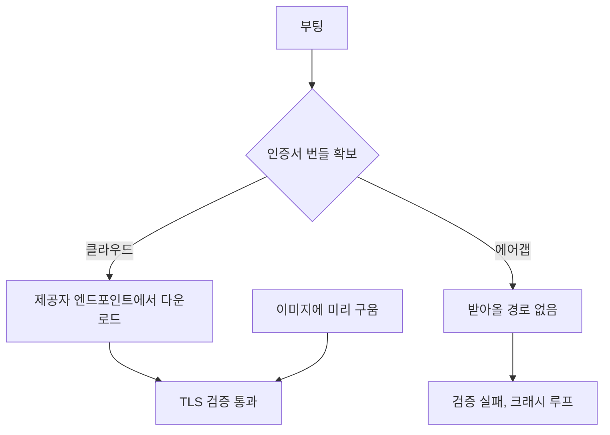

제품을 고객 서버에 통째로 넣어달라는 요구가 들어왔어요. 지금은 EKS 위에서 돌고
있습니다. StatefulSet으로 뜨고, 파일 저장소는 CSI 드라이버로 붙이고, 자격은 시크릿
오퍼레이터가 외부 저장소에서 당겨오고, 트래픽은 서비스 메시를 지나고, 배포는 GitOps
컨트롤러가 하고, 노드가 빠질 때는 drain 훅이 상태를 정리합니다.

그 고객 환경은 인터넷이 안 닿아요. 고객의 클라우드 계정 안에 VPC가 하나 있는데,
인터넷 게이트웨이도 NAT도 없습니다. 인바운드는 물론이고 아웃바운드도 없어요. 거기에
인스턴스 하나와 관리형 데이터베이스 하나만 놓고, 그 위에서 알아서 돌아가게 해달라는
거였습니다.

처음 몇 시간은 "이 구성을 어떻게 한 대에 재현하지"를 생각하며 보냈습니다. 경량
쿠버네티스를 넣을까, 컴포즈로 옮길까, 오퍼레이터는 뭘로 대체하지. 그러다 목록을 쭉
적어놓고 보니 방향이 잘못됐다는 게 보였어요.

## 재현할 게 아니라 걷어낼 거였어요

적어놓은 구성 요소를 하나씩 보면서 "이게 제품이 필요로 하는 건가, 아니면 쿠버네티스
위에 있어서 붙은 건가"를 물었습니다.

| 구성 | 왜 있었나 | 한 대에서는 |
|---|---|---|
| StatefulSet | 파드가 죽고 다시 뜨니까 신원과 볼륨을 묶어야 함 | 프로세스가 안 옮겨 다니면 필요 없음 |
| CSI 드라이버 | 노드와 파드가 분리돼 있으니 볼륨을 원격으로 | 로컬 디스크 |
| 시크릿 오퍼레이터 | 자격을 이미지에 못 넣으니 런타임에 주입 | 부팅 시 환경 파일 하나 |
| 서비스 메시 | 파드가 여럿이고 서로 부름 | 프로세스 하나면 부를 데가 없음 |
| GitOps 컨트롤러 | 클러스터 상태를 선언적으로 수렴 | 이미지를 갈아끼우면 끝 |
| drain 훅 | 노드가 빠질 때 상태 정리 | 노드가 안 빠짐 |

여섯 개 중 여섯 개가 "쿠버네티스라서 붙은 것"이었어요. 걷어내고 나니 남는 건
애플리케이션 번들, 데이터베이스, 파일 저장소, 모델 서빙 넷이었습니다. 데이터베이스는
관리형 서비스가 옆에 있으니 그걸 쓰고, 나머지 셋은 인스턴스 하나에 충분히 들어가는
크기였어요.

이게 이 작업에서 제일 크게 배운 거예요. 온프렘 이식을 "클라우드 환경을 축소 복제하는
일"로 접근하면 끝이 없습니다. 반대로 "클라우드 때문에 생긴 것을 빼는 일"로 보면 목록이
유한하고, 빼고 나면 생각보다 단순해져요.

그래서 이미지를 하나 굽기로 했습니다. 애플리케이션과 서빙까지 다 들어간 머신 이미지를
만들어서, 고객이 관리형 데이터베이스 연결 정보만 넣고 부팅하면 되게요. 여기서부터가
진짜였어요.

## 벽 하나: 이미지 정의가 코드보다 일주일 뒤처져 있었어요

첫 빌드가 부팅에서 죽었습니다. 데이터베이스 연결 문자열을 해석하는 지점에서 예외가
났어요.

원인은 시시했는데 뼈아팠습니다. 이미지 빌드 정의가 애플리케이션의 데이터베이스 엔진
교체보다 일주일 뒤처져 있었어요. 코드는 새 엔진 기준으로 연결 문자열을 파싱하는데,
이미지는 옛날 엔진을 깔고 옛날 형식의 문자열을 넣고 있었던 거죠.

클러스터에서는 이게 안 드러납니다. 배포 매니페스트가 코드와 같은 레포에 있어서 같이
바뀌었거든요. 이미지 정의만 다른 레포에 있었고, 그쪽은 아무도 안 건드렸습니다. 배포
경로가 갈라지는 순간 그 갈래마다 같은 변경이 반영됐는지 확인해야 한다는 걸, 부팅
실패로 배웠어요.

## 벽 둘: 인증서를 받아올 인터넷이 없어요

다음은 더 오래 걸렸습니다. 부팅은 되는데 애플리케이션이 크래시 루프에 빠졌어요. 로그를
보니 이랬습니다.

```text
Error: self signed certificate in certificate chain
```

관리형 데이터베이스에 TLS로 붙는데 인증서 체인 검증이 실패한 거예요. 관리형
데이터베이스는 클라우드 제공자가 운영하는 자체 인증기관으로 서버 인증서를 발급합니다.
그 루트 인증서가 시스템 신뢰 저장소에 기본으로 들어 있지 않으니, 클라이언트가 직접
가지고 있어야 해요.

여기서 조금 허탈했던 게, 사내에서 이미 한 번 이 문제로 장애가 났던 기록이 있었습니다.
배포 차트 주석에 그 이야기가 남아 있었어요. 그때 해법은 "부팅할 때 제공자 엔드포인트에서
인증서 번들을 받아온다"였고, 클러스터에서는 그게 잘 돌았습니다.

그런데 이 고객 환경에는 인터넷 게이트웨이도 NAT도 없어요. 부팅할 때마다 뭔가를 받아오는
방식은 여기서 구조적으로 불가능합니다. 그러니까 클라우드에서 통하던 해법이 여기서는
해법이 아니었어요.



<span class="figcap">외부 연동이 없는 환경에서 "런타임에 받아온다"는 전제는 조용히 깨져요. 굽는 수밖에 없습니다.</span>

결론은 이미지에 구워 넣는 거였어요. 인증서 번들을 빌드 단계에서 가져다 이미지 안에
고정하고, 애플리케이션이 그 경로를 보게 했습니다. 갱신 주기가 오면 이미지를 다시 구워야
하니까 번들 만료일을 빌드 메타데이터에 같이 남겼어요.

여기서 일반화할 게 하나 있습니다. 에어갭 배포에서 제일 자주 깨지는 건 기능이 아니라
전제예요. "받아온다", "조회한다", "확인한다"로 적힌 것들이 전부 후보입니다. 코드에는 안
적혀 있고, 라이브러리 기본 동작이나 운영 관행 안에 숨어 있어요.

## 벽 셋: 영어 테스트는 통과하는데 한국어 검색만 0건이 나와요

제일 조용했던 게 이거였습니다.

이미지가 부팅하고 애플리케이션이 뜨고 테스트가 전부 초록이었어요. 그런데 손으로 써보니
한국어로 검색하면 결과가 안 나왔습니다. 영어로 치면 잘 나오고요. 에러도 없고 로그도
깨끗했어요. 그냥 0건이었습니다.

원인은 데이터베이스 클러스터의 로케일이었어요. PostgreSQL은 클러스터를 초기화할 때
`initdb`가 로케일과 정렬 규칙, 문자 분류 규칙을 결정하고, 이건 나중에 못 바꿉니다. 전문
검색의 토큰화와 정렬이 여기에 딸려 있어요. 로케일이 맞지 않으면 한국어 텍스트가 의도한
대로 안 쪼개집니다.

개발 환경과 클러스터에서는 우리가 직접 컨테이너를 띄웠으니 로케일을 지정할 수 있었어요.
그런데 이 형상에서 쓰기로 한 관리형 데이터베이스는 `initdb` 인자를 노출하지 않습니다.
파라미터 그룹으로 런타임 설정은 바꿀 수 있어도, 클러스터 생성 시점에 굳는 값은 손댈 수가
없어요.

테스트가 못 잡은 이유가 더 뼈아팠습니다. 픽스처가 전부 영어였거든요. 영어는 로케일이
달라도 토큰화가 얼추 맞아서 통과합니다. 그러니까 검증 체계가 통째로 이 결함에 눈을 감고
있었던 거예요.

이 함정은 우리 제품에만 있는 게 아니에요. 다국어를 다루는 서비스를 관리형
데이터베이스로 옮길 때, 초기화 시점에 굳는 값이 무엇인지 목록으로 만들어두고 그중
바꿀 수 없는 게 있는지 먼저 확인하는 게 좋습니다. 그리고 테스트 픽스처에 실제 대상
언어를 꼭 넣으세요. 영어만으로는 통과하는 결함이 생각보다 많아요.

## 조사하다 코드가 "없다"고 나왔던 일

곁가지인데 한 번 크게 헤맨 게 있어서 적어둡니다.

인증서 처리 로직을 찾는데 아무리 찾아도 없었어요. 분명히 누가 짰다고 했는데 레포에
흔적이 없었습니다. 한참 뒤에 확인하니 로컬 `main`이 원격보다 199커밋 뒤처져 있었어요.

조사를 시작하기 전에 `git fetch`부터 하는 습관이 없으면, "코드에 없다"는 결론을 자신
있게 내리게 됩니다. 그리고 그 결론 위에 설계를 얹으면 며칠이 날아가요. 저는 이날 이후로
코드베이스 전수 조사를 시작할 때 최신 상태인지부터 확인합니다.

## 돌아보면

제일 오래 남은 건 방향 전환이었어요. "쿠버네티스를 한 대에서 재현한다"로 접근했으면
아마 지금도 하고 있었을 겁니다. 목록을 적고 "이건 제품이 필요한 건가, 쿠버네티스라서
붙은 건가"를 하나씩 물은 게 그 작업을 유한하게 만들었어요.

그리고 배포 환경의 제약은 기능이 아니라 전제라는 것도요. 외부 연동이 없다는 건 기능
하나가 빠지는 게 아니라, "받아온다"고 적힌 모든 지점을 다시 봐야 한다는 뜻입니다.
인증서가 그랬고, 앞으로 뭐가 더 나올지는 솔직히 아직 모르겠어요.

제일 무서운 건 세 번째였습니다. 앞의 둘은 크래시 루프라도 났지, 한국어 검색은 아무
소리 없이 0건을 돌려줬어요. 테스트가 초록이고 로그가 깨끗한데 기능이 죽어 있는 상태가
제일 오래 갑니다. 그래서 요즘은 새 환경에 뭘 올릴 때 "여기서 조용히 실패할 수 있는 게
뭐지"를 먼저 적어봐요.

## 참고한 자료

- [Locale Support](https://www.postgresql.org/docs/current/locale.html) (PostgreSQL): `initdb` 시점에 굳는 값과 나중에 못 바꾸는 것들
- [Using SSL/TLS to encrypt a connection to a DB instance](https://docs.aws.amazon.com/AmazonRDS/latest/UserGuide/UsingWithRDS.SSL.html) (AWS): 루트 인증서 번들과 갱신 주기
- [Text Search Configuration](https://www.postgresql.org/docs/current/textsearch-configuration.html) (PostgreSQL): 전문 검색 토큰화가 로케일에 딸려 있는 구조
- [Packer](https://developer.hashicorp.com/packer/docs) (HashiCorp): 머신 이미지 빌드 정의를 코드로 관리하기
