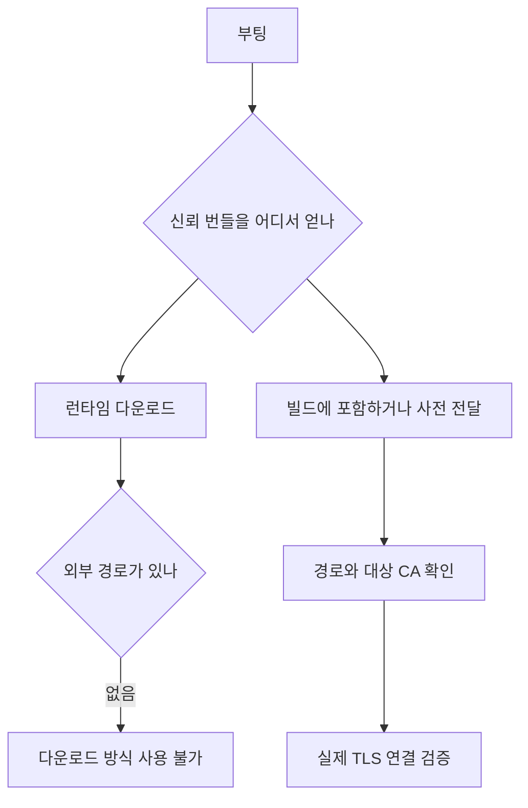

제품을 고객 서버에 통째로 넣어달라는 요구가 들어왔어요. 당시 제품은 EKS 위에서 돌고
있었습니다. StatefulSet으로 뜨고, 파일 저장소는 CSI 드라이버로 붙이고, 자격은 시크릿
오퍼레이터가 외부 저장소에서 당겨오고, 트래픽은 서비스 메시를 지나고, 배포는 GitOps
컨트롤러가 하고, 노드가 빠질 때는 drain 훅이 상태를 정리합니다.

목표 환경은 외부 인터넷과 연결하지 않는 고객 VPC였어요. 인터넷 게이트웨이와 NAT에
의존하는 부팅 절차를 쓸 수 없었습니다. VPC 안의 통신까지 없다는 뜻은 아니에요. 거기에
인스턴스 하나와 관리형 데이터베이스 하나만 놓고, 그 위에서 알아서 돌아가게 해달라는
거였습니다.

처음 몇 시간은 "이 구성을 어떻게 한 대에 재현하지"를 생각하며 보냈습니다. 경량
쿠버네티스를 넣을까, 컴포즈로 옮길까, 오퍼레이터는 뭘로 대체하지. 그러다 목록을 쭉
적어놓고 보니 방향이 잘못됐다는 게 보였어요.

## 구성 요소를 빼도, 그 역할까지 없어지지는 않았어요

적어놓은 구성 요소를 하나씩 보면서 "이게 제품이 필요로 하는 건가, 아니면 쿠버네티스
위에 있어서 붙은 건가"를 물었습니다.

| 클러스터 구성 | 단일 서버에서의 방향 | 남는 운영 책임 |
|---|---|---|
| StatefulSet | 서비스 프로세스와 데이터 경로를 직접 관리 | 재시작 후 같은 데이터를 열 수 있는지 확인 |
| CSI 드라이버 | 로컬 파일 저장소 사용 검토 | 디스크 교체, 백업과 복구 |
| 시크릿 오퍼레이터 | 이미지 밖에서 설정 주입 | 파일 접근 권한과 자격 갱신 |
| 서비스 메시 | 필요한 통신만 직접 연결 | DB와 모델 서버의 인증, TLS와 재연결 |
| GitOps 컨트롤러 | 버전이 정해진 머신 이미지로 배포 | 설정 호환성, 업데이트와 되돌리기 |
| drain 훅 | 프로세스 종료 절차로 옮기기 | 진행 중 작업 정리와 재시작 후 복구 |

이 표는 모든 대체 절차를 구현했다는 완료 목록이 아닙니다. 당시 검토한 단일 서버
방향에, 다시 읽으며 명확히 한 운영 책임을 붙인 거예요. 로컬 디스크를 쓰면 CSI는
없앨 수 있지만 데이터가 사라지지 않게 하는 책임은 남습니다. 서버 한 대도 교체하고
재부팅하니까 종료 처리를 그냥 지울 수는 없어요.

애플리케이션 번들, 데이터베이스, 파일 저장소, 모델 서빙을 남기고, 관리형 데이터베이스를
제외한 구성은 인스턴스 하나에 담는 방향으로 정했습니다. 무엇을 뺄지 정하는 일과 그
형상이 실제 부하를 감당하는지 검증하는 일도 구별해야 했어요.

그래서 애플리케이션과 서빙이 들어간 머신 이미지를 준비하고, 부팅할 때 환경별 설정을
주입하는 경로를 잡았습니다. 연결 정보를 넣고 한 번 켜보는 데서 끝낼 수는 없었어요.
이미지와 설정이 맞는지부터 문제가 나왔습니다.

## 벽 하나: 이미지 정의가 코드보다 일주일 뒤처져 있었어요

첫 빌드가 부팅에서 죽었습니다. 데이터베이스 연결 문자열을 해석하는 지점에서 예외가
났어요.

원인은 시시했는데 뼈아팠습니다. 이미지 빌드 정의가 애플리케이션의 데이터베이스 엔진
교체보다 일주일 뒤처져 있었어요. 코드는 새 엔진 기준으로 연결 문자열을 파싱하는데,
이미지는 옛날 엔진을 깔고 옛날 형식의 문자열을 넣고 있었던 거죠.

클러스터에서는 이게 안 드러납니다. 배포 매니페스트가 코드와 같은 레포에 있어서 같이
바뀌었거든요. 이미지 정의만 다른 레포에 있었고, 그쪽은 아무도 안 건드렸습니다. 배포
경로가 갈라지는 순간 그 갈래마다 같은 변경이 반영됐는지 확인해야 한다는 걸, 부팅
실패로 배웠어요.

## 벽 둘: 인증서를 받아올 인터넷이 없어요

다음은 더 오래 걸렸습니다. 부팅은 되는데 애플리케이션이 크래시 루프에 빠졌어요. 로그를
보니 이랬습니다.

```text
Error: self signed certificate in certificate chain
```

관리형 데이터베이스에 TLS로 붙는 과정에서 인증서 체인을 신뢰하지 못한 상황이었어요.
RDS는 연결할 DB의 CA에 맞는 신뢰 번들을 클라이언트에 준비하도록 안내합니다.
번들이 없는지, 경로를 잘못 읽는지, 대상 CA와 맞지 않는지는 구분해서 확인해야 해요.
에러 문자열만으로 그중 하나를 확정할 수는 없습니다.

여기서 조금 허탈했던 게, 사내에서 이미 한 번 이 문제로 장애가 났던 기록이 있었습니다.
배포 차트 주석에 그 이야기가 남아 있었어요. 그때 해법은 "부팅할 때 제공자 엔드포인트에서
인증서 번들을 받아온다"였고, 클러스터에서는 그게 잘 돌았습니다.

그런데 이 고객 환경에는 인터넷 게이트웨이도 NAT도 없어요. 부팅할 때마다 외부 제공자의
엔드포인트에서 번들을 내려받는 방식은 사용할 수 없었습니다. VPC 내부 통신이나 사전
전달 경로와는 다른 제약이었어요.



<span class="figcap">사전 전달은 다운로드 의존성을 없애요. 실제 TLS 연결이 성공하는지는 별도 확인해야 합니다.</span>

당시 기록에 남긴 조치는 인증서 번들을 빌드 단계에서 이미지에 포함하고 애플리케이션이
그 경로를 보게 하는 것이었어요. 사전 전달 경로가 있다면 파일을 별도로 제공하는 방법도
있으니, 이미지에 넣는 것만이 유일한 해법은 아닙니다.

이 방식에는 갱신 절차가 따라옵니다. 클라이언트가 신뢰할 CA를 바꿔야 할 때 번들을
어떻게 교체할지 정해야 해요. 같은 CA 아래의 서버 인증서 갱신마다 이미지 전체를
다시 만들어야 한다는 뜻은 아닙니다. 번들 준비와 최종 환경에서의 연결 검증을 같은
완료 항목으로 뭉뚱그리지 않으려 합니다.

여기서 일반화할 게 하나 있습니다. 에어갭 배포에서 제일 자주 깨지는 건 기능이 아니라
전제예요. "받아온다", "조회한다", "확인한다"로 적힌 것들이 전부 후보입니다. 코드에는 안
적혀 있고, 라이브러리 기본 동작이나 운영 관행 안에 숨어 있어요.

## 한국어 검색 0건, 여기서는 원인 확정까지 가지 못했어요

제일 조용했던 게 이거였습니다.

당시 기록에는 애플리케이션 기동과 영어 테스트가 통과한 뒤, 수동 확인에서 한국어
검색만 0건이 나왔다는 증상이 남아 있습니다. 에러가 아니라 빈 결과였어요.

처음에는 데이터베이스 로케일을 원인으로 적었습니다. 하지만 다시 읽어보니 해당 쿼리,
검색 설정, 토큰화 결과를 대조한 기록과 최종 수정 후 검증 결과가 빠져 있었어요.
따라서 여기서는 로케일을 조사 후보로 남깁니다. 해결 방법까지 확인한 사건으로
소개할 수는 없습니다.

기술 설명도 더 좁혀야 했습니다. PostgreSQL의 `LC_COLLATE`와 `LC_CTYPE`은 데이터베이스
생성 시 고정되는 값이지만, 모든 로케일 설정이 클러스터의 `initdb`에서 영구히 결정되는
것은 아니에요. 데이터베이스 생성 시 선택과 별도의 collation도 구별해야 합니다.
[Locale Support](https://www.postgresql.org/docs/current/locale.html)에 이 범위가 설명돼 있습니다.

전문 검색에는 검색 설정의 사전과 토큰 유형 매핑도 관여합니다. 그러니 한국어 검색
0건을 곧바로 "관리형 DB에서 locale을 못 바꿔서"라고 결론낼 수는 없어요.
[검색 설정 예제](https://www.postgresql.org/docs/current/textsearch-configuration.html)처럼
토큰과 적용 사전을 살펴보는 과정이 필요합니다.

다시 조사한다면 같은 한국어 문장과 같은 쿼리를 두 환경에 넣고, DB 버전과 로케일,
`default_text_search_config`, `ts_debug` 결과부터 나란히 볼 거예요. 애플리케이션이
실제로 전문 검색을 쓰는지와 저장 데이터, 조회 조건도 함께 확인해야 합니다.
이건 다음 검증 방법이지, 당시 실행해서 통과한 절차는 아닙니다.

영어 픽스처가 통과했다는 사실만으로 한국어 검색도 검증됐다고 볼 수 없다는 점은
남습니다. 다만 모든 영어 입력이 로케일 차이에 안전하다는 일반화도 하지 않으려 해요.

## 부팅 성공과 배포 완료 사이에 남은 것

이 글의 범위는 단일 서버 형상을 검토하고 부팅과 기능 확인 중 막힌 지점을 조사한
기록입니다. 한국어 검색의 최종 수정, 목표 환경의 기능 검증 완료, 고객 배포 완료는
현재 남은 기록으로 확인할 수 없습니다.

앞의 구성 표를 완료 목록으로 읽으면 이 빈칸이 사라져요. 이미지가 켜지는지와 사용자
기능이 동작하는지, 업데이트 후 데이터가 남는지는 각각 다른 확인 결과가 필요합니다.
끝까지 확인하지 못한 부분은 그 상태로 남겨두려 합니다.

## 조사하다 코드가 "없다"고 나왔던 일

곁가지인데 한 번 크게 헤맨 게 있어서 적어둡니다.

인증서 처리 로직을 찾는데 아무리 찾아도 없었어요. 분명히 누가 짰다고 했는데 레포에
흔적이 없었습니다. 한참 뒤에 확인하니 로컬 `main`이 원격보다 199커밋 뒤처져 있었어요.

조사를 시작하기 전에 `git fetch`부터 하는 습관이 없으면, "코드에 없다"는 결론을 자신
있게 내리게 됩니다. 그리고 그 결론 위에 설계를 얹으면 며칠이 날아가요. 저는 이날 이후로
코드베이스 전수 조사를 시작할 때 최신 상태인지부터 확인합니다.

## 돌아보면

제일 오래 남은 건 방향 전환이었어요. "쿠버네티스를 한 대에서 재현한다"로 접근했으면
아마 지금도 하고 있었을 겁니다. 목록을 적고 "이건 제품이 필요한 건가, 쿠버네티스라서
붙은 건가"를 하나씩 물은 게 그 작업을 유한하게 만들었어요.

그리고 배포 환경의 제약은 기능이 아니라 전제라는 것도요. 외부 연동이 없다는 건 기능
하나가 빠지는 게 아니라, "받아온다"고 적힌 모든 지점을 다시 봐야 한다는 뜻입니다.
인증서가 그랬고, 앞으로 뭐가 더 나올지는 솔직히 아직 모르겠어요.

한국어 검색 기록을 다시 보며 남은 숙제도 보였습니다. 빈 결과라는 증상에서 로케일이라는
결론으로 너무 빨리 건너갔어요. 다음에 같은 이관을 한다면 구성 요소를 얼마나 줄였는지와
함께, 대상 언어의 실제 쿼리가 어디까지 확인됐는지를 남기려 합니다. 그래야 다음 사람이
어디서 조사를 이어야 하는지도 알 수 있으니까요.

## 참고한 자료

- [Locale Support](https://www.postgresql.org/docs/current/locale.html) (PostgreSQL): 데이터베이스 생성 시 고정되는 범주와 별도로 바꿀 수 있는 로케일 설정
- [Using SSL/TLS to encrypt a connection to a DB instance](https://docs.aws.amazon.com/AmazonRDS/latest/UserGuide/UsingWithRDS.SSL.html) (AWS): 루트 인증서 번들과 갱신 주기
- [Text Search Configuration](https://www.postgresql.org/docs/current/textsearch-configuration.html) (PostgreSQL): 사전과 토큰 유형 매핑을 설정하고 확인하는 예제
- [Packer](https://developer.hashicorp.com/packer/docs) (HashiCorp): 머신 이미지 빌드 정의를 코드로 관리하기
