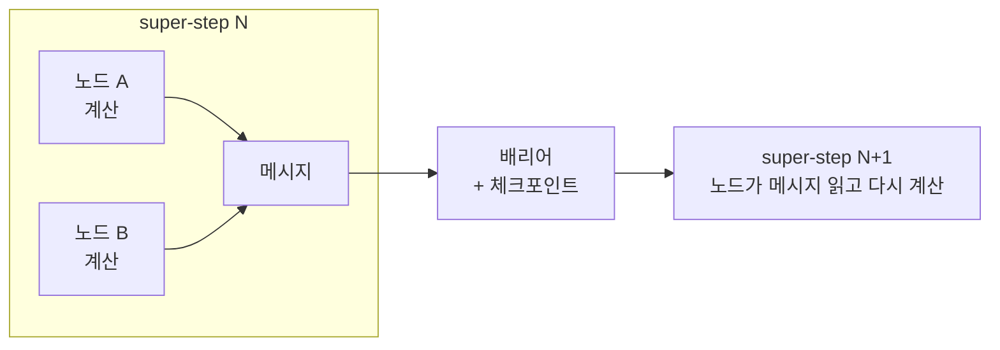

LangGraph를 처음 쓰면 state가 딱 짚을 수 없는 *어딘가*에서 업데이트되는 것처럼
느껴진다. 노드에서 부분 dict를 반환하면 전역 state에 병합되고, 실행을 중단했다가
몇 시간 뒤 재개하고, 두 브랜치가 병렬로 돌다 합쳐진다. 마법처럼 느껴진다 — 보통
그건 모델을 놓치고 있다는 뜻이다.

그 모델은 **[Pregel](https://research.google/pubs/pub37252/)**, 대규모 그래프
처리를 위한 Google의 2010년 시스템이다. LangGraph는 워크플로우 라이브러리 코트를
걸친 Pregel 엔진이다. 코트를 익히면 API를 외우는 것이고, Pregel을 익히면 API가
자명해진다.

> **TL;DR** — LangGraph 노드는 Pregel 정점, state 업데이트는 메시지, 실행은
> **super-step**(동기화된 라운드)으로 전진한다. 매 super-step 경계마다 체크포인트가
> 찍힌다 — 그게 durable resume·human-in-the-loop·병렬 노드가 되는 *이유*다.

## 1분 Pregel: 정점처럼 생각하라

Pregel은 각 **정점**이 오직 자기 로컬 관점에서만 추론하게 해서 그래프를 처리한다.
[Bulk Synchronous Parallel](https://en.wikipedia.org/wiki/Bulk_synchronous_parallel)(BSP)
모델이고, 각 라운드 — **super-step** — 는 세 단계다.

1. 활성 정점이 지난 라운드에 받은 메시지를 처리한다.
2. 이웃 정점에 메시지를 보낸다.
3. 선택적으로 **halt에 투표**한다. 모든 정점이 halt하면 계산이 끝난다.

노드는 라운드 안에서 독립적으로 계산하고, 배리어가 이들을 동기화하고, 체크포인트가 저장된 뒤 다음 라운드가 시작된다. 그 배리어가 전체 트릭이다.

super-step 사이의 동기화 배리어가 핵심이다. 현재 라운드가 완전히 정착되고 기록되기
전엔 아무것도 다음 라운드로 넘어가지 않는다.

## 매핑: LangGraph는 이름만 바꾼 Pregel

줄 세워보면 LangGraph의 어휘는 그냥 Pregel이다.

| Pregel | LangGraph |
|---|---|
| Vertex | Node |
| Message | State 업데이트 (반환하는 부분 dict) |
| `vote_to_halt()` | `END` 노드 |
| Combiner (메시지 병합) | Reducer (state 업데이트 병합) |

"state가 어딘가에서 업데이트된다"는 미스터리? 노드는 전역 state를 변경하지 않는다 —
**메시지(부분 업데이트)를 방출**하고, **reducer**가 배리어에서 메시지들을 다음
state로 합친다. Pregel의 combiner와 같다. 마법이 아니라, 이름 붙이지 않았던
모델이다.

## 배리어가 모든 걸 사주는 이유

LangGraph의 대표 기능들은 전부 "매 super-step마다 체크포인트"의 직접적 결과다.

- **Durable resume** — 각 배리어의 체크포인트가 일관된 스냅샷이라, 실행이 멈췄다가
  정확히 그 지점에서 이어진다.
- **Human-in-the-loop** — "승인 대기"는 그냥 사람이 행동할 때까지 *다음 super-step을
  시작하지 않는 것*이다. state는 이미 안전하게 체크포인트돼 있다.
- **병렬 노드** — 같은 super-step의 정점들은 구조상 독립적이라, 브랜치 팬아웃이
  덧붙인 게 아니라 네이티브다.
- **트랜잭션 보장** — 업데이트는 배리어에서 reducer를 통해 원자적으로 반영된다 —
  라운드 중간에 반쯤 적용되는 일이 없다.

이 중 누가 워크플로우 도구에 추가한 기능은 없다. BSP/Pregel 설계에서 **떨어져
나온다.** 우연히 체크포인트하는 라이브러리와, 실행 모델 자체가 체크포인트인 엔진의
차이다.

## 다른 엔지니어에게 해줄 말

1. **프레임워크가 마법처럼 느껴지면 그 밑바닥 모델을 찾아라.** 마법은 거의 항상
   아직 연결하지 못한 잘 알려진 시스템이다.
2. **API가 아니라 실행 모델을 읽어라.** Pregel은 LangGraph의 보장을 설명하고, API는
   표면만 보여준다.
3. **"state가 어딘가에서 업데이트된다"는 해소 가능한 냄새다.** 여기서 "어딘가"는
   super-step 배리어의 reducer다. 이름 붙이면 미스터리는 죽는다.

---

## 참고자료 & 더 읽을거리

- Malewicz 외 — **Pregel: A System for Large-Scale Graph Processing**, SIGMOD 2010. [논문](https://research.google/pubs/pub37252/)
- L. Valiant — **A Bridging Model for Parallel Computation**(BSP), CACM 1990. [논문](https://dl.acm.org/doi/10.1145/79173.79181)
- **LangGraph** — *Low-level concepts: Pregel, super-steps, checkpointers*. [문서](https://langchain-ai.github.io/langgraph/concepts/low_level/)
