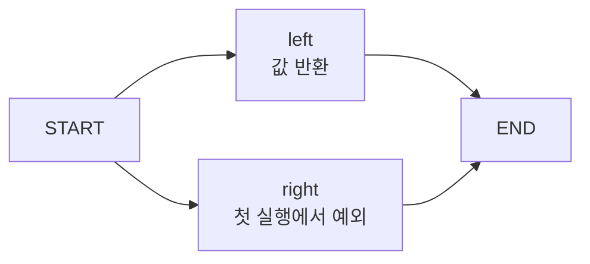

LangGraph에 노드 두 개를 병렬로 연결하고, 오른쪽 노드의 첫 실행을 일부러 실패시켰습니다.
왼쪽은 값을 반환했고 오른쪽은 예외를 던진 상태예요. 여기서 실행을 이어가려면 무엇을
넘겨야 할까요. 처음 보낸 입력을 다시 보내도, 끝난 작업까지 다시 하지는 않을까요.

두 방법을 각각 실행해봤습니다. `invoke(None, config)`로 재개한 경우와 빈 목록을 담은
`invoke({"values": []}, config)`를 호출한 경우입니다. **최종 결과 목록은 같았는데,
왼쪽 노드가 실행된 횟수는 달랐어요.** 반환값만 확인했다면 차이를 놓쳤을 겁니다.

이 글은 2026년 9월 13일에 실행한 독립 실험입니다. Python 3.11.15, LangGraph 1.0.10,
langgraph-checkpoint 4.2.0, langchain-core 1.6.3을 사용했어요. LLM과 외부 API 없이
실제 LangGraph 런타임의 동작을 확인했습니다.

## 결과와 실행 흔적을 따로 셌어요

필요한 그래프는 작습니다. `START`에서 두 노드를 활성화하고, 각 노드가 끝나면 `END`로
이어집니다. 두 노드는 같은 실행 단계인 super-step에 속해요.



<span class="figcap">왼쪽의 재실행 여부를 결정하는 분기는 넣지 않았습니다. 어느 노드를 다시 실행할지는 LangGraph가 결정해요.</span>

노드가 반환하는 값은 그래프의 `State`에 넣고, 호출 횟수와 실행 흔적은 그 밖에 두었습니다.
[전체 실행 파일](/blog/examples/langgraph-supersteps.py)의 `make_graph()` 안에 있는 두 노드는
이렇게 생겼어요.

```python
calls = Counter()
effects = []

def left(state):
    calls["left"] += 1
    effects.append("left")
    return {"values": ["left"]}

def right(state):
    calls["right"] += 1
    effects.append("right")
    if calls["right"] == 1:
        raise RuntimeError("deliberate first-attempt failure")
    return {"values": ["right"]}
```

오른쪽은 흔적을 남긴 **뒤에** 예외를 던집니다. 따라서 값을 반환하지 못했더라도
Python 리스트에는 `"right"`가 남아요. 이 차이를 일부러 만들었습니다. 노드의 실패가
그래프 바깥에서 이미 한 일까지 되돌리는지 확인하려는 거예요.

두 노드의 실행 순서는 비교하지 않습니다. `Counter(effects)`로 횟수를 비교해서,
스레드가 어느 순서로 실행됐는지를 결과의 조건으로 넣지 않았어요.

## 먼저, 병렬 결과를 합치는 방법이 필요했어요

본 실험 전에 더 작은 실패를 확인했습니다. 문자열 키 하나에 왼쪽과 오른쪽이 각각
값을 반환하게 만들면 어떻게 될까요.

```python
class ConflictingState(TypedDict):
    value: str

# START에 연결한 두 노드가 같은 단계에서 반환하는 값
# left:  {"value": "left"}
# right: {"value": "right"}
```

이 경우 예제의 첫 검사는 `InvalidUpdateError`를 잡습니다. 나중 값이 앞의 값을
덮어쓰는 식으로 끝나지 않았어요. 같은 단계에서 받은 두 업데이트를 어떻게 합칠지
정의하지 않았기 때문입니다. [공식 오류 설명](https://docs.langchain.com/oss/python/langgraph/errors/INVALID_CONCURRENT_GRAPH_UPDATE)도
병렬 갱신을 받는 키에 reducer를 정의하도록 설명해요.

제가 원하는 결과는 두 문자열을 모두 모으는 것이어서, 본 실험의 상태는 이렇게 정의했습니다.

```python
class State(TypedDict):
    values: Annotated[list[str], operator.add]
```

`operator.add`가 두 리스트를 합칩니다. 이것은 결과를 합치는 규칙이에요. 노드가 실패하면
어디부터 다시 실행할지 정하는 기능까지 맡지는 않습니다. 앞의 충돌 검사와 오른쪽에 넣은
`RuntimeError`는 서로 다른 실패입니다.

## 실패했는데 왼쪽 결과가 보였어요

그래프를 `InMemorySaver`와 함께 컴파일하고 같은 실행을 찾을 `thread_id`를 지정했습니다.
아래의 `make_graph()`와 `fail_once()`는 전체 실행 파일에 있는 함수예요. `fail_once()`는
첫 실행의 예외를 잡고 두 노드가 한 번씩 호출됐는지도 검사합니다.

```python
graph, calls, effects = make_graph()
config = {"configurable": {"thread_id": "resume-example"}}
fail_once(graph, config, calls, effects)

live = graph.get_state(config)
tasks = {task.name: task for task in live.tasks}
```

확인한 값은 이랬습니다.

```text
live.values = {'values': ['left']}
live.next = ('right',)
tasks['left'].result = {'values': ['left']}
tasks['right'].error = "RuntimeError('deliberate first-attempt failure')"
```

단계 전체가 성공한 건 아닌데 왼쪽 결과는 남아 있습니다. LangGraph는 같은 단계에서
성공한 작업의 출력을 **pending writes**로 보관합니다. 이 결과를 재개할 때 사용할 수
있어서 성공한 노드를 다시 계산하지 않아도 돼요. 이 동작은
[checkpointer의 pending writes 설명](https://docs.langchain.com/oss/python/langgraph/checkpointers#why-use-checkpointers)과도
맞습니다.

여기서 조회 방법에 따른 차이도 있었습니다. 위 `config`에는 `thread_id`만 있어요.
그런데 `live.config`에는 특정 체크포인트를 가리키는 `checkpoint_id`도 들어 있습니다.
그걸 다시 넘기면 같은 시점에도 다른 모습이 보였어요.

```python
checkpoint = graph.get_state(live.config)
```

| 실패 후 조회 | `values` 키의 값 | `next` |
| --- | --- | --- |
| `graph.get_state(config)` | `['left']` | `('right',)` |
| `graph.get_state(live.config)` | `[]` | `('left', 'right')` |

이 버전에서 `thread_id`만 지정한 최신 상태 조회는 완료된 작업의 pending writes까지
반영합니다. 특정 체크포인트를 지정한 조회는 그 체크포인트의 상태를 보여줬어요.
따라서 두 번째 행의 빈 목록만 보고 “왼쪽 결과도 사라졌다”고 해석하면 안 됩니다.
실패한 실행을 조사할 때는 `values`뿐 아니라 어떤 config로 조회했는지와 작업의
`result`, `error`도 같이 봐야 했어요.

## None으로 재개하니 오른쪽만 다시 실행됐습니다

첫 실험은 입력을 다시 넣지 않고 이어갔습니다. 위에서 만든 `config`를 그대로 사용해요.

```python
resumed = graph.invoke(None, config)
```

결과는 다음과 같습니다. 실행 순서에 기대지 않도록 반환 목록을 정렬해서 출력했어요.

```text
RESUME: calls={'left': 1, 'right': 2}, values=['left', 'right'], effects={'left': 1, 'right': 2}
```

왼쪽은 첫 실행 한 번으로 끝났습니다. 오른쪽만 다시 실행됐고, 이번에는 예외를 던지지
않아 두 값을 합친 결과를 받았어요. `graph.get_state(config).next`도 빈 튜플이 됐습니다.
진행할 작업이 남지 않은 것을 확인한 거예요.

## 같은 입력을 다시 보내도 결과는 같았어요

두 번째 실험은 **새 그래프와 새 저장소**에서 시작합니다. 첫 번째 실험을 끝낸 상태에
입력을 더하면 비교 조건이 달라지니까요. 다시 두 노드를 한 번씩 실행하고 오른쪽을
실패시킨 다음, 이번에는 빈 목록을 담은 dict를 보냈습니다.

```python
fresh_graph, fresh_calls, fresh_effects = make_graph()
fresh_config = {"configurable": {"thread_id": "new-input-example"}}
fail_once(fresh_graph, fresh_config, fresh_calls, fresh_effects)

restarted = fresh_graph.invoke({"values": []}, fresh_config)
```

출력은 이랬어요.

```text
NEW_INPUT: calls={'left': 2, 'right': 2}, values=['left', 'right'], effects={'left': 2, 'right': 2}
```

최종 `values`만 보면 앞의 재개와 같습니다. 하지만 왼쪽도 두 번 실행됐어요. 이 그래프에서
입력 dict를 보내는 호출은 `START`를 통해 두 노드를 다시 활성화했습니다. 같은
`thread_id`를 쓰고 값도 처음과 같다고 해서 `None`으로 재개하는 호출과 같지는 않았어요.

| 두 번째 호출 | 왼쪽 누적 실행 | 오른쪽 누적 실행 | 최종 결과 |
| --- | --- | --- | --- |
| `invoke(None, config)` | 1회 | 2회 | `['left', 'right']` |
| `invoke({'values': []}, config)` | 2회 | 2회 | `['left', 'right']` |

실패 후 이어가는 코드를 확인할 때 응답 본문만 비교하면 이 차이를 못 봅니다. 같은
결과를 만들었어도 그 과정에서 실행한 작업은 달랐으니까요.

## 체크포인트 밖에 남긴 흔적은 되돌아가지 않았어요

`None`으로 제대로 재개한 첫 실험에서도 오른쪽의 `effects`는 두 개였습니다. 실패한
첫 실행의 `append()`와 성공한 두 번째 실행의 `append()`가 모두 남았어요. reducer는
그래프 상태를 합쳤고 checkpointer는 재개에 필요한 결과를 보존했지만, 별도의 Python
리스트를 이전 상태로 되돌리지는 않았습니다.

이 리스트는 그래프 상태 밖에서 한 작업을 구별하기 위한 관찰 장치예요. 실제 외부 API의
중복 처리나 멱등성을 시험한 것은 아닙니다. 또 `InMemorySaver`를 사용했으므로 프로세스가
살아 있는 동안 예외를 잡고 재개하는 범위입니다. 프로세스를 종료한 뒤의 복구까지
확인한 결과로 읽을 수는 없어요.

이 실험에서 고친 것은 병렬 결과를 합치는 상태 정의와, 실패한 실행을 이어가는 호출입니다.
그 뒤에도 남는 반복 작업은 별도 흔적으로 확인했습니다. 재시도 문제를 볼 때는 최종
결과가 맞는지와 어떤 작업이 몇 번 실행됐는지를 함께 확인하려고 해요. 여기서는 같은
리스트 하나가 나오는 두 호출이 서로 다른 일을 하고 있었습니다.

## 직접 실행하기

[전체 코드와 검증문](/blog/examples/langgraph-supersteps.py)을 내려받은 디렉터리에서 실행합니다.
앞에서 사용한 함수와 import가 모두 들어 있어요.

```sh
uv run --no-project langgraph-supersteps.py
```

파일에 Python 3.11 계열과 주요 패키지 세 개의 버전을 지정했습니다. 최초 실행에는
Python과 의존성 다운로드가 필요할 수 있어요. 실행 중 모델 호출은 하지 않습니다.
코드는 충돌, 두 가지 상태 조회, 재개와 새 입력의 차이, 상태 밖 흔적을 검사하고 마지막에
아래 문장을 출력합니다.

```text
PASS: conflict, state views, resume, new input, effects
```

## 참고한 자료

- [INVALID_CONCURRENT_GRAPH_UPDATE](https://docs.langchain.com/oss/python/langgraph/errors/INVALID_CONCURRENT_GRAPH_UPDATE) (LangGraph): 같은 단계에서 동일 키에 들어오는 병렬 업데이트와 reducer
- [Checkpointers](https://docs.langchain.com/oss/python/langgraph/checkpointers) (LangGraph): 체크포인트, 작업별 pending writes와 상태 조회
- [실행 코드](/blog/examples/langgraph-supersteps.py) (이 글): 두 실험의 구성, 상태와 실행 횟수 검사
