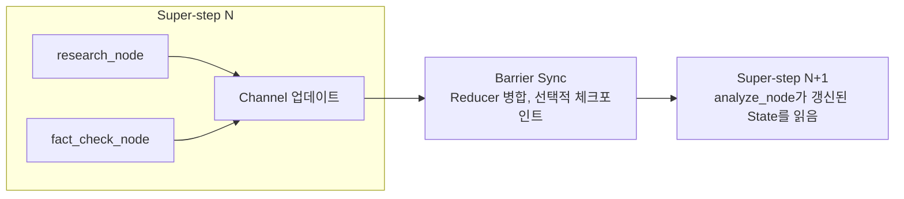

LangGraph로 첫 에이전트를 만들 때, 머릿속이 물음표 투성이였어요. 아래는 당시 헷갈렸던 호출 구조를 줄인 코드이고, 단독 실행 예제는 뒤에 따로 두었습니다.

```python
from langgraph.graph import StateGraph, START, END

graph = StateGraph(State)
graph.add_node("research", research_node)
graph.add_node("analyze", analyze_node)
graph.add_edge(START, "research")
graph.add_edge("research", "analyze")

app = graph.compile(checkpointer=checkpointer)
result = app.invoke(
    {"messages": ["Hello"]},
    {"configurable": {"thread_id": "example"}},
)
```

코드는 간단해 보입니다. 노드 몇 개 만들고, 엣지로 연결하고, `compile()`하고
`invoke()`. 그런데 막상 돌려 보면 State가 대체 어떻게 움직이는 건지, 체크포인트는
언제 저장되는지, Super-step이 뭔지 하나도 이해가 안 됐어요.

`research_node`에서 `return {"messages": [new_msg]}` 하나 했을 뿐인데 다음 노드에
전달됩니다. 함수를 직접 호출한 것도 아닌데 어떻게 그러는 걸까요. 공식 문서에는 "각
노드는 State를 받아 업데이트를 반환합니다"라고만 적혀 있었어요. 그래서 어쩌라는 걸까
싶었죠.

3일을 삽질했습니다. 디버거를 붙여서 한 스텝씩 따라가 봐도 State가 "어디선가"
업데이트되고, 체크포인트가 "어디선가" 저장됐어요. 말 그대로 마법 같았습니다.

그러다 문서를 뒤지던 중에 한 줄을 만났어요.

> "LangGraph's underlying Pregel-inspired architecture…"

Pregel이요? 처음 보는 단어였습니다. 찾아보니 Google이 2010년에 발표한 대규모 그래프
처리 시스템이더라고요. 이 구조가 상태 전달을 이해하는 실마리였어요. 다만 Pregel의 원리를 안다고
체크포인트 저장이나 외부 API의 실패 처리까지 자동으로 설명되는 것은 아니었습니다.

## 함수 호출과 실행 단위를 나눠서 봤어요

제가 혼동한 건 노드 함수를 호출하는 순서와 상태가 반영되는 시점이었습니다. 순차 코드라면
앞 함수의 반환값을 다음 함수에 넘기면 돼요. 병렬 노드가 같은 상태를 읽는 구조에서는
어느 업데이트를 언제 합칠지도 정해야 합니다.

LangGraph의 Pregel 런타임은 실행할 노드를 고르고, 실행하고, 채널에 업데이트를 반영하는
단계를 반복합니다. 이 실행 단위를 Super-step이라고 불러요. 영속 저장은 checkpointer를
연결했을 때 추가되는 기능입니다. 이 둘을 나눠 보니 무엇을 확인해야 할지 좁혀졌어요.

## 도대체 Pregel이 뭐길래요

2010년 Google에는 문제가 있었습니다. PageRank를 수십억 개 웹페이지에 돌려야 하는데
MapReduce로는 너무 느렸어요. MapReduce로 짜면 매 반복마다 이렇습니다.

```python
for iteration in range(max_iterations):
    mapped = map_phase(graph)
    shuffled = shuffle(mapped)   # 네트워크로 데이터 전송
    graph = reduce_phase(shuffled)
    save_to_disk(graph)          # 디스크 I/O
```

반복마다 디스크 I/O에 네트워크 셔플까지 걸리니 죽을 맛이죠. 그래서 Pregel을 만들었고,
핵심 아이디어는 "Think Like a Vertex"였어요. 각 정점이 오직 자기 로컬 관점에서만
생각하게 하는 겁니다.

```python
class Vertex:
    def compute(self, messages):
        process(messages)                     # 받은 메시지 처리
        for neighbor in self.out_edges:
            self.send_message(neighbor, data)  # 이웃에게 전송
        if done():
            self.vote_to_halt()               # 할 일 없으면 종료
```

정점은 전체 그래프가 어떻게 생겼는지 몰라요. 자기 이웃만 압니다. 그게 전부예요. 메시지를
주고받으며 그래프를 순회하고, 그 사이 디스크 I/O를 최소화합니다.

## LangGraph는 Pregel을 어떻게 가져왔나요

LangGraph는 Pregel의 단계별 실행에서 아이디어를 가져왔습니다. 다음 표는 이해를 위한
비교예요. 두 시스템의 API나 실패 보장이 일대일로 같다는 뜻은 아닙니다.

| Pregel | LangGraph |
|---|---|
| Vertex | Node |
| 다음 단계로 보내는 메시지 | Channel을 통한 상태 전달 |
| Message | State 업데이트 |
| Combiner | Reducer |
| 정점의 실행 중단 의사 표시 | `END`로 이어지는 그래프 종료 경로 (같은 API는 아님) |

Pregel의 PageRank 정점과 LangGraph 노드를 나란히 놓으면 차이가 보입니다.

```python
# Pregel, 명시적으로 send_message
class PageRankVertex(Vertex):
    def compute(self, messages):
        self.value = 0.15 + 0.85 * sum(messages)
        for neighbor in self.out_edges:
            self.send_message(neighbor, self.value / len(self.out_edges))
        if converged():
            self.vote_to_halt()

# LangGraph, 그냥 dict를 return
def research_node(state: State) -> dict:
    result = search_web(state["messages"][-1])
    return {"messages": [result], "research_data": result}
```

Pregel은 `send_message()`로 명시적으로 보내는데, LangGraph는 그냥 dict를 반환해요.
그럼 이 dict는 어떻게 다음 노드로 가는 걸까요. 바로 여기가 제가 3일을 막혔던
지점입니다.

## 드디어 풀린 State 전달의 비밀

Pregel에서 정점 A가 B에게 메시지를 보내면, 그 메시지는 먼저 큐에 저장되고, 다음
Super-step에서 B가 읽어요. LangGraph에서도 한 단계의 채널 업데이트는 다음 단계에서
읽을 수 있게 됩니다.

```python
# Super-step 1: research_node 실행
def research_node(state):
    return {"research_data": "result"}   # Channel 업데이트일 뿐

# ── Barrier Sync: 모든 노드 완료 대기, Reducer 적용, checkpointer가 있으면 스냅샷 저장 ──

# Super-step 2: analyze_node 실행
def analyze_node(state):
    data = state["research_data"]        # 이미 반영돼 있음
```

노드는 State를 직접 넘기지 않아요. Channel을 업데이트하면, 배리어에서 정리된 뒤 다음
Super-step에 반영됩니다. 이게 메시지 패싱이에요. 그래서 `return`만 했는데 알아서
전달되는 것처럼 보였던 거고요.


<span class="figcap">같은 단계의 노드는 그 단계 안에서 다른 노드의 새 업데이트를 읽지 않아요. 상태 갱신과 영속 저장은 구분해서 봐야 합니다.</span>

## 병렬 갱신과 실패를 직접 확인했어요

처음 글에서는 reducer가 없으면 병렬 결과 중 하나가 덮어써진다고 적었어요. 순차 갱신과
병렬 갱신을 섞은 설명이었습니다. 같은 단계에서 두 노드가 reducer 없는 동일 키를 갱신하면
`InvalidUpdateError`가 발생합니다. 여러 결과를 모으려면 합치는 규칙이 필요해요.

```python
import operator
from typing import Annotated, TypedDict

class State(TypedDict):
    values: Annotated[list[str], operator.add]
```

이 예에서는 리스트를 합칩니다. `add_messages`는 메시지 ID를 보고 기존 메시지를 갱신할 수도
있으니, 모든 reducer가 단순 덧셈이라는 뜻은 아니에요. 어떤 충돌을 합치고 어떤 충돌을
거절할지 상태 키별로 정해야 합니다.

설명을 검증하려고 [별도 재현 코드](/blog/examples/langgraph-supersteps.py)를 작성했어요.
과거 운영 코드가 아니라 2026년 9월에 글을 수정하면서 만든 예제입니다. Python 3.11 이상과
LangGraph 1.0.10을 사용하고, LLM이나 외부 API는 부르지 않습니다.

파일을 내려받은 뒤 다음 명령으로 실행할 수 있어요. `uv`는 파일에 적힌 의존성을 별도
환경에 설치하므로 최초 실행에는 패키지 다운로드가 필요합니다.

```sh
uv run langgraph-supersteps.py
```

예제는 먼저 reducer 없는 두 노드의 갱신 충돌을 확인합니다. 다음에는 리스트 reducer와
메모리 checkpointer를 연결하고, 오른쪽 노드가 첫 시도에서만 실패하도록 만들었어요.
관찰한 출력은 다음과 같습니다.

```text
Without a reducer: InvalidUpdateError
After failure: left=1, right=1; side effects remain
After resume: left=1, right=2; values=['left', 'right']
PASS: conflict detection, pending writes, resume, external effects
```

## 전체 롤백이라는 말로는 설명이 안 됐어요

왼쪽 노드는 성공했고 오른쪽만 실패했습니다. 이때 그래프의 단계가 끝나지 않았다고 해서
성공한 노드의 결과까지 모두 버리는 것은 아니에요. checkpointer는 완료된 작업의
pending writes를 보존할 수 있습니다. 같은 스레드를 재개하자 왼쪽은 다시 실행되지 않았고
오른쪽만 두 번째로 실행됐어요.

```python
# graph와 config는 위 재현 파일에서 생성해요.
result = graph.invoke(None, config)
for snapshot in graph.get_state_history(config):
    print(snapshot.metadata, snapshot.values, snapshot.next)
```

실패한 실행을 이어갈 때의 `None`과 새 입력 dict를 보내는 것은 구분해야 합니다.
`interrupt()`에서 멈춘 실행에 답할 때는 `Command(resume=...)`를 사용해요.
같은 thread_id를 쓴다는 이유만으로 모든 호출이 같은 재개를 뜻하지는 않습니다.

더 중요한 건 외부 부작용이었어요. 예제의 노드는 상태 반환 전에 별도의 리스트에 호출
흔적을 남깁니다. 오른쪽이 실패해도 그 흔적은 사라지지 않고, 재개하면 하나 더 생겨요.
이 리스트는 그래프 상태 밖에 있으므로 체크포인트가 되돌려주지 않습니다. 실제로 외부
시스템에 쓰는 노드라면 중복 실행을 막을 키나 재시도 가능한 작업 경계가 별도로 필요해요.

이 예제의 `InMemorySaver`는 같은 프로세스 안에서만 상태를 보관합니다. 프로세스가 죽은
뒤에도 재개하려면 영속 checkpointer와 그 저장소의 운영을 따로 준비해야 해요.

## 돌아보면

Pregel을 알게 된 뒤 유용했던 건 이름 자체보다, 디버깅할 질문이 구체적으로 바뀌었다는
점이에요. 두 노드가 같은 단계에서 같은 키를 쓰는지, 그 키의 reducer가 무엇인지,
실패한 노드가 재개할 때 외부 작업도 반복하는지를 나눠서 볼 수 있게 됐습니다.

체크포인트가 있다는 이유로 안전한 재시도가 완성되지는 않았어요. 런타임이 보존하는
범위와 애플리케이션이 책임질 범위를 예제의 호출 횟수로 확인하는 편이, 전체가 롤백된다는
한 문장보다 정확했습니다.

## 참고한 자료

- Malewicz 외, [Pregel: A System for Large-Scale Graph Processing](https://research.google/pubs/pub37252/) (Google, SIGMOD 2010)
- L. Valiant, [A Bridging Model for Parallel Computation](https://dl.acm.org/doi/10.1145/79173.79181) (BSP 모델, CACM 1990)
- LangGraph, [Low-level concepts: Pregel, super-steps, checkpointers](https://langchain-ai.github.io/langgraph/concepts/low_level/)
- LangGraph, [Persistence & checkpointers](https://langchain-ai.github.io/langgraph/concepts/persistence/) (MemorySaver, PostgresSaver)

- [Concurrent graph updates](https://docs.langchain.com/oss/python/langgraph/errors/INVALID_CONCURRENT_GRAPH_UPDATE) (LangGraph): 같은 단계에서 동일 키를 갱신할 때의 오류
- [Checkpointers](https://docs.langchain.com/oss/python/langgraph/checkpointers) (LangGraph): 단계별 스냅샷과 pending writes
- [Interrupts](https://docs.langchain.com/oss/python/langgraph/interrupts) (LangGraph): 승인 대기와 Command를 이용한 재개
