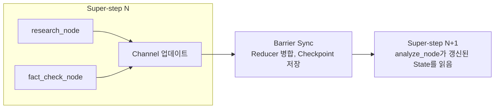

LangGraph로 첫 에이전트를 만들 때, 머릿속이 물음표 투성이였어요.

```python
from langgraph.graph import StateGraph, START, END

graph = StateGraph(State)
graph.add_node("research", research_node)
graph.add_node("analyze", analyze_node)
graph.add_edge(START, "research")
graph.add_edge("research", "analyze")

app = graph.compile(checkpointer=checkpointer)
result = app.invoke({"messages": ["Hello"]})
```

코드는 간단해 보입니다. 노드 몇 개 만들고, 엣지로 연결하고, `compile()`하고
`invoke()`. 그런데 막상 돌려 보면 State가 대체 어떻게 움직이는 건지, 체크포인트는
언제 저장되는지, Super-step이 뭔지 하나도 이해가 안 됐어요.

`research_node`에서 `return {"messages": [new_msg]}` 하나 했을 뿐인데 다음 노드에
전달됩니다. 함수를 직접 호출한 것도 아닌데 어떻게 그러는 걸까요. 공식 문서에는 "각
노드는 State를 받아 업데이트를 반환합니다"라고만 적혀 있었어요. 그래서 어쩌라는 걸까
싶었죠.

3일을 삽질했습니다. 디버거를 붙여서 한 스텝씩 따라가 봐도 State가 "어디선가"
업데이트되고, 체크포인트가 "어디선가" 저장됐어요. 말 그대로 마법 같았습니다.

그러다 문서를 뒤지던 중에 한 줄을 만났어요.

> "LangGraph's underlying Pregel-inspired architecture…"

Pregel이요? 처음 보는 단어였습니다. 찾아보니 Google이 2010년에 발표한 대규모 그래프
처리 시스템이더라고요. 그리고 그 순간, LangGraph의 모든 "이상한" 동작이 전부 여기서
왔다는 걸 깨달았어요.

## 자전거인 줄 알았는데 F1 레이싱카였어요

LangGraph는 `A → B → C` 흐름을 만드는 워크플로우 라이브러리처럼 보입니다. 그런데
내부는 분산 시스템용 그래프 처리 엔진이에요.

```text
원한 것: 자전거          (간단한 워크플로우)
받은 것: F1 레이싱카      (분산 그래프 엔진)
```

자전거 타려던 사람한테 F1을 주면서 "간단해요, 액셀만 밟으면 돼요"라고 하면 당연히
혼란스럽죠. 제가 딱 그 꼴이었습니다. 그런데 반전이 있어요. F1을 이해하고 나면 자전거로는
절대 못 하는 걸 하게 됩니다. 중단과 재개, Human-in-the-Loop, 병렬 실행, 트랜잭션 보장
같은 것들이요. 이게 전부 Pregel 덕분이에요.

## 도대체 Pregel이 뭐길래요

2010년 Google에는 문제가 있었습니다. PageRank를 수십억 개 웹페이지에 돌려야 하는데
MapReduce로는 너무 느렸어요. MapReduce로 짜면 매 반복마다 이렇습니다.

```python
for iteration in range(max_iterations):
    mapped = map_phase(graph)
    shuffled = shuffle(mapped)   # 네트워크로 데이터 전송
    graph = reduce_phase(shuffled)
    save_to_disk(graph)          # 디스크 I/O
```

반복마다 디스크 I/O에 네트워크 셔플까지 걸리니 죽을 맛이죠. 그래서 Pregel을 만들었고,
핵심 아이디어는 "Think Like a Vertex"였어요. 각 정점이 오직 자기 로컬 관점에서만
생각하게 하는 겁니다.

```python
class Vertex:
    def compute(self, messages):
        process(messages)                     # 받은 메시지 처리
        for neighbor in self.out_edges:
            self.send_message(neighbor, data)  # 이웃에게 전송
        if done():
            self.vote_to_halt()               # 할 일 없으면 종료
```

정점은 전체 그래프가 어떻게 생겼는지 몰라요. 자기 이웃만 압니다. 그게 전부예요. 메시지를
주고받으며 그래프를 순회하고, 그 사이 디스크 I/O를 최소화합니다.

## LangGraph는 Pregel을 어떻게 가져왔나요

Pregel의 개념을 그대로 들고 와서 도메인만 바꿨어요. 그래프 알고리즘에서 워크플로우
오케스트레이션으로요.

| Pregel | LangGraph |
|---|---|
| Vertex | Node |
| Edge | Channel |
| Message | State 업데이트 |
| Combiner | Reducer |
| `vote_to_halt()` | `END` 노드 |

Pregel의 PageRank 정점과 LangGraph 노드를 나란히 놓으면 차이가 보입니다.

```python
# Pregel, 명시적으로 send_message
class PageRankVertex(Vertex):
    def compute(self, messages):
        self.value = 0.15 + 0.85 * sum(messages)
        for neighbor in self.out_edges:
            self.send_message(neighbor, self.value / len(self.out_edges))
        if converged():
            self.vote_to_halt()

# LangGraph, 그냥 dict를 return
def research_node(state: State) -> dict:
    result = search_web(state["messages"][-1])
    return {"messages": [result], "research_data": result}
```

Pregel은 `send_message()`로 명시적으로 보내는데, LangGraph는 그냥 dict를 반환해요.
그럼 이 dict는 어떻게 다음 노드로 가는 걸까요. 바로 여기가 제가 3일을 막혔던
지점입니다.

## 드디어 풀린 State 전달의 비밀

Pregel에서 정점 A가 B에게 메시지를 보내면, 그 메시지는 먼저 큐에 저장되고, 다음
Super-step에서 B가 큐에서 읽어요. LangGraph도 똑같습니다.

```python
# Super-step 1: research_node 실행
def research_node(state):
    return {"research_data": "result"}   # Channel 업데이트일 뿐

# ── Barrier Sync: 모든 노드 완료 대기, Reducer 적용, Checkpoint 저장 ──

# Super-step 2: analyze_node 실행
def analyze_node(state):
    data = state["research_data"]        # 이미 반영돼 있음
```

노드는 State를 직접 넘기지 않아요. Channel을 업데이트하면, 배리어에서 정리된 뒤 다음
Super-step에 반영됩니다. 이게 메시지 패싱이에요. 그래서 `return`만 했는데 알아서
전달되는 것처럼 보였던 거고요.


<span class="figcap">노드는 라운드 안에서 독립적으로 돌고, 배리어에서 병합하고 저장한 뒤에야 다음 라운드로 넘어가요. 이 배리어가 전체 트릭입니다.</span>

## 체크포인트는 언제 저장되나요

Pregel은 매 Super-step이 끝난 뒤 체크포인트를 저장합니다. LangGraph도 같아요. 노드
실행 "중"에는 저장하지 않고, Super-step이 끝나야 저장해요. 트랜잭션 보장 때문입니다.
Super-step 안에서 하나라도 실패하면 그 라운드 전체가 롤백돼요.

```python
config = {"configurable": {"thread_id": "user_123"}}
app.invoke({"messages": ["Hello"]}, config)   # 중간에 실패했다고 해볼게요
# 다시 실행하면 마지막 Checkpoint부터 자동 재개
app.invoke({"messages": ["Hello"]}, config)
```

중단과 재개가 되는 게 마법이 아니라, 배리어마다 일관된 스냅샷을 찍어두기 때문이에요.
Human-in-the-Loop, 그러니까 "승인 전까지 멈춤"도 결국 사람이 행동할 때까지 다음
Super-step을 시작하지 않는 것뿐입니다. State는 이미 안전하게 체크포인트돼 있으니까요.

## 병렬과 Reducer

같은 Super-step 안의 노드는 서로 독립적이라 병렬로 실행돼요. 그런데 병렬 노드가 같은
Channel을 건드리면 충돌합니다.

```python
def node_a(state): return {"messages": ["A"]}
def node_b(state): return {"messages": ["B"]}
# Reducer 없으면 하나가 덮어써요. Reducer 있으면 병합되고요.
```

Reducer가 Pregel의 Combiner예요. 채팅 메시지처럼 쌓여야 하는 데이터엔 이렇게 겁니다.

```python
from typing import Annotated
from langgraph.graph.message import add_messages

class State(TypedDict):
    messages: Annotated[list, add_messages]   # ["A"] + ["B"] → ["A","B"]
```

## 그제야 보인 설계 철학

3일 삽질하며 쌓인 물음표들이 하나씩 풀렸어요.

State를 인자로 받고 dict를 반환하는 이유는 Vertex-Centric 프로그래밍 때문입니다. 노드는
전체 흐름을 몰라도 자기 할 일만 하면 돼요. 그래서 단위 테스트가 쉽고 재사용도 되고요.
`compile()`이 필요한 이유는, 개발자 친화적인 API인 StateGraph를 실제 Pregel 런타임으로
변환하기 때문이에요. compile 없이는 Super-step도, 체크포인트도, 트랜잭션도 없습니다.
checkpointer를 따로 주입하는 이유는 런타임과 지속성을 분리했기 때문이고요. 테스트에는
`MemorySaver`, 프로덕션에는 `PostgresSaver`를 쓰고, 런타임 코드는 그대로 둡니다.

## 결론

LangGraph는 복잡합니다. 하지만 이유가 있어요. Google이 10년 넘게 검증한 Pregel을
기반으로 했기 때문입니다. 처음엔 "왜 이렇게 복잡해?" 싶었는데, 알고 보니 그 복잡성이
곧 중단과 재개, Human-in-the-Loop, 병렬 실행, 트랜잭션 보장을 공짜로 주고 있었어요.

자전거인 줄 알았는데 F1이었고, F1을 이해하고 나니 자전거로는 못 하는 걸 하게 됐습니다.
LangGraph의 복잡성은 버그가 아니라 기능이에요. 프레임워크가 마법처럼 느껴질 때는,
십중팔구 아직 이름 붙이지 못한 잘 알려진 시스템이 밑에 깔려 있습니다. 저에겐 그게
Pregel이었고요.

## 실전 팁

디버깅할 때는 Super-step 단위로 생각하면 편해요.

```python
import logging
logging.basicConfig(level=logging.DEBUG)
app.invoke({"messages": ["Hello"]})
# [Super-step 0] START
# [Super-step 1] research_node, fact_check_node  → Checkpoint saved
# [Super-step 2] analyze_node                     → Checkpoint saved
```

체크포인트 목록으로 각 스텝의 State 스냅샷도 들여다볼 수 있습니다.

```python
for cp in checkpointer.list(config):
    print(f"Step {cp.id}: {cp.state}")
```

## 참고한 자료

- Malewicz 외, [Pregel: A System for Large-Scale Graph Processing](https://research.google/pubs/pub37252/) (Google, SIGMOD 2010)
- L. Valiant, [A Bridging Model for Parallel Computation](https://dl.acm.org/doi/10.1145/79173.79181) (BSP 모델, CACM 1990)
- LangGraph, [Low-level concepts: Pregel, super-steps, checkpointers](https://langchain-ai.github.io/langgraph/concepts/low_level/)
- LangGraph, [Persistence & checkpointers](https://langchain-ai.github.io/langgraph/concepts/persistence/) (MemorySaver, PostgresSaver)
