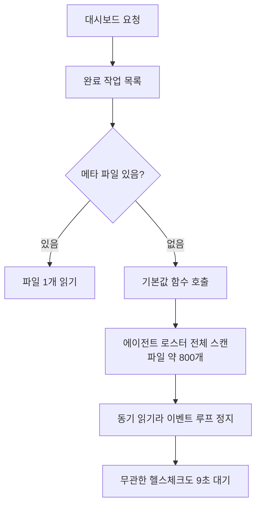

"웹이 느려요"라는 제보를 받았습니다. 이런 제보는 보통 막막해요. 느리다는 게 어디가
어떻게 느린 건지부터 정해야 하니까요.

그런데 상태를 보니 느린 것보다 이상한 게 있었습니다. 파드가 주기적으로 준비 상태에서
빠지고 있었어요. 준비 상태 검사는 헬스체크 엔드포인트를 부르는데, 이 엔드포인트는
파일도 안 읽고 데이터베이스도 안 봅니다. 상수를 하나 돌려주는 게 전부예요.

그게 9초가 걸리고 있었습니다. 그러다 503이 났고요.

## 아무것도 안 하는 엔드포인트가 9초 걸릴 때

이건 그 엔드포인트의 문제일 리가 없어요. 상수를 돌려주는 데 9초가 걸린다면, 그 코드가
실행될 차례가 9초 동안 안 온 겁니다. 이벤트 루프가 막혀 있다는 뜻이에요.

프로세스 상태를 보니 메인 스레드가 `D` 상태에 있었습니다. 중단 불가능한 대기예요.
보통 디스크나 네트워크 입출력을 기다릴 때 이 상태가 됩니다. 스택을 보니 원격 프로시저
호출 대기에서 멈춰 있었어요. 파일시스템이 네트워크 너머에 있으니 파일 하나 여는 게
네트워크 왕복입니다.

여기서 그림이 잡혔어요. 누군가 동기 파일 입출력을 잔뜩 하고 있고, 그 사이 이벤트
루프가 통째로 서고, 그래서 무관한 요청까지 다 밀리는 거였습니다.

## 커널 카운터를 요청 전후로 찍었어요

얼마나 하는지 세어야 했습니다. 애플리케이션 계측을 붙이려면 배포를 해야 하는데, 그전에
커널이 이미 세고 있는 걸 쓰기로 했어요.

리눅스는 NFS 클라이언트 통계를 파일로 노출합니다. 요청 직전과 직후에 이걸 읽고 차이를
내면 그 요청이 유발한 원격 연산 횟수가 나와요.

```sh
cat /proc/net/rpc/nfs > before.txt
curl -s -o /dev/null http://localhost:3000/dashboard
cat /proc/net/rpc/nfs > after.txt
```

결과가 이랬습니다.

| 요청 | 걸린 시간 | 순 파일 열기 |
|---|---|---|
| 대시보드 | 15.8초 | 13,344 |
| 알파 상세 | 39.8초 | 33,368 |

요청 하나에 파일 열기가 만 삼천 번이었어요.

이 시점에 흔한 오해를 하나 지워야 했습니다. "네트워크 파일시스템이라 느린 거 아니냐"는
거요. 그래서 대조군을 잡았습니다. 에이전트 정의 트리를 한 번 읽는 작업을 운영과
스테이징에서 각각 재봤어요. 806번 대 826번으로 거의 같았습니다. 한 번 읽는 비용은
양쪽이 같았어요.

그러니까 문제는 **읽는 비용이 아니라 읽는 횟수**였습니다. 파일시스템을 바꾼다고 해결될
게 아니었어요.

## 기본값을 돌려주는 함수가 800개를 읽고 있었어요

횟수를 만드는 지점을 찾아 들어갔습니다. 대시보드는 완료된 작업 목록을 보여주는데, 각
작업마다 "이 작업을 누가 했는가"를 표시해요. 그 코드가 이렇게 생겼습니다.

```javascript
const type = readRunMeta(runId)?.researcherType ?? defaultResearcherTypeId();
```

평범해 보이죠. 메타 파일에서 읽고, 없으면 기본값을 쓰는 거예요. 문제는 그 기본값
함수였습니다.

```javascript
function defaultResearcherTypeId() {
  const roster = agentRoster();   // 여기가 전부를 읽어요
  return roster.find(...)?.id;
}
```

`agentRoster()`는 등록된 에이전트를 전부 훑으면서 각각의 정의 파일과 규칙, 스킬 문서를
읽습니다. 한 번 부르면 파일 열기가 대략 800번이에요. 캐시는 없었습니다.

그리고 메타 파일이 없는 완료 작업이 14개 있었어요. 목록을 그리는 동안 그 14개마다 이
함수가 불렸습니다.

계산해보니 14 곱하기 480이 6,720쯤이고, 실측이 6,674였어요. 오차 1퍼센트 안입니다.
대시보드는 같은 카드를 두 군데서 그려서 두 배인 13,344였고요. 숫자가 맞았습니다. 이 순간이 이런 조사에서
제일 기분 좋은 지점이에요. 가설이 산술로 확인되면 더 볼 게 없거든요.



<span class="figcap">"없으면 기본값"이라는 평범한 한 줄이, 기본값을 구하는 비용 때문에 증폭기가 됐어요.</span>

## 리플리카를 늘리면 더 나빠져요

해법 후보를 넷 놓고 봤는데, 셋을 단독 해법에서 뺐습니다.

**비동기로 바꾸기.** 이벤트 루프는 안 막히니까 헬스체크는 살아납니다. 그런데 원격
연산 만 삼천 번은 그대로예요. 대시보드는 여전히 15초 걸리고, 파일시스템 쪽 부하도
그대로입니다. 증상 하나를 다른 데로 옮기는 거예요.

**리플리카 늘리기.** 이게 제일 반직관적이었습니다. 보통 느리면 늘리잖아요. 그런데
여기서는 파드가 늘면 같은 스캔을 하는 주체가 늘어납니다. 원격 연산 횟수가 배수로
늘어요. 공유 파일시스템은 모두가 같은 걸 보니까, 늘린 만큼 그쪽이 더 밀립니다.
느려서 늘렸는데 더 느려지는 구조예요.

**CPU 늘리기.** `D` 상태는 CPU를 안 씁니다. 원격 응답을 기다리는 시간이라 코어를
더 줘도 1밀리초도 안 줄어요.

남은 건 근본이었습니다. 기본값 계산을 캐시하고, 애초에 그 함수를 목록 그릴 때 안
부르게 하고, 메타 파일이 없는 작업을 메꾸는 것.

## 계측을 완료 조건에 넣었어요

이 티켓에서 제가 고집한 게 하나 있어요. 완료 조건에 "수정 후 같은 방식으로 다시 세서
횟수가 줄었음을 보인다"를 넣은 겁니다.

넣자고 한 이유가 단순했습니다. 이 문제는 로그에 에러가 안 나요. 사용자가 "빨라진 것
같다"고 말해도 그게 이 수정 때문인지 트래픽이 줄어서인지 알 수가 없습니다. 커널
카운터 차이를 재는 것 말고는 "고쳤다"를 증명할 수단이 없었어요.

성능 작업에서 이게 자주 빠집니다. 고치고 나서 체감으로 판정하고 닫는데, 그러면 몇 달
뒤에 같은 증상이 왔을 때 이게 재발인지 새 문제인지 구분이 안 돼요.

## 곁가지로 나온 것들

조사하면서 같이 보인 게 둘 있었습니다.

프런트엔드가 부팅할 때 아직 안 열어본 섹션 여섯 개를 동시에 요청하고 있었어요.
사용자가 볼 생각도 없는 화면의 데이터를 미리 당기는 건데, 각각이 위의 증폭기를
지나갑니다.

그리고 활동 목록 폴링이 6초 간격인데 응답이 7.8초 걸리고 있었어요. 응답이 오기 전에
다음 요청이 나가니까 겹칩니다. 부하가 스스로를 키우는 모양이에요. 폴링 간격은 응답
시간보다 길어야 한다는 게 당연한 말 같은데, 응답 시간이 나중에 느려지면 이 관계가
조용히 뒤집힙니다.

## 돌아보면

제일 오래 남은 건 "기본값이 공짜가 아니다"예요. `?? defaultSomething()`은 코드에서
제일 안 무해해 보이는 패턴 중 하나인데, 그 함수가 뭘 하는지는 호출부에서 안 보입니다.
여기서는 800개 파일을 읽었어요.

그리고 대조군을 잡은 게 조사 방향을 결정했다는 것도요. "한 번 읽는 비용"을 따로 재지
않았으면 파일시스템을 의심하면서 한참 헤맸을 겁니다. 806 대 826이라는 숫자 하나가
"매체가 아니라 횟수"라고 못 박아줬어요.

마지막으로, 느릴 때 리플리카를 늘리는 게 항상 답은 아니라는 걸 숫자로 본 게 좋았습니다.
공유 자원을 두고 경쟁하는 구조에서는 늘리는 게 곧 경쟁을 늘리는 거예요. 그걸 설득하려면
"늘리면 나빠진다"를 말이 아니라 구조로 보여줘야 하고요.

## 참고한 자료

- [/proc/net/rpc/nfs](https://www.kernel.org/doc/html/latest/filesystems/nfs/index.html) (Linux kernel): 클라이언트 쪽 NFS 연산 카운터
- [nfsstat(8)](https://linux.die.net/man/8/nfsstat) (die.net): 같은 카운터를 사람이 읽기 좋게 보는 도구
- [The Node.js Event Loop](https://nodejs.org/en/learn/asynchronous-work/event-loop-timers-and-nexttick) (Node.js): 동기 입출력이 왜 무관한 요청까지 막는지
- [Configure Liveness, Readiness and Startup Probes](https://kubernetes.io/docs/tasks/configure-pod-container/configure-liveness-readiness-startup-probes/) (Kubernetes): 준비 상태 검사가 실패하면 트래픽이 끊기는 동작
