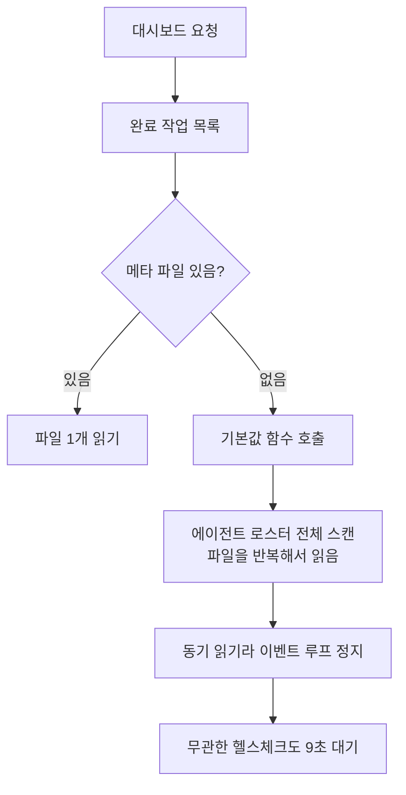

"웹이 느려요"라는 제보를 받았습니다. 이런 제보는 보통 막막해요. 느리다는 게 어디가
어떻게 느린 건지부터 정해야 하니까요.

그런데 상태를 보니 느린 것보다 이상한 게 있었습니다. 파드가 주기적으로 준비 상태에서
빠지고 있었어요. 준비 상태 검사는 헬스체크 엔드포인트를 부르는데, 이 엔드포인트는
파일도 안 읽고 데이터베이스도 안 봅니다. 상수를 하나 돌려주는 게 전부예요.

그게 9초가 걸리고 있었습니다. 그러다 503이 났고요.

## 아무것도 안 하는 엔드포인트가 9초 걸릴 때

상수를 돌려주는 코드 자체보다는, 그 코드가 실행될 차례를 기다리는 시간을 의심했습니다.
이벤트 루프가 막히는지부터 확인하기로 했어요.

프로세스 상태를 보니 메인 스레드가 `D` 상태에 있었습니다. 중단 불가능한 대기예요.
보통 디스크나 네트워크 입출력을 기다릴 때 이 상태가 됩니다. 스택을 보니 원격 프로시저
호출 대기에서 멈춰 있었어요. 이 파일시스템에서는 파일을 여는 과정에도 네트워크 왕복이
발생할 수 있었습니다.

여기서 그림이 잡혔어요. 누군가 동기 파일 입출력을 잔뜩 하고 있고, 그 사이 이벤트
루프가 통째로 서고, 그래서 무관한 요청까지 다 밀리는 거였습니다.

## 커널 카운터를 요청 전후로 찍었어요

얼마나 하는지 세어야 했습니다. 애플리케이션 계측을 붙이려면 배포를 해야 하는데, 그전에
커널이 이미 세고 있는 걸 쓰기로 했어요.

리눅스는 NFS 클라이언트 통계를 파일로 노출합니다. 요청 직전과 직후에 이걸 읽고
원격 연산 카운터의 차이를 비교했어요.

```sh
cat /proc/net/rpc/nfs > before.txt
curl -s -o /dev/null http://localhost:3000/dashboard
cat /proc/net/rpc/nfs > after.txt
```

결과가 이랬습니다. 표의 횟수는 NFS OPEN 카운터 증가량입니다. 애플리케이션의 `open()`
호출 수와 같은 지표는 아니에요. 또한 요청별 카운터가 아니므로, 같은 클라이언트의 다른
작업이 섞이면 그 작업의 연산도 포함됩니다. 아래 값은 요청 전후 구간의 측정으로 읽어야 해요.

| 요청 | 걸린 시간 | NFS OPEN 증가량 |
|---|---|---|
| 대시보드 | 15.8초 | 13,344 |
| 알파 상세 | 39.8초 | 33,368 |

대시보드 요청 전후에 OPEN이 만 삼천 번 넘게 늘었어요.

이 시점에는 "네트워크 파일시스템이라 느린 거 아니냐"는 설명을 더 나눠봐야 했습니다.
그래서 대조군을 잡았어요. 에이전트 정의 트리를 한 번 읽는 작업을 운영과
스테이징에서 각각 재봤어요. 806번 대 826번으로 거의 같았습니다. 한 번의 트리 조회가
발생시키는 연산 수는 비슷했어요. 이것만으로 연산당 지연까지 같다고 할 수는 없습니다.

그래도 조사할 방향은 좁혀졌습니다. 한 번의 트리 조회에 비해 대시보드에서 횟수가 크게
늘어난 이유를 먼저 찾아보기로 했어요. 느린 매체가 영향을 줬더라도 반복 읽기는 줄일
필요가 있었습니다.

## 기본값을 돌려주는 함수가 정의 트리를 전부 읽고 있었어요

횟수를 만드는 지점을 찾아 들어갔습니다. 대시보드는 완료된 작업 목록을 보여주는데, 각
작업마다 "이 작업을 누가 했는가"를 표시해요. 그 코드가 이렇게 생겼습니다.

```javascript
const type = readRunMeta(runId)?.researcherType ?? defaultResearcherTypeId();
```

평범해 보이죠. 메타 파일에서 읽고, 없으면 기본값을 쓰는 거예요. 문제는 그 기본값
함수였습니다.

```javascript
function defaultResearcherTypeId() {
  const roster = agentRoster();   // 여기가 전부를 읽어요
  return roster.find(...)?.id;
}
```

`agentRoster()`는 등록된 에이전트를 전부 훑으면서 각각의 정의 파일과 규칙, 스킬 문서를
읽습니다. 앞선 트리 조회에서 관측한 OPEN 증가량은 대략 800회였어요. 이 함수에는
캐시가 없었습니다.

그리고 메타 파일이 없는 완료 작업이 14개 있었어요. 목록을 그리는 동안 그 14개마다 이
함수가 불렸습니다.

대시보드는 같은 카드를 두 군데서 그리고 있었습니다. 메타 파일이 없는 작업마다 전체
조회가 반복되는 호출 구조는 확인했어요. 다만 한 번의 조회량에 작업 수와 렌더 횟수를
곱한 계산을, 앞의 OPEN 실측값과 정확히 일치하는 검산으로 쓰지는 않겠습니다. 각 측정의
대상과 캐시 조건을 맞추지 않으면 그 산식으로 같은 수치가 나오는지 확인할 수 없어요.



<span class="figcap">"없으면 기본값"이라는 평범한 한 줄이, 기본값을 구하는 비용 때문에 증폭기가 됐어요.</span>

## 리플리카를 늘리기 전에 줄여야 할 연산이 있었어요

해법 후보를 넷 놓고 봤는데, 셋을 단독 해법에서 뺐습니다.

**비동기로 바꾸기.** 이벤트 루프를 막는 시간을 줄이는 데는 도움이 됩니다. 하지만
같은 파일을 반복해서 여는 호출 구조는 남아요. 병렬화로 지연이 달라질 수는 있어도,
비동기 전환만으로 불필요한 원격 연산이 없어지지는 않습니다.

**리플리카 늘리기.** 고정된 총요청량을 여러 파드에 나누는 것만으로 전체 연산 수가
배수로 늘지는 않습니다. 다만 요청당 반복 조회는 남고, 처리하는 동시 요청이 늘면
공유 파일시스템에 더 많은 연산이 몰릴 수 있어요. 이 조사만으로 리플리카 증설이
반드시 악화된다고 말할 수는 없지만, 요청당 비용을 줄이는 작업을 대신하지는 못합니다.

**CPU 늘리기.** `D` 상태는 CPU를 안 씁니다. 원격 응답을 기다리는 시간이라 코어를
늘리는 것만으로 이 대기 원인을 제거할 수는 없었어요.

남은 건 근본이었습니다. 기본값 계산을 캐시하고, 애초에 그 함수를 목록 그릴 때 안
부르게 하고, 메타 파일이 없는 작업을 메꾸는 것.

## 계측을 완료 조건에 넣었어요

이 티켓에서 제가 고집한 게 하나 있어요. 완료 조건에 "수정 후 같은 방식으로 다시 세서
횟수가 줄었음을 보인다"를 넣은 겁니다.

넣자고 한 이유가 단순했습니다. 이 문제는 로그에 에러가 안 나요. 사용자가 "빨라진 것
같다"고 말해도 그게 이 수정 때문인지 트래픽이 줄어서인지 알 수가 없습니다. 커널
카운터와 응답 시간을 같은 조건에서 다시 비교해야 수정 효과를 확인할 수 있었어요.

이 글은 반복 조회를 찾고 수정 방향과 완료 조건을 정한 조사 기록입니다. 수정 후의
카운터나 응답 시간은 제시하지 않았으므로, 개선 폭까지 입증한 결과는 아닙니다.

## 곁가지로 나온 것들

조사하면서 같이 보인 게 둘 있었습니다.

프런트엔드가 부팅할 때 아직 안 열어본 섹션 여섯 개를 동시에 요청하고 있었어요.
사용자가 볼 생각도 없는 화면의 데이터를 미리 당기는 건데, 각각이 위의 증폭기를
지나갑니다.

그리고 활동 목록 폴링이 6초 간격인데 응답이 7.8초 걸리고 있었어요. 응답이 오기 전에
다음 요청이 나가니까 겹칩니다. 부하가 스스로를 키우는 모양이에요. 응답 시간이 길어질 수
있다면 고정 간격만 조정하기보다, 앞선 요청이 끝나기 전에 다음 요청을 겹쳐 보내지 않는
방식도 검토해야 했어요.

## 돌아보면

제일 오래 남은 건 "기본값이 공짜가 아니다"예요. `?? defaultSomething()`은 코드에서
무해해 보이는 패턴 중 하나인데, 그 함수가 뭘 하는지는 호출부에서 안 보입니다.
여기서는 에이전트 정의 트리를 전부 읽었어요.

한 번의 트리 조회와 화면 요청을 나눠 본 덕분에, 다음으로 확인할 호출 지점을 찾을 수
있었습니다. 이후 검증에서는 같은 요청에 대해 OPEN 증가량, 응답 시간, 무관한 헬스체크
지연을 함께 비교해야 해요. 그래야 반복 읽기를 줄인 효과와 이벤트 루프가 풀린 효과를
구별할 수 있습니다.

## 참고한 자료

- [/proc/net/rpc/nfs](https://www.kernel.org/doc/html/latest/filesystems/nfs/index.html) (Linux kernel): 클라이언트 쪽 NFS 연산 카운터
- [nfsstat(8)](https://linux.die.net/man/8/nfsstat) (die.net): 같은 카운터를 사람이 읽기 좋게 보는 도구
- [The Node.js Event Loop](https://nodejs.org/en/learn/asynchronous-work/event-loop-timers-and-nexttick) (Node.js): 동기 입출력이 왜 무관한 요청까지 막는지
- [Configure Liveness, Readiness and Startup Probes](https://kubernetes.io/docs/tasks/configure-pod-container/configure-liveness-readiness-startup-probes/) (Kubernetes): 준비 상태 검사가 실패하면 트래픽이 끊기는 동작
