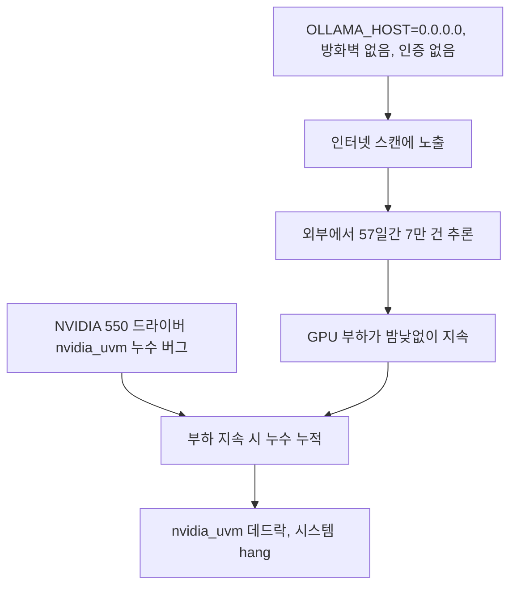

아침에 출근했더니 GPU 서버 한 대가 응답이 없었어요. SSH가 안 붙고, 모니터를 꽂아도
화면에 아무것도 안 나왔습니다. 커널 패닉 메시지조차 없었어요. 할 수 있는 게 없어서
전원을 강제로 내렸다 올렸고, 서버는 아무 일 없었다는 듯 돌아왔습니다.

이 서버는 사내 챗봇용 오픈웨이트 모델을 Ollama로 서빙하던 박스였어요. 그리고 사실
한 달 전에도 한 번 얼어붙은 적이 있었습니다. 그때는 원인을 찾았었어요. 임베딩 모델과
Ollama가 같은 GPU를 나눠 쓰다가 CUDA OOM이 나고, 그게 CPU 폴백으로 흘러 swap을 다
써버리면서 systemd까지 멈춘 거였죠. 임베딩을 CPU로 옮기고 swap을 늘리고 atop을 깔아뒀습니다.

그래서 이번엔 "또 그건가" 싶었어요. 그런데 atop 기록을 보니 이번엔 메모리가 아니었습니다.
swap은 여유가 있었고, RAM도 멀쩡했어요. 다른 원인이었습니다.

## 로그를 세 번 읽었어요

첫 번째 읽기는 그냥 수집이었어요. 멈추기 직전 몇 시간의 `journalctl`, `dmesg`, Ollama
서비스 로그, atop 스냅샷을 한곳에 모았습니다. 이 단계에선 뭘 찾는지 모르니까 일단
넓게 담아요.

두 번째 읽기에서 이상한 게 보였습니다. Ollama 서비스 로그에 요청이 너무 많았어요.
사내 챗봇은 사용자가 몇십 명이라 한산한 편인데, 로그에는 새벽에도 요청이 끊이지 않고
있었습니다. 요청의 출발지 IP를 뽑아서 사내 대역을 제외해봤어요.

```sh
journalctl -u ollama --since "2 months ago" \
  | grep -oE '([0-9]{1,3}\.){3}[0-9]{1,3}' \
  | grep -vE '^(10\.|172\.(1[6-9]|2[0-9]|3[01])\.|192\.168\.|127\.)' \
  | sort | uniq -c | sort -rn | head
```

사내 대역이 아닌 IP가 줄줄이 나왔어요. 대부분 미국 소재 VPS 호스팅 대역이었고, 몇
개의 IP가 번갈아가며 붙고 있었습니다. 처음 등장한 날짜를 찾아보니 57일 전이었어요.
그날부터 멈춘 날까지 외부에서 들어온 추론 요청이 70,232건이었습니다.

일별로 펼쳐보니 추세가 있었어요. 처음엔 하루 400건 정도였는데 멈추기 직전엔 1,100건을
넘고 있었습니다. 누군가 우리 서버를 발견하고, 되는 걸 확인하고, 점점 더 열심히
쓰고 있었던 거예요.

## 왜 열려 있었나

Ollama는 기본으로 `127.0.0.1:11434`에만 붙습니다. 그런데 사내 다른 서버에서 이 모델을
호출해야 해서, 누군가 `OLLAMA_HOST=0.0.0.0`으로 바꿔뒀어요. 사내망에서 접근하려면
필요한 설정이긴 했습니다. 문제는 이 서버에 공인 IP가 있었고, 방화벽 규칙이 없었고,
Ollama API에는 인증이라는 개념 자체가 없다는 거였어요. 셋 중 하나만 있었어도 막혔을
텐데, 셋 다 없었습니다.

침해 경로를 재구성하면 이래요. 인터넷 전체를 스캔하는 서비스들이 있고, 11434 포트에
Ollama 응답이 오는 호스트는 그런 검색에서 바로 나옵니다. 누군가 그 목록에서 우리를
찾았고, `/api/tags`로 어떤 모델이 있는지 본 다음, 자동화된 클라이언트로 붙여서
공짜 추론 API처럼 쓰기 시작한 거예요. 로그의 프롬프트를 몇 개 열어보니 우리 도메인과는
전혀 상관없는, 그냥 범용 챗봇 용도였습니다.

"사내망이니까 괜찮겠지"가 얼마나 위험한 문장인지 이때 알았어요. 사내망에서 접근하려고
연 설정이 곧 인터넷에서 접근되는 설정이었고, 그 사이를 막아주는 건 아무것도 없었습니다.

## 그런데 서버가 멈춘 건 그것 때문만이 아니었어요

여기서 끝났으면 "외부 트래픽 때문에 과부하로 죽었다"로 정리했을 거예요. 그런데 숫자가
안 맞았습니다. 하루 1,100건이면 분당 한 건도 안 돼요. 그 정도로 GPU 서버가 SSH까지
안 되게 멈추진 않습니다.

세 번째 읽기는 타임라인 구성이었어요. 멈추기 전 며칠의 `dmesg`를 시간순으로 놓고,
GPU 관련 커널 메시지를 걸렀습니다. 그러니까 `nvidia_uvm` 모듈에서 나오는 경고가
며칠에 걸쳐 조금씩 늘고 있었어요. 찾아보니 당시 쓰던 NVIDIA 550 계열 드라이버에
`nvidia_uvm`의 `pin_user_pages` 경로에서 메모리를 누수하는 알려진 버그가 있었습니다.
GPU 부하가 오래 지속되면 누수가 쌓이고, 결국 커널 쪽에서 데드락이 걸려 시스템 전체가
멈추는 패턴이었어요.



<span class="figcap">둘 중 하나만 있었으면 안 멈췄을 거예요. 외부 트래픽이 드라이버 버그를 밟을 만큼 GPU를 오래 돌려준 셈이었습니다.</span>

정리하면 원인이 두 겹이었어요. 드라이버 버그는 혼자서는 잘 안 터집니다. 사내 사용량은
낮에만 있고 밤에는 GPU가 쉬니까요. 그런데 외부 트래픽이 24시간 GPU를 돌려주는 바람에
누수가 쉴 틈 없이 쌓였고, 어느 순간 임계를 넘은 거였습니다. 한 달 전 프리즈와 이번
hang은 증상은 비슷했지만 원인은 완전히 달랐어요. 그래서 "또 그건가"로 넘기지 않고
로그를 다시 읽은 게 중요했습니다.

## 조치는 세 가지였어요

먼저 문을 닫았습니다. iptables로 11434 포트를 사내 대역과 localhost에서만 받도록 했고,
같은 구성의 옆 서버에도 똑같이 적용했어요. 그 위에 fail2ban을 올려서 반복 접근을
자동 차단하게 했습니다. 적용 후 외부 IP의 요청이 0이 되는 걸 로그로 확인했어요.

그다음 드라이버를 550에서 580으로 올리고, 패키지 버전을 고정했습니다. 이 서버는 자동
업데이트가 켜져 있었는데, 드라이버가 자동으로 바뀌면 다음엔 어떤 버그를 밟을지 알 수
없어요. 올리는 것보다 고정하는 게 더 중요했습니다.

마지막으로 프로세스를 하나 만들었어요. 새 서비스를 띄울 때 어떤 포트가 어떤 인터페이스에
바인딩되는지 확인하는 항목을 배포 체크리스트에 넣었습니다. `ss -tlnp`로 한 줄 보는
건데, 이 한 줄이 있었으면 57일이 0일이었을 거예요.

## 돌아보면

이 일에서 제일 크게 남은 건 "사내망이니까"라는 말이 설정이 아니라 가정이라는 거예요.
가정은 방화벽 규칙이 아닙니다. 서비스를 여는 순간 그 포트가 어디까지 보이는지는
확인해야 아는 거지 믿을 게 아니었어요.

그리고 증상이 같아 보여도 원인은 다를 수 있다는 것도요. 한 달 전 프리즈의 경험이
있어서 이번엔 더 빨리 볼 수 있었지만, 그 경험 때문에 "또 메모리겠지"로 넘겼다면
외부 트래픽도 드라이버 버그도 못 찾았을 거예요. 체계적으로 타임라인을 다시 놓고,
로그를 상관시켜 보는 절차가 결국 두 겹의 원인을 다 드러냈습니다.

드라이버 버전은 고정하세요. 자동 업데이트가 안정성을 주는 게 아니라, 언제 뭐가 바뀔지
모르는 상태를 줍니다.

## 참고한 자료

- [Ollama FAQ: How do I expose Ollama on my network?](https://github.com/ollama/ollama/blob/main/docs/faq.md) (Ollama): `OLLAMA_HOST` 설정과 그 의미, 인증이 없다는 점을 확인할 수 있어요
- [fail2ban](https://github.com/fail2ban/fail2ban) (GitHub): 로그 기반 반복 접근 자동 차단
- [Shodan](https://www.shodan.io/) (Shodan): 인터넷에 노출된 서비스가 어떻게 검색되는지 직접 확인해볼 수 있어요
- [NVIDIA Driver Documentation](https://docs.nvidia.com/datacenter/tesla/index.html) (NVIDIA): 드라이버 브랜치별 릴리즈 노트와 알려진 이슈
