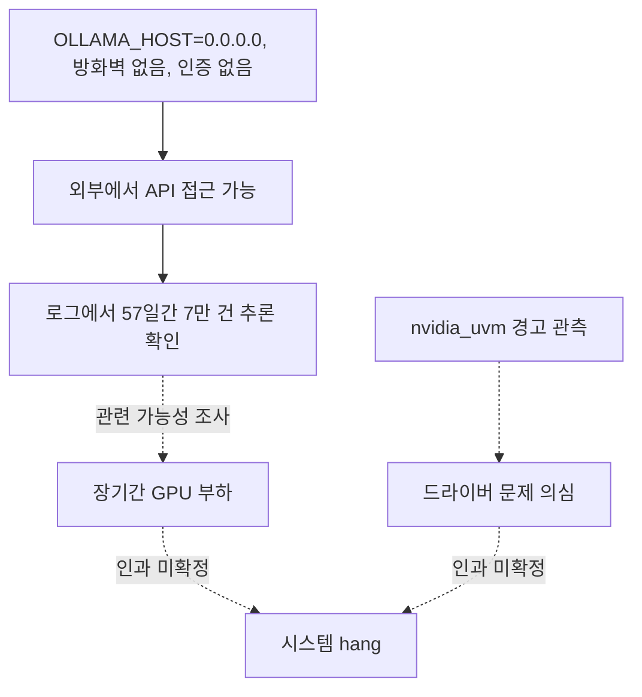

아침에 출근했더니 GPU 서버 한 대가 응답이 없었어요. SSH가 안 붙고, 모니터를 꽂아도
화면에 아무것도 안 나왔습니다. 커널 패닉 메시지조차 없었어요. 할 수 있는 게 없어서
전원을 강제로 내렸다 올렸고, 서버는 아무 일 없었다는 듯 돌아왔습니다.

이 서버는 사내 챗봇용 오픈웨이트 모델을 Ollama로 서빙하던 박스였어요. 그리고 사실
한 달 전에도 한 번 얼어붙은 적이 있었습니다. 그때는 원인을 찾았었어요. 임베딩 모델과
Ollama가 같은 GPU를 나눠 쓰다가 CUDA OOM이 나고, 그게 CPU 폴백으로 흘러 swap을 다
써버리면서 systemd까지 멈춘 거였죠. 임베딩을 CPU로 옮기고 swap을 늘리고 atop을 깔아뒀습니다.

그래서 이번엔 "또 그건가" 싶었어요. 그런데 atop 기록에서는 같은 메모리 고갈 패턴이
보이지 않았습니다. swap과 RAM에 여유가 있어, 지난번 설명을 그대로 적용할 수 없었어요.

## 로그를 세 번 읽었어요

첫 번째 읽기는 그냥 수집이었어요. 멈추기 직전 몇 시간의 `journalctl`, `dmesg`, Ollama
서비스 로그, atop 스냅샷을 한곳에 모았습니다. 이 단계에선 뭘 찾는지 모르니까 일단
넓게 담아요.

두 번째 읽기에서 이상한 게 보였습니다. Ollama 서비스 로그에 요청이 너무 많았어요.
사내 챗봇은 사용자가 몇십 명이라 한산한 편인데, 로그에는 새벽에도 요청이 끊이지 않고
있었습니다. 요청의 출발지 IP를 뽑아서 사내에서 쓰는 주소와 대조했어요.

아래는 로그의 IPv4 문자열을 모으는 예시입니다. 이것만으로 외부 요청이 분류되는 것은
아니에요. 실제 요청의 출발지 필드인지 확인하고, 사내와 프록시가 사용하는 주소를 따로
대조해야 합니다. 사설 IP 대역만 제외하는 방식으로 사내외를 구분할 수는 없어요.

```sh
journalctl -u ollama --since "2 months ago" \
  | grep -oE '([0-9]{1,3}\.){3}[0-9]{1,3}' \
  | sort | uniq -c | sort -rn | head
```

사내 대역이 아닌 IP가 줄줄이 나왔어요. 대부분 미국 소재 VPS 호스팅 대역이었고, 몇
개의 IP가 번갈아가며 붙고 있었습니다. 처음 등장한 날짜를 찾아보니 57일 전이었어요.
그날부터 멈춘 날까지 외부에서 들어온 추론 요청이 70,232건이었습니다. 57일은 로그에서
확인한 사용 기간이에요. 포트가 처음 열린 시각까지 알아낸 것은 아닙니다.

일별로 펼쳐보니 추세가 있었어요. 처음엔 하루 400건 정도였는데 멈추기 직전엔 1,100건을
넘고 있었습니다. 로그에서 확인한 외부 요청이 계속 이어지고 있었어요.

## 왜 열려 있었나

Ollama는 기본으로 `127.0.0.1:11434`에만 붙습니다. 그런데 사내 다른 서버에서 이 모델을
호출해야 해서, 누군가 `OLLAMA_HOST=0.0.0.0`으로 바꿔뒀어요. 다른 호스트가 접근할 수
있게 바인딩을 넓힌 겁니다. 문제는 이 서버에 공인 IP가 있었고, 방화벽 규칙이 없었고,
당시 로컬 Ollama API 앞에는 인증 계층도 없었다는 거였어요. 바인딩을 넓히면서 접근을
제한하는 장치를 함께 두지 않은 상태였습니다.

가능한 유입 경로로는 인터넷 스캔을 생각했습니다. 열린 포트를 발견하고 `/api/tags`로
모델을 확인한 뒤 클라이언트를 연결할 수 있으니까요. 다만 누군가 특정 검색서비스에서
우리를 발견했다는 경로까지 로그로 확정한 것은 아닙니다. 확인한 요청 내용은 우리 서비스
용도와 관련 없는 범용 챗봇 사용에 가까웠어요.

"사내망이니까 괜찮겠지"가 얼마나 위험한 문장인지 이때 알았어요. 사내망에서 접근하려고
연 설정이 곧 인터넷에서 접근되는 설정이었고, 그 사이를 막아주는 건 아무것도 없었습니다.

## 서버가 멈춘 원인은 따로 확인해야 했어요

여기서 끝났으면 "외부 트래픽 때문에 과부하로 죽었다"로 정리했을 거예요. 하지만 하루
요청 수만으로는 순간 동시성, 토큰 길이, GPU 점유 시간을 알 수
없어요. 외부 요청이 있었다는 사실만으로 시스템 hang의 원인을 정할 수는 없었습니다.

세 번째 읽기는 타임라인 구성이었어요. 멈추기 전 며칠의 `dmesg`를 시간순으로 놓고,
GPU 관련 커널 메시지를 걸렀습니다. 그러니까 `nvidia_uvm` 모듈에서 나오는 경고가
며칠에 걸쳐 조금씩 늘고 있었어요. 당시 조사에서는 사용 중인 NVIDIA 550 계열과
`pin_user_pages` 경로의 문제를 찾아, 장기간 GPU 부하와 드라이버 문제의 복합 작용으로
판단했습니다. 다만 이 글에는 정확한 패치 버전, 일치하는 버그 보고서와 커널 스택을
제시하지 않았어요. 따라서 외부 요청에서 메모리 누수와 데드락까지 이어지는 인과를
확정한 재현 결과로 읽을 수는 없습니다.



<span class="figcap">외부 요청과 커널 경고는 관측한 사실이고, 둘이 hang으로 이어지는 점선은 당시 원인 분석에서 연결한 부분입니다.</span>

접근 통제의 결함은 원인 분석의 불확실성과 관계없이 바로 고쳐야 했습니다. 동시에
커널 경고를 근거로 드라이버 변경도 진행했어요. 두 조치를 함께 적용했기 때문에 이후
상태만으로 각 조치의 효과를 분리하거나, 어느 하나만 있었다면 멈추지 않았을 것이라고
결론 낼 수는 없습니다.

## 조치는 세 가지였어요

먼저 문을 닫았습니다. iptables로 11434 포트를 사내 대역과 localhost에서만 받도록 했고,
같은 구성의 옆 서버에도 똑같이 적용했어요. 그 위에 fail2ban을 올려서 반복 접근을
자동 차단하게 했습니다. 적용 후 외부 IP의 요청이 0이 되는 걸 로그로 확인했어요.

그다음 드라이버를 550에서 580으로 올리고, 패키지 버전을 고정했습니다. 이 서버는 자동
업데이트가 켜져 있었는데, 드라이버가 자동으로 바뀌면 다음엔 어떤 버그를 밟을지 알 수
없어요. 당시 대응에서는 어떤 버전이 실행되는지 통제할 수 있게 하는 데 목적이 있었습니다.

마지막으로 프로세스를 하나 만들었어요. 새 서비스를 띄울 때 어떤 포트가 어떤 인터페이스에
바인딩되는지 확인하는 항목을 배포 체크리스트에 넣었습니다. `ss -tlnp`로 한 줄 보는
건데, 바인딩 주소를 확인하는 출발점이 됩니다. 실제 외부 접근 가능 여부는 네트워크
규칙과 함께 확인해야 해요.

## 돌아보면

이 일에서 제일 크게 남은 건 "사내망이니까"라는 말이 설정이 아니라 가정이라는 거예요.
가정은 방화벽 규칙이 아닙니다. 서비스를 여는 순간 그 포트가 어디까지 보이는지는
확인해야 아는 거지 믿을 게 아니었어요.

한 달 전 프리즈와 같은 증상으로 시작했지만, 로그를 다시 읽으면서 새로운 문제를
찾았습니다. 접근 차단의 결과와 드라이버에 대한 원인 가설은 구별해서 남겨야 했어요.
버전 고정도 업데이트를 영구히 멈추자는 뜻으로 남기기보다, 검증한 버전과 다음 변경을
추적할 수 있게 하는 운영 결정으로 설명하는 편이 정확합니다.

## 참고한 자료

- [Ollama FAQ: How do I expose Ollama on my network?](https://github.com/ollama/ollama/blob/main/docs/faq.md) (Ollama): `OLLAMA_HOST` 설정과 그 의미, 인증이 없다는 점을 확인할 수 있어요
- [fail2ban](https://github.com/fail2ban/fail2ban) (GitHub): 로그 기반 반복 접근 자동 차단
- [Shodan](https://www.shodan.io/) (Shodan): 인터넷에 노출된 서비스가 어떻게 검색되는지 직접 확인해볼 수 있어요
- [NVIDIA Driver Documentation](https://docs.nvidia.com/datacenter/tesla/index.html) (NVIDIA): 드라이버 브랜치별 릴리즈 노트와 알려진 이슈
