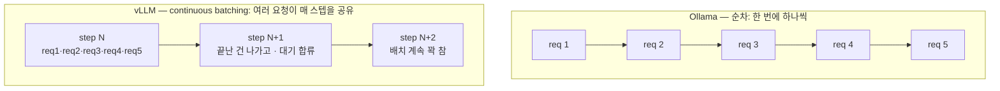
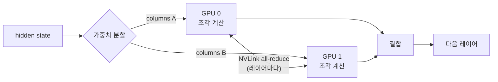
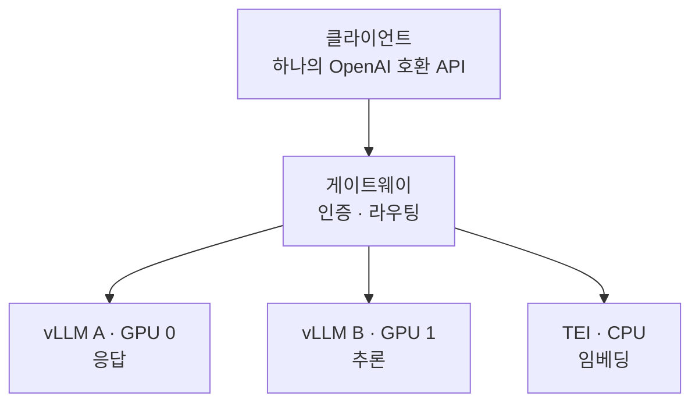

27–32B 오픈웨이트 모델 3개를 48GB GPU 2개 위에서 [Ollama](https://ollama.com)로
서빙하고 있었다. 배치 작업은 **90분**이 걸렸다. OpenAI 호환 게이트웨이 뒤에
[vLLM](https://docs.vllm.ai)으로 옮긴 뒤, 같은 작업이 **21분**에 끝났다 — 우리
하드웨어 기준 **처리량 4.8배**.

하지만 엔지니어링의 핵심은 그 숫자가 아니었다. 진짜 어려운 건 (1) 리더보드에서
제일 빠른 엔진이 아니라 *내가 운영할 수 있는* 엔진을 고르는 것, 그리고 (2) 양자화
모델이 프로덕션에서 믿을 만큼 여전히 맞는 답을 내는지 증명하는 것이었다. 이 글은
그 둘을 짚되, vLLM이 *빠르다*가 아니라 *왜* 빠른지를 설명한다 — 그 "왜"가 당신의
스택으로 옮겨갈 수 있는 부분이니까.

> **TL;DR** — Ollama는 요청을 순차 처리하고, vLLM은 continuous batching +
> PagedAttention으로 요청을 겹치며 텐서 병렬로 GPU 둘에 걸친다. 그게 4.8배다.
> 마이그레이션의 진짜 비용은 양자화 포맷 전환(GGUF → AWQ) 검증이었고, 오래 남는
> 이득은 엔진 앞에 교체 가능한 인터페이스를 둔 것이다.

---

## 먼저, LLM 서빙은 시간을 어디에 쓰나?

속도 향상을 이해하려면 추론 서버가 무엇과 싸우는지부터 알아야 한다. 트랜스포머의
텍스트 생성은 **자기회귀적**이다: 토큰 하나를 내고, 이어 붙이고, 다음 토큰을 위해
전체 forward pass를 다시 돈다. 두 가지 비용이 지배한다.

1. **연산이 아니라 메모리 대역폭에 묶인다.** 토큰 하나를 생성할 때마다 GPU 메모리
   에서 모델 가중치 전체를 읽는다. 배치 크기 1이면 그 읽기로 *토큰 하나*만 만든다 —
   GPU 연산 유닛은 대부분 논다. 해법은 같은 가중치 읽기로 *여러* 요청의 토큰을 함께
   생성하는 것(배칭).
2. **KV 캐시가 커지고, 저장해야 한다.** 매 스텝 전체 시퀀스에 대한 어텐션을 다시
   계산하지 않으려고, 모델은 토큰별 key/value 텐서를 캐싱한다. 이 캐시는 크고 토큰
   마다 자라며, 이걸 어떻게 관리하느냐가 한 번에 몇 요청을 메모리에 담느냐를 정한다.

아래 트릭 대부분은 이 두 비용 중 하나에 대한 공격이다. Ollama는 설계상 둘 다
적극적으로 다루지 않는다.

## Ollama가 한계에 부딪힌 지점

Ollama는 우리를 빠르게 프로덕션까지 데려다줬다 — 그게 그 도구의 일이고, 잘 했다.
다만 실제 동시 부하에서 세 가지 구조적 이유로 천장을 쳤다.

- **Continuous batching 부재.** 요청이 순차 처리돼, 여러 요청에 분산하지 못하고
  요청마다 가중치 읽기를 통째로 냈다.
- **Tensor Parallelism 미지원.** [NVLink](https://www.nvidia.com/en-us/data-center/nvlink/)로
  묶인 GPU 2개인데 한 모델이 둘에 걸치지 못했다 — 두 GPU의 합산 메모리 대역폭을 쓸
  수 없었다.
- **모델 전환 시 cold start.** 세 모델을 오갈 때마다 수십 초의 지연.

이건 버그가 아니라 설계 선택이다. Ollama([llama.cpp](https://github.com/ggml-org/llama.cpp)
기반)는 "한 박스에서 모델을 쉽게 돌린다"에 최적화돼 있다. 우리는 그 형태를 넘어선
것뿐이다.

## vLLM은 왜 빠른가 — 세 가지 메커니즘

### 1. Continuous batching

정적 배칭은 배치를 모아 끝까지 돌린 뒤 다음을 시작한다 — 느린 요청 하나가 전체를
붙잡고, 끝난 슬롯은 논다. **Continuous** 배칭([Orca, OSDI '22](https://www.usenix.org/conference/osdi22/presentation/yu)에서
도입)은 forward pass 한 번 단위로 동작한다: 매 스텝 후 끝난 요청은 배치를 떠나고
대기 중인 요청이 합류한다. GPU가 꽉 찬 상태로 유지된다.


<span class="figcap">순차는 요청 사이 GPU가 놀지만, continuous batching은 가중치 읽기를 in-flight 배치 전체에 분산한다.</span>

Anyscale은 이것만으로 최대 [처리량 23배](https://www.anyscale.com/blog/continuous-batching-llm-inference)를
측정했다. 우리의 동시 5개 워크로드가 정확히 이게 겨냥하는 경우다.

### 2. PagedAttention (KV 캐시 트릭)

요청의 KV 캐시를 저장하는 순진한 방법은 *최대* 시퀀스 길이에 맞춘 하나의 큰 연속
블록을 잡는 것이다. 내부 단편화로 막대한 메모리를 낭비한다 — 그리고 메모리가 곧 몇
요청을 배칭할 수 있느냐의 한계다.

[PagedAttention](https://arxiv.org/abs/2309.06180)(vLLM 뒤의 논문)은 운영체제의
**페이징** 아이디어를 빌린다: KV 캐시를 고정 크기 블록으로 쪼개 연속일 필요 없이
필요할 때 할당한다. 낭비가 0에 가까우니 같은 VRAM에 훨씬 많은 동시 시퀀스가
들어가고 — 이게 곧바로 continuous batching을 먹인다. 가상 메모리와 같은 통찰을
어텐션에 적용한 것이다.

| KV 캐시 전략 | 메모리 낭비 | 동시 시퀀스 |
|---|---|---|
| 연속, 최대 길이 예약 | 큼(내부 단편화) | 적음 |
| **페이지, 온디맨드 블록** | 거의 0 | 많음 |

### 3. Tensor parallelism

두 GPU는 NVLink로 연결돼 있다. 텐서 병렬([Megatron-LM](https://arxiv.org/abs/1909.08053))은
각 레이어의 가중치 행렬을 두 GPU에 나눠 담는다. 모든 GPU가 자기 조각을 계산한 뒤,
레이어마다 NVLink로 부분 결과를 교환한다(all-reduce). 대가는 합산 메모리 대역폭 —
정작 중요한 그 한계 — 과 한 카드에 안 들어갈 모델을 담을 여유다.


<span class="figcap">텐서 병렬(<code>--tensor-parallel-size 2</code>): 각 레이어를 두 GPU에 쪼개고 레이어마다 NVLink로 결과를 맞춘다. Ollama는 이걸 아예 못 했다.</span>

### 그리고 양자화: AWQ vs GGUF

양자화는 가중치를 16bit에서 ~4bit로 줄여, 큰 모델이 들어가고 더 빨리 읽히게 한다.
다만 엔진 입장에선 *포맷*이 중요하다.

- **GGUF**(llama.cpp / Ollama)는 CPU 오프로드와 유연한 CPU/GPU 분할을 중심으로
  설계됐다.
- **[AWQ](https://arxiv.org/abs/2306.00978)**(Activation-aware Weight Quantization)는
  GPU CUDA 커널용으로, 역양자화를 행렬곱에 융합한다 — 별도 언팩 스텝을 내지 않는다.

GPU 전용 서버에선 AWQ 커널이 맞는 도구다. 그리고 이게 실제로 시간을 잡아먹은
부분으로 이어진다.

## 진짜 비용: 양자화 모델이 여전히 맞는지 증명하기

이 마이그레이션의 실제 병목은 설정이 아니라 **검증**이었다.

몇몇 모델은 공식 AWQ 빌드가 없어, 신뢰도를 알 수 없는 커뮤니티 변환본밖에 없었다.
양자화 포맷을 바꿔놓고 출력이 여전히 맞기를 *바랄* 수는 없다 — 양자화는 손실이 있고,
잘못된 변환은 사용자가 부딪히기 전엔 안 드러나는 방식으로 품질을 떨어뜨린다.

그래서 내부 벤치마크 세트를 만들었다. 같은 프롬프트를 기존 스택(GGUF)과 새 스택
(AWQ)에 통과시키고, 스왑을 신뢰하기 *전에* 출력 동등성을 비교했다. 내가 계속
돌아오게 되는 원칙: **일한 엔진이 자기 일을 스스로 인증하지 못한다** — 스왑이
안전한지는 별도의 검증자가 판정한다. 배포가 아니라 이 검증 단계에 대부분의 시간이
들어갔다.

재현을 위한 최종 실행 명령어:

```bash
uv run python -m vllm.entrypoints.openai.api_server \
    --model org/Model-32B-AWQ \
    --tensor-parallel-size 2 \      # 두 GPU에 걸침 (NVLink)
    --max-model-len 2048 \          # 컨텍스트 상한 → KV 캐시 한계
    --max-num-seqs 16 \             # 배치 내 최대 동시 시퀀스
    --gpu-memory-utilization 0.80 \ # KV 캐시 증가 여유
    --host 0.0.0.0 --port 8000
```

## 숫자 — 그리고 그게 실제로 의미하는 것

동일 32B급 모델, 동일 4bit 양자화, 동시 5개 요청, 3회 평균, 256토큰 생성.
**내부 벤치마크, 단일 하드웨어 구성** — 일반화된 주장이 아니다.

| 메트릭 | Ollama | vLLM | Δ |
|---|---|---|---|
| 동시 5개 완료 시간 | 38.9s | 5.7s | 6.8× |
| 평균 지연시간 | 23.31s | 6.48s | 3.6× |
| 요청당 처리량 | 15.0 tok/s | 40.6 tok/s | 2.7× |
| **총 처리량** | 98.6 tok/s | 472.5 tok/s | **4.8×** |

정직하게 읽자. 헤드라인 4.8배는 *동시성 하의 처리량* — continuous batching이 GPU를
꽉 채운 직접적 결과다. 단일 요청 지연은 3.6배로 더 완만한데, 요청 하나는 배칭 이득을
못 보기 때문이다. **페이지에서 제일 큰 숫자가 아니라, 워크로드에 맞는 메트릭을
보고하라.** 배치 작업(다수 요청, 처리량 바운드)엔 4.8배가 정직한 수치고, 지연 SLA가
걸린 챗 엔드포인트엔 3.6배를 인용해야 한다.

## 가장 빠른 엔진이 아니라, 믿을 수 있는 엔진

추론 서버 12개를 조사했다. 순수 처리량만 보면 vLLM은 선두가 **아니었다**.

| 엔진 | 처리량 (H100, 8B) | vLLM 대비 | 메모 |
|---|---|---|---|
| [SGLang](https://github.com/sgl-project/sglang) | 16,215 tok/s | +29% | RadixAttention, 급성장 |
| [LMDeploy](https://github.com/InternLM/lmdeploy) | 16,132 tok/s | +29% | TurboMind 커널 |
| **[vLLM](https://docs.vllm.ai)** | 12,553 tok/s | 기준 | 가장 크고 성숙한 커뮤니티 |
| [llama.cpp](https://github.com/ggml-org/llama.cpp) | ~35 tok/s | ~−360× | CPU/엣지 중심 |

<span class="figcap">공개된 서드파티 수치, 내 측정 아님 — 판을 줄 세우는 용도로만.</span>

그래도 vLLM을 골랐다. 29%의 처리량 우위는 실재한다 — 하지만 새벽 2시에 엔진이
터졌을 때 참고할 답이 더 적은 엔진을 운영하는 비용도 실재한다. vLLM은 해결된 이슈가
가장 많고, 검증된 엣지 케이스가 가장 많고, 레퍼런스 배포가 가장 많았다. 제품 앞단에
이걸 놓는 소규모 팀에겐 **운영 가능성이 최고 처리량을 이긴다.** 일회성 29%를 상시
운영 비용과 맞바꾸는 건 나쁜 거래고, 다시 해도 같게 판단한다.

## 여러 모델 서빙: 하드와이어가 아니라 게이트웨이

모델 셋, 계약 하나. 앞단에 OpenAI 호환 게이트웨이([LiteLLM proxy](https://docs.litellm.ai))를
뒀다.


<span class="figcap">클라이언트는 <code>/v1/chat/completions</code>만 말하고, 게이트웨이 뒤에 뭐가 있는지 끝내 모른다.</span>

Ollama의 `/api/chat`을 OpenAI 호환 표면으로 바꾸자, 클라이언트 코드는 게이트웨이
뒤에 뭐가 도는지 신경 쓰지 않게 됐다 — 다음 엔진 교체는 클라이언트 재작성이 아니라
설정 한 줄이 된다. 임베딩은 같은 문으로
[TEI](https://github.com/huggingface/text-embeddings-inference)(CPU)에 간다.
**소유하는 건 인터페이스이고, 그 뒤 엔진은 교체 가능하다.** 이 분리는 어떤 단일
서빙 엔진보다 오래 간다 — 그게 핵심이다.

## 다른 엔지니어에게 해줄 말

1. **"충분히 좋고 빠르게"가 "완벽하게, 언젠가"를 이긴다.** 29% 빠른 엔진은 얇은
   안전망을 감수할 값이 아니었다.
2. **양자화 스왑은 설정 문제가 아니라 검증 문제다.** 배포 코드를 짜는 것보다 출력
   충실도를 증명하는 데 더 많은 시간을 잡아라.
3. **클라이언트와 엔진 사이에 인터페이스를 둬라.** 엔진은 *반드시* 바뀐다. 그걸
   클라이언트 마이그레이션으로 만들지 마라.

"그냥 LLM 엔진"처럼 보였다. 실제로는 LLM 옷을 입은 분산 시스템 최적화였다.

---

## 참고자료 & 더 읽을거리

- Kwon 외, **PagedAttention / vLLM** — *Efficient Memory Management for LLM Serving with PagedAttention*, SOSP 2023. [arXiv:2309.06180](https://arxiv.org/abs/2309.06180)
- Yu 외, **Orca**(continuous batching) — *A Distributed Serving System for Transformer-Based Generative Models*, OSDI 2022. [논문](https://www.usenix.org/conference/osdi22/presentation/yu)
- Anyscale — *How continuous batching enables 23× throughput in LLM inference*. [블로그](https://www.anyscale.com/blog/continuous-batching-llm-inference)
- Lin 외, **AWQ** — *Activation-aware Weight Quantization for LLM Compression and Acceleration*, MLSys 2024. [arXiv:2306.00978](https://arxiv.org/abs/2306.00978)
- Shoeybi 외, **Megatron-LM**(텐서 병렬) — [arXiv:1909.08053](https://arxiv.org/abs/1909.08053)
- **vLLM** 문서 — [docs.vllm.ai](https://docs.vllm.ai) · **SGLang** — [github](https://github.com/sgl-project/sglang) · **LMDeploy** — [github](https://github.com/InternLM/lmdeploy)
- **LiteLLM** proxy — [docs.litellm.ai](https://docs.litellm.ai) · **TEI** — [github](https://github.com/huggingface/text-embeddings-inference)
