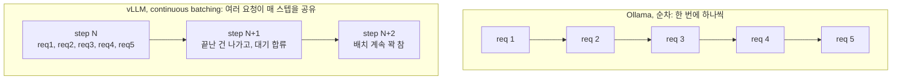
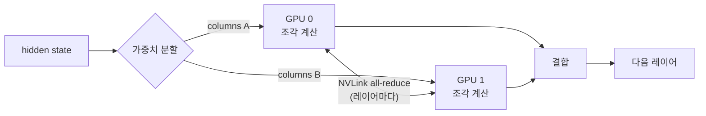
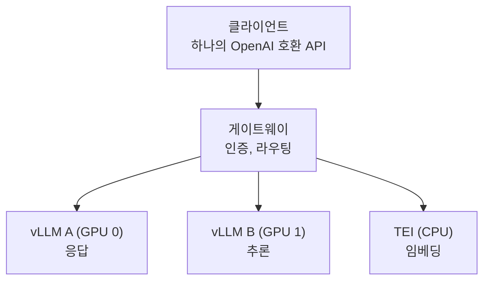

27B에서 32B급 오픈웨이트 모델 3개를 48GB GPU 두 장 위에서 Ollama로 서빙하고
있었습니다. 배치 작업 하나가 90분씩 걸렸어요. 이걸 OpenAI 호환 게이트웨이 뒤의
vLLM으로 옮기고 나니 같은 작업이 21분에 끝났습니다. 우리 하드웨어 기준으로 처리량이
4.8배가 된 거예요.

그런데 정작 엔지니어링의 핵심은 그 숫자가 아니었어요. 진짜 어려웠던 건 두 가지였습니다.
하나는 리더보드에서 제일 빠른 엔진이 아니라 제가 운영할 수 있는 엔진을 고르는 일이었고,
다른 하나는 양자화한 모델이 프로덕션에서 믿을 만큼 여전히 맞는 답을 내는지 증명하는
일이었어요. 이 글에서는 그 둘을 다루면서 vLLM이 왜 빠른지까지 같이 풀어볼게요.
"빠르다"가 아니라 "왜 빠른가"가 여러분 스택으로 옮겨갈 수 있는 부분이니까요.

## LLM 서빙은 시간을 어디에 쓰나요

속도 이야기를 하기 전에, 추론 서버가 무엇과 싸우는지부터 봐야 합니다. 트랜스포머로
텍스트를 만드는 건 자기회귀적이에요. 토큰 하나를 내고, 이어 붙이고, 다음 토큰을 위해
전체 forward pass를 다시 돕니다. 여기서 두 가지 비용이 지배적이에요.

첫째, 연산이 아니라 메모리 대역폭에 묶입니다. 토큰 하나를 생성할 때마다 GPU 메모리에서
모델 가중치 전체를 읽어야 해요. 배치 크기가 1이면 그 읽기로 토큰 하나만 만드니까, GPU
연산 유닛은 대부분 놀고 있죠. 그래서 같은 가중치 읽기로 여러 요청의 토큰을 함께 만드는
배칭이 답이에요.

둘째, KV 캐시가 자라고 그걸 저장해야 합니다. 매 스텝 전체 시퀀스에 대한 어텐션을 다시
계산하지 않으려고 토큰별 key/value를 캐싱하는데, 이 캐시가 크고 토큰마다 커져요. 이걸
어떻게 관리하느냐가 한 번에 몇 요청을 메모리에 담느냐를 정합니다.

아래 나오는 기법들은 거의 다 이 두 비용을 공격하는 거예요. Ollama는 설계상 둘 다
적극적으로 다루지 않고요.

## Ollama가 한계에 부딪힌 지점

Ollama는 우리를 빠르게 프로덕션까지 데려다줬습니다. 그게 그 도구의 일이고, 잘
해줬어요. 다만 실제 동시 부하에서 세 가지 구조적인 이유로 천장을 쳤습니다.

- Continuous batching이 없어요. 요청이 순차 처리되니까, 여러 요청에 나눠 담지 못하고
  요청마다 가중치 읽기를 통째로 냅니다.
- Tensor parallelism을 지원하지 않아요. NVLink로 묶인 GPU가 두 장인데 한 모델이 둘에
  걸치질 못하니, 두 GPU의 합산 메모리 대역폭을 못 씁니다.
- 모델을 바꿀 때 cold start가 납니다. 세 모델을 오갈 때마다 수십 초씩 지연됐어요.

이건 버그가 아니라 설계 선택이에요. Ollama(llama.cpp 기반)는 "한 박스에서 모델을 쉽게
돌린다"에 최적화돼 있고, 우리는 그 형태를 넘어선 것뿐입니다.

## vLLM은 왜 빠른가, 세 가지 메커니즘

### 1. Continuous batching

정적 배칭은 배치를 모아서 끝까지 돌린 다음에 다음 걸 시작해요. 그래서 느린 요청 하나가
전체를 붙잡고, 끝난 슬롯은 놀죠. Continuous batching은([Orca, OSDI '22](https://www.usenix.org/conference/osdi22/presentation/yu)에서
나왔어요) forward pass 한 번 단위로 동작합니다. 매 스텝이 끝나면 완료된 요청은 배치를
떠나고 대기하던 요청이 합류해요. GPU가 꽉 찬 상태로 유지되는 겁니다.


<span class="figcap">순차 방식은 요청 사이에 GPU가 놀지만, continuous batching은 가중치 읽기를 진행 중인 배치 전체에 나눠 담아요.</span>

Anyscale은 이것만으로 처리량이 최대 [23배](https://www.anyscale.com/blog/continuous-batching-llm-inference)가
됐다고 측정했어요. 우리 동시 5개 워크로드가 딱 이게 노리는 경우고요.

### 2. PagedAttention

요청의 KV 캐시를 저장하는 순진한 방법은 최대 시퀀스 길이에 맞춘 큰 연속 블록을
잡아두는 거예요. 그러면 내부 단편화로 메모리를 크게 낭비하는데, 메모리가 곧 몇 요청을
배칭할 수 있느냐의 한계라 뼈아프죠.
[PagedAttention](https://arxiv.org/abs/2309.06180)은(vLLM 뒤의 논문이에요)
운영체제의 페이징 아이디어를 빌려 옵니다. KV 캐시를 고정 크기 블록으로 쪼개서 연속일
필요 없이 필요할 때 할당해요. 낭비가 0에 가까우니 같은 VRAM에 훨씬 많은 동시 시퀀스가
들어가고, 이게 continuous batching을 그대로 먹여 줍니다. 가상 메모리와 똑같은 통찰을
어텐션에 적용한 거예요.

| KV 캐시 전략 | 메모리 낭비 | 동시 시퀀스 |
|---|---|---|
| 연속, 최대 길이 예약 | 큼(내부 단편화) | 적음 |
| 페이지, 온디맨드 블록 | 거의 0 | 많음 |

### 3. Tensor parallelism

우리 GPU 두 장은 NVLink로 연결돼 있어요.
Tensor parallelism은([Megatron-LM](https://arxiv.org/abs/1909.08053)에서 왔어요)
각 레이어의 가중치 행렬을 두 GPU에 나눠 담습니다. GPU마다 자기 조각을 계산하고,
레이어마다 NVLink로 부분 결과를 주고받아요(all-reduce). 얻는 건 합산 메모리
대역폭입니다. 정작 중요한 그 한계 말이에요. 그리고 한 카드에 안 들어갈 모델을 담을
여유도 생기고요.


<span class="figcap">Tensor parallelism(<code>--tensor-parallel-size 2</code>)은 각 레이어를 두 GPU에 쪼개고 레이어마다 NVLink로 결과를 맞춰요. Ollama는 이걸 아예 못 했고요.</span>

### 그리고 양자화, AWQ와 GGUF

양자화는 가중치를 16bit에서 4bit 정도로 줄여서 큰 모델이 들어가고 더 빨리 읽히게 해요.
다만 엔진 입장에선 포맷이 중요합니다. GGUF는(llama.cpp, Ollama) CPU 오프로드와 유연한
CPU/GPU 분할을 중심으로 설계됐어요. [AWQ](https://arxiv.org/abs/2306.00978)는(Activation-aware
Weight Quantization) GPU CUDA 커널용이라, 역양자화를 행렬곱에 융합해서 따로 언팩하는
단계를 내지 않고요. GPU 전용 서버에선 AWQ 커널이 맞는 도구예요. 그리고 이게 실제로
시간을 잡아먹은 부분으로 이어집니다.

## 진짜 비용은 양자화 모델을 검증하는 일이었어요

이 마이그레이션의 실제 병목은 설정이 아니라 검증이었어요. 몇몇 모델은 공식 AWQ 빌드가
없어서, 신뢰도를 알 수 없는 커뮤니티 변환본밖에 없었거든요. 양자화 포맷을 바꿔놓고
출력이 여전히 맞기를 그냥 바랄 수는 없어요. 양자화는 손실이 있고, 잘못된 변환은
사용자가 부딪히기 전엔 잘 안 드러나는 방식으로 품질을 떨어뜨리니까요.

그래서 내부 벤치마크 세트를 만들었습니다. 같은 프롬프트를 기존 스택(GGUF)과 새
스택(AWQ)에 통과시키고, 스왑을 신뢰하기 전에 출력이 같은지 비교했어요. 제가 계속
돌아오는 원칙이 여기 있습니다. 일한 엔진이 자기 일을 스스로 인증하게 두지 않는 거예요.
스왑이 안전한지는 별도의 검증자가 판정합니다. 배포가 아니라 이 검증 단계에 대부분의
시간이 들어갔어요.

재현을 위해 최종 실행 명령어는 이랬습니다.

```bash
uv run python -m vllm.entrypoints.openai.api_server \
    --model org/Model-32B-AWQ \
    --tensor-parallel-size 2 \      # 두 GPU에 걸침 (NVLink)
    --max-model-len 2048 \          # 컨텍스트 상한으로 KV 캐시 한계
    --max-num-seqs 16 \             # 배치 내 최대 동시 시퀀스
    --gpu-memory-utilization 0.80 \ # KV 캐시 증가 여유
    --host 0.0.0.0 --port 8000
```

## 숫자, 그리고 그게 실제로 뜻하는 것

동일 32B급 모델, 동일 4bit 양자화, 동시 5개 요청, 3회 평균, 256토큰 생성 기준이에요.
내부 벤치마크이고 단일 하드웨어 구성이라, 일반화된 주장은 아닙니다.

| 메트릭 | Ollama | vLLM | Δ |
|---|---|---|---|
| 동시 5개 완료 시간 | 38.9s | 5.7s | 6.8× |
| 평균 지연시간 | 23.31s | 6.48s | 3.6× |
| 요청당 처리량 | 15.0 tok/s | 40.6 tok/s | 2.7× |
| 총 처리량 | 98.6 tok/s | 472.5 tok/s | 4.8× |

정직하게 읽어 볼게요. 헤드라인인 4.8배는 동시성 하의 처리량이에요. continuous batching이
GPU를 꽉 채운 직접적인 결과죠. 단일 요청 지연은 3.6배로 더 완만한데, 요청 하나는 배칭
이득을 못 보기 때문이에요. 페이지에서 제일 큰 숫자가 아니라 자기 워크로드에 맞는 숫자를
보고해야 합니다. 배치 작업처럼 다수 요청에 처리량이 중요한 경우엔 4.8배가 정직한
수치이고, 지연 SLA가 걸린 챗 엔드포인트라면 3.6배를 인용하는 게 맞고요.

## 가장 빠른 엔진이 아니라, 믿을 수 있는 엔진

추론 서버를 12개쯤 조사했어요. 순수 처리량만 보면 vLLM은 선두가 아니었습니다.

| 엔진 | 처리량 (H100, 8B) | vLLM 대비 | 메모 |
|---|---|---|---|
| [SGLang](https://github.com/sgl-project/sglang) | 16,215 tok/s | +29% | RadixAttention, 빠르게 성장 |
| [LMDeploy](https://github.com/InternLM/lmdeploy) | 16,132 tok/s | +29% | TurboMind 커널 |
| [vLLM](https://docs.vllm.ai) | 12,553 tok/s | 기준 | 가장 크고 성숙한 커뮤니티 |
| [llama.cpp](https://github.com/ggml-org/llama.cpp) | ~35 tok/s | ~−360× | CPU, 엣지 중심 |

<span class="figcap">공개된 서드파티 수치이고 제 측정이 아니에요. 판을 줄 세우는 용도로만 봐 주세요.</span>

그래도 vLLM을 골랐어요. 29%의 처리량 우위는 실재하지만, 새벽 2시에 엔진이 터졌을 때
참고할 답이 더 적은 엔진을 운영하는 비용도 실재하거든요. vLLM은 해결된 이슈가 제일 많고,
검증된 엣지 케이스가 제일 많고, 레퍼런스 배포도 제일 많았어요. 제품 앞단에 이걸 놓는
소규모 팀한테는 운영 가능성이 최고 처리량을 이깁니다. 일회성 29%를 상시 운영 비용과
맞바꾸는 건 나쁜 거래라, 다시 해도 같게 판단할 거예요.

## 여러 모델 서빙: 하드와이어 말고 게이트웨이

모델은 셋인데 계약은 하나로 두고 싶었어요. 그래서 앞단에 OpenAI 호환
게이트웨이([LiteLLM proxy](https://docs.litellm.ai))를 뒀습니다.


<span class="figcap">클라이언트는 <code>/v1/chat/completions</code>만 말하고, 게이트웨이 뒤에 뭐가 있는지 끝내 몰라요.</span>

클라이언트는 API 하나(`/v1/chat/completions`)만 말합니다. Ollama의 `/api/chat`을
OpenAI 호환 표면으로 바꾸고 나니, 클라이언트 코드는 게이트웨이 뒤에 뭐가 도는지 신경
쓰지 않게 됐어요. 다음 엔진 교체가 클라이언트 재작성이 아니라 설정 한 줄이 되는 거죠.
임베딩은 같은 문으로 [TEI](https://github.com/huggingface/text-embeddings-inference)(CPU)에
가고요. 소유하는 건 인터페이스이고, 그 뒤 엔진은 언제든 교체할 수 있습니다. 이 분리가
어떤 단일 서빙 엔진보다 오래 가요. 사실 그게 핵심이고요.

## 돌아보며

처음엔 "그냥 LLM 엔진 하나 바꾸는 일"처럼 보였는데, 실제로는 LLM 옷을 입은 분산 시스템
최적화였어요. 그 과정에서 세 가지가 몸에 남았습니다. 완벽한 최적해보다 충분히 좋은
걸로 빠르게 옮기는 게 나을 때가 있다는 것, 양자화 스왑은 설정 문제가 아니라 검증 문제라
출력 충실도를 증명하는 데 시간을 더 잡아야 한다는 것, 그리고 클라이언트와 엔진 사이엔
인터페이스를 두어야 엔진을 바꿀 때 그게 클라이언트 마이그레이션이 되지 않는다는 것이요.

## 참고한 자료

- Kwon 외, [PagedAttention / vLLM](https://arxiv.org/abs/2309.06180) (SOSP 2023): LLM 서빙을 위한 PagedAttention 메모리 관리
- Yu 외, [Orca](https://www.usenix.org/conference/osdi22/presentation/yu) (OSDI 2022): continuous batching의 원조
- Anyscale, [continuous batching이 처리량을 23배로](https://www.anyscale.com/blog/continuous-batching-llm-inference)
- Lin 외, [AWQ](https://arxiv.org/abs/2306.00978) (MLSys 2024): Activation-aware Weight Quantization
- Shoeybi 외, [Megatron-LM](https://arxiv.org/abs/1909.08053): tensor parallelism
- [vLLM 문서](https://docs.vllm.ai) | [SGLang](https://github.com/sgl-project/sglang) | [LMDeploy](https://github.com/InternLM/lmdeploy) | [LiteLLM](https://docs.litellm.ai) | [TEI](https://github.com/huggingface/text-embeddings-inference)
