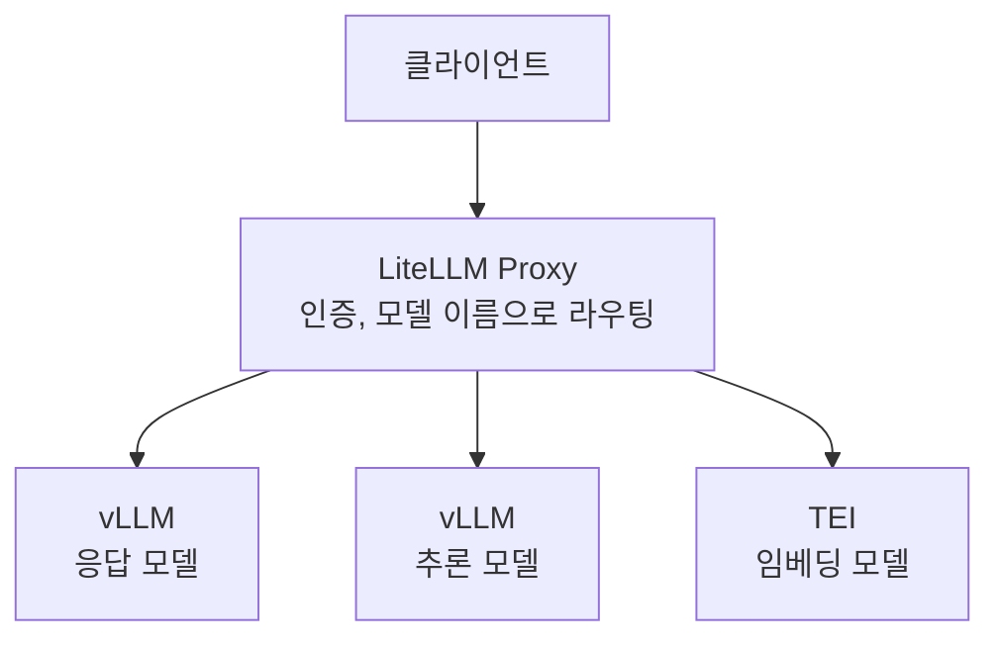

응답용 모델과 추론용 모델을 Ollama로 서빙하고 있었어요. 혼자 쓸 때는 괜찮았는데,
여러 사람이 동시에 요청을 보내니 대기가 길어졌습니다. 모델을 바꾸는 작업에서는
내렸다가 다시 올리는 시간까지 붙었어요. 배치 하나가 다음 일을 계속 붙잡고 있었습니다.

그래서 제가 전환 전략을 잡고, 별도 테스트 서버에서 Ollama와 vLLM을 비교했습니다.
그 결과를 보고 운영 서버를 옮겼고, 여러 모델로 가는 호출은 LiteLLM Proxy에 모았어요.
그런데 이 과정을 "vLLM으로 바꾸니 4.8배 빨라졌다"로만 적으면 빠지는 게 많습니다.
장비도 두 종류였고, 엔진과 함께 양자화 포맷도 바뀌었거든요.

## 먼저, 어느 서버에서 잰 숫자인지부터요

사전 벤치마크와 실제 서비스 배포는 다른 장비에서 했습니다.

| 구분 | 장비 | 여기서 한 일 |
|---|---|---|
| 테스트 | RTX 3090 24GB 두 장 | Ollama와 vLLM 사전 비교 |
| 운영 | A6000 48GB 두 장 | 여러 모델을 서빙하던 환경의 전환 |

테스트에서는 같은 32B급 모델을 4bit 수준으로 맞추고 동시 요청 5개를 보냈어요.
당시 기록에는 3회 반복, 최대 생성 256토큰이라고 남아 있습니다. 다만 Ollama는
GGUF Q4_K_M, vLLM은 AWQ였어요. 같은 모델 계열과 비슷한 비트 수를 맞춘 것이지,
같은 가중치 파일을 두 엔진에 넣은 실험은 아닙니다.

이 구분이 중요했던 이유는 결과 해석 때문이에요. 엔진, 양자화 표현, 실행 커널이 함께
바뀌었습니다. 여기서 나온 차이는 서빙 스택 전환의 비교 근거로 쓸 수 있지만,
그 전부를 continuous batching 하나의 효과라고 분해할 수는 없어요.

## 4.8배는 당시 기록한 처리량의 비율이에요

당시 벤치마크 표에 총 토큰 처리량으로 남긴 값은 이렇습니다.

| 기록한 지표 | Ollama | vLLM |
|---|---|---|
| 총 토큰 처리량 | 98.6 tok/s | 472.5 tok/s |

두 값을 나누면 약 4.8배입니다. 이 숫자가 팀에서 전환을 논의할 때 도움이 됐어요.
다만 지금 남아 있는 요약만으로는 토큰 집계 범위와 시간 분모를 다시 확인할 수 없습니다.
당시 기록을 인용한 값이고, 이번 글 보완 때 벤치마크를 다시 실행한 결과는 아니에요.

예전 글에는 동시 요청 전체 완료 시간과 평균 지연도 같은 표에 놓았습니다. 그런데
기록된 평균 지연이 전체 완료 시간보다 큰 항목이 있어, 같은 실행 집단의 같은 시간축으로
읽을 수 없었어요. 요청별 원자료와 집계 정의를 복원하지 못한 상태에서 각각을
챗 응답 속도나 SLA 개선 수치로 인용하는 건 그만두기로 했습니다.

배치가 90분 넘게 걸리다가 21분에 끝난 관찰도 별도로 있었어요. 앞은 운영 서버의
Ollama, 뒤는 테스트 서버의 vLLM이었습니다. 하드웨어까지 달랐으니 이 시간 차이를
위 표의 4.8배와 같은 실험 결과로 묶을 수는 없습니다.

다시 이런 비교를 한다면 요청별 입력과 실제 출력 토큰 수, 시작과 종료 시각,
워밍업 포함 여부를 같이 남길 거예요. 그래야 "생성 토큰 합계 ÷ 첫 요청 시작부터 마지막
요청 종료까지의 시간"처럼 분모가 분명한 처리량을 다른 사람이 다시 계산할 수 있습니다.

## Ollama의 기능과 당시 설정의 한계는 달랐어요

처음에는 요청이 밀리는 모습을 보고 Ollama를 "요청을 하나씩 처리하는 도구"라고
설명했습니다. 그 설명은 너무 넓었어요. [공식 FAQ](https://docs.ollama.com/faq)는
병렬 요청과 여러 모델의 동시 적재, 여러 GPU에 모델을 나누어 적재하는 동작을 설명합니다.
실제 동작에는 메모리 여유와 동시성 설정이 영향을 줘요.

제가 확인한 문제는 당시 구성에서의 대기와 모델 전환 지연이었습니다. Ollama의 버전과
모든 설정을 고정한 비교 기록이 없으니, 설정을 조정한 Ollama의 최선까지 이겼다고
말할 수는 없어요. 여러 GPU를 쓴다는 것과 레이어 안의 행렬을 나누는 tensor parallelism도
같은 말이 아닙니다.

vLLM을 살펴볼 때 주목한 건 요청을 함께 처리하는 방식과 KV 캐시 관리였어요.
Continuous batching은 진행 중인 배치에 새 요청을 합류시키고, PagedAttention은
KV 캐시를 블록으로 관리해 큰 연속 공간을 미리 잡을 때의 낭비를 줄입니다.
원리는 [PagedAttention 논문](https://arxiv.org/abs/2309.06180)에 정리돼 있어요.
이들이 처리량에 영향을 줄 수 있다는 설명과, 제 실험에서 각각 얼마를 기여했는지는
별개의 질문입니다. 저는 기법별 효과를 분리해서 측정하지 않았습니다.

## 시간이 더 걸린 건 같은 입력의 출력을 비교하는 일이었어요

일부 모델은 공식 AWQ 배포본이 없었습니다. 커뮤니티가 변환한 파일은 구할 수 있었지만,
기존 GGUF 모델과 비슷한 답을 내는지 제가 확인해야 했어요. [AWQ](https://arxiv.org/abs/2306.00978)는
가중치를 낮은 비트 수로 표현하는 방법이고, 비트 수가 같다는 이유만으로 다른 양자화
결과와 출력 품질까지 같아지는 건 아닙니다.

그래서 비교용 프롬프트를 모으고, 같은 입력을 기존 GGUF 경로와 새 AWQ 경로에 넣어
결과물을 하나씩 봤습니다. 서버를 띄우는 코드보다 이 비교에 시간이 더 들었어요.
당시에는 제가 확인한 출력들이 운영에 쓸 만하다고 판단해서 전환했습니다.

여기서 확인한 범위는 같은 입력에 대한 결과물 비교입니다. 정량 점수와 합격선을 갖춘
품질 평가나, 독립된 검증자가 동등성을 입증한 실험까지 한 건 아니에요. 남긴 기록에서
프롬프트 수와 실패 유형별 결과를 확인할 수 없어 "품질 저하 없음"을 수치로 주장할 수도 없습니다.

다음 전환에서는 속도 표 옆에 비교한 입력, 출력 차이, 채택 이유를 함께 남기고 싶어요.
특히 빠른 답을 내더라도 요청한 형식을 어기거나 필요한 내용을 빠뜨리는 경우를 따로
세어야, 출력 검토가 단순한 인상으로 끝나지 않을 것 같습니다.

## 실행 옵션보다 오래 남은 건 호출 경계였어요

모델 하나를 비교한 뒤에는 응답 모델, 추론 모델, 임베딩 모델을 함께 운영해야 했습니다.
클라이언트마다 각 엔진의 주소와 호출 형식을 들고 있으면, 다음 교체도 클라이언트
수정으로 번져요. 그래서 LiteLLM Proxy에 모델 라우팅을 모았습니다.


<span class="figcap">논리적인 호출 구조예요. 사전 벤치마크의 GPU 분할 설정과 운영 모델별 배치를 같은 그림에 섞지 않았습니다.</span>

기존 클라이언트가 쓰던 `/api/chat` 호출을 게이트웨이의 `/v1/chat/completions`로
바꾸는 작업은 필요했어요. 임베딩은 별도 `/v1/embeddings` 경로로 보냅니다.
그 뒤에는 클라이언트가 게이트웨이 주소와 모델 이름을 사용하게 됐습니다.
API 표면을 모아 엔진 주소 변경의 영향을 줄인 거예요. 엔진을 바꿀 때마다 출력과
지원 옵션을 다시 확인하는 일까지 사라지는 건 아닙니다.

아래는 당시 글에 남긴 옵션의 역할을 보여주는 설명용 명령입니다. 모델 이름은 예시이며,
특정 vLLM 버전의 벤치마크를 재현하는 완전한 실행 명세는 아니에요.

```bash
python -m vllm.entrypoints.openai.api_server \
    --model org/Model-32B-AWQ \
    --tensor-parallel-size 2 \
    --max-model-len 2048 \
    --max-num-seqs 16 \
    --gpu-memory-utilization 0.80 \
    --host 127.0.0.1 \
    --port 8000
```

`tensor-parallel-size`는 모델을 나누는 GPU 수, `max-model-len`은 요청의 컨텍스트 상한,
`max-num-seqs`는 한 번에 처리할 시퀀스 수를 제한합니다. `gpu-memory-utilization`은
엔진이 사용할 GPU 메모리 예산을 정하는 값이에요. 각각 다른 제한이라 한 값을 낮춘다고
KV 캐시 공간이 그 비율만큼 늘어나는 건 아닙니다. 예제는 로컬 접속용으로 묶었고,
실제 게이트웨이 연결에는 배치 환경에 맞춘 주소와 인증 설정이 필요합니다.
각 옵션의 정확한 정의는 사용 버전의 [Engine Arguments](https://docs.vllm.ai/en/latest/configuration/engine_args/)에서 확인할 수 있어요.

## 돌아보며

제가 vLLM을 먼저 고른 데에는 참고할 운영 사례와 문서를 찾기 쉬웠다는 판단도 있었어요.
다른 엔진을 같은 장비에서 전부 검증한 뒤 우승자를 고른 건 아닙니다. 제가 비교할 수
있었던 범위에서 후보를 좁히고, 출력까지 확인한 다음 운영 경로를 옮긴 결정이었어요.

이번 일을 다시 적으며 아쉬운 건 숫자의 크기보다 기록의 모양입니다. 테스트 서버와
운영 서버, 처리량과 지연, 눈으로 본 출력과 정량 평가를 처음부터 나누어 남겼다면
전환 근거를 더 짧고 정확하게 설명할 수 있었을 거예요. 다음 엔진을 붙일 때 재사용할
자산은 그 비교 기록과, 클라이언트의 호출을 모아둔 경계라고 생각합니다.

## 참고한 자료

- [FAQ](https://docs.ollama.com/faq) (Ollama): 동시 요청, 모델 적재, 여러 GPU 사용 조건
- [Efficient Memory Management for Large Language Model Serving with PagedAttention](https://arxiv.org/abs/2309.06180) (Kwon et al., 2023): KV 캐시 블록 관리와 배칭
- [AWQ: Activation-aware Weight Quantization for LLM Compression and Acceleration](https://arxiv.org/abs/2306.00978) (Lin et al., 2023): 저비트 가중치 양자화
- [Optimization and Tuning](https://docs.vllm.ai/en/latest/configuration/optimization/) (vLLM): 메모리와 동시성 설정의 상호작용. 현재 문서이며 과거 실행 버전의 증거는 아니에요
