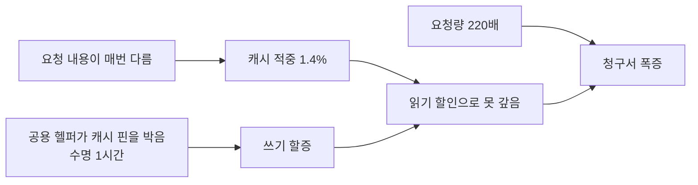

아침에 청구 대시보드를 열었는데 하루치 LLM 비용이 평소의 몇 배였어요. 뭔가 잘못
돌았구나 싶어서 항목을 펼쳤습니다.

그런데 이상했어요. 추론 요청 자체의 입력 토큰과 출력 토큰은 비중이 작았습니다. 청구서의
97.5퍼센트가 "1시간 캐시 쓰기"라는 한 항목이었어요.

캐시라는 단어를 보고 제일 먼저 든 생각이 "캐시 때문에 비용이 늘 수가 있나"였습니다.
캐시는 아끼려고 켜는 거잖아요.

## 캐시 쓰기는 공짜가 아니에요

프롬프트 캐싱이 어떻게 과금되는지부터 다시 봤습니다.

프롬프트 앞부분이 반복될 때, 그 부분을 모델 쪽에 저장해두고 다음 요청에서 재사용하는
기능이에요. 재사용되면 그 토큰은 아주 싸게 계산됩니다. 여기까지가 제가 알고 있던
부분이었어요.

빠뜨린 게 캐시를 **만드는** 비용이었습니다. 저장하는 시점에 일반 입력 토큰보다 비싸게
과금돼요. 그리고 얼마나 오래 살려둘지에 따라 이 할증이 달라집니다. 짧게 두면 덜 비싸고,
길게 두면 더 비싸요.

그러니까 산수가 이렇게 됩니다. 캐시가 적중하면 쓰기 할증을 읽기 할인으로 갚고도 남아요.
안 적중하면 할증만 남습니다. 손익분기가 있는 거예요.

## 적중률이 1.4퍼센트였어요

실제 적중률을 재봤습니다. 1.4퍼센트였어요.

왜 이렇게 낮은지 보려고 어떤 요청이 캐시를 쓰는지 봤습니다. 대부분이 데이터 검증
에이전트였어요. 이 에이전트는 데이터셋을 하나씩 받아서 스키마와 값을 확인합니다.
그러니까 요청마다 프롬프트 내용이 전부 달라요. 앞부분이 같을 일이 없습니다.

즉 이 워크로드에서는 캐시가 원리적으로 적중할 수 없었습니다. 낮은 게 아니라 못 맞히는
거였어요.

## 왜 켜져 있었냐면, 레포 표준이었어요

그럼 왜 켜져 있었나. 코드를 보니 프록시 호출을 감싸는 공용 헬퍼가 있었고, 거기서 캐시
핀을 세 군데에 박고 있었습니다. 시스템 지시, 도구 정의, 메시지 전부요. 수명은 1시간으로
고정이었고요.

```javascript
// 공용 헬퍼 안
bedrock_cache_instructions = "1h"
bedrock_cache_tool_definitions = "1h"
bedrock_cache_messages = "1h"
```

이게 나쁜 결정이었냐면 꼭 그렇지도 않아요. 대화형 에이전트는 시스템 지시와 도구 정의가
매번 똑같습니다. 거기에 캐시를 박으면 크게 아껴요. 실제로 그 용도로 들어간 설정이었고,
그 워크로드에서는 잘 동작했습니다.

문제는 나중에 들어온 검증 에이전트가 같은 헬퍼를 썼다는 거예요. 헬퍼를 쓰면 캐시 핀이
따라옵니다. 호출부에서는 안 보여요.

거기다 마지막 사용자 메시지에까지 캐시 핀이 붙어 있었습니다. 대화형에서는 이게 다음
턴에 재사용되니까 말이 되는데, 단발 요청에서는 저장만 하고 아무도 안 읽어요. 제일 큰
할증이 여기서 났습니다.

## 요청이 220배로 늘어난 것과 겹쳤어요

그날 하필 검증 요청이 평소 25건에서 5,491건으로 늘어 있었습니다. 데이터 소스를 한 번
크게 훑는 작업이 돌았거든요.

적중률 1.4퍼센트에 요청 220배가 겹치니까 청구서가 그 모양이 됐어요. 둘 중 하나만
있었으면 안 보였을 겁니다. 요청이 평소만큼이었으면 할증이 절대액으로 작아서 묻혔을
거고, 캐시가 안 켜져 있었으면 요청이 220배여도 정상 단가라 훨씬 덜 나왔을 거예요.



<span class="figcap">캐시가 나쁜 게 아니라, 적중할 수 없는 워크로드에 상속된 게 문제였어요.</span>

## 제가 처음 말한 절감 폭은 틀렸어요

조치를 정리하면서 "캐싱을 끄면 97.5퍼센트가 절감된다"고 적었습니다. 청구서의 97.5퍼센트가
캐시 쓰기 항목이었으니까요.

이거 틀렸어요. 캐시 쓰기 항목이 통째로 사라지는 게 아니라, 그 토큰들이 **일반 입력
단가로 돌아오는** 겁니다. 캐시 쓰기 단가가 일반 입력의 두 배니까, 실제로 줄어드는 건
그 차액이에요. 절반쯤입니다.

지적받고 나서 49퍼센트로 정정했습니다. 부끄러웠지만 정정하는 게 맞았어요. 비용 절감
수치는 나중에 다른 판단의 근거가 되는데, 두 배 부풀린 숫자가 근거로 남으면 그 위에
쌓이는 결정이 전부 틀어집니다.

수정 자체는 간단했어요. 캐시 핀을 워크로드별로 분리해서, 프롬프트 앞부분이 실제로
반복되는 경로에만 남겼습니다. 발견부터 커밋하고 태그 찍기까지 41분 걸렸어요.

## 진짜 문제는 알림이었습니다

고치고 나서 더 신경 쓰인 건 따로 있었어요. **이걸 왜 아무도 몰랐나.**

찾아보니 비용 알림 리포터가 이미 있었습니다. 30분마다 성실하게 돌고 있었어요. 로그도
남고 있었고요.

그런데 뭘 보고 있었냐면, 원가가 기록되지 않은 레코드가 있는지와 같은 요청이 두 번
청구됐는지였습니다. 둘 다 데이터 정합성 검사예요. 금액 자체에 대한 임계값은 없었습니다.

그러니까 하루 비용이 몇 배가 되는 동안 알림은 매 30분 "이상 없음"을 찍고 있었어요.
거짓말은 아니에요. 자기가 보는 축에서는 정말 이상이 없었으니까요.

이게 관측에서 제일 위험한 형태라고 생각합니다. 알림이 없는 것보다 나빠요. 알림이
없으면 사람들이 불안해서 가끔 들여다보는데, 알림이 있으면 "안 울렸으니 괜찮다"고
믿거든요. 그 믿음이 정확히 어디까지 유효한지는 아무도 확인 안 하고요.

그래서 금액 기준 임계값을 추가했습니다. 그리고 기존 알림 항목들도 다시 훑으면서 "이게
안 울렸다는 게 정확히 뭘 보장하는가"를 한 줄씩 적어뒀어요.

## 돌아보면

제일 크게 남은 건 "이름이 좋은 기능은 검산을 덜 받는다"입니다. 캐시, 압축, 재시도,
풀링 같은 것들이요. 이름에 이미 "좋은 것"이라는 뜻이 들어 있어서, 켜놓고 나서 실제로
이득인지 재보지를 않아요. 저도 그랬습니다.

그리고 공용 헬퍼가 정책을 상속시킨다는 것도요. 헬퍼는 반복을 줄이려고 만드는 건데,
그 안에 기본값이 들어가는 순간 나중에 들어오는 호출자가 그 기본값의 전제를 모른 채
따라갑니다. 대화형에 맞춘 캐시 정책이 단발 배치로 그대로 흘러간 게 그거예요.

마지막으로, 알림이 돌고 있다는 것과 그 알림이 이 사고를 잡는다는 건 완전히 다른
이야기라는 것. 알림 목록을 볼 때 이제는 "무엇에 대해 울리나"보다 "무엇에 대해서는
안 울리나"를 먼저 봅니다.

## 참고한 자료

- [Prompt caching](https://docs.claude.com/en/docs/build-with-claude/prompt-caching) (Anthropic): 캐시 쓰기와 읽기의 단가 차이, 수명 선택이 할증에 미치는 영향
- [Prompt caching for faster model inference](https://docs.aws.amazon.com/bedrock/latest/userguide/prompt-caching.html) (AWS Bedrock): 캐시 지점을 어디에 박는지와 그 비용이 청구서에 어떻게 나타나는지
- [Alerting on SLOs](https://sre.google/workbook/alerting-on-slos/) (Google SRE Workbook): 알림이 무엇을 보장하고 무엇을 보장하지 않는지 설계하기
