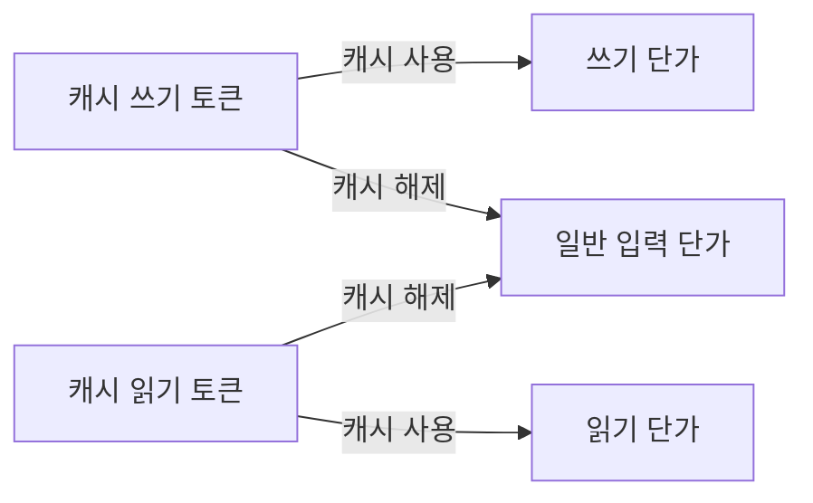

프롬프트 캐시 비용을 검토하면서 같은 청구 항목을 다르게 해석하는 상황을 만났습니다.
캐시 쓰기가 큰 비중을 차지하니 캐시를 끄면 대부분 절약된다는 설명이 있었고,
저는 일반 입력 단가로 돌아오는 비용도 남는다고 봤어요. 어느 쪽이 맞는지 알려면
청구 항목의 이름보다 **캐시를 끈 뒤 같은 토큰이 어디에 청구되는지**부터 계산해야 했습니다.

2026년 8월의 작업 기록과 당시 대화에 남아 있는 출발점입니다. 설정된 TTL을 확인하는
일도 필요했지만, 그 설정을 알기 전에도 분리할 수 있는 문제가 있었어요. 캐시 쓰기
항목의 금액과 캐시 때문에 추가로 지출한 금액은 같지 않습니다.

이 글에서는 그 계산을 끝까지 해보겠습니다. 실제 청구서나 배포 후 절감 성과를 옮기지
않고, 2026년 9월 14일에 만든 가상 토큰 원장을 사용해요. 모델 호출 없이 실행할 수 있는
[전체 계산 코드](/blog/examples/prompt-cache-cost.py)도 함께 두었습니다.

## 비교 기준은 캐시를 끈 동일한 요청이에요

일반 입력 단가를 `p`, 1시간 캐시 쓰기 단가를 `2p`라고 해볼게요. 어떤 토큰을 캐시에
처음 쓰는 데 2달러를 썼다면, 캐시를 끄더라도 그 토큰을 입력으로 처리하는 1달러는
남습니다. 쓰기 항목의 2달러를 전부 절감액으로 빼면 안 돼요.

읽기 쪽에서는 방향이 반대입니다. 캐시에서 싸게 읽었던 토큰도 캐시를 끄면 일반
입력으로 돌아와요. 쓰기 할증은 사라지지만 읽기 할인도 함께 사라집니다.



계산에 쓸 단가는 Claude API의 Sonnet 4.5 표준 요금으로 고정했습니다. 2026년 9월
14일 확인 기준이며, 금액 단위는 100만 토큰당 미국 달러입니다. Batch 할인, 지역
할증, 도구 사용료와 세금은 포함하지 않습니다. 다른 모델이나 Bedrock에 적용할 때는
해당 모델과 제공자의 단가로 바꿔야 해요. [Anthropic 요금표](https://platform.claude.com/docs/en/about-claude/pricing)

| 토큰 항목 | 기호 | 100만 토큰당 단가 |
| --- | --- | ---: |
| 일반 입력 | U | $3.00 |
| 5분 캐시 쓰기 | W5 | $3.75 |
| 1시간 캐시 쓰기 | W1 | $6.00 |
| 캐시 읽기 | R | $0.30 |
| 출력 | O | $15.00 |

같은 요청과 출력을 유지한다는 조건에서 두 비용은 이렇게 됩니다.

```text
캐시 사용 = (3U + 3.75W5 + 6W1 + 0.3R + 15O) / 1,000,000
캐시 해제 = (3(U + W5 + W1 + R) + 15O) / 1,000,000

캐시 사용 - 캐시 해제 = (0.75W5 + 3W1 - 2.7R) / 1,000,000
```

마지막 줄이 양수면 해당 원장에서 캐시 사용이 더 비쌉니다. 일반 입력과 출력은 동일하게
유지했으므로 차이에서 빠졌어요. 캐시 읽기가 많으면 음수가 될 수 있고, 그때 캐시를
끄면 비용이 늘어납니다.

## 같은 100번의 요청으로 세 가지 원장을 만들었어요

요청마다 일반 입력 1,000토큰, 캐시 후보 접두사 10,000토큰, 출력 200토큰을 처리한다고
가정했습니다. 100번이면 입력은 총 110만 토큰, 출력은 2만 토큰이에요. 내용이 매번
달라지는 경우와 같은 접두사를 재사용하는 경우를 각각 계산했습니다.

아래 세 행은 모두 **가상 입력값을 계산한 결과**입니다. 캐시 서버의 실제 적중을
측정한 표가 아니에요. 특히 두 번째 행은 첫 쓰기 후 나머지 요청이 캐시가 유효한 동안
같은 접두사를 읽었다는 조건입니다.

| 조건 | W5 | W1 | R | 캐시 사용 | 캐시 해제 |
| --- | ---: | ---: | ---: | ---: | ---: |
| 매번 1시간 캐시 쓰기 | 0 | 1,000,000 | 0 | $6.600 | $3.600 |
| 처음 한 번 쓰고 99번 읽기 | 0 | 10,000 | 990,000 | $0.957 | $3.600 |
| TTL이 섞인 원장 | 80,000 | 20,000 | 900,000 | $1.290 | $3.600 |

첫 번째 행의 캐시 쓰기 청구액은 6달러입니다. 그런데 캐시를 끄면 줄어드는 금액은
3달러예요. 같은 접두사 토큰을 일반 입력으로 처리하는 3달러가 남기 때문입니다.
전체 비용도 6.60달러에서 3.60달러가 되므로, 쓰기 항목의 비중을 그대로 전체 절감률로
옮길 수 없어요.

두 번째 행에서는 캐시를 끄는 쪽이 더 비쌉니다. 첫 쓰기 비용만 보면 비싼 정책이지만,
그 뒤의 읽기 할인이 그 비용을 충분히 갚았습니다. 그래서 비용 검토에는 쓰기뿐 아니라
읽기도 필요합니다.

## 적중률이 같아도 결론은 반대가 됩니다

이번에는 **필요한 접두사가 이미 캐시에 있는 상태에서 시작한 두 요청의 관찰 구간**을
비교합니다. 앞서 캐시를 만든 비용은 이 두 요청 원장 밖에 있으므로, 캐시 전체 수명의
손익을 계산하는 예제는 아니에요. 요청 두 번 중 한 번이 적중했다면 요청 기준 적중률은
50퍼센트입니다. 하지만 적중한 요청과 실패한 요청의 토큰 수가 다르면 구간 내 비용
결과는 달라집니다.

| 1시간 캐시를 쓰는 두 요청 | 읽기 토큰 | 쓰기 토큰 | 캐시 사용 | 캐시 해제 |
| --- | ---: | ---: | ---: | ---: |
| 긴 요청은 적중, 짧은 요청은 쓰기 | 100,000 | 10,000 | $0.090 | $0.330 |
| 짧은 요청은 적중, 긴 요청은 쓰기 | 10,000 | 100,000 | $0.603 | $0.330 |

일반 입력과 출력은 이 작은 비교에서 0으로 두었습니다. 총 토큰 수도, 적중한 요청
개수도 같습니다. 첫 행에서는 캐시가 이득이고 두 번째 행에서는 손해예요.

그러니 “적중률이 얼마 이상이면 켠다”는 규칙을 만들려면 그 적중률의 분모부터 정해야
합니다. 요청 개수만 있으면 긴 실패 한 번과 짧은 적중 한 번의 비용을 구별하지 못해요.
이 원장에서는 `W5`, `W1`, `R`의 토큰 수를 직접 합산하는 편이 명확했습니다.

## 원장의 입력도 검증해야 해요

Claude Messages 응답의 `input_tokens`는 캐시 읽기나 쓰기를 포함한 전체 입력이
아닙니다. `cache_creation_input_tokens`는 쓰기 합계이고, TTL별 내역은
`cache_creation`에 들어갑니다. 합계와 내역을 모두 더하면 쓰기를 두 번 세게 돼요.
[응답 usage 설명](https://platform.claude.com/docs/en/build-with-claude/prompt-caching#tracking-cache-performance)

```python
usage = {
    "input_tokens": 100_000,
    "cache_creation_input_tokens": 100_000,
    "cache_creation": {
        "ephemeral_5m_input_tokens": 80_000,
        "ephemeral_1h_input_tokens": 20_000,
    },
    "cache_read_input_tokens": 900_000,
    "output_tokens": 20_000,
}
```

위 객체는 **앞에서 만든 100개 가상 요청의 usage를 필드별로 합산한 값**입니다.
단일 API 응답이나 110만 토큰짜리 요청이 아니에요. 각 요청의 입력은 11,000토큰으로
유지했습니다. `80,000 + 20,000 = 100,000`인지 검사한 뒤 쓰기 합계는 검산에만 씁니다. 전체 입력은
`100,000 + 100,000 + 900,000 = 1,100,000`토큰이에요.

쓰기 합계만 있고 TTL 구분이 없다면 이 요금표에서는 가격을 하나로 확정할 수 없습니다.
계산 코드는 그런 입력을 오류로 처리해요. 애플리케이션의 기본값이 짧다고 해서, 실제
청구된 쓰기를 전부 짧은 TTL로 간주하지 않았습니다.

Bedrock Converse는 `inputTokens`, `cacheWriteInputTokens`, `cacheReadInputTokens`,
`cacheDetails`처럼 필드 이름이 다릅니다. 아래 코드는 Claude Messages 형식을 받으므로
Converse 응답을 그대로 넣지 않습니다. 청구 제공자의 필드 정의에 맞게 먼저 변환해야 해요.
[AWS의 캐시 사용량 설명](https://docs.aws.amazon.com/bedrock/latest/userguide/prompt-caching.html)

## 몇 번 재사용해야 쓰기 비용을 갚을까요

크기가 같은 접두사를 한 번 쓰고, 만료 전 `n`번 읽는 경우로 좁혀볼게요. 일반 입력
단가를 1로 놓으면 이 글의 요금에서 읽기는 0.1입니다.

```text
1시간 캐시: 2 + 0.1n < 1 + n
            n > 1 / 0.9
            최소 2번의 읽기 필요

5분 캐시:   1.25 + 0.1n < 1 + n
            n > 0.25 / 0.9
            최소 1번의 읽기 필요
```

1시간 캐시에서 “두 번”은 최초 쓰기까지 합쳐 두 요청이라는 뜻이 아닙니다. 한 번 쓰고
두 번 읽는 총 세 요청이에요. 접두사가 바뀌거나 만료되어 다시 쓰면 쓰기 비용도 다시
들어가므로, 이 식을 하루 전체 요청 횟수에 그대로 적용하면 안 됩니다.

TTL을 늘릴지는 이 재사용 간격과 함께 판단해야 합니다. 같은 접두사를 짧은 간격으로
계속 읽는다면 긴 TTL의 추가 비용을 낼 이유가 줄어들고, 긴 간격의 재사용이 실제로
있다면 긴 TTL을 비교할 수 있어요. 캐시 적중 시 수명이 갱신된다는 동작도 같이 확인해야
합니다. [캐시 수명 설명](https://platform.claude.com/docs/en/build-with-claude/prompt-caching#1-hour-cache-duration)

## 계산 코드에서 확인한 것

[전체 파일](/blog/examples/prompt-cache-cost.py)을 내려받아 Python 3.10 이상에서 실행할 수
있습니다. 표의 원장과 기대 금액을 대조하고, 적중률 반례와 TTL 내역 누락을 검사해요.

```sh
python3 prompt-cache-cost.py
```

```text
all_miss_1h: cached=$6.600, no_cache=$3.600, delta=$+3.000
one_write_99_reads: cached=$0.957, no_cache=$3.600, delta=$-2.643
mixed_ttl: cached=$1.290, no_cache=$3.600, delta=$-2.310
large_hit_small_miss: cached=$0.090, no_cache=$0.330, delta=$-0.240
small_hit_large_miss: cached=$0.603, no_cache=$0.330, delta=$+0.273
PASS: baseline, mixed TTL, hit-rate counterexample, usage validation, break-even
```

검증한 것은 같은 사용량을 다른 단가로 계산하는 방법입니다. 실제 캐시 적중, 응답
지연, 배포 후 청구 감소를 검증한 것은 아니에요. 트래픽이나 출력 길이가 달라진 날을
비교하려면 그 변화도 따로 계산해야 합니다.

처음의 질문으로 돌아가면, 캐시 쓰기 항목을 없애는 것만으로 그 금액을 전부 아끼지는
못합니다. 비용을 비교하려면 쓰기와 읽기가 일반 입력으로 돌아오는 원장을 만들어야
해요. 이 구분을 하고 나니 캐시를 켤지 끌지보다 먼저 어떤 사용량이 빠져 있는지를
확인할 수 있었습니다.

## 참고한 자료

- [Pricing](https://platform.claude.com/docs/en/about-claude/pricing) (Anthropic): 2026-09-14 확인한 Sonnet 4.5 표준 토큰 단가
- [Prompt caching](https://platform.claude.com/docs/en/build-with-claude/prompt-caching) (Anthropic): 입력과 캐시 사용량 필드, TTL 구분과 갱신
- [Prompt caching for faster model inference](https://docs.aws.amazon.com/bedrock/latest/userguide/prompt-caching.html) (AWS): Bedrock Converse의 토큰 필드와 TTL 내역
