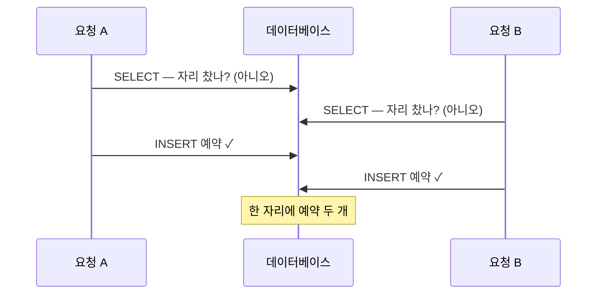

예약 시스템에서 두 사용자가 거의 같은 순간에 같은 자리를 예약했는데 — 코드가 DB
트랜잭션 안에서 돌고 중복 체크까지 먼저 했는데도 — *둘 다* 성공했다. 본능은
"트랜잭션이 잡았어야지"다. 안 잡았고, 왜 안 잡았는지 이해하는 게 전부다.

> **TL;DR** — check-then-insert에는 트랜잭션만으로 못 닫는 레이스 윈도우가 있다.
> 상호배제가 필요하다. 트랜잭션 *전에* 획득하는 Redis 락(`SETNX`)이 동작한다 —
> 하지만 바로 이 버그엔 DB **unique 제약**이 더 견고한 해법인 경우가 많다. 문제가
> 실제로 부르는 도구가 뭔지 알아야 한다.

## 트랜잭션이 구해주지 못하는 이유

예약 로직은 check-then-act다. *이 자리 찼나? 아니오 → 예약을 insert.* 트랜잭션으로
감싸도 여전히 레이스가 난다. 두 요청 모두 어느 쪽이 insert 하기 전에 check를 하기
때문이다.


<span class="figcap">두 읽기가 어느 쓰기보다 먼저 일어난다. 어느 트랜잭션도 상대의 미커밋 insert를 못 본다(READ COMMITTED든 REPEATABLE READ든) — 그래서 둘 다 자리가 비었다고 믿는다.</span>

트랜잭션은 *스냅샷의* 원자성과 격리를 주지, check-then-act 시퀀스 전체에 대한
상호배제를 주지 않는다. 두 요청이 같은 임계 구역을 동시에 돌고 있는데, 아무것도
이들을 직렬화하지 않는다.

## 해법: 분산락으로 상호배제

여러 서버에 걸치면 프로세스 내 락은 무용하다 — 요청이 다른 머신에 있을 수 있다.
이들이 *공유하는* 락이 필요하다. Redis가 자연스러운 건 명령을 단일 스레드로 순차
처리하고 `SET key val NX`가 원자적이기 때문이다. 정확히 한 호출자만 이긴다.

중요한 순서: **락을 트랜잭션 전에 획득하고, `finally`에서 해제한다.**

```text
1. SET lock:slot:{id} <token> NX PX <ttl>   // 원자적 획득
2. 획득 실패 → 거절 (다른 요청이 자리를 쥠)
3. BEGIN 트랜잭션
4.   check + insert
5. COMMIT
6. finally → 락 해제 (토큰 일치할 때만)      // 남의 락 풀지 않기
```

동작과 고장을 가르는 디테일 둘:

- **TTL은 필수다.** 획득과 해제 사이에 소유자가 죽으면, TTL이 자리를 영원히
  데드락시키는 대신 락을 풀어준다.
- **자기 락만 해제한다.** 토큰을 저장하고 삭제 전에 확인하라. 안 그러면 TTL이 만료된
  느린 요청이 *다른* 요청의 락을 지울 수 있다.

## 정직한 한계 (그리고 이 버그의 더 나은 해법)

이제 단일 Redis가 단일 장애점이다. Redis를 클러스터로 묶으면, 풀려던 바로 그 문제가
되살아난다. 서로 불일치할 수 있는 노드들에 걸쳐 락을 조율하는 것. 그게
**[RedLock](https://redis.io/docs/latest/develop/use/patterns/distributed-locks/)**이
다루는 것이고 — 진짜로 논쟁적이다(Kleppmann의
[비판](https://martin.kleppmann.com/2016/02/08/how-to-do-distributed-locking.html)
참고). 분산 락은 보이는 것만큼 간단한 적이 없다.

그래서 *바로 이 버그*엔 DB부터 손이 간다.

| 접근 | 언제 최선인가 |
|---|---|
| 자리에 **`UNIQUE` 제약** | 불변식이 "자리당 한 행"일 때 — DB가 강제하게. 가장 단순, 레이스 불가능. |
| `SELECT … FOR UPDATE`(행 락) | 같은 행을 read-then-write 원자적으로 해야 할 때. |
| `SERIALIZABLE` 격리 | DB가 충돌을 감지해 한 트랜잭션을 abort하게 하고 싶을 때. |
| **Redis 분산락** | 임계 구역이 DB 너머로 걸칠 때(외부 호출, 여러 저장소). |

중복 예약엔 `(slot_id)` unique 인덱스가 두 번째 insert를 구조적으로 실패시킨다 — 락도,
레이스도, 튜닝할 TTL도 없다. 임계 구역이 진짜로 한 테이블보다 클 때 분산락을 꺼내라.

## 다른 엔지니어에게 해줄 말

1. **트랜잭션은 격리하지, check-then-act를 직렬화하지 않는다.** 해법을 고르기 전에
   레이스를 명시적으로 이름 붙여라.
2. **불변식을 데이터에 최대한 가깝게 밀어라.** 운영해야 하는 락보다 unique 제약이
   낫다.
3. **락을 써야 한다면 디테일을 지켜라** — 크래시를 견딜 TTL, 남의 락을 안 푸는 토큰,
   그리고 클러스터 모드 합의에 대한 맑은 눈.

---

## 참고자료 & 더 읽을거리

- Redis — *Distributed Locks with Redis (Redlock)*. [문서](https://redis.io/docs/latest/develop/use/patterns/distributed-locks/)
- M. Kleppmann — *How to do distributed locking*(Redlock 비판). [글](https://martin.kleppmann.com/2016/02/08/how-to-do-distributed-locking.html)
- PostgreSQL — *Transaction Isolation*. [문서](https://www.postgresql.org/docs/current/transaction-iso.html)
- M. Kleppmann — *Designing Data-Intensive Applications*(7장, 약한 격리 & 레이스 컨디션).
