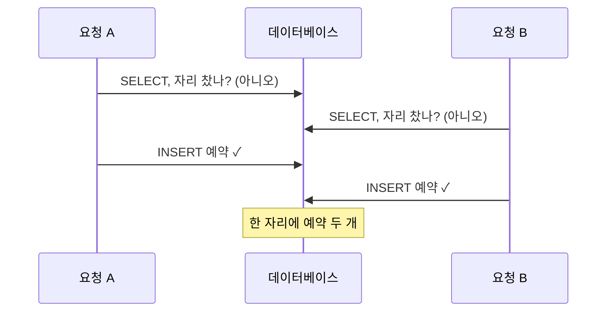

두 사용자가 거의 같은 순간에 같은 자리를 예약했는데, 둘 다 성공 응답을 받았어요. 예약
코드는 insert 전에 자리가 찼는지 체크했고, 전체가 DB 트랜잭션 안에서 돌았습니다. 제 첫
반응은 아마 지금 여러분과 같았을 거예요. 트랜잭션이 잡았어야 하는 거 아닌가.

중복 체크가 트랜잭션 안에 있다는 사실만으로 두 요청이 직렬화되지는 않았어요.
어떤 제약과 격리 수준이 이 불변식을 지키는지 따로 봐야 했습니다.

## 트랜잭션이 저를 구해주지 못한 이유

예약 로직은 check-then-act예요. 이 자리 찼나 확인하고, 안 찼으면 예약을 insert 합니다.
이걸 트랜잭션으로 감싸도 여전히 레이스가 나요. 두 요청 모두 어느 쪽이 insert 하기 전에
check를 하기 때문이에요.


<span class="figcap">두 읽기가 어느 쓰기보다 먼저 일어나요. 어느 트랜잭션도 상대의 미커밋 insert를 못 보니까(READ COMMITTED든 REPEATABLE READ든), 둘 다 자리가 비었다고 믿습니다.</span>

문제는 트랜잭션 자체가 아니라, 중복을 막을 제약 없이 읽기 결과에만 기대던 흐름이었어요.
위 그림은 두 트랜잭션이 빈자리를 각각 읽을 수 있는 조건을 가정합니다. `SERIALIZABLE`이나
적절한 잠금을 사용하면 달라지고, 충돌로 중단된 트랜잭션을 재시도하는 처리도 필요해요.
당시 DB와 드라이버의 정확한 버전, 격리 설정은 이 글에 남아 있지 않아 모든 DB의 동작으로
일반화하지는 않겠습니다.

## 해법은 분산락으로 상호배제하는 것이었어요

여러 서버에 걸치면 프로세스 내 락은 무용합니다. 두 요청이 메모리를 공유하지 않는 다른
머신에 있을 수 있으니까요. 둘 다 보는 락이 필요해요. Redis가 자연스러운 건 두 가지
이유입니다. 명령을 단일 스레드로 순서대로 처리하고, `SET key value NX`가 원자적이라
정확히 한 호출자만 키를 이길 수 있어요. 가장 중요한 순서는 이거예요. 락을 트랜잭션
전에 획득하고, `finally`에서 해제합니다.

```text
1. acquired = SET lock:seat:{id} <token> NX PX <ttl>   // 원자적 획득
2. 획득 실패 → 거절 (다른 요청이 이 자리를 쥐고 있음)
3. BEGIN 트랜잭션
4.   check + insert
5. COMMIT
6. finally → 토큰이 아직 일치할 때만 락 해제
```

동작하는 락과 미묘하게 고장난 락을 가르는 디테일이 둘 있어요. 하나는 TTL이 필수라는
거예요. 소유자가 3번과 6번 사이에 죽으면, TTL이 그 자리를 영원히 데드락시키는 대신 락을
풀어줍니다. 다른 하나는 자기 락만 해제해야 한다는 거고요. 고유 토큰을 저장하고 삭제 전에
검증해야 해요. 비교와 삭제는 Lua 스크립트 등으로 하나의 원자적 연산으로 수행해야 합니다.
따로 읽고 지우면 그 사이 소유자가 바뀔 수 있어요.

이것만으로 작업 전체가 안전해지는 것은 아닙니다. TTL이 만료돼도 이전 소유자의 DB 작업은
계속될 수 있고, 새 소유자와 쓰기가 겹칠 수 있어요. 소유 토큰은 남의 락 삭제를 막는 장치이고,
중복 예약 자체는 DB 제약으로 막는 편이 명확합니다.

## 정직한 한계, 그리고 제가 실제로 고를 해법

이제 단일 Redis가 단일 장애점이에요. 그걸 고치려고 Redis를 클러스터로 묶으면, 풀려던
바로 그 문제가 되살아납니다. 장애 전환 중 락의 소유 상태를 어떻게 보존할지의 문제예요.
독립된 여러 Redis 인스턴스에 락을 잡는 [Redlock](https://redis.io/docs/latest/develop/use/patterns/distributed-locks/)은 일반 Redis Cluster와 같은 구성이 아닙니다. 가정과 한계를 다룬 Kleppmann의
[비판](https://martin.kleppmann.com/2016/02/08/how-to-do-distributed-locking.html)은
꼭 읽어보세요. 분산 락은 처음 보이는 것만큼 간단한 적이 없어요.

그래서 바로 이 버그에는 Redis보다 DB부터 손이 갑니다.

| 접근 | 언제 최선인가 |
|---|---|
| 자리에 `UNIQUE` 제약 | 자리와 시간대 조합의 중복 행을 막을 때. 필수 키와 제약 위반 응답 처리가 필요해요. |
| `SELECT … FOR UPDATE` (행 락) | 모든 예약자가 같은 기존 좌석 행을 잠그고 확인할 때. 없는 예약 행만 조회하는 것으로는 부족해요. |
| `SERIALIZABLE` 격리 | DB가 스스로 충돌을 감지해 한 트랜잭션을 abort하게 하고 싶을 때 |
| Redis 분산락 | 임계 구역이 DB 너머로 걸칠 때. 외부 API 호출이나 여러 데이터 저장소요. |

중복 예약에는 `(seat_id, time_slot)` unique 인덱스가 두 번째 insert를 구조적으로
거절하게 할 수 있어요. 이 설명은 좌석과 시간대가 필수 값이고, 그 조합당 예약 하나라는
단순한 모델을 전제로 합니다. 취소와 재예약 규칙이 있으면 제약도 그 규칙에 맞춰야 해요.

당시에는 Redis 락을 적용했지만, 지금 같은 문제를 설계한다면 DB가 중복을 거절하도록
만드는 것부터 검토하겠어요. 당시 선택에서 UNIQUE 제약을 바로 쓰지 않은 구체적인 제약은
기록에 남아 있지 않습니다. 그래서 Redis가 필요했던 사례라고까지 주장하지는 않아요.

검증할 때도 성공 응답 수만 세면 부족합니다. 같은 좌석과 시간대에 두 요청을 동시에 보내고,
최종 예약 행이 하나인지, 다른 요청이 제약 위반을 사용자에게 올바르게 돌려주는지 봐야 해요.
락을 쓴다면 작업 중 TTL이 끝나는 경우도 별도로 확인해야 합니다. 당시 수정 후의 부하 시험
결과는 남아 있지 않아 여기에 수치를 붙이지 않았어요.

## 참고한 자료

- Redis, [Distributed Locks with Redis (Redlock)](https://redis.io/docs/latest/develop/use/patterns/distributed-locks/)
- M. Kleppmann, [How to do distributed locking](https://martin.kleppmann.com/2016/02/08/how-to-do-distributed-locking.html) (Redlock 비판)
- PostgreSQL, [Transaction Isolation](https://www.postgresql.org/docs/current/transaction-iso.html)
- M. Kleppmann, [Designing Data-Intensive Applications](https://dataintensive.net/) (7장, 약한 격리와 레이스 컨디션)
