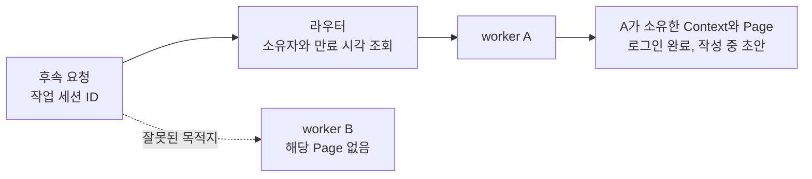

스크래핑 서비스에서 로그인과 데이터 수집은 요청 하나로 끝나지 않았습니다. 첫 요청에서
사이트에 로그인하고, 다음 요청에서 대시보드를 읽고, 그다음 요청에서 상세 정보를 더
가져와야 했어요. 뒤의 요청들도 앞에서 로그인한 브라우저를 사용해야 했습니다.

서버가 하나일 때는 그 서버가 보관한 브라우저를 찾으면 됐습니다. 고객사가 늘어 서버를
추가하자 요청이 다른 서버에 도착할 수 있게 됐어요. 로그인은 A에서 했는데 후속 요청이
B로 가면, B에는 그 요청을 이어갈 브라우저가 없었습니다. 이것이
[2025년 8월 20일 원문](https://velog.io/@imkkuk/Stateful-%EC%84%9C%EB%B2%84-%ED%99%95%EC%9E%A5%ED%95%98%EA%B8%B0Session-Aware-Routing%EC%9C%BC%EB%A1%9C-%EB%B8%8C%EB%9D%BC%EC%9A%B0%EC%A0%80-%EC%84%B8%EC%85%98-%EC%9D%BC%EA%B4%80%EC%84%B1-%EC%9C%A0%EC%A7%80%ED%95%98%EA%B8%B0)에 적었던 문제입니다.

당시 선택은 세션 ID로 브라우저의 소유 서버를 찾아주는 라우팅이었습니다. 이번에는 그
선택이 무엇을 해결하는지, 어디부터는 해결하지 못하는지 실제 브라우저로 확인했습니다.
로그인한 페이지에서 작업을 시작한 뒤 잘못된 서버와 소유 서버로 각각 요청을 보내고,
매핑 만료와 소유 서버 종료도 따로 시험했어요.

아래 결과는 2026년 9월 14일의 독립 로컬 실험입니다. Node 24.15.0, Playwright 1.56.1,
Chromium 141.0.7390.37을 사용했습니다. 대상 사이트와 로그인은 예제 안에서 만든
모의 서비스이며, 당시 회사 시스템이나 운영 로그를 재현한 것은 아닙니다.

## 같은 세션 ID가 같은 브라우저를 만들어주지는 않았어요

[전체 실행 코드](/blog/examples/browser-session-routing.mjs)는 A와 B를 서로 다른 Node
프로세스로 띄웁니다. 각 worker는 전용 headless Chromium을 실행하고, 세션을 만들 때
임시 `BrowserContext`와 `Page`를 생성해요. 사용자 브라우저나 기존 프로필은 사용하지 않습니다.

A에 새 작업을 요청하면 실제 페이지에서 다음 순서가 실행됩니다.

```javascript
const page = await context.newPage();
await page.goto(`${targetUrl}/login`);
await page.getByRole('button', { name: 'Sign in as demo' }).click();
await page.waitForURL(`${targetUrl}/workspace`);
await page.getByRole('textbox', { name: 'Report draft' }).fill(input.draft);
const sessionId = randomUUID();
sessions.set(sessionId, { context, page });
```

모의 사이트는 로그인 버튼을 누르면 쿠키를 발행합니다. 해당 쿠키로 접근한 workspace에만
로그인 표시와 입력란을 보여줘요. 입력한 `July report, step 2`는 아직 제출하지 않은 초안입니다.
대상 서버에도, 라우터에도 저장하지 않았습니다. **열려 있는 Page의 입력값**으로 남습니다.

여기서 같은 이름으로 부르기 쉬운 것들을 나눌 필요가 있었습니다.

| 구분 | 이 실험에서 하는 일 |
| --- | --- |
| 대상 사이트의 로그인 | 해당 사이트가 쿠키를 보고 workspace 접근을 허용 |
| worker의 작업 세션 | 세션 ID로 실제 `context`, `page` 객체를 보관 |
| 라우팅 매핑 | 세션 ID에 대응하는 worker 이름과 만료 시각을 보관 |

클라이언트가 후속 요청에 넣는 것은 작업 세션 ID입니다. 그 문자열을 전달한다고 B에
A의 `Page` 객체가 생기지는 않습니다. 로그인한 계정이 같다는 사실만으로 지금 열어둔
페이지의 작성 중 입력까지 생기는 것도 아니고요.

원문에서는 Playwright의 WebSocket 연결마다 독립 브라우저가 생성된다고 설명했는데,
그것은 일반적인 API 제약이 아니었습니다. [`browserType.connect()`](https://playwright.dev/docs/api/class-browsertype#browser-type-connect)는
기존 브라우저에 연결할 수 있고, [인증 상태를 저장해 새 context에서 재사용하는 방법](https://playwright.dev/docs/auth)도
지원합니다. 이번 실험의 조건은 브라우저 공유가 불가능하다는 것이 아니라, **worker가
자기 Page를 소유하고 후속 작업을 실행하는 구조**입니다.

## B는 페이지를 못 찾았고, A는 작성 중인 값을 읽었어요

먼저 A에서 세션을 만든 뒤 같은 ID를 B로 직접 보냈습니다. B는 자기 세션 목록에서
그 ID를 찾지 못해 `404 SESSION_NOT_OWNED`를 반환했습니다.

```javascript
const session = sessions.get(id);
if (!session) return { status: 404, body: { error: 'SESSION_NOT_OWNED', worker: name } };
```

이 검사가 먼저 필요한 이유는, 뒤의 작업이 문자열이나 DB 레코드 조회가 아니기 때문입니다.
worker는 자신이 보관한 실제 `Page`에서 로그인 표시와 입력값을 읽습니다.

```javascript
authenticated: await session.page.getByRole('heading', { name: 'Signed in as demo' }).isVisible(),
page: new URL(session.page.url()).pathname,
draft: await session.page.getByRole('textbox', { name: 'Report draft' }).inputValue(),
```

B에서 실패한 다음에는 라우터에 같은 ID를 보냈습니다. 라우터는 세션 생성 시 기록한
소유자 A를 찾아 그 worker로 HTTP 요청을 전달했어요.



<span class="figcap">요청의 목적지를 바꿨습니다. 라우터가 브라우저 상태를 복사하거나 대신 실행한 것은 아닙니다.</span>

두 경로의 실제 출력은 다음과 같습니다. 상태 코드는 이 예제에서 정한 응답입니다.

```text
WRONG_WORKER: 404 SESSION_NOT_OWNED
OWNER: 200 authenticated=true draft="July report, step 2"
```

A가 돌려준 초안은 라우터에 넣어둔 문자열이 아닙니다. 로그인 후 열린 페이지에서
`inputValue()`로 읽은 값이에요. 따라서 이 검사에서는 ID가 맞게 연결됐는지뿐 아니라,
후속 요청이 실제 진행 중인 브라우저 작업에 도달했는지도 확인했습니다.

## 매핑이 만료되어도 페이지는 살아 있었어요

라우터의 매핑에는 브라우저 상태가 없습니다. 저장하는 것은 이 정도예요.

```javascript
{ worker: 'A', expiresAt: Date.now() + ttlMs }
```

소유 서버를 찾기 전에 만료 여부를 확인합니다. 이 예제의 후속 요청은 매핑이 없거나
만료되면 다른 서버를 임의로 선택하지 않고 실패 응답을 반환해요.

```javascript
if (!owner) return json(res, 404, { error: 'MAPPING_MISSING' });
if (owner.expiresAt <= Date.now()) return json(res, 410, { error: 'MAPPING_EXPIRED' });
destination = workers[owner.worker];
```

검증에서는 두 번째 세션의 매핑 TTL을 50ms로 설정하고 75ms를 기다렸습니다. 라우터를
통한 요청은 `410`이 됐지만, A를 직접 조회하자 여전히 같은 Page에서 초안을 읽었습니다.

```text
EXPIRED_MAPPING: 410 MAPPING_EXPIRED; owner still reads the live Page
```

**매핑의 유효기간과 브라우저의 수명은 별개**였습니다. 매핑의 유효기간이 끝났다고
브라우저가 자동으로 정리되지는 않았어요. 실제 서비스에서 둘의 수명을 맞추려면 세션 정리
규칙이 추가로 필요합니다. 이 실험은 그 정리를 구현한 결과가 아니라, 두 수명이 저절로
같아지지 않는 것을 확인한 결과입니다.

여기서는 만료 시각을 로컬 Map에 저장했습니다. Redis의 TTL 삭제, 복제 지연, 장애 전환을
검증한 것은 아닙니다. 제어 화면의 만료 버튼은 마감 시각을 과거로 바꾸며, 자동 검증은
실제로 시간을 기다린 뒤 동일한 만료 조건을 검사합니다.

## 주소를 B로 바꾸어도 작업은 복구되지 않았습니다

다음에는 A의 브라우저를 닫고 A의 HTTP 서버와 프로세스를 종료했습니다. 첫 번째 세션의
매핑은 아직 A를 가리키도록 남겨뒀어요. 후속 요청은 연결할 소유 서버가 없어 실패했습니다.

이제 매핑의 주소만 B로 바꾸면 어떨까요. B는 응답할 수 있는 서버지만 기존 세션의
`Page`는 가지고 있지 않았습니다.

```text
STOPPED_OWNER: 502 OWNER_UNAVAILABLE
REMAPPED_TO_B: 404 SESSION_NOT_OWNED
```

네트워크 연결 실패가 세션 없음으로 바뀌었을 뿐, 중단된 작업이 이어지지는 않았습니다.
주소 매핑에는 로그인한 context나 열려 있던 페이지, 작성 중인 입력이 없기 때문이에요.

마지막으로 B에서 같은 모의 계정으로 새로 로그인했습니다. 로그인은 성공했지만 새
workspace의 입력란은 비어 있었고, 새 작업 세션 ID가 만들어졌습니다.

```text
NEW_LOGIN_ON_B: 201 authenticated=true draft=""; new session
```

재로그인은 새 작업을 시작할 수 있게 했습니다. 작성 중이던 초안을 복구하지는 않았어요.
이 초안은 의도적으로 페이지 안에만 두었습니다. 대상 서비스가 초안을 서버에 저장하거나,
필요한 작업 상태를 별도로 보존했다면 복구 방법은 달라질 수 있습니다.

## 어디까지 확인했는지 남겨둡니다

이번 실험에서 바꾼 것은 후속 요청의 목적지였습니다. 라우터를 거치자 로그인과 초안이
남아 있는 A의 Page에 도달했습니다. 매핑 만료는 살아 있는 Page를 지우지 않았고,
소유 서버 종료 뒤 주소만 바꾸는 것으로는 그 Page를 되살릴 수 없었습니다.

시험한 종료는 worker가 브라우저까지 정리하는 제어된 종료입니다. 호스트 장애, 강제 종료
뒤 남은 브라우저 프로세스, 재시작 복구는 시험하지 않았어요. 두 요청이 같은 Page를 동시에
조작할 때의 순서나 충돌도 이 코드의 검증 범위 밖입니다.

원래 문제로 돌아가면, 세션 ID만 있어서는 후속 수집이 이어지지 않았습니다. 그 ID가
가리키는 브라우저가 어디에 있고 누가 작업을 수행하는지까지 연결해야 했어요. 라우팅으로
해결한 부분은 그 연결입니다. 이미 사라진 브라우저 작업을 다시 만드는 일은 별도의
상태 보존과 재시작 설계가 필요했습니다.

## 직접 실행하기

[실행 파일](/blog/examples/browser-session-routing.mjs)을 빈 디렉터리에 내려받고 아래
명령을 실행합니다. 예제 전용 의존성을 설치하며, Chromium 최초 다운로드가 필요해요.

```sh
npm install --save-exact playwright@1.56.1
npx playwright install chromium
node browser-session-routing.mjs --self-test
```

자동 검증은 실제 worker API를 호출하고 브라우저에서 읽은 값과 응답 코드를 검사합니다.
완료되면 테스트 서버와 브라우저를 정리하고 다음 문장을 출력합니다.

```text
PASS: browser ownership, routing, mapping expiry, owner stop, address-only remap, new login
```

`--self-test` 없이 실행하면 `http://127.0.0.1:47320`에서 같은 요청을 보내는 제어 화면을
열 수 있습니다. 세션 생성, 잘못된 worker 요청, 소유자 라우팅, 만료, 종료, 재매핑을
버튼으로 확인할 수 있어요. 모든 서버는 loopback 주소에만 바인딩합니다.

## 참고한 자료

- [Stateful 서버 확장하기](https://velog.io/@imkkuk/Stateful-%EC%84%9C%EB%B2%84-%ED%99%95%EC%9E%A5%ED%95%98%EA%B8%B0Session-Aware-Routing%EC%9C%BC%EB%A1%9C-%EB%B8%8C%EB%9D%BC%EC%9A%B0%EC%A0%80-%EC%84%B8%EC%85%98-%EC%9D%BC%EA%B4%80%EC%84%B1-%EC%9C%A0%EC%A7%80%ED%95%98%EA%B8%B0) (2025년 8월 20일 원문): 로그인 세션을 공유하는 후속 요청과 서버 확장에서 시작한 문제
- [BrowserType.connect](https://playwright.dev/docs/api/class-browsertype#browser-type-connect) (Playwright): 기존 브라우저에 연결하는 API
- [BrowserContext](https://playwright.dev/docs/api/class-browsercontext) (Playwright): 독립 브라우저 세션과 context 안의 Page
- [Authentication](https://playwright.dev/docs/auth) (Playwright): 인증 상태 저장과 새 context에서의 재사용
- [실행 코드](/blog/examples/browser-session-routing.mjs) (이 글): 실제 브라우저를 소유한 worker, 라우터와 경계 조건 검증
