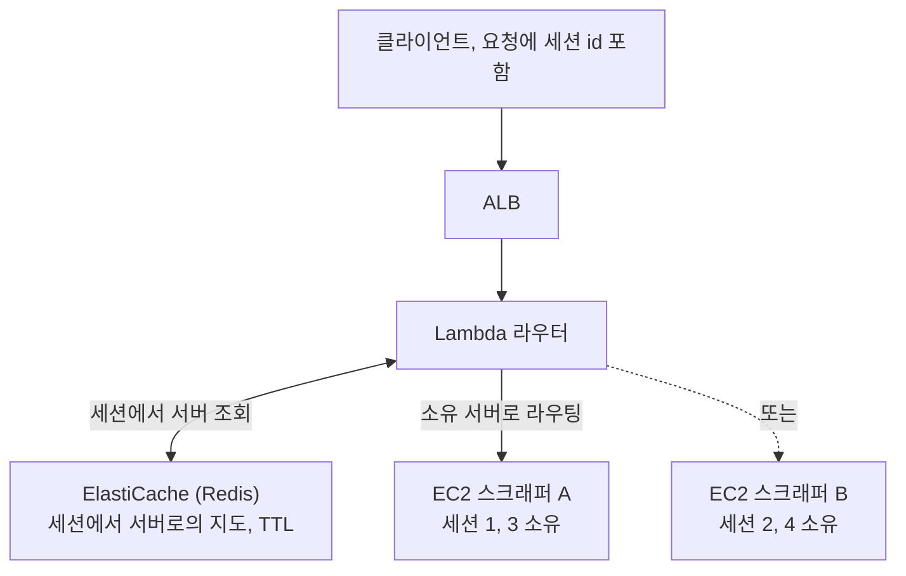

스크래핑 서비스는 사이트에 로그인한 다음, 그 로그인한 사용자로 계속 일해야 했어요.
작업 하나가 인증된 브라우저 세션 하나를 공유하는 요청의 연속이었거든요.

1. 1차 요청, 대상 사이트에 로그인
2. 2차 요청, 로그인된 그 세션으로 대시보드 스크래핑
3. 3차 요청, 같은 세션으로 상세 정보 추가 수집

서버가 하나일 땐 손쉬웠습니다. 브라우저 세션이 메모리에 있고 모든 요청이 그걸
찾았으니까요. 그러다 트래픽이 늘어 로드밸런서 뒤에 두고 서버를 하나 더 붙였는데, 곧장
깨졌어요. 2차 요청이 로그인한 적 없는 머신에 떨어진 겁니다. 세션이 그냥 거기 없었어요.

여기서 옮기기 어려웠던 것은 로그인 쿠키만이 아니라 진행 중인 브라우저와 작업 상태였어요.
해당 세션이 살아 있는 동안 후속 요청이 그 소유 서버에 도달해야 했습니다. 사용자 전체를
영구히 한 서버에 고정한다는 뜻은 아니고, 살아 있는 작업 세션의 수명을 기준으로 한 요구였어요.

## 처음 걸어 들어간 막다른 길

첫 본능은 DB 패턴을 흉내 내는 거였어요. 모든 서버가 공유 DB 하나에 닿을 수 있다면, 공유
브라우저 하나는 왜 안 될까 싶었죠. Playwright를 별도 서버 뒤에 두고 어떤 스크래퍼든
거기 붙게 하면 세션 공유 문제가 사라질 것 같았습니다.

절반은 됐고, 실패한 절반이 가장 많은 걸 가르쳐 줬어요.

Playwright를 별도 티어로 분리해도 어떤 브라우저와 context를 누가 소유하고 정리하는지는
별도 문제로 남았습니다. 처음 글에서는 WebSocket 연결마다 독립 브라우저가 생긴다고
적었는데, Playwright의 일반적인 제약으로 설명한 것은 잘못이었어요.

`browserType.connect()`는 `launchServer()`로 띄운 기존 브라우저에 연결합니다.
`connectOverCDP()`도 기존 Chromium 브라우저에 붙을 수 있어요. 어떤 context를 선택하고
세션을 공유할지는 당시 서버 코드의 책임이었습니다. 정확한 당시 연결 구현은 이 글에
남아 있지 않으므로, API 자체가 세션 공유를 못 한다는 결론은 철회합니다.

유지한 설계는 소유권을 한곳에 두는 방식이었어요. 브라우저를 아무 서버나 동시에 조작하게
만들기보다, 해당 브라우저를 관리하는 서버를 찾아 요청을 보내기로 했습니다.

## 해법은, 세션이 아니라 위치를 외부화하는 것이었어요

세션을 못 옮기면 세션으로 라우팅하면 됩니다. 각 서버가 자기 브라우저 세션을 소유하게
두고, 어느 서버가 어느 세션을 쥐는지의 중앙 지도를 두고, 라우터가 그 지도를 읽어 각
요청을 맞는 곳으로 전달하는 거예요.

세션 1은 스크래퍼 A에서 태어났으니, 세션 1의 모든 후속 요청은 브라우저가 실제로 사는 A로 되돌려 라우팅돼요.

세 가지 원칙이 설계를 지탱했습니다. 먼저 세션이 아니라 세션의 위치를 외부화했어요.
지도는 Redis에 두고, 무겁고 직렬화가 안 되는 브라우저 상태는 그 자리에 그대로 뒀습니다.
그리고 세션 ID로 라우팅했어요. 첫 요청이 매핑을 만들고(TTL을 겁니다), 이후 모든 요청은
세션 id를 실어 오니까 라우터가 소유 서버를 조회한 뒤 전달합니다. 이 매핑은 브라우저
상태의 복제본이 아닙니다. 소유 서버가 사라지면 주소만 다른 서버로 바꿔도 작업은 복구되지
않아요. 새 로그인부터 시작할지, 해당 작업을 실패로 끝낼지의 계약이 필요했습니다.

당시 매핑의 정확한 TTL, 오류 응답 코드와 종료 처리 결과는 이 글에 남아 있지 않아요.
이를 완료된 장애 복구 구현으로 덧붙이는 대신, 같은 구조를 검토할 때 필요한 경계를 적었습니다.

| 매핑을 읽은 결과 | 확인할 동작 |
|---|---|
| 매핑과 소유 세션 모두 유효 | 소유 서버로 전달하되 세션 접근 권한도 검사 |
| TTL 만료로 매핑 없음 | 새 작업과 기존 작업의 후속 요청을 구별 |
| 매핑은 있지만 소유 서버 없음 | 기존 세션이 복구된 척하지 않고 재로그인/실패 처리 |
| Redis 조회 자체가 실패 | 매핑 없음과 구별하고 임의 서버로 보내지 않기 |

TTL은 라우팅 정보의 유효기간이지 브라우저 프로세스를 종료하는 명령은 아닙니다.
소유 서버의 세션 정리와 매핑 삭제가 어긋나는 경우를 별도로 시험해야 해요.

## 트레이드오프는 소리 내어 말하는 게 좋아요

영리한 라우팅 설계는 늘 새 장애 표면을 삽니다. 정직한 장부는 이래요.

| 새로 생기는 위험 | 검토할 대응과 한계 |
|---|---|
| Redis 조회 실패 | Multi-AZ 구성도 장애 전환 중 오류 처리는 필요 |
| 서버가 죽으면 그 세션 손실 | 재로그인과 작업 재시도. 중복 작업 여부 별도 확인 |
| Lambda 라우팅 홉의 cold start 지연 | 프로비저닝된 동시성의 비용과 실제 지연을 비교 |

위 대응을 모두 구현했다는 뜻은 아닙니다. 당시에는 살아 있는 브라우저의 소유 서버를
찾는 방식을 택했어요. 다른 설계에서는 브라우저 context를 공유하거나, 직렬화 가능한 상태를
저장소로 옮길 수도 있습니다. 어떤 상태를 옮길 수 있는지와 동시 접근을 누가 조율하는지가
선택의 기준입니다.

이 패턴은 연결이나 프로세스 메모리를 특정 노드가 소유하는 경우에 참고할 수 있어요.
공유 저장소를 쓰는 업로드나 영속 상태를 가진 워크플로까지 한 노드에 고정된다고
일반화하면 안 됩니다.

이 경험에서 남길 만한 결정은 무거운 상태를 옮기는 대신 위치를 공유한 것이에요.
그 선택으로 후속 요청의 목적지는 정할 수 있었지만, 세션이 사라진 뒤의 복구까지 해결되는
것은 아니었습니다. 다음에 같은 구조를 다룬다면 정상 라우팅과 소유 서버 종료, TTL 만료를
나눠서 재현하고 각각의 응답을 기록하겠어요.

## 참고한 자료

- AWS, [Application Load Balancer: sticky sessions](https://docs.aws.amazon.com/elasticloadbalancing/latest/application/sticky-sessions.html)
- AWS, [Amazon ElastiCache for Redis](https://docs.aws.amazon.com/AmazonElastiCache/latest/red-ug/WhatIs.html)
- M. Kleppmann, [Designing Data-Intensive Applications](https://dataintensive.net/) (6장, 파티셔닝과 요청 라우팅)
- Playwright, [Browser & CDP 연결 모델](https://playwright.dev/docs/api/class-browsertype)
