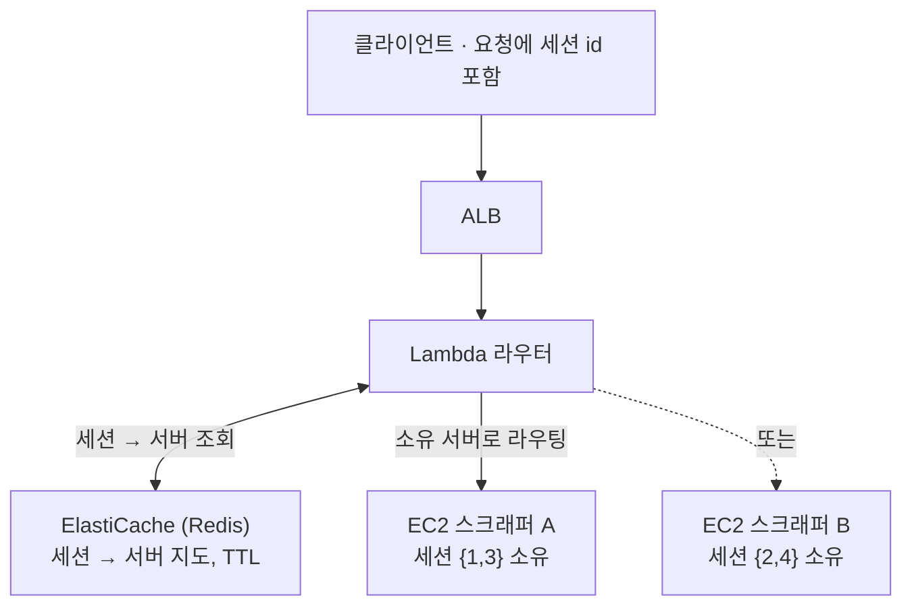

확장의 교과서적 조언은 "서버를 무상태로 만들라"다. 좋은 조언이다 — 상태가 **라이브
브라우저 세션**, 그러니까 직렬화해서 다른 머신에 넘기기 어려운 로그인 상태이기
전까지는. 내 상황이 그랬고, 무상태를 강요하는 건 잘못된 목표였다. 옳은 수는 세션의
*위치*를 외부화하고, 각 요청을 그 세션을 소유한 단 하나의 서버로 라우팅하는
것이었다.

> **TL;DR** — 상태를 외부화할 수 없다면 맞서지 마라. **어느 서버가 어느 세션을
> 쥐고 있는지의 지도**를 외부화하고, 라우팅을 세션 인식형으로 만들어라. 어려운 건
> 라우팅 테이블이 아니라, 어떤 상태가 진짜로 sticky한지 인정하는 일이다.

## 문제: 여러 서버에 걸친 멀티 스텝 세션

사이트에 로그인하는 스크래핑 서비스는 일련의 요청을 같은 인증 세션 위에 묶어야
한다.

1. 1차 요청 — 대상 사이트에 로그인
2. 2차 요청 — *로그인된 그 세션으로* 대시보드 스크래핑
3. 3차 요청 — *같은 세션으로* 상세 정보 추가 수집

서버 하나면 자명하다. 브라우저 세션이 메모리에 있고 모든 요청이 그걸 찾는다. 스케일
아웃하면 로드밸런서가 그 요청들을 여러 서버로 흩뿌리고, 2차 요청은 로그인한 적 없는
머신에 떨어진다. 세션이 사라진다.

핵심 제약: **"특정 사용자의 요청은 항상 같은 서버로 가야 한다"** — 이게 stateful
서비스의 정의이자, 무상태 조언이 없는 셈 치는 바로 그것이다.

## 처음 시도한 막다른 길

첫 본능은 DB 패턴을 흉내 내는 것이었다. 브라우저를 공유 Playwright 서버 뒤로
중앙집중화해서 어떤 스크래퍼든 어떤 세션에 닿게 하기. 절반쯤 됐고, 하나를 가르쳐
줬다.

- Playwright를 별도 티어로 분리한 건 **네트워크 리소스를 아꼈다.**
- 하지만 세션 공유는 **해결하지 못했다.** Playwright의 진입 방식은 둘인데 둘 다
  이걸 못 고친다.
  - **WebSocket** — 연결마다 *독립적인* 브라우저가 뜬다. 공유 없음.
  - **CDP(Chrome DevTools Protocol)** — 포트로 특정 브라우저에 붙을 수 있지만,
    브라우저 수백 개면 포트 관리 자체가 또 하나의 분산 문제가 된다.

아키텍처 분리는 유용해서 유지하고, 공유 브라우저 아이디어는 버렸다. 선택지를 하나
지워주는 막다른 길도 진전이다.

## 해법: 세션이 아니라 *위치*를 외부화

세션을 못 옮기면, 세션으로 라우팅하라. 각 서버는 자기 브라우저 세션을 소유하고,
중앙 지도가 **어느 서버가 어느 세션을 쥐는지**를 기록하며, 라우터가 그 지도를 읽어
전달한다.

세션 1은 스크래퍼 A에서 태어났으니, 세션 1의 모든 후속 요청은 A로 되돌려 라우팅된다.

세 가지 설계 원칙이 전체를 지탱했다.

1. **세션이 아니라 세션의 위치를 외부화한다.** 지도(세션 → 서버)는 Redis에 두고,
   무겁고 직렬화 안 되는 브라우저 상태는 그 자리에 둔다.
2. **정체성으로 라우팅한다.** 라우터가 세션 id를 뽑아 소유 서버를 조회한 뒤
   전달한다 — 첫 요청이 매핑을 만들고(TTL 포함), 이후 요청은 그걸 따른다.
3. **장애를 전제한다.** 서버가 죽으면 그 세션들은 사라진다. 시스템은 이를 감지해
   허공으로 라우팅하는 대신 깔끔하게 실패해야 한다.

## 트레이드오프 (소리 내어 말하기)

"영리한 라우팅" 설계는 늘 새 장애 표면을 산다. 정직한 목록:

| 한계 | 완화 |
|---|---|
| 이제 Redis가 단일 장애점 | Multi-AZ ElastiCache |
| 서버 다운 → 그 세션 손실 | 새 세션을 시작하는 클라이언트 재시도 |
| 라우팅 홉의 Lambda cold start | 프로비저닝된 동시성 |

어느 것도 공짜가 아니고, 아닌 척하는 게 아키텍처가 썩는 방식이다. 이 설계가 값어치
있는 건 오직 대안 — 매 홉마다 라이브 브라우저 세션을 직렬화하는 것 — 이 더
나쁘기 때문이다.

## 패턴은 일반화된다

이건 스크래핑 이야기가 아니다. 상태를 옮기는 비용이 클 때면 언제나 같은 모양이
나온다.

- **WebSocket 팬아웃**(채팅, 게임 서버) — 연결이 한 노드에 산다.
- **청크 파일 업로드** — 진행 중인 업로드가 시작한 곳에 산다.
- **상태 기계 워크플로우** — 기계의 메모리가 한 워커에 고정된다.

재사용 가능한 아이디어: **상태의 생명주기를 정의하고, 그 *위치*를 외부화하고,
라우팅이 그걸 따르게 하라.** "Sticky session"이 잘 알려진 사촌이고, 이건 그
stickiness를 로드밸런서에만 위임할 수 없을 때의 같은 본능이다.

## 다른 엔지니어에게 해줄 말

1. **"무상태로 만들라"는 목표지 법이 아니다.** 어떤 상태는 진짜로 sticky하다.
   아닌 척 말고 이름을 붙여라.
2. **비싼 것(세션)이 아니라 싼 것(포인터)을 외부화하라.**
3. **설계의 진짜 비용은 새로 생기는 장애 모드다.** 다이어그램 옆에 적어둬라. 안
   그러면 프로덕션에서 만난다.

---

## 참고자료 & 더 읽을거리

- AWS — *Application Load Balancer: sticky sessions*. [문서](https://docs.aws.amazon.com/elasticloadbalancing/latest/application/sticky-sessions.html)
- AWS — *Amazon ElastiCache for Redis*. [문서](https://docs.aws.amazon.com/AmazonElastiCache/latest/red-ug/WhatIs.html)
- M. Kleppmann — *Designing Data-Intensive Applications* (6장, 파티셔닝 / 요청 라우팅).
- Playwright — *Browser & CDP 연결 모델*. [문서](https://playwright.dev/docs/api/class-browsertype)
