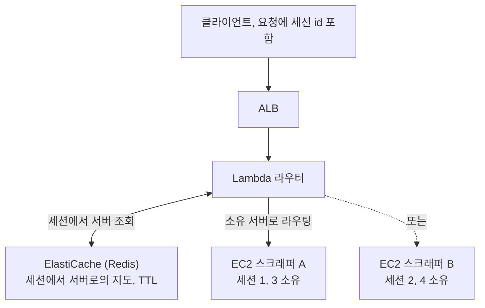

스크래핑 서비스는 사이트에 로그인한 다음, 그 로그인한 사용자로 계속 일해야 했어요.
작업 하나가 인증된 브라우저 세션 하나를 공유하는 요청의 연속이었거든요.

1. 1차 요청, 대상 사이트에 로그인
2. 2차 요청, 로그인된 그 세션으로 대시보드 스크래핑
3. 3차 요청, 같은 세션으로 상세 정보 추가 수집

서버가 하나일 땐 손쉬웠습니다. 브라우저 세션이 메모리에 있고 모든 요청이 그걸
찾았으니까요. 그러다 트래픽이 늘어 로드밸런서 뒤에 두고 서버를 하나 더 붙였는데, 곧장
깨졌어요. 2차 요청이 로그인한 적 없는 머신에 떨어진 겁니다. 세션이 그냥 거기 없었어요.

교과서적 조언인 "서버를 무상태로 만들라"가 무용해지는 순간이 여기예요. 제 상태는
직렬화해서 다른 머신에 넘기기 어려운, 로그인을 쥔 라이브 브라우저였거든요. 진짜
요구사항은 불편하지만 분명했습니다. 특정 사용자의 요청은 항상 같은 서버로 가야 한다는
것. 이게 stateful 서비스의 정의이자, 무상태 조언이 없는 셈 치는 바로 그 부분이에요.

## 처음 걸어 들어간 막다른 길

첫 본능은 DB 패턴을 흉내 내는 거였어요. 모든 서버가 공유 DB 하나에 닿을 수 있다면, 공유
브라우저 하나는 왜 안 될까 싶었죠. Playwright를 별도 서버 뒤에 두고 어떤 스크래퍼든
거기 붙게 하면 세션 공유 문제가 사라질 것 같았습니다.

절반은 됐고, 실패한 절반이 가장 많은 걸 가르쳐 줬어요.

Playwright를 별도 티어로 분리한 건 도움이 됐습니다. 네트워크 리소스를 아꼈고 아키텍처도
깔끔해졌어요. 하지만 두 서버가 세션을 공유하게 만들진 못했습니다. Playwright의 진입
방식은 둘뿐인데, 둘 다 제가 원한 걸 못 하거든요.

- WebSocket은 연결마다 자기만의 독립적인 브라우저가 떠요. 공유가 안 됩니다.
- CDP(Chrome DevTools Protocol)는 포트로 특정 브라우저에 붙을 수 있는데, 라이브
  브라우저가 수백 개면 그 포트 관리가 그 자체로 또 하나의 분산 시스템 문제가 돼요.
  문제를 없앤 게 아니라 옮긴 것뿐이었습니다.

그래서 공유 브라우저 아이디어는 버리고 아키텍처 분리는 유지했어요. 선택지를 하나
지워주는 막다른 길도 진전입니다. 세션은 본질적으로 한 서버에 고정된다는 것, 그러니 그걸
상대로 싸우지 말라는 걸 알려줬으니까요.

## 해법은, 세션이 아니라 위치를 외부화하는 것이었어요

세션을 못 옮기면 세션으로 라우팅하면 됩니다. 각 서버가 자기 브라우저 세션을 소유하게
두고, 어느 서버가 어느 세션을 쥐는지의 중앙 지도를 두고, 라우터가 그 지도를 읽어 각
요청을 맞는 곳으로 전달하는 거예요.

세션 1은 스크래퍼 A에서 태어났으니, 세션 1의 모든 후속 요청은 브라우저가 실제로 사는 A로 되돌려 라우팅돼요.

세 가지 원칙이 설계를 지탱했습니다. 먼저 세션이 아니라 세션의 위치를 외부화했어요.
지도는 Redis에 두고, 무겁고 직렬화가 안 되는 브라우저 상태는 그 자리에 그대로 뒀습니다.
그리고 정체성으로 라우팅했어요. 첫 요청이 매핑을 만들고(TTL을 겁니다), 이후 모든 요청은
세션 id를 실어 오니까 라우터가 소유 서버를 조회한 뒤 전달합니다. 마지막으로 장애를
전제했어요. 서버가 죽으면 그 세션들은 사라지니까, 시스템이 이를 감지해서 허공으로
라우팅하는 대신 깔끔하게 실패하도록 했습니다.

## 트레이드오프는 소리 내어 말하는 게 좋아요

영리한 라우팅 설계는 늘 새 장애 표면을 삽니다. 정직한 장부는 이래요.

| 새로 생기는 위험 | 완화 방법 |
|---|---|
| 이제 Redis가 단일 장애점 | Multi-AZ ElastiCache |
| 서버가 죽으면 그 세션 손실 | 새 세션을 시작하는 클라이언트 재시도 |
| Lambda 라우팅 홉의 cold start 지연 | 프로비저닝된 동시성 |

어느 것도 공짜가 아니에요. 이 설계가 값어치 있는 건 오직 대안, 그러니까 매 홉마다 라이브
브라우저 세션을 직렬화하는 쪽이 더 나쁘기 때문입니다. 장애 모드를 다이어그램 옆에
적어두는 것, 그게 아키텍처를 정직하게 유지하는 방법이에요.

## 패턴은 일반화됩니다

이건 애초에 스크래핑 이야기가 아니었어요. 상태를 옮기는 비용이 클 때면 언제나 같은
모양이 나옵니다. WebSocket 팬아웃(채팅, 게임 서버)에서는 연결이 한 노드에 살고, 청크
파일 업로드에서는 진행 중인 업로드가 시작한 곳에 살고, 상태 기계 워크플로우에서는 기계의
메모리가 한 워커에 고정돼요.

재사용할 수 있는 아이디어는 이거예요. 상태의 생명주기를 정의하고, 그 위치를 외부화하고,
라우팅이 그걸 따르게 하는 것. 잘 알려진 사촌이 "sticky session"이고, 이건 그
stickiness를 로드밸런서에만 맡길 수 없을 때의 같은 본능입니다.

돌아보면 배운 건 세 가지예요. "무상태로 만들라"는 목표지 법이 아니라는 것, 그래서 어떤
상태가 진짜로 sticky한지 인정하고 그걸 위한 설계를 해야 한다는 것. 비싼 것인 세션이
아니라 싼 것인 포인터를 외부화해야 한다는 것. 그리고 설계의 진짜 비용은 새로 생기는 장애
모드라는 것이요. 제 세 개는 결국 다 만났지만, 인시던트가 되지 않은 유일한 이유는 첫날부터
다이어그램 위에 적혀 있었기 때문입니다.

## 참고한 자료

- AWS, [Application Load Balancer: sticky sessions](https://docs.aws.amazon.com/elasticloadbalancing/latest/application/sticky-sessions.html)
- AWS, [Amazon ElastiCache for Redis](https://docs.aws.amazon.com/AmazonElastiCache/latest/red-ug/WhatIs.html)
- M. Kleppmann, [Designing Data-Intensive Applications](https://dataintensive.net/) (6장, 파티셔닝과 요청 라우팅)
- Playwright, [Browser & CDP 연결 모델](https://playwright.dev/docs/api/class-browsertype)
