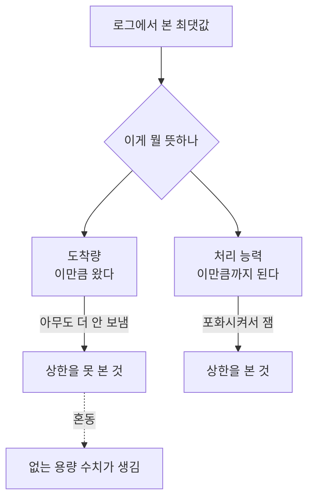

사내 모델 서빙 용량을 정리하는 문서를 쓰고 있었어요. 그러다 "동시 처리량 5.59건"이라는
숫자를 만났습니다. 채널에도 있고 다른 문서에도 있었어요. 여러 사람이 이 값을 근거로
용량 계획을 말하고 있었습니다.

문서에 적으려면 어디서 나온 건지는 알아야 하니까 출처를 찾기로 했어요. 30분쯤 걸릴 줄
알았습니다.

## 5.59라는 문자열을 다 찾아봤어요

측정을 했다면 로그나 스크립트 출력에 그 값이 남아 있을 거라고 봤습니다. 그래서 관련
세션 로그와 작업 기록을 전부 뒤졌어요.

```sh
grep -ro '5\.59' . | wc -l
```

116건이 나왔습니다. 오, 많다 싶어서 하나씩 열어봤어요.

```text
2026-08-22T14:25.599Z  ...
2026-08-24T09:15.599Z  ...
2026-08-25T11:02.599Z  ...
```

전부 타임스탬프의 밀리초 부분이었습니다. 116건 중 단 하나도 측정값이 아니었어요.

그러니까 이 숫자는 어딘가에서 측정돼서 인용된 게 아니라, 애초에 그런 형태로 존재한
적이 없었습니다.

## 원형은 있었는데 단위가 달랐어요

그렇다고 누가 지어낸 건 아닐 거예요. 비슷한 값을 찾아보니 "5.52배"라는 게 나왔습니다.
배수였어요. 건수가 아니라요.

어딘가에서 "5.52배"가 "5.5건"이 되고, 그게 다시 "5.59건"으로 굳은 겁니다. 전화 게임처럼요.

그럼 그 5.52배는 뭐였나. 계산 과정을 따라가니 이랬습니다. 모델이 한 번에 담을 수 있는
총 토큰 용량을 분자로 두고, 요청 하나가 쓰는 토큰을 분모로 둬서 "동시에 몇 개가 들어가나"를
구한 거였어요. 산수 자체는 맞습니다.

문제는 분모였어요. 요청 하나가 쓰는 토큰을 **모델의 최대 컨텍스트 길이**로 잡았습니다.
그런데 실제 요청의 평균 입력 길이는 그것의 8분의 1이었어요. 모델이 받아줄 수 있는
최대치를 모든 요청이 다 쓴다고 가정한 거죠.

그리고 좀 허탈했던 게, 관련 티켓 코멘트에 이미 제대로 잰 값이 적혀 있었습니다.
캐시 사용량 기준으로 실제 동시 상한이 40건대라고요. 누군가 제대로 재놨는데, 채널에서
돌아다닌 건 계산으로 나온 쪽이었어요.

## 정정 초안을 썼는데 같은 실수를 했어요

여기까지 파악하고 정정 문단을 썼습니다. 대충 이런 내용이었어요.

> 앞서 인용된 동시 5.59건은 근거가 없습니다. 실제로는 노드 하나가 동시 20건을
> 저하 없이 처리하는 것이 관측됐고, 캐시 기준 상한은 40건대입니다.

써놓고 다시 읽는데 "동시 20건을 저하 없이"에서 걸렸어요.

이 20건은 어디서 나왔냐면, 로그에서 동시에 실행 중인 요청 수의 최댓값이었습니다.
그러니까 **20건이 도착했다**는 걸 본 거예요. 20건이 한계라는 걸 잰 게 아니고요.
아무도 21건을 보내본 적이 없으면 20이 최댓값으로 남습니다. 그게 능력치는 아니에요.

"저하 없이"는 더 나빴습니다. 같은 조사 자료 안에 응답 시간 중앙값이 69초에서 174초로
늘어난 구간이 있었어요. 제가 쓴 문단에서 두 단락 아래에요. 저하가 없긴요.

정정하려고 쓴 글이 정확히 같은 종류의 실수를 하고 있었습니다. **도착량을 처리 능력으로
읽는 것**이요.



<span class="figcap">최댓값은 능력이 아니라 수요의 흔적이에요. 포화시키지 않았으면 상한은 안 보입니다.</span>

## 왜 이런 게 잘 퍼지는지 생각해봤어요

이 사건이 좀 오래 남았습니다. 숫자 하나가 틀린 것보다, 그게 왜 이렇게 잘 퍼졌는지가요.

**소수점이 신뢰를 줍니다.** "5.59"는 누가 열심히 잰 것처럼 보여요. "대략 5"였으면
다들 한 번씩 물어봤을 겁니다. 정밀해 보이는 숫자가 검산을 덜 받아요.

**단위는 전달 과정에서 제일 먼저 떨어집니다.** 배수에서 건수로 바뀌는 데 아무 저항이
없었어요. 문장 안에서 숫자만 살아남고 단위는 맥락에 묻힙니다.

**측정과 계산이 같은 모양으로 적힙니다.** "동시 5.52배"는 계산 결과인데, 적힌 형태는
실측치와 구분이 안 돼요. 문서에 "실측"과 "추정"을 구분해서 적지 않으면 며칠만 지나도
본인도 헷갈립니다.

그래서 그 뒤로 용량 관련 숫자를 적을 때는 세 가지를 같이 적어요. 어떻게 쟀는지,
언제 쟀는지, 그리고 그게 도착량인지 상한인지.

## 상한을 진짜로 재려면

이 조사에서 나온 실용적인 결론도 적어둘게요. 서빙 용량의 상한을 재려면 결국 포화시켜야
합니다. 그런데 포화가 안 만들어지면 거기서 나온 최댓값은 상한이 아니에요.

그리고 포화시켰다고 해도 "저하 없음"을 주장하려면 지연 분포를 같이 봐야 합니다. 처리
건수는 유지되는데 대기열만 길어지는 형태의 저하가 있어요. 에러율도 안 올라가고 처리량도
안 떨어지는데 사용자는 느려지는 겁니다. 건수만 보면 이게 안 보여요.

## 돌아보면

제일 뼈아픈 건 제 정정 초안이었습니다. 남의 실수를 지적하는 문단에서 같은 실수를 했다는
게요. 그런데 생각해보면 당연한 면도 있어요. 그 실수는 부주의해서 하는 게 아니라, 로그에
있는 최댓값을 자연스럽게 능력치로 읽게 되는 인지적인 기울기가 있어서 하는 거니까요.

그래서 이 글의 결론을 "숫자를 조심하자"로 안 쓰려고 합니다. 그건 아무 도움이 안 돼요.
대신 질문 하나로 남기려고요. **이 숫자를 만들려면 무엇을 했어야 하는가.** 상한이라면
포화시켰어야 하고, 비율이라면 분모가 뭔지 적었어야 하고, 실측이라면 잰 시점이 있어야
합니다. 그게 안 떠오르면 그 숫자는 아직 측정이 아니에요.

그리고 제대로 잰 값이 티켓 코멘트에 이미 있었다는 것도 남습니다. 좋은 측정이 존재해도
유통되지 않으면 나쁜 숫자가 그 자리를 차지해요. 재는 것만큼 그걸 찾을 수 있는 자리에
두는 게 중요하더라고요.

## 참고한 자료

- [Latency, throughput and the coordinated omission problem](https://www.infoq.com/presentations/latency-response-time/) (Gil Tene): 부하 측정에서 도착량과 처리 능력을 혼동하는 구조적 이유
- [Universal Scalability Law](http://www.perfdynamics.com/Manifesto/USLscalability.html) (Neil Gunther): 동시성을 올렸을 때 처리량이 어떻게 꺾이는지, 최댓값이 상한이 아닌 이유
- [Metrics, tracing, and logging](https://peter.bourgon.org/blog/2017/02/21/metrics-tracing-and-logging.html) (Peter Bourgon): 어떤 질문에 어떤 관측 수단이 답할 수 있는지
