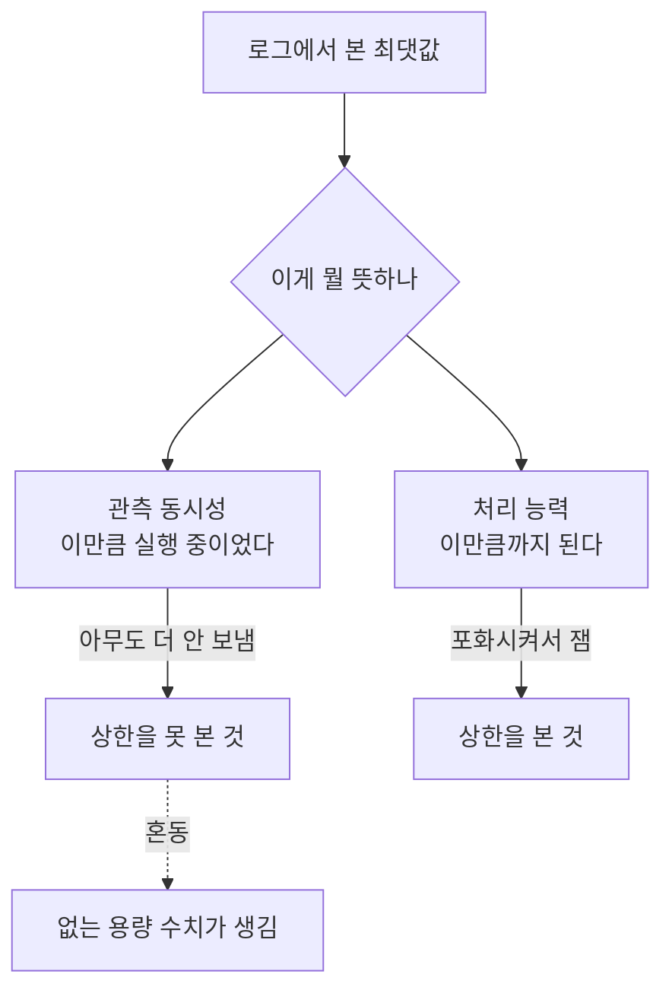

사내 모델 서빙 용량을 정리하는 문서를 쓰고 있었어요. 그러다 "동시 처리량 5.59건"이라는
숫자를 만났습니다. 채널에도 있고 다른 문서에도 있었어요. 여러 사람이 이 값을 근거로
용량 계획을 말하고 있었습니다.

문서에 적으려면 어디서 나온 건지는 알아야 하니까 출처를 찾기로 했어요. 30분쯤 걸릴 줄
알았습니다.

## 5.59라는 문자열을 다 찾아봤어요

측정을 했다면 로그나 스크립트 출력에 그 값이 남아 있을 거라고 봤습니다. 그래서 관련
세션 로그와 작업 기록을 전부 뒤졌어요.

```sh
grep -ro '5\.59' . | wc -l
```

116건이 나왔습니다. 오, 많다 싶어서 하나씩 열어봤어요.

```text
2026-08-22T14:25.599Z  ...
2026-08-24T09:15.599Z  ...
```

전부 초와 밀리초 표기의 일부가 걸린 것이었습니다. 확인한 116건 중 측정값은 없었어요.

여기서 말할 수 있는 건 확인한 기록에서 이 숫자의 측정 근거를 찾지 못했다는 것까지예요.
다른 기록에도 존재한 적이 없었다고 증명한 것은 아닙니다.

## 비슷한 숫자를 찾았는데 단위와 계산도 맞지 않았어요

비슷한 값을 찾아보니 "5.52배"라고 적힌 기록이 나왔습니다. 그런데 '배'라는 표기만으로
무엇을 비교한 값인지 알 수는 없었어요.

이 값이 전달되면서 단위와 숫자가 바뀌었을 가능성을 생각했어요. 하지만 "5.52배"에서
"5.59건"까지 이어지는 수정 이력은 확인하지 못했습니다. 둘의 전파 경로는 가설로 남겼어요.

관련 계산 설명에는 모델이 한 번에 담을 수 있는 총 토큰 용량을 요청 하나가 쓰는 토큰으로
나누는 식이 있었습니다. 이 식이 추정하는 것은 수용 가능한 요청 수예요. 비교 대상의
처리량이나 지연을 나눈 성능 배수와는 다릅니다. 기록의 단위와 설명된 식부터 맞지
않았어요. 원래 입력값을 대조해 5.52가 나오는 계산까지 이 글에 제시한 것은 아니므로,
산술이 검증된 수치로 인용할 수도 없습니다.

문제는 분모였어요. 요청 하나가 쓰는 토큰을 **모델의 최대 컨텍스트 길이**로 잡았습니다.
그런데 실제 요청의 평균 입력 길이는 그것의 8분의 1이었어요. 모델이 받아줄 수 있는
최대치를 모든 요청이 다 쓴다고 가정한 거죠. 평균 입력 길이만으로 분모를 바꾸는 것도
충분하지는 않습니다. 생성 중 늘어나는 토큰과 요청 길이 분포도 고려해야 하니까요.

관련 티켓 코멘트에는 캐시 사용량을 근거로 한 40건대라는 값도 있었습니다. 이것도
자원 사용량에서 산출한 추정인지, 지연 기준을 정하고 시험한 동시 처리 한계인지 구별해야
했어요. 출처가 있다는 것만으로 실측 상한이라고 부를 수는 없습니다.

## 정정 초안을 썼는데 같은 실수를 했어요

여기까지 파악하고 정정 문단을 썼습니다. 대충 이런 내용이었어요.

> 앞서 인용된 동시 5.59건은 근거가 없습니다. 실제로는 노드 하나가 동시 20건을
> 저하 없이 처리하는 것이 관측됐고, 캐시 기준 상한은 40건대입니다.

써놓고 다시 읽는데 "동시 20건을 저하 없이"에서 걸렸어요.

이 20건은 어디서 나왔냐면, 로그에서 동시에 실행 중인 요청 수의 최댓값이었습니다.
그러니까 **그 시점에 20건이 실행 중이었다**는 걸 본 거예요. 도착률이나 처리 한계를
잰 게 아니고요. 더 높은 부하를 만들거나 관측하지 않았다면, 최댓값만으로 한계를
알 수는 없습니다.

"저하 없이"는 더 나빴습니다. 같은 조사 자료 안에 응답 시간 중앙값이 69초에서 174초로
늘어난 구간이 있었어요. 제가 쓴 문단에서 두 단락 아래에요. 저하가 없긴요.

정정하려고 쓴 글이 정확히 같은 종류의 실수를 하고 있었습니다. **관측된 동시 실행 수를
처리 능력으로 읽는 것**이요. 지연 저하 없이 처리할 수 있는 동시성을 잰 것은 아니었어요.



<span class="figcap">관측한 최댓값만으로 처리 한계는 알 수 없어요. 시험 부하와 지연 조건을 함께 봐야 합니다.</span>

## 왜 이런 게 잘 퍼지는지 생각해봤어요

이 사건이 좀 오래 남았습니다. 숫자 하나가 틀린 것보다, 그게 왜 이렇게 잘 퍼졌는지가요.

**소수점이 신뢰를 줍니다.** "5.59"는 누가 열심히 잰 것처럼 보여요. "대략 5"였으면
다들 한 번씩 물어봤을 겁니다. 정밀해 보이는 숫자가 검산을 덜 받아요.

**단위가 빠지면 다른 지표를 같은 값처럼 읽기 쉽습니다.** 이번 조사에서는 전파 경로를
확정하지 못했지만, 배수와 건수를 구분하지 않은 채 비교할 수 없다는 건 분명했어요.

**측정과 계산이 같은 모양으로 적힙니다.** "동시 5.52배"는 계산 결과인데, 적힌 형태는
실측치와 구분이 안 돼요. 문서에 "실측"과 "추정"을 구분해서 적지 않으면 며칠만 지나도
본인도 헷갈립니다.

그래서 그 뒤로 용량 관련 숫자를 적을 때는 세 가지를 같이 적어요. 어떻게 쟀는지,
언제 쟀는지, 그리고 관측 동시성인지, 자원 기준 추정인지, 성능 조건을 둔 한계인지.

## 상한을 진짜로 재려면

이 조사에서 나온 실용적인 결론도 적어둘게요. 서빙 용량의 상한을 주장하려면 부하를
늘렸을 때 어느 조건에서 한계에 닿는지 확인해야 합니다. 시험 범위 안에서 그 한계에
닿지 않았다면, 거기서 나온 최댓값을 상한으로 적을 수는 없어요.

그리고 포화시켰다고 해도 "저하 없음"을 주장하려면 지연 분포를 같이 봐야 합니다. 처리
건수는 유지되는데 대기열만 길어지는 형태의 저하가 있어요. 에러율도 안 올라가고 처리량도
안 떨어지는데 사용자는 느려지는 겁니다. 건수만 보면 이게 안 보여요.

## 돌아보면

제일 뼈아픈 건 제 정정 초안이었습니다. 남의 실수를 지적하는 문단에서 같은 실수를 했다는
게요. 그런데 생각해보면 당연한 면도 있어요. 그 실수는 부주의해서 하는 게 아니라, 로그에
있는 최댓값을 자연스럽게 능력치로 읽게 되는 인지적인 기울기가 있어서 하는 거니까요.

그래서 이 글의 결론을 "숫자를 조심하자"로 안 쓰려고 합니다. 그건 아무 도움이 안 돼요.
대신 질문 하나로 남기려고요. **이 숫자를 만들려면 무엇을 했어야 하는가.** 상한이라면
포화시켰어야 하고, 비율이라면 분모가 뭔지 적었어야 하고, 실측이라면 잰 시점이 있어야
합니다. 그게 안 떠오르면 그 숫자는 아직 측정이 아니에요.

이 조사에서 새 용량 상한을 확정한 것은 아닙니다. 확인한 숫자마다 원천, 단위, 계산식,
측정 시점과 시험 조건을 붙여야 한다는 결론을 남겼어요. 빈 항목이 있으면 그 빈칸을
추측으로 채우지 않고, 용량 결정 전에 더 확인할 부분으로 두는 게 필요했습니다.

## 참고한 자료

- [Latency, throughput and the coordinated omission problem](https://www.infoq.com/presentations/latency-response-time/) (Gil Tene): 부하 측정에서 도착량과 처리 능력을 혼동하는 구조적 이유
- [Universal Scalability Law](http://www.perfdynamics.com/Manifesto/USLscalability.html) (Neil Gunther): 동시성을 올렸을 때 처리량이 어떻게 꺾이는지, 최댓값이 상한이 아닌 이유
- [Metrics, tracing, and logging](https://peter.bourgon.org/blog/2017/02/21/metrics-tracing-and-logging.html) (Peter Bourgon): 어떤 질문에 어떤 관측 수단이 답할 수 있는지
