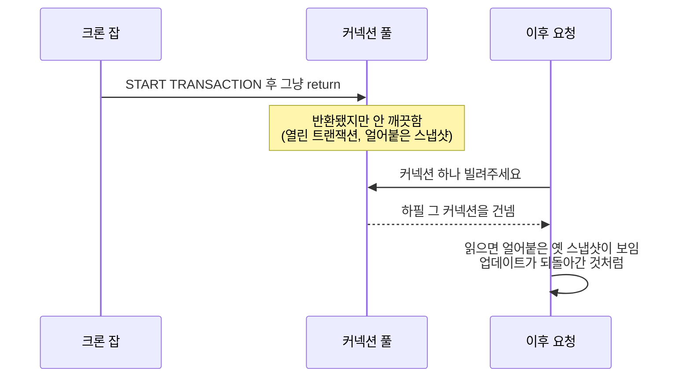

제가 받은 버그 리포트는 좀 이상했습니다. 사용자가 값을 하나 수정하면 저장은 분명히
돼요. 그런데 새로고침을 하면 가끔 예전 값이 다시 나타납니다. 같은 요청, 같은 코드인데
어떤 때는 되고 어떤 때는 안 되는 거죠.

더 이상했던 건 이거예요. 서버를 재시작하면 잠깐 괜찮아지는데, 딱 20~30분쯤 지나면 다시
슬금슬금 나타났습니다.

프로덕션을 좀 다뤄보신 분이라면 "재시작하면 잠깐 괜찮아진다"는 말에서 뭔가 감이 오실
거예요. 보통 이건 코드 로직 자체의 버그라기보다, 시간이 지나면서 상태가 쌓이는 공유
리소스를 의심하게 되는 신호입니다. 그리고 백엔드에서 가장 많이 공유되고 재사용되는
리소스가 바로 커넥션 풀이고요.

## 코드를 열기 전에, 증상부터 읽어봤어요

증상 세 개를 같이 놓으니 이미 어느 쪽을 봐야 할지 대충 보였습니다.

- 같은 요청인데 결과가 그때그때 달라요.
- 업데이트가 됐다가 다시 옛날 값으로 돌아가요.
- 갓 켠 서버에선 멀쩡하고, 20~30분은 지나야 나타나요.

갓 뜬 커넥션 풀에는 아직 문제가 될 커넥션이 없습니다. 문제를 만드는 코드가 한 번 돌고,
그 커넥션이 다시 누군가에게 빌려질 때까지 시간이 필요한 거예요. 정리하면, 어떤 요청이
남이 쓰고 남긴 상태를 그대로 들고 있는 커넥션을 뽑아 쓰고 있다는 얘기였습니다. 이제 뭘
쫓아야 할지 모양이 잡혔어요.

## 값싼 용의자부터 하나씩 지웠어요

먼저 DB를 의심했습니다. MariaDB는 최신 버전이었고, 이 증상과 관련된 알려진 문제도
없었어요. 실제로 누가 붙어 있나 확인해보니 애플리케이션과 제 DataGrip 세션뿐이었습니다.
서버 쪽엔 수상한 게 없어서 넘어갔어요.

다음은 캐시였습니다. 앞단에 Redis 같은 건 없었고, TypeORM 내장 쿼리 캐시도 꺼져
있었어요. 그러니 예전 값이 보이는 게 캐싱 때문일 리는 없었습니다.

이렇게 지우고 나니 남는 건 애플리케이션이 트랜잭션을 다루는 방식이었어요. 그리고 로그
두 개가 사건을 마무리해줬습니다.

앱 로그를 구조적으로 남기게 해두니, 같은 시각에 들어온 두 요청이 서로 다른 값을 받아
가는 게 보였어요. 하나는 수정된 값을, 다른 하나는 옛날 값을 받았습니다. 이게
결정적이었어요. 데이터가 잘못된 게 아니라 커넥션마다 보고 있는 게 다르다는 뜻이었거든요.
그다음 SQL 로그를 켜니 범인이 나왔습니다. 커밋도 롤백도 짝이 없는 `START TRANSACTION`
하나가 찍혀 있었어요.

## 진짜 원인은, 트랜잭션 안에서 그냥 return 해버린 코드였어요

크론 잡 하나가 트랜잭션을 열어놓고, 어떤 분기에서 커밋도 하기 전에 `return`으로
빠져나가고 있었습니다.

```javascript
async badCode() {
  const connection = getConnection();
  try {
    await connection.startTransaction();
    // ...비즈니스 로직...
    if (A === true) {
      return A;                       // 커밋도 롤백도 없이 여기서 나가버려요
    }
    await connection.commitTransaction();
    return dto;
  } catch (e) {
    await connection.rollbackTransaction();
  } finally {
    await connection.release();       // 반환은 되는데, 트랜잭션은 아직 열려 있어요
  }
}
```

여기가 조금 까다로운 부분이에요. `finally`가 커넥션을 반환해주긴 합니다. 그래서 겉보기엔
정리가 된 것처럼 보이죠. 그런데 early return이 커밋과 롤백을 둘 다 건너뛰었기 때문에, 이
커넥션은 트랜잭션이 열린 채로 풀에 돌아가요. 반환은 됐지만 깨끗하지가 않은 겁니다.

이게 왜 옛날 값을 보여주는지 궁금하실 텐데요, MySQL과 MariaDB의 기본 격리 수준인
REPEATABLE READ 때문이에요. 트랜잭션은 첫 읽기 시점에 일관된 스냅샷을 하나 떠놓고, 그
트랜잭션이 끝날 때까지 계속 그 스냅샷만 보여줍니다. 그러니 트랜잭션이 열린 채로 멈춰
있는 커넥션은, 그걸 다음에 빌려 가는 사람한테도 계속 예전 시점의 데이터를 보여주게 되는
거예요.



이렇게 보면 증상 세 개가 한 번에 설명됩니다. 어떤 커넥션을 뽑느냐에 따라 달라지니까
결과가 들쭉날쭉했고, 얼어붙은 스냅샷이 수정보다 앞선 시점이라 값이 되돌아간 것처럼
보였어요. 크론이 돌고 그 커넥션이 다시 빌려질 때까지 시간이 걸리니까, 서버가 좀 돌아간
뒤에야 나타났던 겁니다.

## 고치는 건 간단했어요. 다만 습관이 중요했고요

모든 경로에서 커넥션이 반환되기 전에 커밋이나 롤백을 반드시 하도록 바꿨습니다.

```javascript
async goodCode() {
  const connection = getConnection();
  try {
    await connection.startTransaction();
    const dto = A === true
      ? await handleA(connection)
      : await handleNonA(connection);   // 분기를 try 안에서 처리해요
    await connection.commitTransaction();
    return dto;
  } catch (e) {
    await connection.rollbackTransaction();
    throw e;
  } finally {
    await connection.release();          // 이제 항상 깨끗한 커넥션이 돌아가요
  }
}
```

try에서 커밋, catch에서 롤백, finally에서 반환. 이게 당장의 해결이었습니다. 그런데 사실
더 오래 가는 해결은, 트랜잭션 경계를 이렇게 손으로 관리하는 걸 그만두는 거였어요.
`typeorm-transactional` 같은 데코레이터를 쓰거나 `withTransaction(fn)` 같은 래퍼로
감싸두면, 어느 분기로 빠지든 커밋과 롤백을 빠뜨릴 수가 없습니다. 그리고 트랜잭션 블록
안에서는 웬만하면 분기하거나 중간에 return 하지 않는 게 좋아요. 분기가 필요하면
트랜잭션에 들어가기 전에 먼저 정해두면 됩니다.

하나만 더 말씀드리면, 이 버그를 잡을 수 있었던 건 결국 로그 덕분이었어요. 같은 시각의 두
요청이 다른 값을 받는다는 걸 로그가 보여주지 않았다면, 이건 몇 주씩 숨어 있었을 겁니다.
저는 이 일을 겪고 나서부터 스테이징과 프로덕션엔 구조적인 로그를 꼭 남겨두는 편이에요.

돌아보면 이 버그가 유난히 얄미웠던 이유는, 정작 문제를 일으킨 코드(크론 잡)와 증상이
나타난 곳(사용자 요청)이 완전히 달랐기 때문입니다. 트랜잭션 하나가 새면 그 여파는 그
코드가 아니라 커넥션 풀 전체로 퍼지니까요. 잊지 않으려고 애쓰는 것보다, 애초에 잊을 수
없는 구조로 만들어두는 게 낫다는 걸 다시 한번 배웠어요.

## 참고한 자료

- [Consistent Nonlocking Reads](https://dev.mysql.com/doc/refman/8.0/en/innodb-consistent-read.html) (MySQL): REPEATABLE READ 스냅샷이 어떻게 동작하는지
- [SET TRANSACTION ISOLATION LEVEL](https://mariadb.com/kb/en/set-transaction/) (MariaDB)
- [Transactions & QueryRunner](https://typeorm.io/transactions) (TypeORM)
- [typeorm-transactional](https://github.com/Aliheym/typeorm-transactional): 트랜잭션 경계를 데코레이터로 관리하기
